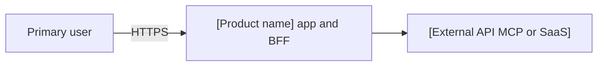
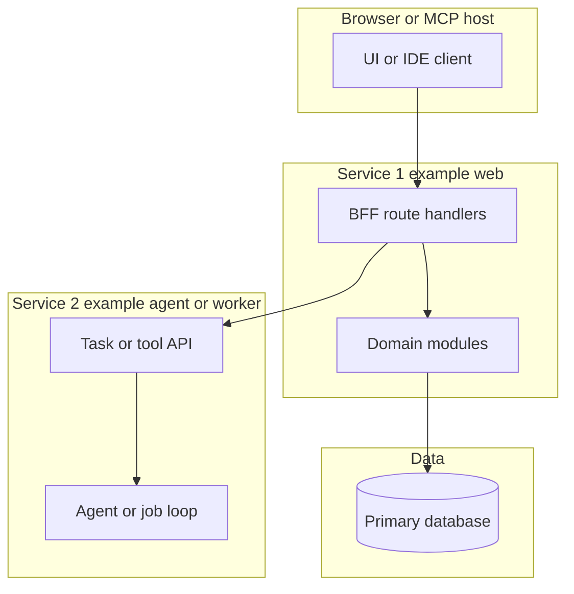
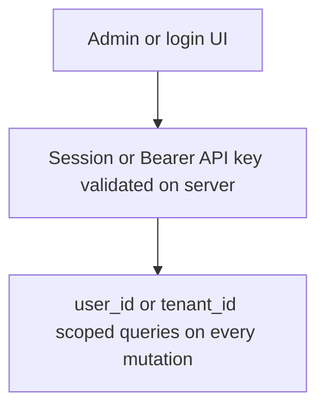
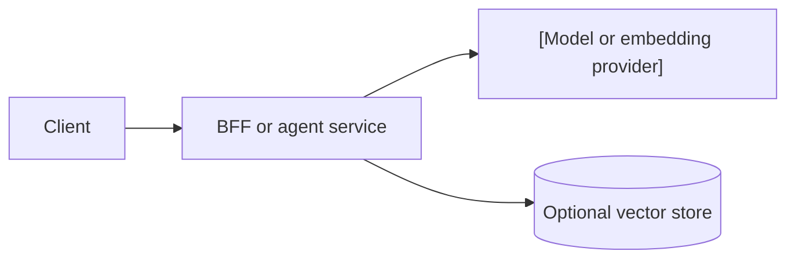

# Architecture — [product name]

> **Purpose**: Record the stack, boundaries, and a small number of decisions. Product behavior belongs in [`product-backlog.md`](./product-backlog.md). Optional / JIT (not a required process artifact).
> **Practices**: [`sdd-scrum-practices.md`](../sdd-scrum-practices.md) (what, how, when).
> **Framework**: [`pack-scrum-in-sdd.md`](../pack-scrum-in-sdd.md) (names and meaning).

Product requirements stay on [`product-backlog.md`](./product-backlog.md). Locked stack versions or env conventions may live in a sibling doc such as `tech-spec.md` when the project uses one. Link that file here instead of copying it.

| Spec | Role |
| --- | --- |
| [`product-backlog.md`](./product-backlog.md) | PBIs, scope, and acceptance |
| [`[module]/[stem]-design.md`](./[module]/[stem]-design.md) | Example module design (replace path from `artifacts-map.json`) |
| [`release.md`](./release.md) | Local startup and go-live order |

## 1. Architecture goals

| Goal | Meaning |
| --- | --- |
| [Example: Safe degradation] | [One upstream failure leaves partial UI and explicit error state.] |
| [Example: Server-side secrets] | [Browser and MCP clients talk only to the app BFF or gateway; no provider keys in the client.] |
| [Example: Callable surfaces stay separate] | [Web, agent, RAG, or MCP stay distinct processes when more than one ships.] |

[Optional scope line or link to `./product-backlog.md#L{line}`.]

## 2. Product shape

| Surface | Role | Who uses it |
| --- | --- | --- |
| [Web app] | [Catalog, forms, admin UI] | [End user] |
| [BFF / API] | [Auth, validation, orchestration] | [Same-origin UI or trusted clients] |
| [Agent or MCP server] | [Tools, retrieval, long-running tasks] | [App backend or external MCP host] |

## 3. Recommended diagrams

Keep each diagram that applies. Delete sections whose title says optional when the product does not need that view. Replace bracket labels; do not ship real host names or secrets in this file.

### Diagram: System context

Shows actors and external systems at the product boundary.

### Diagram: Logical view (services)

Use when the product has more than one deployable (for example web + agent + RAG, or UI + MCP server).

After the diagram, list **principles** the team must honor (three to six bullets). Example: the browser does not call the database; the BFF owns session auth.

### Diagram: Auth and tenancy (optional)

Use when multiple users or API keys share one deployment.

### Diagram: ML inference path (optional)

Use when production calls an LLM or model API. MVP needs versioning and a rollback path before go-live; avoid a full training platform until a second model or retrain loop is real.

| Concern | MVP default | Later when scale requires it |
| --- | --- | --- |
| Serving | Sync HTTP from BFF or one worker | Queue, batch, or dedicated inference service |
| Versioning | Prompt and model id in repo config | Registry and staged promotion (ADR) |
| Quality | Logs and user-visible failure | Latency SLO, drift checks, canary deploy |

### Diagram: Deployment and runtime

| Process or service | Responsibility | Deploy shape |
| --- | --- | --- |
| [[service-a]] | [UI and BFF] | [Example: `make dev` / Docker / PaaS] |
| [[service-b]] | [Agent, worker, or MCP] | [Independent process or container] |
| [[database]] | [App data] | [Managed Postgres or local JSON for MVP] |

## 4. Stack

| Category | Choice | Note |
| --- | --- | --- |
| App / UI | [Example: Next.js App Router, TypeScript] | [Example: i18n keys for user-visible copy.] |
| API / services | [Example: Route handlers in same app or Fastify service] | [Example: Zod validation on every mutation.] |
| Data | [Example: Postgres, or JSON under `data/` for MVP] | [Example: migrations or isolated test data dir.] |
| Auth | [Example: session cookie, OAuth, or Bearer API key] | [Example: enforce on server; UI hiding is not the control.] |
| Hosting / runtime | [Example: Docker Compose, Vercel] | [Example: single region until ADR says otherwise.] |
| CI / tests | [Example: GitHub Actions, Vitest, Playwright] | [Example: extends common-test-strategy; fixture-only default.] |
| ML / inference | [Example: — or OpenAI-compatible HTTP] | [Example: caller-owned LLM vs server-side agent loop.] |

## 5. Design principles

1. **[Example: BFF boundary]** — [The browser does not hold provider secrets or call the database directly.]
2. **[Example: Write path]** — [External or pasted content uses propose then confirm before persistence when the product is a knowledge or content system.]
3. **[Example: Retrieval honesty]** — [Answers that claim library or catalog facts include citations or stable ids.]
4. **[Example: Failure isolation]** — [One provider timeout returns a partial result or keyed error, not a blank page.]

## 6. Non-goals

- [Example: payments, marketplace checkout, or escrow in MVP]
- [Example: silent auto-ingest without user confirm]
- [Example: Kubeflow or full feature-store platform for a single-model MVP]
- [Example: training or fine-tuning on the app server]

## 7. Decisions

**Decision: [Short title, example separate agent service]**

- [One fact the team must honor when building.]
- [Optional second fact.]
- ADR: [`ADR-NNN`](./adr/ADR-NNN-short-title.md) when the choice is ADR-worthy; omit when the decision is local and reversible.

## 8. Module specs

Per-module design, stories, and tests live under `[artifacts root]/` as named in `artifacts-map.json`. Link `[stem]-design.md`, `[stem]-stories.md`, and `[stem]-tests.md` from the product or sprint backlog when an SBI needs them.

Local startup and go-live order are in [`release.md`](./release.md).
