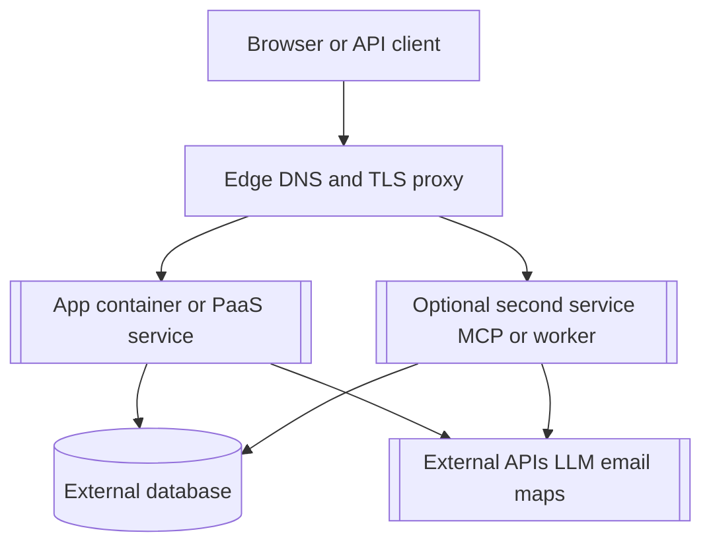

# Release — [product name]

> **Purpose**: How to start locally, the order of production release steps, and upgrade or rollback. Do not write real host names, secrets, or customer environment names here. Optional / JIT (not a required process artifact).
> **Practices**: [`sdd-scrum-practices.md`](./sdd-scrum-practices.md) (what, how, when).
> **Framework**: [`scrum-in-sdd.md`](./scrum-in-sdd.md) (names and meaning).

Runtime shape lives in [`architecture.md`](./architecture.md). Step-by-step operator detail for a shared platform may live in a separate **`deployment-plan.md`** (for example `specs/deployment-plan.md`). This file states what the product needs; the deployment plan fills host-specific placeholders for release automation or ops.

| Spec | Role |
| --- | --- |
| [`architecture.md`](./architecture.md) | Stack, services, and deployment diagram |
| [`release.md`](./release.md) | Local startup, release order, smoke, rollback |
| [`deployment-plan.md`](./deployment-plan.md) | Optional: stack name, ports, domains, CI image names for operators |
| [`.secrets`](./.secrets) or `.env.prod.example` | Secret **names** and where values live (not values in git) |

## 1. Local development

1. Install dependencies ([Example: `npm ci` or project documented command]).
2. Prepare local data ([Example: test database or temp data dir; do not use production data]).
3. Run **`make up`** (or **`make dev`** for foreground).
4. Smoke: [Example: open `http://localhost:[port]` and confirm the primary happy path from product backlog].

Stop the stack with **`make down`**.

Acceptance may link a PBI on [`product-backlog.md`](./product-backlog.md#L{line}) when the backlog defines local startup.

## 2. Pre-flight (before first production deploy)

Stop before deploy if any required row is missing in the app repo.

| Artifact | Required | Notes |
| --- | --- | --- |
| Production container build | [yes / no] | [Example: `Dockerfile` path] |
| Production compose | [yes / no] | [Example: `docker-compose.prod.yml`; image-only, no local `build:` on the target host] |
| CI publish workflow | [yes / no] | [Example: `.github/workflows/` builds and pushes to a registry] |
| Env name template | yes | [Example: `.env.prod.example`; names only, no secret values] |
| Entrypoint / migrations | [yes / no] | [Example: migrate then start; which service runs migrations] |
| Deployment plan | [optional] | [When ops uses a guided release; mirrors sections 3–7 below with real placeholders filled at deploy time] |

## 3. Diagram: Production runtime (optional)

Use when production is not a single PaaS button. Replace bracket labels. Do not put secrets in the diagram.

Note whether the public hostname routes one service or splits paths (for example `/` to web and `/mcp` to a sibling container). Detail belongs in `deployment-plan.md` when paths are non-obvious.

## 4. Production release order

Run in order. Do not point DNS or TLS at a service that is not healthy yet.

| Step | Action | Record in deployment-plan |
| --- | --- | --- |
| 0 | Isolation pre-check | Unique stack name, host ports, domain, database name on a shared node |
| 1 | CI image | Registry, image name, tag policy (`latest`, git sha) |
| 2 | Runtime env | Variable **names** on the host or orchestrator (values only in secret store) |
| 3 | Database | Reachability, migration command, dedicated database name |
| 4 | Deploy | Compose or platform deploy; shared Docker network name if applicable |
| 5 | DNS | Zone, record type, target (placeholder IP or CNAME) |
| 6 | TLS and reverse proxy | Upstream is **container name and container port**, not host map port when using Docker DNS |
| 7 | Smoke | URLs and paths below; spot-check another app if the node is shared |

## 5. Production placeholders

Replace at deploy time. Do not commit live values in this file.

| Item | Placeholder |
| --- | --- |
| App URL | `https://[product domain]` |
| Stack or project name | `[STACK_NAME]` |
| Primary image | `[registry]/[owner]/[repo]/[service]:[tag]` |
| Database | [Engine]; connection string only in runtime env; database name `[DB_NAME]` |
| Release sequence | Build and push image → deploy stack → migrate if needed → DNS → TLS → smoke |

Before go-live, check scope on [`product-backlog.md`](./product-backlog.md#L{line}) when the backlog defines a scope gate.

## 6. Environment variable names

Values live in Portainer, the host secret store, or the platform env UI. Never in git.

| Name | Required | Notes |
| --- | --- | --- |
| `DATABASE_URL` | [yes / no] | [Dedicated `[DB_NAME]`; not another app's database] |
| `APP_URL` | [yes / no] | `https://[product domain]` |
| [Example: `MCP_AUTH_TOKEN`] | [optional] | [When a public MCP path exists] |

See `.env.prod.example` in the app repo for the full list.

## 7. Smoke checklist

After deploy:

- [ ] `https://[product domain]/` loads the primary surface
- [ ] [Health or readiness path, example `/healthz` or `/api/health`]
- [ ] [One critical user journey in one line]
- [ ] [Optional: MCP or API path when in scope]
- [ ] On a shared node: at least one existing app still passes a quick check

## 8. Upgrade

1. Back up the database (or confirm automated backups).
2. Publish a new image tag from CI.
3. Update the running stack to that tag and re-pull.
4. Run migrations if the release includes schema changes.
5. Repeat the smoke checklist in section 7.
6. If smoke fails, roll back the image tag and restore the database from backup when data changed; record the incident in [`changes-log.md`](./changes-log.md).

## 9. Rollback

1. Set the stack to the last known-good image tag.
2. Re-run smoke. If migrations are not reversible, follow the runbook in `deployment-plan.md` or an ADR.
3. Record what failed and what was restored in [`changes-log.md`](./changes-log.md).
