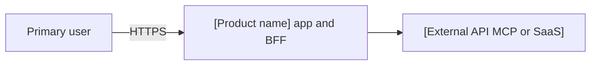
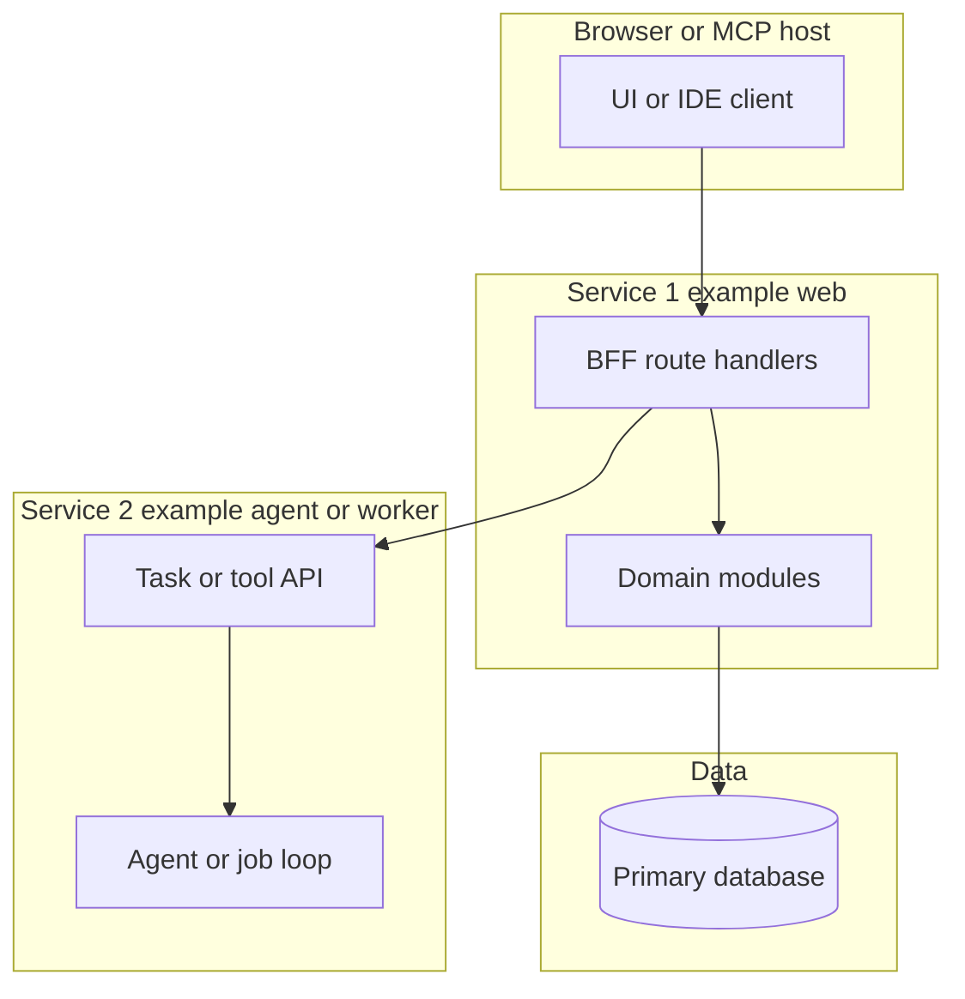
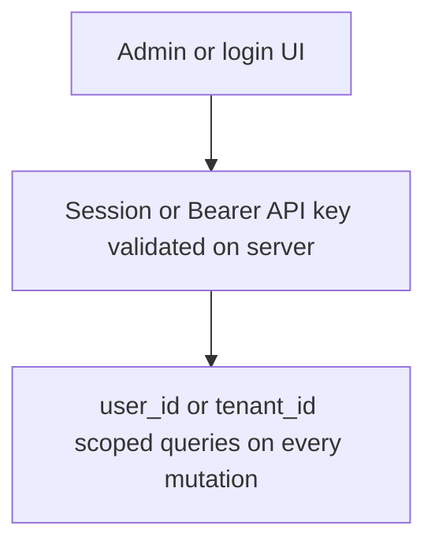
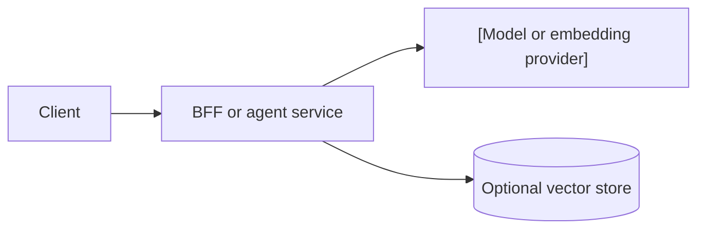

# 架构 — [product name]

> **Purpose**：记录技术栈、系统边界与少量关键决策。产品行为写在 [`product-backlog.md`](./product-backlog.md)。Optional / JIT（非必填流程工件）。
> **Practices**：[`sdd-scrum-practices.md`](../sdd-scrum-practices.md)（做什么、怎么做、何时做）。
> **Framework**：[`pack-scrum-in-sdd.md`](../pack-scrum-in-sdd.md)（名称与含义）。

产品需求留在 [`product-backlog.md`](./product-backlog.md)。若项目使用独立文档存放锁定的栈版本或环境约定（例如 `tech-spec.md`），在本文件链接该文档即可，不要整段复制。

| 文档 | 作用 |
| --- | --- |
| [`product-backlog.md`](./product-backlog.md) | PBI、范围与验收 |
| [`[module]/[stem]-design.md`](./[module]/[stem]-design.md) | 模块设计示例（路径按 `artifacts-map.json` 替换） |
| [`release.md`](./release.md) | 本地启动与上线顺序 |

## 1. 架构目标

| 目标 | 含义 |
| --- | --- |
| [示例：安全降级] | [上游一处失败时，UI 仍可部分可用，并给出明确错误状态。] |
| [示例：密钥在服务端] | [浏览器与 MCP 客户端只访问应用 BFF 或网关；Provider 密钥不出现在客户端。] |
| [示例：可调用面分离] | [Web、Agent、RAG 或 MCP 在多于一个交付单元时保持独立进程。] |

[可选：范围说明一行，或链到 `./product-backlog.md#L{line}`。]

## 2. 产品形态

| 界面 | 角色 | 使用者 |
| --- | --- | --- |
| [Web 应用] | [目录、表单、管理 UI] | [终端用户] |
| [BFF / API] | [鉴权、校验、编排] | [同源 UI 或受信客户端] |
| [Agent 或 MCP server] | [Tools、检索、长时任务] | [应用后端或外部 MCP 宿主] |

## 3. 推荐示意图

保留适用的图。标题含 optional 的小节在产品不需要该视图时删除。替换方括号占位；不要在本文件写入真实主机名或密钥。

### 示意图：系统上下文

展示产品边界上的参与者与外部系统。

### 示意图：逻辑视图（服务）

产品有多于一个可部署单元时使用（例如 web + agent + RAG，或 UI + MCP server）。

图后列出团队必须遵守的 **principles**（三至六条）。示例：浏览器不直连数据库；BFF 负责 session 鉴权。

### 示意图：鉴权与租户（可选）

多用户或 API key 共享同一部署时使用。

### 示意图：ML 推理路径（可选）

生产环境调用 LLM 或模型 API 时使用。MVP 上线前需要版本管理与回滚路径；在出现第二个模型或重训闭环之前，不要引入完整训练平台。

| 关注点 | MVP 默认 | 规模扩大后 |
| --- | --- | --- |
| Serving | BFF 或单一 worker 同步 HTTP | 队列、批处理或独立推理服务 |
| Versioning | Prompt 与 model id 写在仓库配置 | Registry 与分阶段发布（ADR） |
| Quality | 日志与用户可见失败 | 延迟 SLO、漂移检测、canary 部署 |

### 示意图：部署与运行时

| 进程或服务 | 职责 | 部署形态 |
| --- | --- | --- |
| [[service-a]] | [UI 与 BFF] | [示例：`make dev` / Docker / PaaS] |
| [[service-b]] | [Agent、worker 或 MCP] | [独立进程或容器] |
| [[database]] | [应用数据] | [托管 Postgres 或 MVP 用本地 JSON] |

## 4. 技术栈

| 类别 | 选型 | 说明 |
| --- | --- | --- |
| App / UI | [示例：Next.js App Router、TypeScript] | [示例：面向用户的文案使用 i18n key。] |
| API / services | [示例：同应用 Route handlers 或 Fastify 服务] | [示例：每次 mutation 用 Zod 校验。] |
| Data | [示例：Postgres，或 MVP 下 `data/` 内 JSON] | [示例：migration 或隔离测试数据目录。] |
| Auth | [示例：session cookie、OAuth 或 Bearer API key] | [示例：在服务端强制；仅靠 UI 隐藏不是控制手段。] |
| Hosting / runtime | [示例：Docker Compose、Vercel] | [示例：ADR 另有说明前保持单区域。] |
| CI / tests | [示例：GitHub Actions、Vitest、Playwright] | [示例：继承 common-test-strategy；默认 fixture-only。] |
| ML / inference | [示例：— 或 OpenAI 兼容 HTTP] | [示例：调用方自持 LLM 与服务端 Agent 循环。] |

## 5. 设计原则

1. **[示例：BFF 边界]** — [浏览器不保存 Provider 密钥，也不直连数据库。]
2. **[示例：写入路径]** — [知识或内容类产品中，外部或粘贴内容须 propose 再 confirm 后才持久化。]
3. **[示例：检索诚实]** — [声称来自库或目录的事实须带引用或稳定 id。]
4. **[示例：失败隔离]** — [单个 Provider 超时时返回部分结果或带 key 的错误，而不是整页空白。]

## 6. 非目标

- [示例：MVP 不含支付、市集结账或 escrow]
- [示例：未经用户 confirm 的静默自动 ingest]
- [示例：单模型 MVP 不上 Kubeflow 或完整 feature-store 平台]
- [示例：在应用服务器上做训练或 fine-tuning]

## 7. 决策

**Decision: [短标题，示例：独立 Agent 服务]**

- [构建时必须遵守的一条事实。]
- [可选第二条。]
- ADR：值得 ADR 时写 [`ADR-NNN`](./adr/ADR-NNN-short-title.md)；局部且可逆的决定可省略。

## 8. 模块 spec

各模块的 design、stories、tests 位于 `artifacts-map.json` 所指的 `[artifacts root]/` 下。当 SBI 需要时，从 product backlog 或 sprint backlog 链接 `[stem]-design.md`、`[stem]-stories.md`、`[stem]-tests.md`。

本地启动与上线顺序见 [`release.md`](./release.md)。
