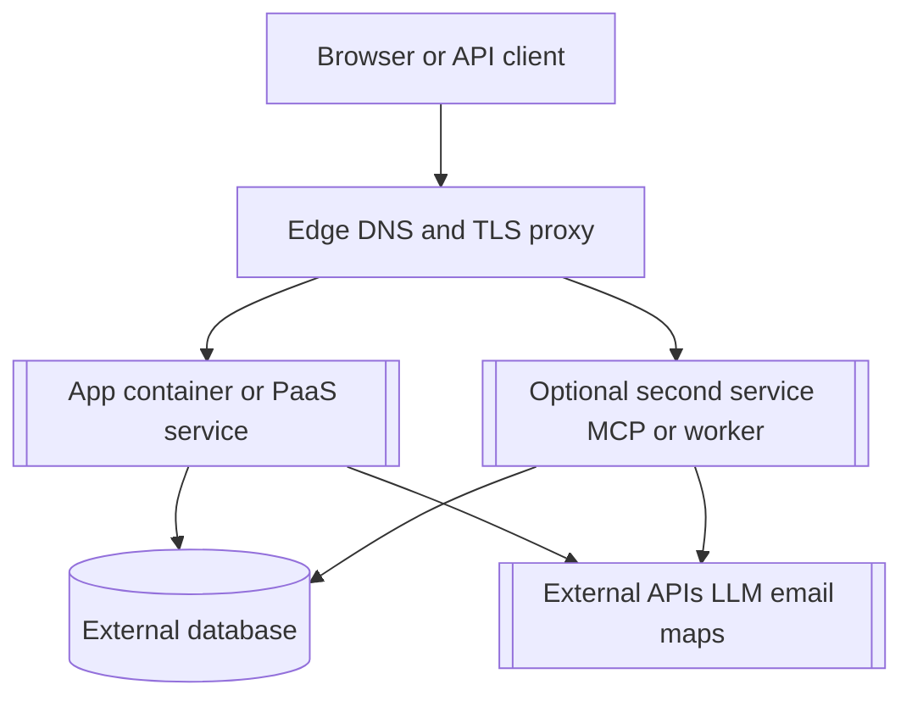

# 发布 — [product name]

> **Purpose**：本地如何启动、生产发布步骤顺序，以及升级与回滚。不要在本文件写真实主机名、密钥或客户环境名。Optional / JIT（非必填流程工件）。
> **Practices**：[`sdd-scrum-practices.md`](../sdd-scrum-practices.md)（做什么、怎么做、何时做）。
> **Framework**：[`pack-scrum-in-sdd.md`](../pack-scrum-in-sdd.md)（名称与含义）。

运行时形态见 [`architecture.md`](./architecture.md)。共享平台的逐步操作可放在单独的 **`deployment-plan.md`**（例如 `specs/deployment-plan.md`）。本文件写产品需要什么；部署计划在发布自动化或运维侧填入与主机相关的占位符。

| 文档 | 作用 |
| --- | --- |
| [`architecture.md`](./architecture.md) | 技术栈、服务与部署图 |
| [`release.md`](./release.md) | 本地启动、发布顺序、smoke、回滚 |
| [`deployment-plan.md`](./deployment-plan.md) | 可选：栈名、端口、域名、CI 镜像名（给运维） |
| [`.secrets`](./.secrets) 或 `.env.prod.example` | 密钥**名称**及值存放位置（值不进 git） |

## 1. 本地开发

1. 安装依赖（[示例：项目文档中的 `npm ci` 或等价命令]）。
2. 准备本地数据（[示例：测试库或临时数据目录；不要用生产数据]）。
3. 运行 **`make up`**（前台开发用 **`make dev`**）。
4. Smoke：[示例：打开 `http://localhost:[port]`，确认 product backlog 中的主 happy path]。

用 **`make down`** 停止本地栈。

若 backlog 定义了本地启动验收，可链到 [`product-backlog.md`](./product-backlog.md#L{line}) 上的 PBI。

## 2. 发布前检查（首次生产部署前）

应用仓库中任一必填行缺失则停止发布。

| 工件 | Required | 说明 |
| --- | --- | --- |
| Production container build | [yes / no] | [示例：`Dockerfile` 路径] |
| Production compose | [yes / no] | [示例：`docker-compose.prod.yml`；仅镜像，目标主机上不要本地 `build:`] |
| CI publish workflow | [yes / no] | [示例：`.github/workflows/` 构建并推送到 registry] |
| Env name template | yes | [示例：`.env.prod.example`；仅名称，无密钥值] |
| Entrypoint / migrations | [yes / no] | [示例：先 migrate 再启动；哪个服务跑 migration] |
| Deployment plan | [optional] | [运维使用引导式发布时；镜像下文第 3–7 节，部署时填真实占位符] |

## 3. 示意图：生产运行时（可选）

生产不是「一键 PaaS」时使用。替换方括号标签；图中不要写密钥。

说明公网主机名是指向单一服务还是按路径拆分（例如 `/` 到 web、`/mcp` 到 sibling 容器）。路径不直观时，细节写在 `deployment-plan.md`。

## 4. 生产发布顺序

按顺序执行。服务未健康前不要把 DNS 或 TLS 指过去。

| 步骤 | 动作 | 记入 deployment-plan |
| --- | --- | --- |
| 0 | Isolation pre-check | 共享节点上的唯一栈名、主机端口、域名、库名 |
| 1 | CI image | Registry、镜像名、tag 策略（`latest`、git sha） |
| 2 | Runtime env | 主机或编排器上的变量**名称**（值只在 secret store） |
| 3 | Database | 可达性、migration 命令、专用库名 |
| 4 | Deploy | Compose 或平台部署；适用时共享 Docker 网络名 |
| 5 | DNS | 区域、记录类型、目标（占位 IP 或 CNAME） |
| 6 | TLS and reverse proxy | 使用 Docker DNS 时，upstream 为**容器名与容器端口**，不是主机映射端口 |
| 7 | Smoke | 下文 URL 与路径；共享节点时抽查另一应用 |

## 5. 生产占位符

部署时替换。不要把 live 值提交进本文件。

| 项 | 占位符 |
| --- | --- |
| App URL | `https://[product domain]` |
| Stack or project name | `[STACK_NAME]` |
| Primary image | `[registry]/[owner]/[repo]/[service]:[tag]` |
| Database | [引擎]；连接串只在运行时 env；库名 `[DB_NAME]` |
| Release sequence | 构建并推送镜像 → 部署栈 → 如需则 migrate → DNS → TLS → smoke |

上线前若 backlog 有范围门禁，核对 [`product-backlog.md`](./product-backlog.md#L{line})。

## 6. 环境变量名称

值放在 Portainer、主机 secret store 或平台 env UI。不要进 git。

| 名称 | Required | 说明 |
| --- | --- | --- |
| `DATABASE_URL` | [yes / no] | [专用 `[DB_NAME]`；不要用其他应用的库] |
| `APP_URL` | [yes / no] | `https://[product domain]` |
| [示例：`MCP_AUTH_TOKEN`] | [optional] | [存在公网 MCP 路径时] |

完整列表见应用仓库中的 `.env.prod.example`。

## 7. Smoke 检查清单

部署后：

- [ ] `https://[product domain]/` 能打开主界面
- [ ] [健康或就绪路径，示例 `/healthz` 或 `/api/health`]
- [ ] [一条关键用户路径，一行描述]
- [ ] [可选：范围内的 MCP 或 API 路径]
- [ ] 共享节点：至少一个已有应用仍能通过快速检查

## 8. 升级

1. 备份数据库（或确认自动备份可用）。
2. 从 CI 发布新镜像 tag。
3. 将运行栈更新到该 tag 并 re-pull。
4. 若发布含 schema 变更则跑 migration。
5. 重复第 7 节 smoke checklist。
6. 若 smoke 失败，回滚镜像 tag；数据已变则从备份恢复；在 [`changes-log.md`](./changes-log.md) 记录事件。

## 9. 回滚

1. 将栈设回最近已知良好的镜像 tag。
2. 重跑 smoke。若 migration 不可逆，按 `deployment-plan.md` 或 ADR 中的 runbook 操作。
3. 在 [`changes-log.md`](./changes-log.md) 记录失败内容与恢复情况。
