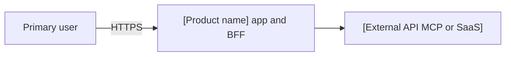
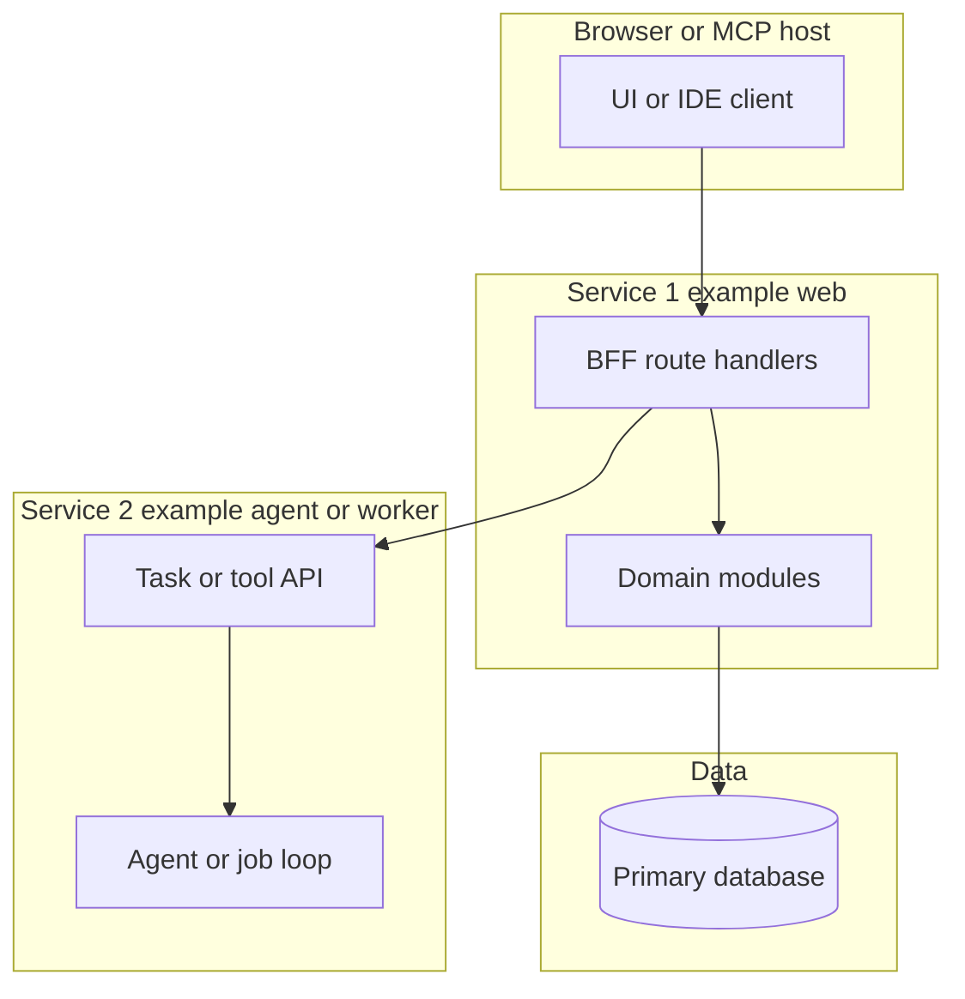
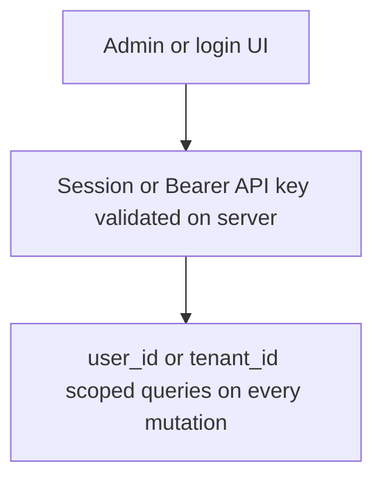
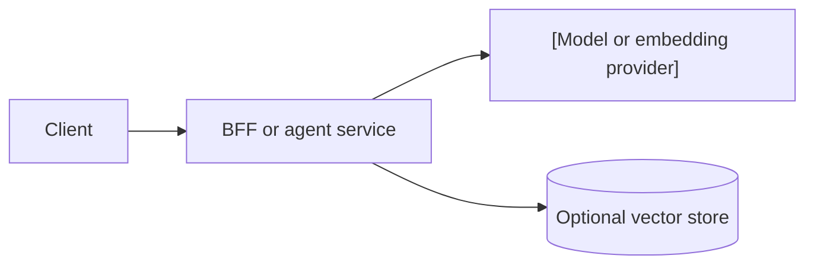

# 架構 — [product name]

> **Purpose**：記錄技術棧、系統邊界與少量關鍵決策。產品行為寫在 [`product-backlog.md`](./product-backlog.md)。Optional / JIT（非必填流程工件）。
> **Practices**：[`sdd-scrum-practices.md`](../sdd-scrum-practices.md)（做什麼、怎麼做、何時做）。
> **Framework**：[`pack-scrum-in-sdd.md`](../pack-scrum-in-sdd.md)（名稱與含義）。

產品需求留在 [`product-backlog.md`](./product-backlog.md)。若專案使用獨立文件存放鎖定的棧版本或環境約定（例如 `tech-spec.md`），在本檔案連結該文件即可，不要整段複製。

| 文件 | 作用 |
| --- | --- |
| [`product-backlog.md`](./product-backlog.md) | PBI、範圍與驗收 |
| [`[module]/[stem]-design.md`](./[module]/[stem]-design.md) | 模組設計範例（路徑按 `artifacts-map.json` 替換） |
| [`release.md`](./release.md) | 本地啟動與上線順序 |

## 1. 架構目標

| 目標 | 含義 |
| --- | --- |
| [範例：安全降級] | [上游一處失敗時，UI 仍可部分可用，並給出明確錯誤狀態。] |
| [範例：金鑰在服務端] | [瀏覽器與 MCP 客戶端只存取應用 BFF 或閘道；Provider 金鑰不出現在客戶端。] |
| [範例：可呼叫面分離] | [Web、Agent、RAG 或 MCP 在多於一個交付單元時保持獨立進程。] |

[可選：範圍說明一行，或連到 `./product-backlog.md#L{line}`。]

## 2. 產品形態

| 介面 | 角色 | 使用者 |
| --- | --- | --- |
| [Web 應用] | [目錄、表單、管理 UI] | [終端用戶] |
| [BFF / API] | [鑑權、校驗、編排] | [同源 UI 或受信客戶端] |
| [Agent 或 MCP server] | [Tools、檢索、長時任務] | [應用後端或外部 MCP 宿主] |

## 3. 推薦示意圖

保留適用的圖。標題含 optional 的小節在產品不需要該檢視時刪除。替換方括號占位；不要在本檔案寫入真實主機名或金鑰。

### 示意圖：系統上下文

展示產品邊界上的參與者與外部系統。

### 示意圖：邏輯檢視（服務）

產品有多於一個可部署單元時使用（例如 web + agent + RAG，或 UI + MCP server）。

圖後列出團隊必須遵守的 **principles**（三至六條）。範例：瀏覽器不直連資料庫；BFF 負責 session 鑑權。

### 示意圖：鑑權與租戶（可選）

多使用者或 API key 共享同一部署時使用。

### 示意圖：ML 推理路徑（可選）

生產環境呼叫 LLM 或模型 API 時使用。MVP 上線前需要版本管理與回滾路徑；在出現第二個模型或重訓閉環之前，不要引入完整訓練平台。

| 關注點 | MVP 預設 | 規模擴大後 |
| --- | --- | --- |
| Serving | BFF 或單一 worker 同步 HTTP | 佇列、批次處理或獨立推理服務 |
| Versioning | Prompt 與 model id 寫在倉庫設定 | Registry 與分階段發布（ADR） |
| Quality | 日誌與使用者可見失敗 | 延遲 SLO、漂移偵測、canary 部署 |

### 示意圖：部署與執行時

| 進程或服務 | 職責 | 部署形態 |
| --- | --- | --- |
| [[service-a]] | [UI 與 BFF] | [範例：`make dev` / Docker / PaaS] |
| [[service-b]] | [Agent、worker 或 MCP] | [獨立進程或容器] |
| [[database]] | [應用資料] | [託管 Postgres 或 MVP 用本地 JSON] |

## 4. 技術棧

| 類別 | 選型 | 說明 |
| --- | --- | --- |
| App / UI | [範例：Next.js App Router、TypeScript] | [範例：面向使用者的文案使用 i18n key。] |
| API / services | [範例：同應用 Route handlers 或 Fastify 服務] | [範例：每次 mutation 用 Zod 校驗。] |
| Data | [範例：Postgres，或 MVP 下 `data/` 內 JSON] | [範例：migration 或隔離測試資料目錄。] |
| Auth | [範例：session cookie、OAuth 或 Bearer API key] | [範例：在服務端強制；僅靠 UI 隱藏不是控制手段。] |
| Hosting / runtime | [範例：Docker Compose、Vercel] | [範例：ADR 另有說明前保持單區域。] |
| CI / tests | [範例：GitHub Actions、Vitest、Playwright] | [範例：繼承 common-test-strategy；預設 fixture-only。] |
| ML / inference | [範例：— 或 OpenAI 相容 HTTP] | [範例：呼叫方自持 LLM 與服務端 Agent 迴圈。] |

## 5. 設計原則

1. **[範例：BFF 邊界]** — [瀏覽器不保存 Provider 金鑰，也不直連資料庫。]
2. **[範例：寫入路徑]** — [知識或內容類產品中，外部或貼上內容須 propose 再 confirm 後才持久化。]
3. **[範例：檢索誠實]** — [聲稱來自庫或目錄的事實須帶引用或穩定 id。]
4. **[範例：失敗隔離]** — [單個 Provider 逾時時回傳部分結果或帶 key 的錯誤，而不是整頁空白。]

## 6. 非目標

- [範例：MVP 不含支付、市集結帳或 escrow]
- [範例：未經使用者 confirm 的靜默自動 ingest]
- [範例：單模型 MVP 不上 Kubeflow 或完整 feature-store 平台]
- [範例：在應用伺服器上做訓練或 fine-tuning]

## 7. 決策

**Decision: [短標題，範例：獨立 Agent 服務]**

- [建構時必須遵守的一條事實。]
- [可選第二條。]
- ADR：值得 ADR 時寫 [`ADR-NNN`](./adr/ADR-NNN-short-title.md)；局部且可逆的決定可省略。

## 8. 模組 spec

各模組的 design、stories、tests 位於 `artifacts-map.json` 所指的 `[artifacts root]/` 下。當 SBI 需要時，從 product backlog 或 sprint backlog 連結 `[stem]-design.md`、`[stem]-stories.md`、`[stem]-tests.md`。

本地啟動與上線順序見 [`release.md`](./release.md)。
