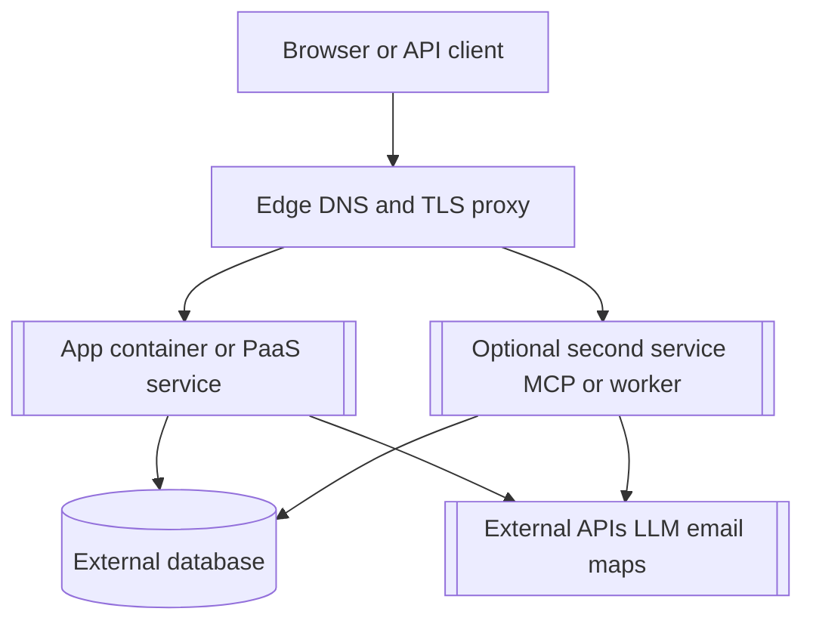

# 發布 — [product name]

> **Purpose**：本地如何啟動、生產發布步驟順序，以及升級與回滾。不要在本檔案寫真實主機名、金鑰或客戶環境名。Optional / JIT（非必填流程工件）。
> **Practices**：[`sdd-scrum-practices.md`](../sdd-scrum-practices.md)（做什麼、怎麼做、何時做）。
> **Framework**：[`pack-scrum-in-sdd.md`](../pack-scrum-in-sdd.md)（名稱與含義）。

執行時形態見 [`architecture.md`](./architecture.md)。共享平台的逐步操作可放在單獨的 **`deployment-plan.md`**（例如 `specs/deployment-plan.md`）。本檔案寫產品需要什麼；部署計畫在發布自動化或維運側填入與主機相關的占位符。

| 文件 | 作用 |
| --- | --- |
| [`architecture.md`](./architecture.md) | 技術棧、服務與部署圖 |
| [`release.md`](./release.md) | 本地啟動、發布順序、smoke、回滾 |
| [`deployment-plan.md`](./deployment-plan.md) | 可選：棧名、連接埠、網域、CI 映像名（給維運） |
| [`.secrets`](./.secrets) 或 `.env.prod.example` | 金鑰**名稱**及值存放位置（值不進 git） |

## 1. 本地開發

1. 安裝依賴（[範例：專案文件中的 `npm ci` 或等價命令]）。
2. 準備本地資料（[範例：測試庫或暫存資料目錄；不要用生產資料]）。
3. 執行 **`make up`**（前景開發用 **`make dev`**）。
4. Smoke：[範例：開啟 `http://localhost:[port]`，確認 product backlog 中的主 happy path]。

用 **`make down`** 停止本地棧。

若 backlog 定義了本地啟動驗收，可連到 [`product-backlog.md`](./product-backlog.md#L{line}) 上的 PBI。

## 2. 發布前檢查（首次生產部署前）

應用倉庫中任一必填列缺失則停止發布。

| 工件 | Required | 說明 |
| --- | --- | --- |
| Production container build | [yes / no] | [範例：`Dockerfile` 路徑] |
| Production compose | [yes / no] | [範例：`docker-compose.prod.yml`；僅映像，目標主機上不要本地 `build:`] |
| CI publish workflow | [yes / no] | [範例：`.github/workflows/` 建置並推送到 registry] |
| Env name template | yes | [範例：`.env.prod.example`；僅名稱，無金鑰值] |
| Entrypoint / migrations | [yes / no] | [範例：先 migrate 再啟動；哪個服務跑 migration] |
| Deployment plan | [optional] | [維運使用引導式發布時；映像下文第 3–7 節，部署時填真實占位符] |

## 3. 示意圖：生產執行時（可選）

生產不是「一鍵 PaaS」時使用。替換方括號標籤；圖中不要寫金鑰。

說明公網主機名是指向單一服務還是按路徑拆分（例如 `/` 到 web、`/mcp` 到 sibling 容器）。路徑不直觀時，細節寫在 `deployment-plan.md`。

## 4. 生產發布順序

按順序執行。服務未健康前不要把 DNS 或 TLS 指過去。

| 步驟 | 動作 | 記入 deployment-plan |
| --- | --- | --- |
| 0 | Isolation pre-check | 共享節點上的唯一棧名、主機連接埠、網域、庫名 |
| 1 | CI image | Registry、映像名、tag 策略（`latest`、git sha） |
| 2 | Runtime env | 主機或編排器上的變數**名稱**（值只在 secret store） |
| 3 | Database | 可達性、migration 命令、專用庫名 |
| 4 | Deploy | Compose 或平台部署；適用時共享 Docker 網路名 |
| 5 | DNS | 區域、記錄類型、目標（占位 IP 或 CNAME） |
| 6 | TLS and reverse proxy | 使用 Docker DNS 時，upstream 為**容器名與容器連接埠**，不是主機對映連接埠 |
| 7 | Smoke | 下文 URL 與路徑；共享節點時抽查另一應用 |

## 5. 生產占位符

部署時替換。不要把 live 值提交進本檔案。

| 項 | 占位符 |
| --- | --- |
| App URL | `https://[product domain]` |
| Stack or project name | `[STACK_NAME]` |
| Primary image | `[registry]/[owner]/[repo]/[service]:[tag]` |
| Database | [引擎]；連線字串只在執行時 env；庫名 `[DB_NAME]` |
| Release sequence | 建置並推送映像 → 部署棧 → 如需則 migrate → DNS → TLS → smoke |

上線前若 backlog 有範圍門禁，核對 [`product-backlog.md`](./product-backlog.md#L{line})。

## 6. 環境變數名稱

值放在 Portainer、主機 secret store 或平台 env UI。不要進 git。

| 名稱 | Required | 說明 |
| --- | --- | --- |
| `DATABASE_URL` | [yes / no] | [專用 `[DB_NAME]`；不要用其他應用的庫] |
| `APP_URL` | [yes / no] | `https://[product domain]` |
| [範例：`MCP_AUTH_TOKEN`] | [optional] | [存在公網 MCP 路徑時] |

完整列表見應用倉庫中的 `.env.prod.example`。

## 7. Smoke 檢查清單

部署後：

- [ ] `https://[product domain]/` 能開啟主介面
- [ ] [健康或就緒路徑，範例 `/healthz` 或 `/api/health`]
- [ ] [一條關鍵用戶路徑，一行描述]
- [ ] [可選：範圍內的 MCP 或 API 路徑]
- [ ] 共享節點：至少一個已有應用仍能通過快速檢查

## 8. 升級

1. 備份資料庫（或確認自動備份可用）。
2. 從 CI 發布新映像 tag。
3. 將執行棧更新到該 tag 並 re-pull。
4. 若發布含 schema 變更則跑 migration。
5. 重複第 7 節 smoke checklist。
6. 若 smoke 失敗，回滾映像 tag；資料已變則從備份還原；在 [`changes-log.md`](./changes-log.md) 記錄事件。

## 9. 回滾

1. 將棧設回最近已知良好的映像 tag。
2. 重跑 smoke。若 migration 不可逆，按 `deployment-plan.md` 或 ADR 中的 runbook 操作。
3. 在 [`changes-log.md`](./changes-log.md) 記錄失敗內容與還原情況。
