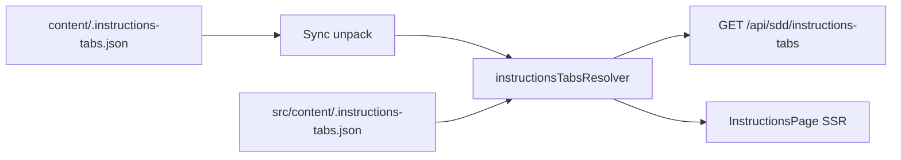

# framework.sdd.works — Admin portal design

Operator web app. Stories: [`app-stories.md`](./app-stories.md). Mockups: [`ui-mockup/`](./ui-mockup/). Stack lock: [`r1-tech-spec.md`](../phase1-process-specs/r1-tech-spec.md) (Phase 1 archive). MCP: [`mcp-design.md`](../mcp/mcp-design.md).

**Status:** draft — one user story at a time.

## 1. Goals and non-goals

| Goals | Non-goals |
| --- | --- |
| Email/password admin portal with invite-only accounts | Portal chat LLM |
| Keys CRUD for `sdd_get_key` | In-portal edit or git push of framework files |
| Settings: one GitHub repository URL (validate then save) | Public self-registration |
| Read-only live GitHub tree/file view | `next-intl` `[locale]` routes |
| i18n `en` / `zh-Hans` / `zh-Hant` | Map vendor keys in this UI |

Host: **`sdd.works`** after [feature-72 / ADR-127](../adr/ADR-127-public-hostnames-sdd-and-learn.md) (**Web-portal-30**). Until cutover ships, production may still be **`framework.sdd.works`**. Protocol id is not localized.

## 2. Stack

Next.js **16.3** App Router, React **19.2**, TypeScript **7.0**, Tailwind **4.3**, React Query **5**, Zustand **5**, RHF + Zod, Prisma + PostgreSQL, Vitest, RTL, Playwright. Mail: Resend. GitHub: server-side REST (Octokit or `fetch`).

## 3. Runtime

Prefer one Next.js process for portal HTML + `/api/admin/*`. MCP Streamable HTTP may be the same process on `/mcp` or a sibling Node process (see [`mcp-design.md`](../mcp/mcp-design.md)). Session middleware **must not** attach to `/mcp`.

```text
sdd.works                     canonical after ADR-127 (framework.sdd.works → redirect)
  /  /login  /reset-password  /set-password  /accept-invite  /instructions
  /admin/*                    session HTML
  /api/admin/*                session + CSRF BFF
  /mcp                        MCP HTTP (bearer) — not cookie
learn.sdd.works               WordPress + /en/learn-embedded/ (iframe only)
```

Local: portal `3040`, Postgres `5435` db `framework_sdd`. Makefile: `dev` / `up` / `down`.

## 4. Data

Prisma. Unique `admins.email`, `keys.key_name`.

| Entity | Fields |
| --- | --- |
| `Admin` | id, email unique, username unique, name, passwordHash (empty until set), status `ACTIVE` \| `DEACTIVATED` |
| `Session` | cookie payload `{ adminId }` sealed with `SESSION_SECRET`; optional `sessionVersion` later |
| `ResetToken` | adminId, tokenHash, expiresAt (1h), usedAt |
| `InviteToken` | email, tokenHash, expiresAt (7d), usedAt, invitedBy |
| `Key` | `key_id` UUID (system), `key_name` unique English (`^[A-Za-z][A-Za-z0-9_-]*$`), `key_description`, `key_value` (encrypted at rest), createdAt, updatedAt |
| `Setting` | singleton row: `githubUrl` (nullable until set), `updatedBy`, `updatedAt` |

Password: scrypt (`node:crypto`). Key values: encrypt at rest with `KEYS_ENCRYPTION_KEY`. Values leave the server only on the authenticated Keys page (list/detail show plaintext to the session admin) and authorized `sdd_get_key` (plaintext `key_value`). No regenerate — admins paste and edit values.

Seed: email `me@ethanhuang.com` (or `ADMIN_SEED_EMAIL`), username `admin` (or `ADMIN_SEED_USERNAME`). Password plaintext from **`ADMIN_SEED_PASSWORD`** only; stored as scrypt hash. Seed fails if password env is blank. Re-seed updates the hash from env. Do not bake passwords into the image or git.

## 5. Auth

| Channel | Credential | Not used for |
| --- | --- | --- |
| Portal + `/api/admin` | Session cookie | `/mcp` |
| MCP HTTP | Bearer | Admin HTML |

Cookie: HttpOnly, Secure in prod, SameSite=Lax, Path=/. CSRF on cookie writes: SameSite=Lax plus Origin/Referer must match host. Rate-limit reset (and invite); login not rate-limited.

Invite: Resend mail with `/accept-invite?token=`. Reset: Resend mail with `/set-password?token=`. Do not claim send success without provider ack.

## 6. Routes

| Path | Story | Mockup | Auth |
| --- | --- | --- | --- |
| `/` | `sdd-admin-home` | `01-home.html` | Public |
| `/login` | `sdd-admin-login` | `02-login.html` | Public; signed-in → `/admin/keys` |
| `/reset-password` | `sdd-admin-password-reset` | `03-reset.html` | Public |
| `/set-password` | `sdd-admin-password-reset` | `04-set-password.html` | Reset token or empty-password session |
| `/accept-invite` | `sdd-admin-invite` | `05-accept-invite.html` | Invite token |
| `/instructions` | `sdd-admin-instructions` | `13-instructions.html` | Public |
| `/admin` | `sdd-admin-landing` | — | Session; redirect → `/admin/keys` |
| `/admin/keys` | `sdd-admin-keys` | `06-keys.html` | Session; post-login landing |
| `/admin/keys/new` | `sdd-admin-keys` | `07-key-new.html` | Session |
| `/admin/keys/[id]` | `sdd-admin-keys` | `09-key-edit.html` | Session |
| `/admin/settings` | `sdd-admin-settings` | `11-settings.html` | Session |
| `/admin/framework` | `sdd-admin-framework` | `12-framework.html` | Session |
| `/admin/accounts` | `sdd-admin-accounts` | `10-admins.html` | Session |

Create success redirects to `/admin/keys` with a saved tip (no one-shot “copy generated secret” step — values are admin-pasted).

### BFF

| Action | API |
| --- | --- |
| Session | `GET /api/admin/session` |
| Login / logout / locale | `POST /api/admin/login` `logout` `locale` |
| Reset / set password | `POST /api/admin/password/reset` `password/set` |
| Invite / accounts | `GET /api/admin/users` `POST /api/admin/users/invite` `DELETE /api/admin/users/[id]` |
| Keys | `GET/POST /api/admin/keys` `PATCH/DELETE /api/admin/keys/[id]` |
| Settings | `GET /api/admin/settings` `PUT /api/admin/settings` |
| Framework tree | `GET /api/admin/framework` |

Errors: `{ error: { key } }`. Never return stacks or other key names.

## 7. GitHub sync

Settings stores **one** repository URL. BFF fetches tree/contents with `GITHUB_TOKEN` (contents:read). Token never goes to the browser.

Near-real-time: poll or webhook (`GITHUB_WEBHOOK_SECRET`) + short cache. Target: cached tree interactive under 2s; if refresh > ~3s show a soft tip. Sync failure: keyed error, do not blank the shell. No in-portal write.

**Save flow (Settings):**

1. Client enables Save only when the URL field differs from the stored value (dirty).
2. On Save, server validates host shape (`github.com` or documented GitHub Enterprise host). Malformed → `errors.settings_url_invalid`; **do not** persist.
3. Server checks the repository is reachable with `GITHUB_TOKEN` (e.g. GET repo metadata). Unreachable / not found / private without access → `errors.settings_url_unreachable`; **do not** persist.
4. On success: persist `githubUrl`, return success; UI shows `admin.settings.saved`.

## 8. i18n

Catalogs `messages/en.json`, `zh-Hans.json`, `zh-Hant.json`. Helper `t(locale, key, vars)`. Locale cookie `sdd_locale`. Switcher labels: **EN / 简 / 繁** (locale ids remain `en` / `zh-Hans` / `zh-Hant`). Missing key → `en` → key name. Dates/numbers: `Intl`. `html lang`: `en` / `zh-CN` / `zh-Hant`.

Brand mark: `public/sdd-logo.png` (SDD WORKS wordmark, **transparent** background) in headers and public shells; favicon / apple-touch from the same brand family. Authoring source: [`src/618x618.logos.png`](../../src/618x618.logos.png) (718×256 RGBA) per [ADR-121](../adr/ADR-121-sdd-works-wordmark-logo.md). Host string **`sdd.works`** is the aria-label / protocol id after **ADR-127** — not duplicated as text beside the logo.

Display sizes (CSS, 200% of original tokens): home / auth wordmark height `144px` / `112px`; header mark height `72px`. Offsets: home logo `margin-left: -30px`; header logo `margin-left: -22px`. Do not paint an opaque background behind the logo image. `Logo.tsx` intrinsic dimensions: **718×256**. Guide hero (`.guide-hero-title`): logo **5.625rem** tall, **`margin-left: -23px`**, headline Antonio **clamp(1.45rem, 2.65vw, 2.125rem)** weight **700**, flex **align-items: center**. **`admin.guide.title`** is the same English line in **en**, **zh-Hans**, and **zh-Hant**.

MCP instructions links on the public home and the signed-in header, and the guide footer Admin portal link, open in a **new tab** (`target="_blank"` + `rel="noopener noreferrer"`).

Do not localize: **`sdd.works`** (host id), tool names, locale ids, default admin email.

zh-Hant TW vs HK remains an open question; one `zh-Hant` catalog is enough until decided.

## 9. Visual style

Reuse the existing mockup tokens: cream `#fafafa`, ink `#0a0a0a`, thin lines, radius 0, Outfit + Noto Sans SC/TC + JetBrains Mono. Signature: SDD WORKS wordmark from [ADR-121](../adr/ADR-121-sdd-works-wordmark-logo.md) (cyan / orange on **transparent**). Mockup asset: `ui-mockup/assets/sdd-logo.png`. No shadows, gradients, or color status pills. Weight and underline show state.

Public/auth first paint: one 12px / 700ms rise; honor `prefers-reduced-motion`.

### Tokens

Canonical file: [`src/styles/tokens.css`](../../src/styles/tokens.css) (keep in sync with mockup `:root`).

```css
--bg: #fafafa; --bg-elevated: #ffffff;
--ink: #0a0a0a; --ink-2: #1f1f1f;
--mute: #525252; --mute-soft: #6b6b6b;
--line: #e0e0e0; --line-strong: #bdbdbd;
--fill: #f0f0f0; --danger: #8b1a1a;
--radius: 0; --control-h: 2.75rem;
--font-ui: "Outfit", "Noto Sans SC", "Noto Sans TC", system-ui, sans-serif;
--font-mono: "JetBrains Mono", ui-monospace, monospace;
--max: 760px;
```

### Components

| Component | Spec |
| --- | --- |
| Primary button | Black fill, white type, 1.5px ink border, radius 0, verb label |
| Text link | Ink, 1px underline; hover → ink underline |
| Danger quiet | Mute type, no fill; hover → ink. Delete |
| Input | Mono uppercase label; bottom border only; 2px ink focus |
| Textarea | Same as input; used for long `key_value` paste |
| Callout | Fill bg, 1px line; error uses `--danger` |
| Table | No vertical rules; mono caps headers; row text actions |
| Keys list | Columns: name, description, key value; actions Copy / Edit / Delete — no regenerate |
| Key value cell | Mono; truncate with ellipsis; Copy writes full `key_value` |
| Dialog | Square, 1px line, 28% ink mask; Escape closes |
| Framework tree | Mono list; directories as uppercase labels; files as leaves; no edit |
| Settings form | Single URL field + Save; Save disabled until dirty; success/error callouts after validate |

Keyboard: 2px ink focus ring. Primary actions reachable without a mouse. Desktop ~1280px and mobile ~390px: public column readable; app nav collapses to a text menu.

## 10. Page frames

```text
Public home                         AUTH
EN 简 繁 top-right                  EN 简 繁
logo + tagline                      logo + closed-register notice
instructions (new tab) + Sign in    title · fields · submit

APP (signed in)
[sdd-logo]     MCP instructions (new tab)   Hello, {name}   EN 简 繁
Keys | Framework | Settings | Admins | Sign out
content: list / form / read-only tree
```

## 11. Module layout

```text
app/                          # Next.js App Router (to scaffold)
  layout.tsx                  # import src/styles/globals.css; favicon
  (public)/page.tsx           # HomePage
  (auth)/login/ …
  instructions/
  admin/layout.tsx            # AppShell
  admin/keys/  settings/  framework/  accounts/
  api/admin/...
src/
  styles/{globals,portal,tokens,email}.css
  components/ui/              # Button, Callout, Field, LocaleSwitch, Logo, Dialog, …
  components/layout/          # AppShell, AuthShell, SkipLink, SiteFooter
  components/features/        # HomePage, LoginPage, KeysList, SettingsForm, …
  i18n/{t,messages}.ts
  auth/{session,csrf,password}.ts
  db/prisma.ts
  mail/resend.ts
  github/sync.ts
messages/{en,zh-Hans,zh-Hant}.json
public/{sdd-logo,sdd-mark,favicon,apple-icon,EthanWeChat}.png
prisma/schema.prisma
```

**UI source of truth:** HTML mockups under [`ui-mockup/`](./ui-mockup/). Production CSS/components under `src/` must match mockup class names and layout. When mockups change, update `src/styles/portal.css` + components in the same change.

Admin BFF may import Prisma. Shared install/key core used by MCP must not import Next.

## 12. Security

- No `NEXT_PUBLIC_*` tokens. Route handlers: `import "server-only"` for secret modules.
- Key values never in logs, list JSON for anonymous callers, or MCP resources.
- Authorization on the server; hiding UI is not the control.
- Cannot delete self or last admin.

## 13. Tests

Test plan: write `app-tests.md` when automation lands. Until then follow **common-test-strategy** + [`r1-tech-spec.md`](../phase1-process-specs/r1-tech-spec.md) quality bar. E2E: login, reset request, invite, Keys CRUD, Settings URL + framework view. Assert keys / roles / test ids. CI fixture-only; live GitHub / Resend opt-in.

## 14. Anti-patterns

- Cookie session as MCP credential
- Writing GitHub files from the portal
- Hard-coded user-facing English in components
- Blanking the app shell on GitHub failure
- Showing key values without a session
- System-generated key values or regenerate flows (admins paste and edit `key_value`)
- Diverging from mockup class names or inventing a second visual system

---

## 15. Detailed Page Design

Implementation must be **100% aligned** with [`ui-mockup/`](./ui-mockup/). Prefer mockup HTML structure + `portal.css` classes over redesign. Spec below is the contract for Next.js pages.

### 15.1 Alignment checklist (every page)

| Check | Rule |
| --- | --- |
| Structure | Same shells: `home-shell` / `auth-shell` / `app-shell` |
| Tokens | Only CSS variables from `src/styles/tokens.css` |
| Copy | i18n keys from `messages/*.json` — no hard-coded product strings |
| Locale | Switcher labels **EN / 简 / 繁**; `html lang` via `LOCALE_HTML_LANG` |
| Brand | `/sdd-logo.png` wordmark (transparent); `/sdd-mark.png` square for mail; favicon `/favicon.png`; no host text beside logo; sizes/offsets per § Visual language |
| Focus | Visible 2px ink focus; Escape closes dialogs |
| Motion | Honor `prefers-reduced-motion` |
| Test ids | Keep mockup `data-testid` values |

### 15.2 Common UI artifacts

| Artifact | Path | Role |
| --- | --- | --- |
| Design tokens | `src/styles/tokens.css` | `:root` colors, type, control metrics |
| Portal CSS | `src/styles/portal.css` | Full mockup stylesheet (class names frozen) |
| Email CSS | `src/styles/email.css` | Transactional mail layout |
| Globals entry | `src/styles/globals.css` | `@import "./portal.css"` |
| Message catalogs | `messages/{en,zh-Hans,zh-Hant}.json` | All UI strings |
| i18n helper | `src/i18n/t.ts` | `t(locale, key, vars?)` + locale labels |
| Brand | `src/618x618.logos.png` → `public/sdd-logo.png` (718×256 wordmark, [ADR-121](../adr/ADR-121-sdd-works-wordmark-logo.md)); `sdd-mark.png` (square mail/icon); `favicon.png`; `apple-icon.png`; `EthanWeChat.png` | Logo / mail / tab / QR |
| UI primitives | `src/components/ui/*` | Button, Callout, Field, LocaleSwitch, Logo, Dialog, PasswordField, CopyButton |
| Floating frame | `portal.css` `.floating-frame`, `.floating-frame__scroll`, `.floating-frame__actions` | Reusable modal shell for guide-style markdown on admin chrome (Admin note, future overlays). Mockup source: [`mockup.css`](./ui-mockup/assets/mockup.css). |
| Shells | `src/components/layout/*` | AuthShell, AppShell, SkipLink, SiteFooter |
| Feature views | `src/components/features/*` | HomePage, LoginPage, KeysList, SettingsForm |

**CSS conventions (from mockup):** cream `--bg` `#fafafa`, ink `#0a0a0a`, radius `0`, bottom-border inputs, black primary `.btn`, quiet `.btn-text`, callouts `.callout-success` / `.callout-error`, tables without vertical rules, mono for keys/paths.

**Shared chrome**

| Shell | Used by | Chrome |
| --- | --- | --- |
| `AuthShell` (`home` \| `auth`) | `/`, `/login`, reset, set-password, accept-invite | Locale top-right; logo; **fixed** footer copyright (guide variant on `/`) |
| `AppShell` | All `/admin/*` | Logo → `/admin/keys`; MCP instructions **new tab**; hello; locale; left nav Keys / Framework / Settings / Admins / Sign out; mobile menu toggle; **fixed** footer |

**Footer (Web-portal-09 / WA-02):** `.site-footer` is `position: fixed; bottom: 0; left: 0; right: 0; z-index` above content. Shells add bottom padding equal to the footer height so content is not covered. Same rule in mockup CSS.

### 15.3 Page-by-page

#### `/` — Instructions landing · mockup `01-home.html` · `InstructionsPage`

| | |
| --- | --- |
| Job | Public install guide (same body as `/instructions`) |
| Layout | Same as `/instructions` (Setup / Features, fixed guide footer with Admin portal) |
| Forbidden | Logo-card home (`admin-home-instructions`, `admin-login`) |
| Test ids | `instructions-guide`, `guide-tab-setup`, `guide-tab-features`, `footer-admin-portal` |

#### `/login` — Sign-in · `02-login.html` · `LoginPage`

| | |
| --- | --- |
| Job | Email/password session |
| Layout | Logo; closed-registration status + WeChat QR on “Contact an admin”; form email + password (show/hide); Sign in; Reset password link; Back to home → `/` (instructions) |
| Errors | `errors.login_failed` via `.error` |
| Keys | `admin.login.*`, `admin.register.*` |
| Test ids | `login-submit`, `login-error`, `contact-admin`, `register-disabled` |

#### `/reset-password` — Request reset · `03-reset.html`

| | |
| --- | --- |
| Job | Request Resend reset mail |
| Layout | Auth card; email; Submit; success callout hides form and lead. Before send: Back to home → `/`. After send: Back to login (`admin.common.back_login`) → `/login` |
| Client submit (WA-05 / WA-08 / WA-10) | Form has no navigational `action`. Submit control cannot issue a document GET (`type="button"` or `preventDefault` before any await). Success → `admin.reset.sent` callout with the previous catalog sentence (no `{email}`), form and `admin.reset.lead` hidden. Failure → `.error` with API key or `errors.reset_mail_send_failed`, form stays. Document stays on `/reset-password` with no `?email=` query. |
| Mail path | Known ACTIVE admin: skip Resend only when `E2E_SKIP_MAIL=1` (writes `E2E_RESET_FILE`); else Resend when configured; else keyed `errors.reset_mail_send_failed`. Capture file paths alone do not skip mail. Unknown email → `{ ok: true }` with the same success callout (no account leak). A sub-100ms `200` means Resend was not called. |
| Keys | `admin.reset.*` (`admin.reset.sent` en: “If that email is an admin account, a reset mail is on its way. Check inbox and junk.”; zh-Hans / zh-Hant matching; no `{email}`), `admin.common.back_home`, `admin.common.back_login`, `errors.reset_mail_send_failed`, `errors.rate_limited`, `errors.csrf` |
| Test ids | `reset-email`, `reset-submit`, `reset-back-login` (success state), `reset-error` (failure) |

#### `/set-password` — Set / reset password · `04-set-password.html`

| | |
| --- | --- |
| Job | Set password from empty account or reset token |
| Gate (WA-04) | No reset token and `passwordHash` non-empty → redirect `/login` (or `/admin/keys` when session is valid). No token and empty hash → `admin.set_password.lead` + form. Reset token path unchanged. |
| Layout | New + confirm password; mismatch error; done state → Sign in |
| Modes | Empty-password session vs `?token=` reset; expired → dedicated callout |
| Keys | `admin.set_password.*`, `errors.password_mismatch`, `errors.reset_link_expired_*` |

#### `/accept-invite` — Accept invite · `05-accept-invite.html`

| | |
| --- | --- |
| Job | Create admin from invite token |
| Layout | Invited email (read-only); name, username, password, confirm; Create account; done / expired states |
| Keys | `admin.accept_invite.*`, `errors.invite_link_expired_*` |

#### `/admin/keys` — Keys list · `06-keys.html` · `KeysList` + `AppShell` (`content--keys`)

| | |
| --- | --- |
| Job | List name, description, key_value; copy / edit / delete |
| Layout | Eyebrow + **bullet lead** (`lead_1`–`lead_3`) + Add key + Bulk delete; optional saved callout; table checkbox · name · description · value · row actions; empty state |
| Forbidden | Regenerate |
| Keys | `admin.keys.*` (`lead_1`–`lead_3`; legacy `lead` kept for catalogs) |
| Test ids | `issue-key`, `keys-delete-selected`, `keys-select-all` |
| Lead copy | Three bullets: third-party capabilities → examples (Qwen, OpenAI, Google Maps, Amap) → `sdd_get_key(key-name)` |

#### `/admin/keys/new` — Add key · `07-key-new.html`

| | |
| --- | --- |
| Job | Create key_id + English unique name + description + pasted value |
| Layout | Same bullet lead as Keys list; form: name (`pattern` English), description, textarea value; Save → `/admin/keys?saved=1` |
| Validation | `errors.key_name_taken`, `errors.key_name_invalid` |
| Keys | `admin.keys.name_hint`, `lead_1`–`lead_3`, … |

#### `/admin/keys/[id]` — Edit key · `09-key-edit.html`

| | |
| --- | --- |
| Job | Edit name / description / value; delete with confirm |
| Layout | Show system `key_id`; same fields as create; Save; Delete opens dialog (no regenerate) |
| Keys | `admin.keys.edit_title`, `admin.keys.id_label`, `admin.keys.delete_*` |

#### `/admin/accounts` — Admins · `10-admins.html`

| | |
| --- | --- |
| Job | Invite by email; list admins; delete (not self / not last) |
| Layout | Invite row (email + Send invite); table name · email · status · Delete |
| Keys | `admin.users.*` |
| Test ids | `users-table` |

#### `/admin/settings` — Settings · `11-settings.html` · `SettingsForm`

| | |
| --- | --- |
| Job | One GitHub URL; dirty Save; validate then persist |
| Layout | Title + lead; success/error callouts; **Repository URL** as `.section-subtitle` (no rule under label); underline `input[type=url]` (mono); hint; Save disabled until dirty |
| Flow | Unchanged → Save disabled; success → tip + DB; fail → tip, no DB write |
| Keys | `admin.settings.*`, `errors.settings_url_*` |
| Test ids | `settings-url`, `settings-save` |

#### `/admin/framework` — Framework · `12-framework.html`

| | |
| --- | --- |
| Job | Cache-backed read-only view of synced package artifacts (SYNK-01 unpacked tree); operator pack-file note ([Web-portal-26](../product-backlog.md#pb-123)) |
| Layout | Eyebrow “Live sync with” + title “framework.sdd.works GitHub repository”; **repo path** (mono) + `framework-repo-actions`: `btn-page` **Change git repository in Settings**, **Sync with git repository**, then **Admin note** (`btn-text`, literal English); `h2.section-subtitle` “framework.sdd.works artifacts:” above tree; empty → CTA Settings; `cache_missing` → sync CTA; sync error callout keeps shell |
| Admin note ([Web-portal-26](../product-backlog.md#pb-123)) | **Admin note** opens a **floating frame** (`.dialog-backdrop` + `.floating-frame`) with `role="dialog"`. Scroll region wraps `article.guide-section.guide-md-body.guide-md-body--prose` (same typography and tables as instructions content tabs). Body HTML from `content/.admin-note.md` (cache) or [`src/content/.admin-note.md`](../../src/content/.admin-note.md) (bundled). Fenced code maps to `.codeblock.codeblock--file` with **Copy** ([ADR-117](../adr/ADR-117-learn-embed-spacing-and-codeblock-tokens.md)). **Close** (literal English, `btn-page`) in `.floating-frame__actions` only; backdrop and Escape dismiss. |
| Mockup | [`12-framework.html`](./ui-mockup/12-framework.html) — `.floating-frame` + full note (regen: `npx tsx scripts/sync-admin-note-mockup.mjs`). Open: `?admin-note=1`. **Confirmed 2026-10-08** (Ethan). |
| Tree | Top-level dirs (`agents/`, `rules/`, `skills/`, …) render as title-case labels (**Agents**, **Rules**, **Skills**) and **expand one level by default**. Immediate children are indented under each folder (files and subfolders). Deeper nesting uses `+`/`−` toggles, collapsed by default. Files never get toggles. At every level, **directories sort before files**, then entries sort **by name** (locale-aware `localeCompare`). |
| Keys | `admin.framework.*` (`change_repo`, `sync_repo`, `tree_expand`, `tree_collapse`, `artifacts`, optional `admin_note_loading` / `admin_note_error`; display URL is data, not `lead` prose). **Admin note** and **Close** labels are literal English (Web-portal-26 exception). |
| Forbidden | Edit / push; public or unauthenticated access to the note HTML |
| Test ids | `framework-source`, `framework-change-repo`, `framework-sync-repo`, `framework-admin-note`, `framework-admin-note-dialog`, `framework-admin-note-body`, `framework-admin-note-close`, `framework-cache-missing`, `framework-artifacts`, `framework-tree`, `framework-tree-toggle-*`, `framework-empty`, `framework-to-settings` |

##### Technical design — Admin note (Web-portal-26)

| | |
| --- | --- |
| Pack path | `<unpacked>/content/.admin-note.md` |
| Bundled fallback | [`src/content/.admin-note.md`](../../src/content/.admin-note.md) |
| Resolver | [`src/lib/admin-note.ts`](../../src/lib/admin-note.ts): `readAdminNote()` — `resolveCachedVersion()` → read `<unpacked>/content/.admin-note.md`; else [`src/content/.admin-note.md`](../../src/content/.admin-note.md). Return `{ html, source: "cache" \| "package" }`. Prose via `renderPortalMarkdown` / `renderContentMarkdown` with rel path `content/.admin-note.md`. After markdown HTML, map `<pre><code class="language-*">` to `.codeblock.codeblock--file` markup (lang tag + copy affordance); preserve `<pre>` inner whitespace for indent. |
| API | [`src/app/api/admin/admin-note/route.ts`](../../src/app/api/admin/admin-note/route.ts) — admin session required; 401 when unsigned; 404 or keyed error when both paths missing; JSON `{ html, source }`. No locale query param. |
| UI | [`FrameworkView.tsx`](../../src/components/features/FrameworkView.tsx): literal **Admin note** `btn-text` after sync; opens `.dialog-backdrop` + `.floating-frame`; fetch on first open (loading/error callouts); inject API `html` into `article.guide-section.guide-md-body.guide-md-body--prose`; wire fenced blocks with [`CopyButton`](../../src/components/ui/CopyButton.tsx) (`codeblock-copy`, label **Copy** literal or `admin.keys.copy` for copy feedback only). **Close** literal in `.floating-frame__actions`. Copy [`.floating-frame`](./ui-mockup/assets/mockup.css) block into [`portal.css`](../../src/styles/portal.css) (mockup sync per §15.4). |
| Sync | After **Sync with git repository**, the next open reads the new cache file without redeploy (same as Features). |
| CSS | Shared `.floating-frame` tokens; prose via existing ADR-123 rules; code blocks via global `.codeblock` / `.codeblock--file`. |

**Implementation plan (Web-portal-26)**

1. **task-01.** Unit tests in `src/lib/admin-note.test.ts`: cache preferred; package fallback; script stripped; fenced JSON → `codeblock--file`; inner pre keeps source indent.
2. **task-02.** `GET /api/admin/admin-note` route tests: 401 unsigned; 200 `{ html, source }` with fixture unpack; no locale param.
3. **task-03.** Mockup confirm — **done 2026-10-08** ([`12-framework.html`](./ui-mockup/12-framework.html), `?admin-note=1`).
4. **task-04.** Framework floating frame + `portal.css` sync; `FrameworkView` component test (open, Close, Escape, `guide-section` on body).
5. **task-05.** E2E in `e2e/admin-framework.spec.ts` or extend framework spec: open note → seed table visible → JSON codeblock Copy → Close → tree present.
6. **task-06.** Run [`app-tests.md`](./app-tests.md) §28 before Done.

**Build readiness:** Mockup and AC39–AC43 are aligned. Next step is implementation (`/fullstack-engineer`), not further spec edits unless scope changes.

#### `/instructions` — MCP guide · `13-instructions.html`

| | |
| --- | --- |
| Job | Present SDD.works: Built on Harness. Ready for Scrum (title key `admin.guide.title`); install steps on Setup tab |
| Layout | `AuthShell` home variant (`home-shell guide-shell`); top-right locale only; **no** Back to home; hero row (logo left of title) + mono tagline `SKILLS.RULES.AGENTS.TEMPLATES` with **no** hairline under the tagline; logo, title, tagline, and tabs sit in one sticky block ([ADR-111](../adr/ADR-111-guide-header-sticky.md), [Web-portal-29](../product-backlog.md#L419)); **Setup** / **Features** / **Scrum in SDD** tabs (`guide-tabs`, labels flush to content left edge, tab row keeps its underline); Setup: **one** pill CTA copies `Fetch and execute the setup instructions from https://framework.sdd.works/setup` ([ADR-061](../adr/ADR-061-setup-prompt-public-path.md)); **no** lite copy on framework.sdd.works (full pack only; partner sites use [`LITE_PARTNER_SETUP_SENTENCE`](../../src/mcp/brand.ts) and `GET /setup/install`); install phrase + `sdd_install_framework` after MCP connect; **no** on-page Manual setup `mcp.json` block (stdio sample stays in fetched `/setup` markdown only); agents roster (7 names) without intro paragraph; **no** Tools table; update hint (`setup_update_tool`, one muted line naming `sdd_update_framework`) above agents heading; **no** secret form on Setup ([ADR-115](../adr/ADR-115-get-secret-on-learn-tab.md)); Features: `#features-body` from the synced markdown under `content/features/` ([ADR-071](../adr/ADR-071-portal-content-paths.md)), no secret form; Scrum in SDD: `#scrum-body` from `content/scrum-in-sdd/` (feature-16); Learn Scrum: embed panel with secret form under the iframe ([ADR-115](../adr/ADR-115-get-secret-on-learn-tab.md)); footer Admin portal link then copyright |
| Tabs (WA-06) | Setup, Features, and Scrum in SDD are links (`?tab=features` / `?tab=scrum-in-sdd` on the current path). Click updates client state and the URL, so a full load still opens the selected tab. The tab list sits inside `.guide-sticky` (`z-index: 20`). Inactive panel uses `hidden` with `display: none !important`. Same on `/` and `/instructions`. |
| Guide tab (Web-portal-12 / feature-16) | Third tab after Features (`?tab=scrum-in-sdd`, `#panel-scrum`). Label key `admin.guide.tab_scrum` is `Scrum in SDD` in `en`, `zh-Hans`, and `zh-Hant` (not translated). Cache path is **human-read** `<unpacked>/content/scrum-in-sdd/scrum-in-sdd.{locale}.md` ([ADR-071](../adr/ADR-071-portal-content-paths.md), [ADR-125](../adr/ADR-125-dual-audience-scrum-guide-and-guide-editor-skill.md)). Fallback is `src/content/scrum-in-sdd/`. English order: Part I–III, then **Appendix: Short summary of the 2020 Scrum Guide**. The **Index** lists h1 and h2 with GitHub-style `#` fragments ([ADR-109](../adr/ADR-109-content-tab-heading-anchors.md)); regenerate with `node scripts/rebuild-scrum-in-sdd-en.mjs --index-only` after part or heading edits. Keep lists **tight** ([knowledge](../knowledge/agent/cursor-markdown-preview-loose-list.md)). Panel `.scrum-body`: `h1` 1.65rem, later part titles 2.75rem top margin; `h2` 1.2rem. No Features em-dash split. **AI-read** install guide is `templates/pack-scrum-in-sdd.md` beside `constants.json` ([ADR-126](../adr/ADR-126-ai-read-pack-templates-and-pack-scrum-in-sdd-filename.md)); it is not this tab. OGT #8: [ogt-8-pack-scrum-in-sdd.md](../framework/ogt-8-pack-scrum-in-sdd.md). Get secret is not on this tab. |
| Secret form (feature-04 / feature-05, [ADR-115](../adr/ADR-115-get-secret-on-learn-tab.md), [ADR-117](../adr/ADR-117-learn-embed-spacing-and-codeblock-tokens.md) / feature-73) | Learn panel only, after `.learn-embed-fallback`. No intro. Spacing: **15px** iframe→fallback, **45px** fallback→`#learn-secret`. `.secret-stack` with `.secret-lookup` (`.input-box` + `.btn.secret-action-btn`) then **found row** `.codeblock.secret-result-block` with `.codeblock-text` + `.codeblock-copy.secret-action-btn` (Copy width = Get secret). Global `.codeblock`: square corners, `1.5px` border, `var(--fill)` background. Secret-stack codeblock row height **2.125rem**. Mock confirm: [`13-instructions.html`](./ui-mockup/13-instructions.html). |
| Test ids | `instructions-guide`, `guide-sticky`, `guide-tab-setup`, `guide-tab-features`, `guide-tab-scrum`, `panel-features`, `features-body`, `panel-scrum`, `scrum-body`, `guide-agents`, `setup-highlight`, `setup-update-preface`, `copy-setup-prompt`, `copy-install-phrase`, `copy-install-cmd`, `learn-embed-loading`, `learn-embed-loading-indicator`, `secret-lookup`, `secret-name`, `secret-get`, `secret-result`, `secret-error` |
| Entry | Home + header open **new tab** |
| Keys | `admin.guide.*` (secret form: `secret_hint`, `secret_button`, `secret_empty`, `secret_missing`) |

#### Features catalog (feature-07)

The Features tab does not keep a fixed list in the app. It shows a markdown file that the operator edits in the pack repo.

| | |
| --- | --- |
| Authoring package | `src/content/features/features.en.md`, `features.zh-Hans.md`, `features.zh-Hant.md`. The runtime image copies `src/`, so these files are on the server. `specs/` is not copied. |
| Pack repo | Same three filenames under `content/features/` in the Settings GitHub pack ([ADR-071](../adr/ADR-071-portal-content-paths.md)). Not at the pack root. Not under `templates/`. |
| Server read | Latest unpacked sync cache `.data/sdd-packages/<commit>/unpacked/content/features/` first. The page does not call GitHub. |
| Package fallback | If that cache cannot be read, or it has no English file, read `src/content/features/` for the active locale. Response `source` is `package`. A missing Chinese file in that folder uses the English package file. There is no unavailable message. |
| Install | Allow-list copy does not include these three files. They never land on `{client_root}`. |
| Page | `/` and `/instructions` server-render `#features-body` for cookie `sdd_locale` (default `en`). Locale switch reloads the page. The body is either the cache file or the package file. |
| Reader | One shared reader used by `GET /api/sdd/features?locale=` and by the page. Public. No key values. Response `{ locale, sourceLocale, source, html }` where `source` is `cache` or `package`. |
| Locale fallback | Inside the chosen source, a missing `zh-Hans` or `zh-Hant` file uses that source’s `features.en.md` and `sourceLocale` `en`. |
| Failed sync | If sync fails and the previous cache is still on disk, the reader serves that cache. `source` stays `cache`. |
| Markdown | Add `marked` only. Parse on the server. Escape raw HTML. Drop `javascript:` links. Do not add an admin editor. Catalog entries are GFM two-column tables under gray `h3` group labels ([ADR-123](../adr/ADR-123-unified-guide-markdown-body.md)). Legacy em-dash list lines may still render via `renderFeaturesMarkdown` until seeds drop lists. |
| Forbidden | A second hardcoded Agents / Skills / Rules / Templates catalog in the component or in locale JSON. |

#### Guide markdown body (ADR-123 / WA-18)

All `type: "content"` tabs share one presentation stack. Setup and Learn embed tabs are out of scope.

| | |
| --- | --- |
| Wrapper | `guide-section guide-md-body` plus `guide-md-body--catalog` (Features) or `guide-md-body--prose` (Scrum in SDD, invoke-agents, default for new content tabs) |
| Test ids | Unchanged: `features-body`, `scrum-body`, `{tabId}-body` on the same `<article>` |
| HTML | After marked, wrap every `<table>` in `<div class="content-table">` for all content paths |
| Width | Body uses full `--guide-max` (56rem centered column); no inner `40rem` prose cap |
| Tables | `table-layout: fixed`; first column `--guide-md-catalog-col1` (11rem); sentence-case headers; mono first column on `--catalog` only |
| Catalog alignment | `--catalog` tables: `padding-left: 0.45rem` on `.content-table` so cells align with `h3` badge text inset |
| Retired classes | Do not add new rules on `.features-body`, `.scrum-body`, or `.portal-content-body` after migration |

Mockup: [`13-instructions.html`](./ui-mockup/13-instructions.html), [`14-invoke-agents-review.html`](./ui-mockup/14-invoke-agents-review.html). Verification: [`app-tests.md`](./app-tests.md) §26; AC37.

#### Implementation plan (feature-07 only)

Do these in order. Write the failing test for a step before the code for that step. Do not start feature-01, feature-02, or feature-03 in this plan.

1. **task-01.** Add the three files under `src/content/features/`. Any markdown is valid. They do not need matching headings. These are the files the image deploys.
2. **task-02.** Copy those filenames to the pack and sync. [ADR-071](../adr/ADR-071-portal-content-paths.md) places them at `content/features/`, not the pack root. Confirm they appear under `.data/sdd-packages/<commit>/unpacked/content/features/`. Install’s copied path list omits those files.
3. **task-03.** Add the reader and `GET /api/sdd/features`. Tests: cache English file, cache zh file, missing cache zh falls back to cache English with `source` `cache`.
4. **task-04.** Remove the fixed lists from `InstructionsPage`. Render `html` into `#features-body` on `/` and `/instructions`. Keep Get secret after that node. Tests: body text comes from the fixture file; a `<script>` in the fixture is text, not a script; Setup copy and `mcp.json` are unchanged.
5. **task-05.** When the cache is missing or has no English file, read `src/content/features/` and set `source` to `package`. The page still shows `features-body`. Test locale `en` and a missing Chinese package file falling back to the English package file.
6. **task-06.** Run the regression in [`app-tests.md`](./app-tests.md) §7 before marking feature-07 Done. That pass covers Setup, the tools table, Get secret, tab switch, and reset success on `/` and `/instructions`.

#### Lite install file links (feature-55 / Web-portal-17)

Lite HTTP install ([`mcp-design.md`](../mcp/mcp-design.md) §2.1c) needs a public index route and a public file route. They read only the synced unpack. They do not call GitHub at request time. They do not write `{client_root}` or `.sdd-installed.json`.

| | |
| --- | --- |
| Allow-list file | `{unpacked}/lite-pack.allowlist.json` at pack repo root ([ADR-107](../adr/ADR-107-lite-pack-allowlist-filename.md), [`LITE_PACK_ALLOWLIST_FILENAME`](../../src/core/seeds/lite-install-manifest.ts)) |
| Validation | [`validateLiteInstallManifest`](../../src/core/seeds/lite-install-manifest.ts) with `seedRoot` = latest unpack dir, `checkFilesExist: true`, `requireExactLists: false` |
| List route | `GET /api/sdd/lite/files`. Optional query `version` (default `latest`). Same cache resolution as [`GET /api/sdd/package`](../../src/app/api/sdd/package/route.ts) via [`resolveCachedVersion`](../../src/core/sync/cache.ts). |
| List success body | `{ package_version, package_commit, cache_synced_at, files, downloads }`. `files` is sorted relative paths (`skills/…`, `rules/…`). `downloads` is `{ path, url }[]` with one entry per path. `package_version` and `package_commit` match the cached package ref. |
| File route | `GET /api/sdd/lite/file?path={relativePath}`. Optional query `version` (default `latest`). |
| Same-origin URLs | Build `url` from the request origin (or `PUBLIC_BASE_URL` when set, same pattern as setup markdown rewrite). Path query value is the relative path, URL-encoded. |
| File success | Stream or buffer the file from `{unpacked}/{path}` with a sensible `Content-Type` from extension (`.md`, `.mdc`). |
| File auth | Re-read and validate `lite-pack.allowlist.json` for the resolved commit. Allow the download only when `path` is in the combined skills and rules list. Reject `..`, leading `/`, backslashes, and NUL. |
| Errors | JSON `{ error: { code, message } }`. Codes: `sync_pending` (409, no sync manifest), `version_not_found` (404), `lite_manifest_missing` (404), `lite_manifest_invalid` (422), `path_not_allowed` (404), `path_invalid` (400). No secret values in messages. |
| Out of scope | Admin session, MCP tools, writing `.sdd-lite-installed.json`, tarball extract on the server |

Shared module (recommended): `src/lib/lite-pack-files.ts` or `src/core/seeds/lite-pack-files.ts` — load allow-list JSON from an unpack root, validate, return sorted `files`, and resolve whether a path is allowed. Routes stay thin.

#### Implementation plan (feature-55 only)

Do these in order. Write the failing test for a step before the code for that step.

1. **task-01.** Add the shared loader or export a function from `lite-install-manifest.ts` that reads `{unpacked}/lite-pack.allowlist.json` and returns sorted paths after validation.
2. **task-02.** Add `GET /api/sdd/lite/files` and integration tests in [`sdd-api.test.ts`](../../src/app/api/sdd/sdd-api.test.ts): success with fixture unpack + allow-list; `sync_pending`; missing file `lite_manifest_missing`; invalid JSON or bad paths `lite_manifest_invalid`.
3. **task-03.** Add `GET /api/sdd/lite/file` and tests: 200 for an allow-listed path; `path_not_allowed` for a path not in the list; `path_invalid` for traversal.
4. **task-04.** Run [`app-tests.md`](./app-tests.md) §9 before marking feature-55 Done.

#### Lite install prompt (feature-56 / Web-portal-18)

Part 1 is public agent markdown at `GET /setup/install`. Part 2 is the **partner** one-line paste ([`app-stories.md`](./app-stories.md) AC21), not a control on framework.sdd.works. Depends on [feature-55](./app-design.md#lite-install-file-links-feature-55--web-portal-17) lite file routes and on [Spec-seeds-18](../product-backlog.md#L482) / [`framework-design.md`](../framework/framework-design.md) lite receipt merge on the client.

##### Partner one-line (Part 2)

| | |
| --- | --- |
| Portal | `/` and `/instructions` Setup show **full MCP only**. No `copy-lite-setup-prompt`. |
| Partner sites | Paste [`LITE_PARTNER_SETUP_SENTENCE`](../../src/mcp/brand.ts): `Fetch and execute the setup instructions from https://framework.sdd.works/setup/install` (production URL in every locale). |
| Authoring | Document the sentence in [`public/agent-setup/install.md`](../../public/agent-setup/install.md) section **Partner site one-line prompt**. |
| Verification | Agent fetches `GET /setup/install` after the user pastes the sentence in Trae CN or another partner UI. |

##### Technical design (Part 1)

| | |
| --- | --- |
| Public URL | `GET /setup/install` ([ADR-061](../adr/ADR-061-setup-prompt-public-path.md)) |
| Rewrite | Add to [`SETUP_REWRITES`](../../src/mcp/setup-paths.ts): `source` `/setup/install`, `destination` `/api/agent-setup/install` |
| Handler | [`src/app/api/agent-setup/install/route.ts`](../../src/app/api/agent-setup/install/route.ts) — mirror [`agent-setup/route.ts`](../../src/app/api/agent-setup/route.ts): read template from disk, optional local origin substitution, return `text/markdown; charset=utf-8`, `Cache-Control: no-cache` |
| Source file | [`public/agent-setup/install.md`](../../public/agent-setup/install.md) (new). Version line at top (for example `Lite install version: YYYY-MM-DD.vN`) like full `prompt.md`. |
| Local dev rewrite | When `isLocalMcpDev()`, replace production origin `https://framework.sdd.works` with `getMcpWebsiteUrl()` so fetches hit the local portal. Same pattern as full setup markdown. |
| Auth | None. Public like `GET /setup`. |
| Dependency | Agent steps call `GET /api/sdd/lite/files` and `GET /api/sdd/lite/file?path=` ([feature-55](#lite-install-file-links-feature-55--web-portal-17)). |

**Markdown contract (AC20)**

The served body must match `public/agent-setup/install.md` after rewrite. Integration tests assert the following (substring or dedicated section headings):

| Requirement | In body |
| --- | --- |
| File index | Instruct `GET /api/sdd/lite/files` (or same-origin path after rewrite) |
| Per-file download | Instruct `GET /api/sdd/lite/file` with allow-listed relative paths only |
| Client root | Instruct resolving `{client_root}` for the running IDE or agent host |
| Receipt | Instruct merge and `.sdd-lite-installed.json` per [Spec-seeds-18](../product-backlog.md#L482) and [`planLiteInstallReceipt`](../../src/core/seeds/lite-install-receipt.ts) rules |
| Forbidden | Must not instruct `sdd_install_framework`, `sdd_update_framework`, or writing `.sdd-installed.json` |
| Scope | Copy only paths from the manifest (`skills/`, `rules/`). No agents, workflows, or templates from lite allow-list |

Shared helpers: `getLiteInstallSetupUrl()` and `LITE_PARTNER_SETUP_SENTENCE` in [`src/mcp/brand.ts`](../../src/mcp/brand.ts).

##### Implementation plan (feature-56 only)

Do these in order. Write the failing test for a step before the code for that step. **feature-55** routes must be green first.

1. **task-01.** Add `public/agent-setup/install.md` with the contract above and the partner one-line section. Review with operator before merge.
2. **task-02.** Add rewrite + `GET /api/agent-setup/install` handler + `setup-paths` test update. Integration tests in [`sdd-api.test.ts`](../../src/app/api/sdd/sdd-api.test.ts): 200 body contains required phrases and `LITE_PARTNER_SETUP_SENTENCE`; `GET /setup` rewrite still serves stdio `prompt.md` (not lite body).
3. **task-03.** Keep Setup UI full-pack only (`SetupGuidePanel`). Unit test: no `copy-lite-setup-prompt` on Setup.
4. **task-04.** Mockups without lite pill. Run [`app-tests.md`](./app-tests.md) §10 before marking feature-56 Done.

#### Instructions tabs (feature-58 / feature-59 / feature-60)

Configurable tabs on `/` and `/instructions` replace hard-coded Features and Scrum tab buttons. Operator rules for the JSON file are in [`src/content/.admin-note.md`](../../src/content/.admin-note.md). Technical design confirmed 2026-10-07: pack-primary config (B), default tab always Setup, bundled JSON-only fallback when cache config is missing or invalid.

| | |
| --- | --- |
| Config file (pack) | `content/.instructions-tabs.json` at pack repo root under `content/` |
| Config file (bundled) | [`src/content/.instructions-tabs.json`](../../src/content/.instructions-tabs.json) — same schema; used when cache file missing or fails validation |
| Resolver | Shared module (for example `src/lib/instructions-tabs.ts`): read cache unpack → validate → else read bundled file only |
| Tab order | Order of objects in `tabs[]` |
| Default tab | When URL has no `?tab=`, select Setup (`queryParam` `setup`) even if another row is first in JSON |
| Tab types | **`code`:** React panel from app registry (`CODE_TAB_REGISTRY`; ship `setup` → `<SetupGuidePanel />` extracted from current `InstructionsPage`). **`content`:** server-rendered markdown from explicit per-locale paths in `paths`. **`embedded_external_page`:** iframe panel ([ADR-110](../adr/ADR-110-learn-tab-embedded-external-page.md)). **`internal_page_folder`:** index tree under **`rootPath`** ([ADR-124](../adr/ADR-124-internal-page-folder-index-json.md), feature-74). |
| Content paths | `paths.en` required; `zh-Hans` / `zh-Hant` optional. Values are relative to unpack root. Reject `..` and absolute paths. Read cache file first, then package fallback under `src/content/…` for that path (reuse features/scrum reader helpers). |
| API | `GET /api/sdd/instructions-tabs?locale=` — public; same resolver; response `{ version, source, tabs: [{ type, id, label, queryParam, panelTestId, html?, embedUrl?, sourceLocale?, contentSource? }] }` where `source` is `cache` or `bundled` for the config file |
| Page | Server components on `/` and `/instructions` call resolver + markdown hydration for content tabs; client keeps WA-06 link tabs and panel `hidden` behavior |
| Tab labels ([ADR-119](../adr/ADR-119-instructions-tab-labels-in-pack-config.md)) | **`labels`** map on each tab row (`en` required; zh locales optional, fallback `en`). Resolver sets **`label`** for active locale. UI renders `tab.label` only. **`labelKey` removed.** Other guide strings stay in portal `messages/*.json`. |
| Install | Config and content markdown paths are not on MCP install allow-list |
| Mockup | [`13-instructions.html`](./ui-mockup/13-instructions.html) shows dynamic tab row; sample **Knowledge** tab is illustrative only |
| Heading anchors | [ADR-109](../adr/ADR-109-content-tab-heading-anchors.md). See **Content tab heading anchors** below. |

**JSON schema (version 1)**

```json
{
  "version": 1,
  "tabs": [
    {
      "type": "code",
      "id": "setup",
      "labels": {
        "en": "Setup",
        "zh-Hans": "设置",
        "zh-Hant": "設定"
      },
      "queryParam": "setup",
      "panelTestId": "panel-setup"
    },
    {
      "type": "content",
      "id": "features",
      "labels": {
        "en": "Features",
        "zh-Hans": "功能",
        "zh-Hant": "功能"
      },
      "queryParam": "features",
      "panelTestId": "panel-features",
      "paths": {
        "en": "content/features/features.en.md",
        "zh-Hans": "content/features/features.zh-Hans.md",
        "zh-Hant": "content/features/features.zh-Hant.md"
      }
    }
  ]
}
```

Validation (fail → bundled file only): JSON parse; `version === 1`; non-empty `tabs`; unique `id` and `queryParam`; every tab has **`labels.en`** (non-empty string); **`labelKey` rejected**; every `code.id` in allowlist; every `content` row has `paths.en`; every `embedded_external_page` row has `urls.en`; every **`internal_page_folder`** row has non-empty **`rootPath`** (pack folder under `content/`, no `..`); **`rootPath`** normalizes under `contentRoot`; root **`rootPath/.index.json`** must parse when `checkFilesExist` is on; at least one `setup` code row recommended for default tab behavior. Per-folder **`.index.json`** validation runs in the folder resolver (duplicate **`id`**, required **`open`** on files, safe **`paths`**, **`.md`** only). `validateInstructionsTabsConfig` takes `contentRoot` = sync unpack root; path strings join under that root for checks (see [`framework-design.md`](../framework/framework-design.md#instructions-tabs-config)).



#### Implementation plan (feature-58 → feature-59 → feature-60)

1. **feature-58.** Add pack seed + bundled JSON; validator unit tests; document in `.admin-note.md` (done in seed). Copy to pack on sync.
2. **feature-59.** Resolver + route + Vitest integration tests (cache hit, invalid cache → bundled, content html + locale fallback).
3. **feature-60.** Extract Setup panel; dynamic tab list and panels; default Setup; deprecate direct `readFeaturesCatalog` / `readScrumInSddCatalog` on page once config drives those tabs. Update [`13-instructions.html`](./ui-mockup/13-instructions.html) note if order differs from legacy “Setup first in bar”.

Legacy [`GET /api/sdd/features`](../../src/app/api/sdd/features/route.ts) and scrum route may stay for direct access until a later cleanup story; the instructions page uses instructions-tabs only after feature-60.

#### Embedded external page (feature-70 / ADR-110)

| | |
| --- | --- |
| Type | `embedded_external_page` in `content/.instructions-tabs.json` |
| Last tab | `learn-scrum-in-sdd`. `labels` per locale (for example en `Learn Scrum in SDD`). `urls.en`, `urls.zh-Hans`, and `urls.zh-Hant` are all **`https://learn.sdd.works/en/learn-embedded/`** after **ADR-127** |
| Panel | One iframe (`learn-scrum-iframe`) plus an open-in-new-tab link. Guide tokens only. No border on the iframe ([ADR-112](../adr/ADR-112-learn-embed-frame.md)) |
| Allowlist | `https` and host **`learn.sdd.works`** or **`www.learn.sdd.works`** ([ADR-127](../adr/ADR-127-public-hostnames-sdd-and-learn.md)) |
| Default tab | Setup when `?tab=` is absent |
| Frame | `.learn-embed-frame`: `width: 100%`, `border: 0`. No fixed `aspect-ratio` ([ADR-114](../adr/ADR-114-learn-embed-auto-height.md)). Height set inline from postMessage. Fallback height until first valid message. No crop via `transform` or `overflow` |
| Loading ([ADR-118](../adr/ADR-118-learn-embed-loading-skeleton.md), centered indicator [ADR-120](../adr/ADR-120-learn-embed-centered-loading-indicator.md) / [WA-17](../issues-log.md)) | Host `.learn-embed-frame-host` wraps iframe plus overlay `.learn-embed-skeleton` (`data-testid="learn-embed-loading"`) and `.learn-embed-loading-indicator` (`data-testid="learn-embed-loading-indicator"`, `aria-hidden="true"`). Indicator centered in the host above the grid; ink/line ring ~1.25rem; rotate only when motion allowed. Iframe not painted until `load` (`visibility: hidden` while loading). Skeleton cells stay opaque; pulse background only. Overlay: 3×3 grid; `pointer-events: none`. Shown until iframe `load`; reset on `embedUrl` change. Host `aria-busy` and `admin.guide.learn_scrum_embed_loading` unchanged. Fallback and `#learn-secret` outside host. |
| Resize | [`LearnScrumEmbedPanel.tsx`](../../src/components/features/LearnScrumEmbedPanel.tsx) (client): listen for `{ type: "sdd-learn-embed-height", height: number }` from embed host origins. Shared constant in [`src/lib/learn-embed-messaging.ts`](../../src/lib/learn-embed-messaging.ts) (new). |
| learn.sdd.works dependency | `learn-embedded` page: full-width grid CSS and script that posts height to portal origin **`https://sdd.works`**. Not built in this repo. |
| Copy ([ADR-113](../adr/ADR-113-learn-embed-copy-and-fallback.md), spacing [ADR-117](../adr/ADR-117-learn-embed-spacing-and-codeblock-tokens.md)) | No intro. Fallback link **15px** below iframe. Iframe `src` from resolver |
| Get secret ([ADR-115](../adr/ADR-115-get-secret-on-learn-tab.md), [ADR-117](../adr/ADR-117-learn-embed-spacing-and-codeblock-tokens.md)) | Order: iframe → fallback → `#learn-secret` (**45px** below fallback). Found value: compact `.codeblock` with visible **1.5px** border; value and Copy share **2.125rem** row height. **§20** [`app-tests.md`](./app-tests.md); CSS contract [`learn-embed-spacing.test.ts`](../../src/styles/learn-embed-spacing.test.ts) |
| Code | [`LearnScrumEmbedPanel.tsx`](../../src/components/features/LearnScrumEmbedPanel.tsx): drop prefix plus split link keys; one external link; compose `GuideSecretLookup` between iframe and fallback. [`messages/*.json`](../../messages/en.json): update intro; replace two fallback keys with one |
| Embed page | Grid-only view at **`https://learn.sdd.works/en/learn-embedded/`** (replaces pre-cutover `sdd.works` embed URL) |

#### Hostname cutover (feature-72 / Web-portal-30 / ADR-127)

**Technical design**

| Area | Change |
| --- | --- |
| Pack + bundled JSON | [`pack.framework.sdd.works/content/.instructions-tabs.json`](../../pack.framework.sdd.works/content/.instructions-tabs.json) and [`src/content/.instructions-tabs.json`](../../src/content/.instructions-tabs.json): **`learn-scrum-in-sdd.urls.*`** → **`https://learn.sdd.works/en/learn-embedded/`** |
| Embed allowlist | [`src/lib/embed-page-host-allowlist.ts`](../../src/lib/embed-page-host-allowlist.ts): **`learn.sdd.works`**, **`www.learn.sdd.works`** |
| Learn URL helper | [`src/lib/sdd-works-learn-url.ts`](../../src/lib/sdd-works-learn-url.ts): constant matches pack JSON (rename optional) |
| postMessage | [`src/lib/learn-embed-messaging.ts`](../../src/lib/learn-embed-messaging.ts): allow **`learn.sdd.works`** message origin; parent is **`sdd.works`** |
| Production origin | [`src/mcp/brand.ts`](../../src/mcp/brand.ts), [`src/mcp/setup-markdown.ts`](../../src/mcp/setup-markdown.ts), [`src/core/tools/package-fetch.ts`](../../src/core/tools/package-fetch.ts): default **`https://sdd.works`** |
| Setup UI | [`SetupGuidePanel.tsx`](../../src/components/features/SetupGuidePanel.tsx): paste sentence **`https://sdd.works/setup`** |
| Host literals | [`src/i18n/t.ts`](../../src/i18n/t.ts) **`HOST`**, [`src/app/layout.tsx`](../../src/app/layout.tsx) **title** → **`sdd.works`** |
| Tests | Vitest files listed in [`app-tests.md`](./app-tests.md) §29 |
| Operator | DNS, TLS, NPM, **`framework.sdd.works`** redirect, WordPress **`frame-ancestors`** ([`go-live/`](../go-live/); delta recorded when ops steps land) |

**Build readiness:** **AC44**, **ADR-127**, and §29 define the contract. Mockup target state in [`13-instructions.html`](./ui-mockup/13-instructions.html). Next step: **`fullstack-engineer`** (app + pack JSON + tests), then operator cutover.

#### Internal page folder (feature-74 / Web-portal-36 / ADR-124)

Mockup confirmed: [`16-knowledge-folder-spike.html`](./ui-mockup/16-knowledge-folder-spike.html) (path trail revision accepted 2026-10-08). Spike script [`assets/knowledge-spike.js`](./ui-mockup/assets/knowledge-spike.js). Sample tree [`assets/samples/knowledge/`](./ui-mockup/assets/samples/knowledge/). Production mirrors pack [`content/knowledge/`](../../src/content/knowledge/). Notes: [`knowledge-folder-tab-spike.md`](../knowledge/agent/knowledge-folder-tab-spike.md).

##### UI

| | |
| --- | --- |
| Panel | Client component under **`panelTestId`** (for example `panel-knowledge`). Guide tokens from §9: cream column, underlined list links, disc list, no card browser. |
| Path trail | **`nav.knowledge-path`** above list or article. Segments: tab **`queryParam`**, then each folder **`id`** in **`path=`**, then **`doc`** id when set. Prefix segments are links; last segment is current. i18n **`admin.guide.knowledge_path_label`** on the **`nav`**. No **Back** button. |
| Tab root list | Path shows only `knowledge` (current). Disc list of entries. No folder **`h2`**. |
| Subfolder list | Path like `knowledge / archived`. Disc list. No folder **`h2`**. |
| Article (**`same_tab`**) | Path includes **`doc`** segment. List hidden; article in **`guide-md-body--prose`**. Prefix path links clear **`doc`** or shorten **`path`**. |
| **`new_tab` row** | Same **`href`** as **`same_tab`** (`tab`, **`path`**, **`doc`**). `target="_blank"`, `rel="noopener noreferrer"`. Optional muted **`admin.guide.knowledge_new_tab_hint`**. Primary click does not set **`doc`** on the current tab. |
| Loading / error | Visible loading copy and error message in the panel; other tabs unaffected. |
| a11y | Path links have visible focus. List uses **`ul`** / **`li`**. Focus management per [ADR-124](../adr/ADR-124-internal-page-folder-index-json.md). |

CSS: shared **`.guide-folder-*`** and **`.guide-inline-link`** under **`.guide-section.guide-folder-browser`** in [`portal.css`](../../src/styles/portal.css) (same tokens as **`.guide-md-body`**). No tab-specific **`.knowledge-*`** presentation rules in production.

##### URL sync

| State | Query |
| --- | --- |
| Tab selected, root list | `?tab=<queryParam>` |
| Subfolder list | `?tab=<queryParam>&path=<id>` or `path=a/b` for nested folders |
| **`same_tab`** article | add `&doc=<file-id>` |

Sync with `InstructionsClient` tab switching: changing **`tab`** clears **`path`** and **`doc`**. **`pushState`** / **`popstate`** for in-tab navigation. Deep links SSR the correct panel state when **`tab`**, **`path`**, and **`doc`** are present.

##### Technical

| | |
| --- | --- |
| Config row | `type` **`internal_page_folder`**, **`id`**, **`labels`**, **`queryParam`**, **`panelTestId`**, **`rootPath`** (for example `content/knowledge`). |
| Index contract | [ADR-124](../adr/ADR-124-internal-page-folder-index-json.md). |
| Resolver module | Extend [`instructions-tabs.ts`](../../src/lib/instructions-tabs.ts) or add `knowledge-folder.ts`: load **`rootPath` + path + /.index.json`**, resolve locale labels, validate entries. |
| Markdown | Reuse **`renderContentMarkdown`** (or shared pipeline) for article HTML. Read cache unpack then **`src/content/`** fallback ([ADR-071](../adr/ADR-071-portal-content-paths.md)). |
| API | Extend **`GET /api/sdd/instructions-tabs`** with folder index payloads, or add **`GET /api/sdd/instructions-folder?locale=&rootPath=&path=`** for index JSON and **`&doc=`** for article metadata + html. Pick one surface in implementation; tests lock the chosen contract. |
| SSR | [`InstructionsPage`](../../src/app/instructions/page.tsx) (and home alias) passes initial index or article html for the active locale when query params are set. |
| Client | **`KnowledgeFolderPanel`**: path trail, list vs article modes, **`new_tab`** rows, `router.push` + SSR refresh (no client-only index fetch). Drop **`folderTitle`** **`h2`** and **Back** per mockup. |
| Validator | [`validateInstructionsTabsConfig`](../../src/core/seeds/instructions-tabs-config.ts) accepts **`internal_page_folder`**; CE-TABS tests include a fixture row. |
| Pack ship | Bundled tab row for Knowledge plus tree under **`src/content/knowledge/`** (may replace standalone **`invoke-agents`** **`content`** tab in a follow-on commit in the same SBI). |

##### Implementation plan (feature-74)

1. Validator + index parser unit tests (ADR-124 fixtures under **`src/content/knowledge/`**).
2. API + resolver integration tests (cache vs bundled, locale fallback, bad index).
3. **`KnowledgeFolderPanel`** + **`portal.css`** + i18n keys; wire into **`InstructionsClient`**.
4. SSR deep link for **`path`** / **`doc`**; browser checks for root → subfolder → **`same_tab`** via path links and **`new_tab`** row.
5. Pack **`content/.instructions-tabs.json`** Knowledge row; run **`npm run check:pack-seeds`** and [`app-tests.md`](./app-tests.md) §27.

##### Path trail revision (mockup accepted 2026-10-08)

1. Add **`KnowledgePathNav`** (or inline in panel): build segments from **`queryParam`**, **`folderSegments`**, **`doc`**; render **`Link`** per prefix; **`data-testid="knowledge-path"`**.
2. Remove **`knowledge-back`**, list **`h2`** from **`folderTitle`**, and tab-root **`folderTitle`** fallback in **`attachKnowledgeState`** unless reused elsewhere.
3. Use **`.guide-folder-*`** in **`portal.css`** (shipped); mockup may keep **`.knowledge-*`** until aligned.
4. i18n: **`admin.guide.knowledge_path_label`** (nav accessible name). **`admin.guide.knowledge_back`** removed (unused after path trail).
5. Update unit, component, and E2E tests per **§27** and **AC38**.

#### Mail — `14-email-reset.html` / `15-email-invite.html`

| | |
| --- | --- |
| Job | Resend HTML for reset / invite |
| Styles | `src/styles/email.css` + square `sdd-mark.png` / brand in mail body |
| Keys | `admin.mail.*` |

### 15.4 Wire-up notes for implementers

1. Import `src/styles/globals.css` once in root layout; set `<link rel="icon" href="/favicon.png" />` and apple-touch.
2. Persist locale in cookie `sdd_locale`; on switch POST `/api/admin/locale` and update `html lang`.
3. Wrap admin routes in `AppShell` with `activeNav` and optional `contentClassName="content--keys"`.
4. Do not restyle buttons/inputs with Tailwind utilities that fight `portal.css` — prefer mockup classes.
5. When adding a string, add keys to all three message files in the same PR as the component.

### 15.5 Mockup ↔ code map

| Mockup | Route | Primary component |
| --- | --- | --- |
| `01-home.html` | `/` | `HomePage` |
| `02-login.html` | `/login` | `LoginPage` |
| `03-reset.html` | `/reset-password` | (Auth form; same Field/Button) |
| `04-set-password.html` | `/set-password` | (Auth form) |
| `05-accept-invite.html` | `/accept-invite` | (Auth form) |
| `06-keys.html` | `/admin/keys` | `KeysList` + `AppShell` |
| `07-key-new.html` | `/admin/keys/new` | Key form feature |
| `09-key-edit.html` | `/admin/keys/[id]` | Key form + Dialog |
| `10-admins.html` | `/admin/accounts` | Accounts feature |
| `11-settings.html` | `/admin/settings` | `SettingsForm` + `AppShell` |
| `12-framework.html` | `/admin/framework` | Framework tree feature |
| `13-instructions.html` | `/`, `/instructions` | `InstructionsPage` + `InstructionsClient`; tab bar from `instructions-tabs` resolver (feature-60); Setup code panel + dynamic content panels |
| `16-knowledge-folder-spike.html` | `/`, `/instructions` (`?tab=knowledge`) | **`KnowledgeFolderPanel`** (feature-74); confirmed UX reference |
| `14` / `15` email | Resend templates | `email.css` |

Optional confirmation `08-key-created.html` is not a required route — create redirects to list with saved tip.

#### Content tab heading anchors (feature-71 / Web-portal-28)

[ADR-109](../adr/ADR-109-content-tab-heading-anchors.md). [Web-portal-28](../product-backlog.md#L413).

##### UI

No new screen, tab, or palette. Content tabs keep the type scale already on `.features-body`, `.scrum-body`, and `.portal-content-body`.

Headings in those three bodies use `scroll-margin-top` so a fragment scroll is not covered by the tab bar. [Web-portal-29](../product-backlog.md#L419) raises that offset to the full sticky block (logo, tagline, and tabs). No new color, motion, or label.

##### Technical

Shared renderer: `createRenderer` in [`src/lib/features-catalog.ts`](../../src/lib/features-catalog.ts). Both `renderFeaturesMarkdown` and `renderPortalMarkdown` emit heading `id`s. `renderContentMarkdown` in [`src/lib/instructions-tabs.ts`](../../src/lib/instructions-tabs.ts) stays the only content-tab entry, so every `type: "content"` tab inherits the ids.

Slug rules:

- Plain text of the heading. Strip inline marks such as bold.
- GitHub-style slug: lowercase, spaces to hyphens, drop punctuation.
- First use of a slug is the bare id. The next is `slug-1`, then `slug-2`.
- Reset the counter at the start of each `marked.parse` call.

Features em-dash list splitting stays unchanged. Pack markdown is not rewritten. A repeated Index fragment still targets the first heading.

CSS lives in [`src/styles/portal.css`](../../src/styles/portal.css) and the mockup stylesheet [`specs/admin-portal/ui-mockup/assets/mockup.css`](./ui-mockup/assets/mockup.css) for the same three body classes.

Tests: unit cases in [`src/lib/features-catalog.test.ts`](../../src/lib/features-catalog.test.ts) and [`src/lib/scrum-in-sdd-catalog.test.ts`](../../src/lib/scrum-in-sdd-catalog.test.ts). See [`app-tests.md`](./app-tests.md) §12.

#### Sticky guide header (Web-portal-29)

[ADR-111](../adr/ADR-111-guide-header-sticky.md). [Web-portal-29](../product-backlog.md#L419). AC27 in [`app-stories.md`](./app-stories.md).

##### UI

No new screen, palette, or type. The existing logo, title (`admin.guide.title`), tagline (`admin.guide.lead`), and tab names stay. The hairline under the tagline is removed. The tab row keeps its underline and the active tab mark.

The pinned block is one column, left aligned, same width as the guide. On a narrow viewport the title wraps inside the block. The tab names scroll sideways inside the tab row. The page does not scroll sideways.

The locale switch stays in the top-right of the shell and scrolls away. The footer stays at the bottom of the page.

Mockups: [`01-home.html`](./ui-mockup/01-home.html) and [`13-instructions.html`](./ui-mockup/13-instructions.html). Shared rules in [`assets/mockup.css`](./ui-mockup/assets/mockup.css).

##### Technical

Markup in [`src/components/features/InstructionsPage.tsx`](../../src/components/features/InstructionsPage.tsx): wrap `header.guide-hero` and `div.guide-tabs` in `div.guide-sticky` with `data-testid="guide-sticky"`. The locale switch stays in `AuthShell` (`.shell-locale`), outside that wrapper. No new message keys. No API and no auth change.

CSS in [`src/styles/portal.css`](../../src/styles/portal.css), mirrored in the mockup stylesheet:

- `.guide-sticky`: `position: sticky; top: 0; z-index: 20; background: var(--bg)`. Negative horizontal margin equal to `.guide-shell .home-main` padding (`1.5rem`) so the background covers the column gutters. Matching horizontal padding keeps the logo and tabs on the content edge.
- `.guide-hero`: no `border-bottom`. Bottom spacing about `0.75rem`. No extra padding under the tagline.
- `.guide-tabs`: keep `border-bottom`. `margin-bottom: 0` so the gap under the tabs belongs to the sticky block's margin. `flex-wrap: nowrap; overflow-x: auto` so extra tabs scroll inside the row.
- Heading `scroll-margin-top` on `.features-body`, `.scrum-body`, and `.portal-content-body` is at least the sticky block height (logo row, tagline, tab row), replacing the tab-bar-only `4.5rem`.

Tests: component cases on `InstructionsPage` and a browser check on `/` and `/instructions`. See [`app-tests.md`](./app-tests.md) §14.

##### Horizontal overflow (WA-14)

[WA-14](../issues-log.md) tracks a regression of the AC27 rule: the page must not scroll sideways; only `.guide-tabs` (and in-content `.content-table` wrappers) may scroll horizontally inside their boxes.

Containment targets in [`src/styles/portal.css`](../../src/styles/portal.css):

- `.guide-shell`, `.guide-shell .home-main`, `.guide-body`, and tab panels: `min-width: 0` where flex layout applies, so wide descendants do not expand the document.
- `.guide-sticky`: negative margin stays paired with padding; overflow from the sticky band must not widen `html` / `body`.
- `.learn-embed` / `.learn-embed-frame`: column width only (`width: 100%`, `max-width: 100%`, `box-sizing: border-box`).
- `.secret-stack` / `.secret-lookup`: `max-width: 100%` on the Learn tab at all viewport widths. The lookup input must shrink below a fixed `32rem` before the `@media (max-width: 640px)` stack rule, or that breakpoint moves up, so viewports between ~520px and 640px do not overflow.

Verification: [`app-tests.md`](./app-tests.md) §19. Acceptance remains AC27; no new label keys.

##### Learn embed centered loader (WA-17 / ADR-120)

[ADR-120](../adr/ADR-120-learn-embed-centered-loading-indicator.md). [WA-17](../issues-log.md).

**UI:** One ring centered in the frame host over the 3×3 skeleton. Guide ink and line tokens only. The skeleton grid stays; the ring is the primary motion cue.

**Technical:** [`LearnScrumEmbedPanel.tsx`](../../src/components/features/LearnScrumEmbedPanel.tsx) renders `learn-embed-loading-indicator` while `!iframeLoaded`. [`portal.css`](../../src/styles/portal.css) matches [`mockup.css`](./ui-mockup/assets/mockup.css) for indicator placement and skeleton background pulse (not whole-cell opacity). Iframe gets a loading class with `visibility: hidden` until `load`.

**Mockup:** [`13-instructions.html`](./ui-mockup/13-instructions.html) `data-mockup-state="loading"`.

Verification: [`app-tests.md`](./app-tests.md) §23; AC34.

##### Brand wordmark (ADR-121)

[ADR-121](../adr/ADR-121-sdd-works-wordmark-logo.md). [Web-portal-34](../product-backlog.md#pb-131).

**UI:** Cyan **SDD**, splatter, orange **WORKS** on transparent PNG. Same height tokens as today; `object-fit: contain` preserves the 718×256 aspect in header, auth, and guide hero.

**Technical:** Authoring file [`src/618x618.logos.png`](../../src/618x618.logos.png). Implementation copies to [`public/sdd-logo.png`](../../public/sdd-logo.png). [`Logo.tsx`](../../src/components/ui/Logo.tsx) sets `width={718}` and `height={256}` on `next/image`. No URL change. Optional CSS offset tweaks only after mockup sign-off.

**Mockup:** [`ui-mockup/assets/sdd-logo.png`](./ui-mockup/assets/sdd-logo.png). Review on [`13-instructions.html`](./ui-mockup/13-instructions.html), [`01-home.html`](./ui-mockup/01-home.html), [`02-login.html`](./ui-mockup/02-login.html).

Verification: [`app-tests.md`](./app-tests.md) §24; AC35. Mockup approved 2026-10-08; production asset swap is the remaining build step.

##### Guide hero and Setup tab (ADR-122)

[ADR-122](../adr/ADR-122-instructions-guide-hero-and-setup-tab.md). [Web-portal-35](../product-backlog.md#pb-132).

**UI:** Hero title key `admin.guide.title`; Antonio on `h1` via `--font-hero` in [`globals.css`](../../src/styles/globals.css) and [`portal.css`](../../src/styles/portal.css). Setup lead `setup_highlight`; update line `setup_update_tool` in `.setup-update-preface`; no Manual setup or Tools table.

**Technical:** [`SetupGuidePanel.tsx`](../../src/components/features/SetupGuidePanel.tsx), [`InstructionsPage.tsx`](../../src/components/features/InstructionsPage.tsx). Stdio sample stays on `GET /setup` only.

**Mockup:** [`01-home.html`](./ui-mockup/01-home.html), [`13-instructions.html`](./ui-mockup/13-instructions.html).

Verification: [`app-tests.md`](./app-tests.md) §25; AC36.
