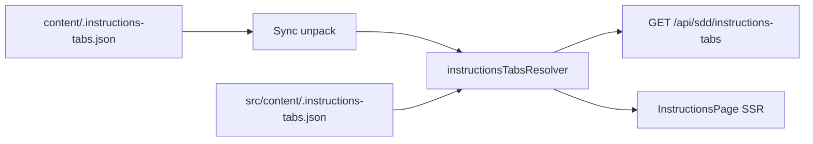

# framework.sdd.works — Admin portal design

Operator web app. Stories: [`app-stories.md`](./app-stories.md). Mockups: [`ui-mockup/`](./ui-mockup/). Stack lock: [`r1-tech-spec.md`](../phase1-process-specs/r1-tech-spec.md) (Phase 1 archive). MCP: [`mcp-design.md`](../mcp/mcp-design.md).

**Status:** draft — one user story at a time.

## 1. Goals and non-goals

| Goals | Non-goals |
| --- | --- |
| Email/password admin portal with invite-only accounts | Portal chat LLM |
| Keys CRUD for `sdd_get_key` | In-portal edit or git push of framework files |
| Settings: one GitHub repository URL (validate then save) | Public self-registration |
| Read-only live GitHub tree/file view | `next-intl` `[locale]` routes |
| i18n `en` / `zh-Hans` / `zh-Hant` | Map vendor keys in this UI |

Host: `framework.sdd.works`. Protocol id is not localized.

## 2. Stack

Next.js **16.3** App Router, React **19.2**, TypeScript **7.0**, Tailwind **4.3**, React Query **5**, Zustand **5**, RHF + Zod, Prisma + PostgreSQL, Vitest, RTL, Playwright. Mail: Resend. GitHub: server-side REST (Octokit or `fetch`).

## 3. Runtime

Prefer one Next.js process for portal HTML + `/api/admin/*`. MCP Streamable HTTP may be the same process on `/mcp` or a sibling Node process (see [`mcp-design.md`](../mcp/mcp-design.md)). Session middleware **must not** attach to `/mcp`.

```text
framework.sdd.works
  /  /login  /reset-password  /set-password  /accept-invite  /instructions
  /admin/*                    session HTML
  /api/admin/*                session + CSRF BFF
  /mcp                        MCP HTTP (bearer) — not cookie
```

Local: portal `3040`, Postgres `5435` db `framework_sdd`. Makefile: `dev` / `up` / `down`.

## 4. Data

Prisma. Unique `admins.email`, `keys.key_name`.

| Entity | Fields |
| --- | --- |
| `Admin` | id, email unique, username unique, name, passwordHash (empty until set), status `ACTIVE` \| `DEACTIVATED` |
| `Session` | cookie payload `{ adminId }` sealed with `SESSION_SECRET`; optional `sessionVersion` later |
| `ResetToken` | adminId, tokenHash, expiresAt (1h), usedAt |
| `InviteToken` | email, tokenHash, expiresAt (7d), usedAt, invitedBy |
| `Key` | `key_id` UUID (system), `key_name` unique English (`^[A-Za-z][A-Za-z0-9_-]*$`), `key_description`, `key_value` (encrypted at rest), createdAt, updatedAt |
| `Setting` | singleton row: `githubUrl` (nullable until set), `updatedBy`, `updatedAt` |

Password: scrypt (`node:crypto`). Key values: encrypt at rest with `KEYS_ENCRYPTION_KEY`. Values leave the server only on the authenticated Keys page (list/detail show plaintext to the session admin) and authorized `sdd_get_key` (plaintext `key_value`). No regenerate — admins paste and edit values.

Seed: email `me@ethanhuang.com` (or `ADMIN_SEED_EMAIL`), username `admin` (or `ADMIN_SEED_USERNAME`). Password plaintext from **`ADMIN_SEED_PASSWORD`** only; stored as scrypt hash. Seed fails if password env is blank. Re-seed updates the hash from env. Do not bake passwords into the image or git.

## 5. Auth

| Channel | Credential | Not used for |
| --- | --- | --- |
| Portal + `/api/admin` | Session cookie | `/mcp` |
| MCP HTTP | Bearer | Admin HTML |

Cookie: HttpOnly, Secure in prod, SameSite=Lax, Path=/. CSRF on cookie writes: SameSite=Lax plus Origin/Referer must match host. Rate-limit reset (and invite); login not rate-limited.

Invite: Resend mail with `/accept-invite?token=`. Reset: Resend mail with `/set-password?token=`. Do not claim send success without provider ack.

## 6. Routes

| Path | Story | Mockup | Auth |
| --- | --- | --- | --- |
| `/` | `sdd-admin-home` | `01-home.html` | Public |
| `/login` | `sdd-admin-login` | `02-login.html` | Public; signed-in → `/admin/keys` |
| `/reset-password` | `sdd-admin-password-reset` | `03-reset.html` | Public |
| `/set-password` | `sdd-admin-password-reset` | `04-set-password.html` | Reset token or empty-password session |
| `/accept-invite` | `sdd-admin-invite` | `05-accept-invite.html` | Invite token |
| `/instructions` | `sdd-admin-instructions` | `13-instructions.html` | Public |
| `/admin` | `sdd-admin-landing` | — | Session; redirect → `/admin/keys` |
| `/admin/keys` | `sdd-admin-keys` | `06-keys.html` | Session; post-login landing |
| `/admin/keys/new` | `sdd-admin-keys` | `07-key-new.html` | Session |
| `/admin/keys/[id]` | `sdd-admin-keys` | `09-key-edit.html` | Session |
| `/admin/settings` | `sdd-admin-settings` | `11-settings.html` | Session |
| `/admin/framework` | `sdd-admin-framework` | `12-framework.html` | Session |
| `/admin/accounts` | `sdd-admin-accounts` | `10-admins.html` | Session |

Create success redirects to `/admin/keys` with a saved tip (no one-shot “copy generated secret” step — values are admin-pasted).

### BFF

| Action | API |
| --- | --- |
| Session | `GET /api/admin/session` |
| Login / logout / locale | `POST /api/admin/login` `logout` `locale` |
| Reset / set password | `POST /api/admin/password/reset` `password/set` |
| Invite / accounts | `GET /api/admin/users` `POST /api/admin/users/invite` `DELETE /api/admin/users/[id]` |
| Keys | `GET/POST /api/admin/keys` `PATCH/DELETE /api/admin/keys/[id]` |
| Settings | `GET /api/admin/settings` `PUT /api/admin/settings` |
| Framework tree | `GET /api/admin/framework` |

Errors: `{ error: { key } }`. Never return stacks or other key names.

## 7. GitHub sync

Settings stores **one** repository URL. BFF fetches tree/contents with `GITHUB_TOKEN` (contents:read). Token never goes to the browser.

Near-real-time: poll or webhook (`GITHUB_WEBHOOK_SECRET`) + short cache. Target: cached tree interactive under 2s; if refresh > ~3s show a soft tip. Sync failure: keyed error, do not blank the shell. No in-portal write.

**Save flow (Settings):**

1. Client enables Save only when the URL field differs from the stored value (dirty).
2. On Save, server validates host shape (`github.com` or documented GitHub Enterprise host). Malformed → `errors.settings_url_invalid`; **do not** persist.
3. Server checks the repository is reachable with `GITHUB_TOKEN` (e.g. GET repo metadata). Unreachable / not found / private without access → `errors.settings_url_unreachable`; **do not** persist.
4. On success: persist `githubUrl`, return success; UI shows `admin.settings.saved`.

## 8. i18n

Catalogs `messages/en.json`, `zh-Hans.json`, `zh-Hant.json`. Helper `t(locale, key, vars)`. Locale cookie `sdd_locale`. Switcher labels: **EN / 简 / 繁** (locale ids remain `en` / `zh-Hans` / `zh-Hant`). Missing key → `en` → key name. Dates/numbers: `Intl`. `html lang`: `en` / `zh-CN` / `zh-Hant`.

Brand mark: `public/sdd-logo.png` (full wordmark, **transparent** background) in headers and public shells; favicon / apple-touch from the same brand family. Host string `framework.sdd.works` remains the aria-label / protocol id — not duplicated as text beside the logo.

Display sizes (CSS, 200% of original tokens): home / auth wordmark height `144px` / `112px`; header mark height `72px`. Offsets: home logo `margin-left: -30px`; header logo `margin-left: -22px`. Do not paint an opaque background behind the logo image.

MCP instructions links on the public home and the signed-in header open in a **new tab** (`target="_blank"` + `rel="noopener noreferrer"`).

Do not localize: `framework.sdd.works`, tool names, locale ids, default admin email.

zh-Hant TW vs HK remains an open question; one `zh-Hant` catalog is enough until decided.

## 9. Visual style

Reuse the existing mockup tokens: cream `#fafafa`, ink `#0a0a0a`, thin lines, radius 0, Outfit + Noto Sans SC/TC + JetBrains Mono. Signature: brand wordmark `public/sdd-logo.png` (cyan / orange on **transparent**). No shadows, gradients, or color status pills. Weight and underline show state.

Public/auth first paint: one 12px / 700ms rise; honor `prefers-reduced-motion`.

### Tokens

Canonical file: [`src/styles/tokens.css`](../../src/styles/tokens.css) (keep in sync with mockup `:root`).

```css
--bg: #fafafa; --bg-elevated: #ffffff;
--ink: #0a0a0a; --ink-2: #1f1f1f;
--mute: #525252; --mute-soft: #6b6b6b;
--line: #e0e0e0; --line-strong: #bdbdbd;
--fill: #f0f0f0; --danger: #8b1a1a;
--radius: 0; --control-h: 2.75rem;
--font-ui: "Outfit", "Noto Sans SC", "Noto Sans TC", system-ui, sans-serif;
--font-mono: "JetBrains Mono", ui-monospace, monospace;
--max: 760px;
```

### Components

| Component | Spec |
| --- | --- |
| Primary button | Black fill, white type, 1.5px ink border, radius 0, verb label |
| Text link | Ink, 1px underline; hover → ink underline |
| Danger quiet | Mute type, no fill; hover → ink. Delete |
| Input | Mono uppercase label; bottom border only; 2px ink focus |
| Textarea | Same as input; used for long `key_value` paste |
| Callout | Fill bg, 1px line; error uses `--danger` |
| Table | No vertical rules; mono caps headers; row text actions |
| Keys list | Columns: name, description, key value; actions Copy / Edit / Delete — no regenerate |
| Key value cell | Mono; truncate with ellipsis; Copy writes full `key_value` |
| Dialog | Square, 1px line, 28% ink mask; Escape closes |
| Framework tree | Mono list; directories as uppercase labels; files as leaves; no edit |
| Settings form | Single URL field + Save; Save disabled until dirty; success/error callouts after validate |

Keyboard: 2px ink focus ring. Primary actions reachable without a mouse. Desktop ~1280px and mobile ~390px: public column readable; app nav collapses to a text menu.

## 10. Page frames

```text
Public home                         AUTH
EN 简 繁 top-right                  EN 简 繁
logo + tagline                      logo + closed-register notice
instructions (new tab) + Sign in    title · fields · submit

APP (signed in)
[sdd-logo]     MCP instructions (new tab)   Hello, {name}   EN 简 繁
Keys | Framework | Settings | Admins | Sign out
content: list / form / read-only tree
```

## 11. Module layout

```text
app/                          # Next.js App Router (to scaffold)
  layout.tsx                  # import src/styles/globals.css; favicon
  (public)/page.tsx           # HomePage
  (auth)/login/ …
  instructions/
  admin/layout.tsx            # AppShell
  admin/keys/  settings/  framework/  accounts/
  api/admin/...
src/
  styles/{globals,portal,tokens,email}.css
  components/ui/              # Button, Callout, Field, LocaleSwitch, Logo, Dialog, …
  components/layout/          # AppShell, AuthShell, SkipLink, SiteFooter
  components/features/        # HomePage, LoginPage, KeysList, SettingsForm, …
  i18n/{t,messages}.ts
  auth/{session,csrf,password}.ts
  db/prisma.ts
  mail/resend.ts
  github/sync.ts
messages/{en,zh-Hans,zh-Hant}.json
public/{sdd-logo,sdd-mark,favicon,apple-icon,EthanWeChat}.png
prisma/schema.prisma
```

**UI source of truth:** HTML mockups under [`ui-mockup/`](./ui-mockup/). Production CSS/components under `src/` must match mockup class names and layout. When mockups change, update `src/styles/portal.css` + components in the same change.

Admin BFF may import Prisma. Shared install/key core used by MCP must not import Next.

## 12. Security

- No `NEXT_PUBLIC_*` tokens. Route handlers: `import "server-only"` for secret modules.
- Key values never in logs, list JSON for anonymous callers, or MCP resources.
- Authorization on the server; hiding UI is not the control.
- Cannot delete self or last admin.

## 13. Tests

Test plan: write `app-tests.md` when automation lands. Until then follow **common-test-strategy** + [`r1-tech-spec.md`](../phase1-process-specs/r1-tech-spec.md) quality bar. E2E: login, reset request, invite, Keys CRUD, Settings URL + framework view. Assert keys / roles / test ids. CI fixture-only; live GitHub / Resend opt-in.

## 14. Anti-patterns

- Cookie session as MCP credential
- Writing GitHub files from the portal
- Hard-coded user-facing English in components
- Blanking the app shell on GitHub failure
- Showing key values without a session
- System-generated key values or regenerate flows (admins paste and edit `key_value`)
- Diverging from mockup class names or inventing a second visual system

---

## 15. Detailed Page Design

Implementation must be **100% aligned** with [`ui-mockup/`](./ui-mockup/). Prefer mockup HTML structure + `portal.css` classes over redesign. Spec below is the contract for Next.js pages.

### 15.1 Alignment checklist (every page)

| Check | Rule |
| --- | --- |
| Structure | Same shells: `home-shell` / `auth-shell` / `app-shell` |
| Tokens | Only CSS variables from `src/styles/tokens.css` |
| Copy | i18n keys from `messages/*.json` — no hard-coded product strings |
| Locale | Switcher labels **EN / 简 / 繁**; `html lang` via `LOCALE_HTML_LANG` |
| Brand | `/sdd-logo.png` wordmark (transparent); `/sdd-mark.png` square for mail; favicon `/favicon.png`; no host text beside logo; sizes/offsets per § Visual language |
| Focus | Visible 2px ink focus; Escape closes dialogs |
| Motion | Honor `prefers-reduced-motion` |
| Test ids | Keep mockup `data-testid` values |

### 15.2 Common UI artifacts

| Artifact | Path | Role |
| --- | --- | --- |
| Design tokens | `src/styles/tokens.css` | `:root` colors, type, control metrics |
| Portal CSS | `src/styles/portal.css` | Full mockup stylesheet (class names frozen) |
| Email CSS | `src/styles/email.css` | Transactional mail layout |
| Globals entry | `src/styles/globals.css` | `@import "./portal.css"` |
| Message catalogs | `messages/{en,zh-Hans,zh-Hant}.json` | All UI strings |
| i18n helper | `src/i18n/t.ts` | `t(locale, key, vars?)` + locale labels |
| Brand | `public/sdd-logo.png` (wordmark), `sdd-mark.png` (square mail/icon), `favicon.png`, `apple-icon.png`, `EthanWeChat.png` | Logo / mail / tab / QR |
| UI primitives | `src/components/ui/*` | Button, Callout, Field, LocaleSwitch, Logo, Dialog, PasswordField, CopyButton |
| Shells | `src/components/layout/*` | AuthShell, AppShell, SkipLink, SiteFooter |
| Feature views | `src/components/features/*` | HomePage, LoginPage, KeysList, SettingsForm |

**CSS conventions (from mockup):** cream `--bg` `#fafafa`, ink `#0a0a0a`, radius `0`, bottom-border inputs, black primary `.btn`, quiet `.btn-text`, callouts `.callout-success` / `.callout-error`, tables without vertical rules, mono for keys/paths.

**Shared chrome**

| Shell | Used by | Chrome |
| --- | --- | --- |
| `AuthShell` (`home` \| `auth`) | `/`, `/login`, reset, set-password, accept-invite | Locale top-right; logo; **fixed** footer copyright (guide variant on `/`) |
| `AppShell` | All `/admin/*` | Logo → `/admin/keys`; MCP instructions **new tab**; hello; locale; left nav Keys / Framework / Settings / Admins / Sign out; mobile menu toggle; **fixed** footer |

**Footer (Web-portal-09 / WA-02):** `.site-footer` is `position: fixed; bottom: 0; left: 0; right: 0; z-index` above content. Shells add bottom padding equal to the footer height so content is not covered. Same rule in mockup CSS.

### 15.3 Page-by-page

#### `/` — Instructions landing · mockup `01-home.html` · `InstructionsPage`

| | |
| --- | --- |
| Job | Public install guide (same body as `/instructions`) |
| Layout | Same as `/instructions` (Setup / Features, fixed guide footer with Admin portal) |
| Forbidden | Logo-card home (`admin-home-instructions`, `admin-login`) |
| Test ids | `instructions-guide`, `guide-tab-setup`, `guide-tab-features`, `footer-admin-portal` |

#### `/login` — Sign-in · `02-login.html` · `LoginPage`

| | |
| --- | --- |
| Job | Email/password session |
| Layout | Logo; closed-registration status + WeChat QR on “Contact an admin”; form email + password (show/hide); Sign in; Reset password link; Back to home → `/` (instructions) |
| Errors | `errors.login_failed` via `.error` |
| Keys | `admin.login.*`, `admin.register.*` |
| Test ids | `login-submit`, `login-error`, `contact-admin`, `register-disabled` |

#### `/reset-password` — Request reset · `03-reset.html`

| | |
| --- | --- |
| Job | Request Resend reset mail |
| Layout | Auth card; email; Submit; success callout hides form and lead. Before send: Back to home → `/`. After send: Back to login (`admin.common.back_login`) → `/login` |
| Client submit (WA-05 / WA-08 / WA-10) | Form has no navigational `action`. Submit control cannot issue a document GET (`type="button"` or `preventDefault` before any await). Success → `admin.reset.sent` callout with the previous catalog sentence (no `{email}`), form and `admin.reset.lead` hidden. Failure → `.error` with API key or `errors.reset_mail_send_failed`, form stays. Document stays on `/reset-password` with no `?email=` query. |
| Mail path | Known ACTIVE admin: skip Resend only when `E2E_SKIP_MAIL=1` (writes `E2E_RESET_FILE`); else Resend when configured; else keyed `errors.reset_mail_send_failed`. Capture file paths alone do not skip mail. Unknown email → `{ ok: true }` with the same success callout (no account leak). A sub-100ms `200` means Resend was not called. |
| Keys | `admin.reset.*` (`admin.reset.sent` en: “If that email is an admin account, a reset mail is on its way. Check inbox and junk.”; zh-Hans / zh-Hant matching; no `{email}`), `admin.common.back_home`, `admin.common.back_login`, `errors.reset_mail_send_failed`, `errors.rate_limited`, `errors.csrf` |
| Test ids | `reset-email`, `reset-submit`, `reset-back-login` (success state), `reset-error` (failure) |

#### `/set-password` — Set / reset password · `04-set-password.html`

| | |
| --- | --- |
| Job | Set password from empty account or reset token |
| Gate (WA-04) | No reset token and `passwordHash` non-empty → redirect `/login` (or `/admin/keys` when session is valid). No token and empty hash → `admin.set_password.lead` + form. Reset token path unchanged. |
| Layout | New + confirm password; mismatch error; done state → Sign in |
| Modes | Empty-password session vs `?token=` reset; expired → dedicated callout |
| Keys | `admin.set_password.*`, `errors.password_mismatch`, `errors.reset_link_expired_*` |

#### `/accept-invite` — Accept invite · `05-accept-invite.html`

| | |
| --- | --- |
| Job | Create admin from invite token |
| Layout | Invited email (read-only); name, username, password, confirm; Create account; done / expired states |
| Keys | `admin.accept_invite.*`, `errors.invite_link_expired_*` |

#### `/admin/keys` — Keys list · `06-keys.html` · `KeysList` + `AppShell` (`content--keys`)

| | |
| --- | --- |
| Job | List name, description, key_value; copy / edit / delete |
| Layout | Eyebrow + **bullet lead** (`lead_1`–`lead_3`) + Add key + Bulk delete; optional saved callout; table checkbox · name · description · value · row actions; empty state |
| Forbidden | Regenerate |
| Keys | `admin.keys.*` (`lead_1`–`lead_3`; legacy `lead` kept for catalogs) |
| Test ids | `issue-key`, `keys-delete-selected`, `keys-select-all` |
| Lead copy | Three bullets: third-party capabilities → examples (Qwen, OpenAI, Google Maps, Amap) → `sdd_get_key(key-name)` |

#### `/admin/keys/new` — Add key · `07-key-new.html`

| | |
| --- | --- |
| Job | Create key_id + English unique name + description + pasted value |
| Layout | Same bullet lead as Keys list; form: name (`pattern` English), description, textarea value; Save → `/admin/keys?saved=1` |
| Validation | `errors.key_name_taken`, `errors.key_name_invalid` |
| Keys | `admin.keys.name_hint`, `lead_1`–`lead_3`, … |

#### `/admin/keys/[id]` — Edit key · `09-key-edit.html`

| | |
| --- | --- |
| Job | Edit name / description / value; delete with confirm |
| Layout | Show system `key_id`; same fields as create; Save; Delete opens dialog (no regenerate) |
| Keys | `admin.keys.edit_title`, `admin.keys.id_label`, `admin.keys.delete_*` |

#### `/admin/accounts` — Admins · `10-admins.html`

| | |
| --- | --- |
| Job | Invite by email; list admins; delete (not self / not last) |
| Layout | Invite row (email + Send invite); table name · email · status · Delete |
| Keys | `admin.users.*` |
| Test ids | `users-table` |

#### `/admin/settings` — Settings · `11-settings.html` · `SettingsForm`

| | |
| --- | --- |
| Job | One GitHub URL; dirty Save; validate then persist; pack repo file note for operators ([Web-portal-26](../product-backlog.md#L420)) |
| Layout | Title + lead; success/error callouts; **Repository URL** as `.section-subtitle` (no rule under label); underline `input[type=url]` (mono); hint; Save disabled until dirty; **Admin note** block renders markdown from synced `content/.admin-note.md` (authoring seed [`src/content/.admin-note.md`](../../src/content/.admin-note.md)) |
| Flow | Unchanged → Save disabled; success → tip + DB; fail → tip, no DB write. Note body updates after pack sync only. |
| Keys | `admin.settings.*`, `errors.settings_url_*` |
| Test ids | `settings-url`, `settings-save`, `settings-pack-note` |

#### `/admin/framework` — Framework · `12-framework.html`

| | |
| --- | --- |
| Job | Cache-backed read-only view of synced package artifacts (SYNK-01 unpacked tree) |
| Layout | Eyebrow “Live sync with” + title “framework.sdd.works GitHub repository”; **repo path** (mono) + `btn-page` **Change git repository in Settings** + **Sync with git repository**; `h2.section-subtitle` “framework.sdd.works artifacts:” above tree; empty → CTA Settings; `cache_missing` → sync CTA; sync error callout keeps shell |
| Tree | Top-level dirs (`agents/`, `rules/`, `skills/`, …) render as title-case labels (**Agents**, **Rules**, **Skills**) and **expand one level by default**. Immediate children are indented under each folder (files and subfolders). Deeper nesting uses `+`/`−` toggles, collapsed by default. Files never get toggles. At every level, **directories sort before files**, then entries sort **by name** (locale-aware `localeCompare`). |
| Keys | `admin.framework.*` (`change_repo`, `sync_repo`, `tree_expand`, `tree_collapse`, `artifacts`; display URL is data, not `lead` prose) |
| Forbidden | Edit / push |
| Test ids | `framework-source`, `framework-change-repo`, `framework-sync-repo`, `framework-cache-missing`, `framework-artifacts`, `framework-tree`, `framework-tree-toggle-*`, `framework-empty`, `framework-to-settings` |

#### `/instructions` — MCP guide · `13-instructions.html`

| | |
| --- | --- |
| Job | Install framework.sdd.works to AI tools |
| Layout | `AuthShell` home variant (`home-shell guide-shell`); top-right locale only; **no** Back to home; hero row (logo left of title) + mono tagline `SKILLS.RULES.AGENTS.TEMPLATES`; **Setup** / **Features** / **Scrum in SDD** tabs (`guide-tabs`, labels flush to content left edge); Setup: **one** pill CTA copies `Fetch and execute the setup instructions from https://framework.sdd.works/setup` ([ADR-061](../adr/ADR-061-setup-prompt-public-path.md)); **no** lite copy on framework.sdd.works (full pack only; partner sites use [`LITE_PARTNER_SETUP_SENTENCE`](../../src/mcp/brand.ts) and `GET /setup/install`); install phrase + `sdd_install_framework` after MCP connect; Manual setup one `mcp.json` with `command` `${userHome}/.sdd/sdd-mcp` and `SDD_SERVER_URL` `https://framework.sdd.works` (no second `mcp.json`, no `curl`), agents roster (7 names), tools table **Tool** + **Description** only (no Channel); Features: `#features-body` from the synced markdown under `content/features/` ([ADR-071](../adr/ADR-071-portal-content-paths.md)), no secret form; Scrum in SDD: `#scrum-body` from `content/scrum-in-sdd/` (feature-16); Setup ends with the secret form after the tools table ([ADR-067](../adr/ADR-067-get-secret-on-setup.md), feature-17); footer Admin portal link then copyright |
| Tabs (WA-06) | Setup, Features, and Scrum in SDD are links (`?tab=features` / `?tab=scrum-in-sdd` on the current path). Click updates client state and the URL, so a full load still opens the selected tab. `.guide-tabs` is `position: relative; z-index: 10`. Inactive panel uses `hidden` with `display: none !important`. Same on `/` and `/instructions`. |
| Guide tab (Web-portal-12 / feature-16) | Third tab after Features (`?tab=scrum-in-sdd`, `#panel-scrum`). Label key `admin.guide.tab_scrum` is `Scrum in SDD` in `en`, `zh-Hans`, and `zh-Hant` (not translated). Cache path is `<unpacked>/content/scrum-in-sdd/scrum-in-sdd.{locale}.md` ([ADR-071](../adr/ADR-071-portal-content-paths.md)). Fallback is `src/content/scrum-in-sdd/`. The panel uses `.scrum-body`: `h1` is 1.65rem with 2.75rem above later part titles; `h2` is 1.2rem. List items keep inline markdown. No Features em-dash split. Template seeds stay `templates/{locale}/scrum-in-sdd.md`. Get secret stays on Setup ([ADR-067](../adr/ADR-067-get-secret-on-setup.md)). |
| Secret form (feature-04 / feature-05, placement [ADR-067](../adr/ADR-067-get-secret-on-setup.md) / feature-17) | On Setup only, after the tools table, section `#setup-secret` with no heading. The Features panel does not include the form. Wrapper `.secret-stack`: column, `width: fit-content`, `max-width: 100%`, `gap: 1.25rem` between the lookup row and the result. Form `.secret-lookup` inside the stack: placeholder input (`admin.guide.secret_hint`) + Get secret control (`admin.guide.secret_button`) as `button type="button"` (must not issue a document GET). Catalog: en `Enter the name of the secret, example: sdd-trial-googlemaps` / `Get secret`; zh-Hans `输入要获得的密钥名称，例如：sdd-trial-googlemaps` / `获取密钥`; zh-Hant `輸入要取得的密鑰名稱，例如：sdd-trial-googlemaps` / `獲取密鑰`. CSS: row gap `0.75rem`; input `flex: 0 0 32rem` (does not shrink), width/min/max `32rem`, height `2.125rem`; button content-sized, height `2.125rem`. Found result and not-found notice stretch to the stack (`width: 0; min-width: 100%`) so the right edge lines up with Get secret. Found UI: existing portal `.codeblock` with `CopyButton`, `data-testid="secret-result"`, `aria-live="polite"`. Missing / empty: `.secret-error` (`data-testid="secret-error"`) with `admin.guide.secret_missing` or `admin.guide.secret_empty`. After the result renders, scroll `secret-result` or `secret-error` into view (`block: "start"`). Below `640px`: stack and field full width, button stacks under the field. **Lookup (feature-05):** `POST` one exact `key_name` to a public route that decrypts via the same store as `getKey`; response is only that plaintext value or keyed `admin.guide.secret_missing` (lists no other names). Viewport stays on `#setup-secret` with the Setup tab selected. Exact name match only (no fuzzy match). Mock: [`13-instructions.html`](./ui-mockup/13-instructions.html) (same form in [`01-home.html`](./ui-mockup/01-home.html)). |
| Test ids | `instructions-guide`, `guide-tab-setup`, `guide-tab-features`, `guide-tab-scrum`, `panel-features`, `features-body`, `panel-scrum`, `scrum-body`, `guide-agents`, `copy-setup-prompt`, `copy-mcp-config`, `secret-lookup`, `secret-name`, `secret-get`, `secret-result`, `secret-error` |
| Entry | Home + header open **new tab** |
| Keys | `admin.guide.*` (secret form: `secret_hint`, `secret_button`, `secret_empty`, `secret_missing`) |

#### Features catalog (feature-07)

The Features tab does not keep a fixed list in the app. It shows a markdown file that the operator edits in the pack repo.

| | |
| --- | --- |
| Authoring package | `src/content/features/features.en.md`, `features.zh-Hans.md`, `features.zh-Hant.md`. The runtime image copies `src/`, so these files are on the server. `specs/` is not copied. |
| Pack repo | Same three filenames under `content/features/` in the Settings GitHub pack ([ADR-071](../adr/ADR-071-portal-content-paths.md)). Not at the pack root. Not under `templates/`. |
| Server read | Latest unpacked sync cache `.data/sdd-packages/<commit>/unpacked/content/features/` first. The page does not call GitHub. |
| Package fallback | If that cache cannot be read, or it has no English file, read `src/content/features/` for the active locale. Response `source` is `package`. A missing Chinese file in that folder uses the English package file. There is no unavailable message. |
| Install | Allow-list copy does not include these three files. They never land on `{client_root}`. |
| Page | `/` and `/instructions` server-render `#features-body` for cookie `sdd_locale` (default `en`). Locale switch reloads the page. The body is either the cache file or the package file. |
| Reader | One shared reader used by `GET /api/sdd/features?locale=` and by the page. Public. No key values. Response `{ locale, sourceLocale, source, html }` where `source` is `cache` or `package`. |
| Locale fallback | Inside the chosen source, a missing `zh-Hans` or `zh-Hant` file uses that source’s `features.en.md` and `sourceLocale` `en`. |
| Failed sync | If sync fails and the previous cache is still on disk, the reader serves that cache. `source` stays `cache`. |
| Markdown | Add `marked` only. Parse on the server. Escape raw HTML. Drop `javascript:` links. Do not add an admin editor. The mock is a sample, not a schema. Inside `#features-body`, a section title is the large heading. A group label such as Agents is a small ink label on a light gray ground, not a second heading. Each entry is one line: the name, then an em dash, then the description. Lists under a heading use a disc marker and sit inset from the heading (`padding-left: 1.35rem` on the list, `0.25rem` on the item). Headings and gray group labels stay flush left. |
| Forbidden | A second hardcoded Agents / Skills / Rules / Templates catalog in the component or in locale JSON. |

#### Implementation plan (feature-07 only)

Do these in order. Write the failing test for a step before the code for that step. Do not start feature-01, feature-02, or feature-03 in this plan.

1. **task-01.** Add the three files under `src/content/features/`. Any markdown is valid. They do not need matching headings. These are the files the image deploys.
2. **task-02.** Copy those filenames to the pack and sync. [ADR-071](../adr/ADR-071-portal-content-paths.md) places them at `content/features/`, not the pack root. Confirm they appear under `.data/sdd-packages/<commit>/unpacked/content/features/`. Install’s copied path list omits those files.
3. **task-03.** Add the reader and `GET /api/sdd/features`. Tests: cache English file, cache zh file, missing cache zh falls back to cache English with `source` `cache`.
4. **task-04.** Remove the fixed lists from `InstructionsPage`. Render `html` into `#features-body` on `/` and `/instructions`. Keep Get secret after that node. Tests: body text comes from the fixture file; a `<script>` in the fixture is text, not a script; Setup copy and `mcp.json` are unchanged.
5. **task-05.** When the cache is missing or has no English file, read `src/content/features/` and set `source` to `package`. The page still shows `features-body`. Test locale `en` and a missing Chinese package file falling back to the English package file.
6. **task-06.** Run the regression in [`app-tests.md`](./app-tests.md) §7 before marking feature-07 Done. That pass covers Setup, the tools table, Get secret, tab switch, and reset success on `/` and `/instructions`.

#### Lite install file links (feature-55 / Web-portal-17)

Lite HTTP install ([`mcp-design.md`](../mcp/mcp-design.md) §2.1c) needs a public index route and a public file route. They read only the synced unpack. They do not call GitHub at request time. They do not write `{client_root}` or `.sdd-installed.json`.

| | |
| --- | --- |
| Allow-list file | `{unpacked}/lite-pack.allowlist.json` at pack repo root ([ADR-107](../adr/ADR-107-lite-pack-allowlist-filename.md), [`LITE_PACK_ALLOWLIST_FILENAME`](../../src/core/seeds/lite-install-manifest.ts)) |
| Validation | [`validateLiteInstallManifest`](../../src/core/seeds/lite-install-manifest.ts) with `seedRoot` = latest unpack dir, `checkFilesExist: true`, `requireExactLists: false` |
| List route | `GET /api/sdd/lite/files`. Optional query `version` (default `latest`). Same cache resolution as [`GET /api/sdd/package`](../../src/app/api/sdd/package/route.ts) via [`resolveCachedVersion`](../../src/core/sync/cache.ts). |
| List success body | `{ package_version, package_commit, cache_synced_at, files, downloads }`. `files` is sorted relative paths (`skills/…`, `rules/…`). `downloads` is `{ path, url }[]` with one entry per path. `package_version` and `package_commit` match the cached package ref. |
| File route | `GET /api/sdd/lite/file?path={relativePath}`. Optional query `version` (default `latest`). |
| Same-origin URLs | Build `url` from the request origin (or `PUBLIC_BASE_URL` when set, same pattern as setup markdown rewrite). Path query value is the relative path, URL-encoded. |
| File success | Stream or buffer the file from `{unpacked}/{path}` with a sensible `Content-Type` from extension (`.md`, `.mdc`). |
| File auth | Re-read and validate `lite-pack.allowlist.json` for the resolved commit. Allow the download only when `path` is in the combined skills and rules list. Reject `..`, leading `/`, backslashes, and NUL. |
| Errors | JSON `{ error: { code, message } }`. Codes: `sync_pending` (409, no sync manifest), `version_not_found` (404), `lite_manifest_missing` (404), `lite_manifest_invalid` (422), `path_not_allowed` (404), `path_invalid` (400). No secret values in messages. |
| Out of scope | Admin session, MCP tools, writing `.sdd-lite-installed.json`, tarball extract on the server |

Shared module (recommended): `src/lib/lite-pack-files.ts` or `src/core/seeds/lite-pack-files.ts` — load allow-list JSON from an unpack root, validate, return sorted `files`, and resolve whether a path is allowed. Routes stay thin.

#### Implementation plan (feature-55 only)

Do these in order. Write the failing test for a step before the code for that step.

1. **task-01.** Add the shared loader or export a function from `lite-install-manifest.ts` that reads `{unpacked}/lite-pack.allowlist.json` and returns sorted paths after validation.
2. **task-02.** Add `GET /api/sdd/lite/files` and integration tests in [`sdd-api.test.ts`](../../src/app/api/sdd/sdd-api.test.ts): success with fixture unpack + allow-list; `sync_pending`; missing file `lite_manifest_missing`; invalid JSON or bad paths `lite_manifest_invalid`.
3. **task-03.** Add `GET /api/sdd/lite/file` and tests: 200 for an allow-listed path; `path_not_allowed` for a path not in the list; `path_invalid` for traversal.
4. **task-04.** Run [`app-tests.md`](./app-tests.md) §9 before marking feature-55 Done.

#### Lite install prompt (feature-56 / Web-portal-18)

Part 1 is public agent markdown at `GET /setup/install`. Part 2 is the **partner** one-line paste ([`app-stories.md`](./app-stories.md) AC21), not a control on framework.sdd.works. Depends on [feature-55](./app-design.md#lite-install-file-links-feature-55--web-portal-17) lite file routes and on [Spec-seeds-18](../product-backlog.md#L449) / [`framework-design.md`](../framework/framework-design.md) lite receipt merge on the client.

##### Partner one-line (Part 2)

| | |
| --- | --- |
| Portal | `/` and `/instructions` Setup show **full MCP only**. No `copy-lite-setup-prompt`. |
| Partner sites | Paste [`LITE_PARTNER_SETUP_SENTENCE`](../../src/mcp/brand.ts): `Fetch and execute the setup instructions from https://framework.sdd.works/setup/install` (production URL in every locale). |
| Authoring | Document the sentence in [`public/agent-setup/install.md`](../../public/agent-setup/install.md) section **Partner site one-line prompt**. |
| Verification | Agent fetches `GET /setup/install` after the user pastes the sentence in Trae CN or another partner UI. |

##### Technical design (Part 1)

| | |
| --- | --- |
| Public URL | `GET /setup/install` ([ADR-061](../adr/ADR-061-setup-prompt-public-path.md)) |
| Rewrite | Add to [`SETUP_REWRITES`](../../src/mcp/setup-paths.ts): `source` `/setup/install`, `destination` `/api/agent-setup/install` |
| Handler | [`src/app/api/agent-setup/install/route.ts`](../../src/app/api/agent-setup/install/route.ts) — mirror [`agent-setup/route.ts`](../../src/app/api/agent-setup/route.ts): read template from disk, optional local origin substitution, return `text/markdown; charset=utf-8`, `Cache-Control: no-cache` |
| Source file | [`public/agent-setup/install.md`](../../public/agent-setup/install.md) (new). Version line at top (for example `Lite install version: YYYY-MM-DD.vN`) like full `prompt.md`. |
| Local dev rewrite | When `isLocalMcpDev()`, replace production origin `https://framework.sdd.works` with `getMcpWebsiteUrl()` so fetches hit the local portal. Same pattern as full setup markdown. |
| Auth | None. Public like `GET /setup`. |
| Dependency | Agent steps call `GET /api/sdd/lite/files` and `GET /api/sdd/lite/file?path=` ([feature-55](#lite-install-file-links-feature-55--web-portal-17)). |

**Markdown contract (AC20)**

The served body must match `public/agent-setup/install.md` after rewrite. Integration tests assert the following (substring or dedicated section headings):

| Requirement | In body |
| --- | --- |
| File index | Instruct `GET /api/sdd/lite/files` (or same-origin path after rewrite) |
| Per-file download | Instruct `GET /api/sdd/lite/file` with allow-listed relative paths only |
| Client root | Instruct resolving `{client_root}` for the running IDE or agent host |
| Receipt | Instruct merge and `.sdd-lite-installed.json` per [Spec-seeds-18](../product-backlog.md#L449) and [`planLiteInstallReceipt`](../../src/core/seeds/lite-install-receipt.ts) rules |
| Forbidden | Must not instruct `sdd_install_framework`, `sdd_update_framework`, or writing `.sdd-installed.json` |
| Scope | Copy only paths from the manifest (`skills/`, `rules/`). No agents, workflows, or templates from lite allow-list |

Shared helpers: `getLiteInstallSetupUrl()` and `LITE_PARTNER_SETUP_SENTENCE` in [`src/mcp/brand.ts`](../../src/mcp/brand.ts).

##### Implementation plan (feature-56 only)

Do these in order. Write the failing test for a step before the code for that step. **feature-55** routes must be green first.

1. **task-01.** Add `public/agent-setup/install.md` with the contract above and the partner one-line section. Review with operator before merge.
2. **task-02.** Add rewrite + `GET /api/agent-setup/install` handler + `setup-paths` test update. Integration tests in [`sdd-api.test.ts`](../../src/app/api/sdd/sdd-api.test.ts): 200 body contains required phrases and `LITE_PARTNER_SETUP_SENTENCE`; `GET /setup` rewrite still serves stdio `prompt.md` (not lite body).
3. **task-03.** Keep Setup UI full-pack only (`SetupGuidePanel`). Unit test: no `copy-lite-setup-prompt` on Setup.
4. **task-04.** Mockups without lite pill. Run [`app-tests.md`](./app-tests.md) §10 before marking feature-56 Done.

#### Instructions tabs (feature-58 / feature-59 / feature-60)

Configurable tabs on `/` and `/instructions` replace hard-coded Features and Scrum tab buttons. Operator rules for the JSON file are in [`src/content/.admin-note.md`](../../src/content/.admin-note.md). Technical design confirmed 2026-10-07: pack-primary config (B), default tab always Setup, bundled JSON-only fallback when cache config is missing or invalid.

| | |
| --- | --- |
| Config file (pack) | `content/.instructions-tabs.json` at pack repo root under `content/` |
| Config file (bundled) | [`src/content/.instructions-tabs.json`](../../src/content/.instructions-tabs.json) — same schema; used when cache file missing or fails validation |
| Resolver | Shared module (for example `src/lib/instructions-tabs.ts`): read cache unpack → validate → else read bundled file only |
| Tab order | Order of objects in `tabs[]` |
| Default tab | When URL has no `?tab=`, select Setup (`queryParam` `setup`) even if another row is first in JSON |
| Tab types | **`code`:** React panel from app registry (`CODE_TAB_REGISTRY`; ship `setup` → `<SetupGuidePanel />` extracted from current `InstructionsPage`). **`content`:** server-rendered markdown from explicit per-locale paths in `paths`. |
| Content paths | `paths.en` required; `zh-Hans` / `zh-Hant` optional. Values are relative to unpack root. Reject `..` and absolute paths. Read cache file first, then package fallback under `src/content/…` for that path (reuse features/scrum reader helpers). |
| API | `GET /api/sdd/instructions-tabs?locale=` — public; same resolver; response `{ version, source, tabs: [{ type, id, labelKey, queryParam, panelTestId, html?, sourceLocale?, contentSource? }] }` where `source` is `cache` or `bundled` for the config file |
| Page | Server components on `/` and `/instructions` call resolver + markdown hydration for content tabs; client keeps WA-06 link tabs and panel `hidden` behavior |
| i18n | Tab labels from `labelKey`; new keys need en / zh-Hans / zh-Hant catalogs |
| Install | Config and content markdown paths are not on MCP install allow-list |
| Mockup | [`13-instructions.html`](./ui-mockup/13-instructions.html) shows dynamic tab row; sample **Knowledge** tab is illustrative only |

**JSON schema (version 1)**

```json
{
  "version": 1,
  "tabs": [
    {
      "type": "code",
      "id": "setup",
      "labelKey": "admin.guide.tab_setup",
      "queryParam": "setup",
      "panelTestId": "panel-setup"
    },
    {
      "type": "content",
      "id": "features",
      "labelKey": "admin.guide.tab_features",
      "queryParam": "features",
      "panelTestId": "panel-features",
      "paths": {
        "en": "content/features/features.en.md",
        "zh-Hans": "content/features/features.zh-Hans.md",
        "zh-Hant": "content/features/features.zh-Hant.md"
      }
    }
  ]
}
```

Validation (fail → bundled file only): JSON parse; `version === 1`; non-empty `tabs`; unique `id` and `queryParam`; every `code.id` in allowlist; every `content` row has `paths.en`; paths safe and under allowed roots; at least one `setup` code row recommended for default tab behavior. `validateInstructionsTabsConfig` takes `contentRoot` = sync unpack root; path strings join under that root for checks (see [`framework-design.md`](../framework/framework-design.md#instructions-tabs-config)).



#### Implementation plan (feature-58 → feature-59 → feature-60)

1. **feature-58.** Add pack seed + bundled JSON; validator unit tests; document in `.admin-note.md` (done in seed). Copy to pack on sync.
2. **feature-59.** Resolver + route + Vitest integration tests (cache hit, invalid cache → bundled, content html + locale fallback).
3. **feature-60.** Extract Setup panel; dynamic tab list and panels; default Setup; deprecate direct `readFeaturesCatalog` / `readScrumInSddCatalog` on page once config drives those tabs. Update [`13-instructions.html`](./ui-mockup/13-instructions.html) note if order differs from legacy “Setup first in bar”.

Legacy [`GET /api/sdd/features`](../../src/app/api/sdd/features/route.ts) and scrum route may stay for direct access until a later cleanup story; the instructions page uses instructions-tabs only after feature-60.

#### Mail — `14-email-reset.html` / `15-email-invite.html`

| | |
| --- | --- |
| Job | Resend HTML for reset / invite |
| Styles | `src/styles/email.css` + square `sdd-mark.png` / brand in mail body |
| Keys | `admin.mail.*` |

### 15.4 Wire-up notes for implementers

1. Import `src/styles/globals.css` once in root layout; set `<link rel="icon" href="/favicon.png" />` and apple-touch.
2. Persist locale in cookie `sdd_locale`; on switch POST `/api/admin/locale` and update `html lang`.
3. Wrap admin routes in `AppShell` with `activeNav` and optional `contentClassName="content--keys"`.
4. Do not restyle buttons/inputs with Tailwind utilities that fight `portal.css` — prefer mockup classes.
5. When adding a string, add keys to all three message files in the same PR as the component.

### 15.5 Mockup ↔ code map

| Mockup | Route | Primary component |
| --- | --- | --- |
| `01-home.html` | `/` | `HomePage` |
| `02-login.html` | `/login` | `LoginPage` |
| `03-reset.html` | `/reset-password` | (Auth form; same Field/Button) |
| `04-set-password.html` | `/set-password` | (Auth form) |
| `05-accept-invite.html` | `/accept-invite` | (Auth form) |
| `06-keys.html` | `/admin/keys` | `KeysList` + `AppShell` |
| `07-key-new.html` | `/admin/keys/new` | Key form feature |
| `09-key-edit.html` | `/admin/keys/[id]` | Key form + Dialog |
| `10-admins.html` | `/admin/accounts` | Accounts feature |
| `11-settings.html` | `/admin/settings` | `SettingsForm` + `AppShell` |
| `12-framework.html` | `/admin/framework` | Framework tree feature |
| `13-instructions.html` | `/`, `/instructions` | `InstructionsPage` + `InstructionsClient`; tab bar from `instructions-tabs` resolver (feature-60); Setup code panel + dynamic content panels |
| `14` / `15` email | Resend templates | `email.css` |

Optional confirmation `08-key-created.html` is not a required route — create redirects to list with saved tip.
