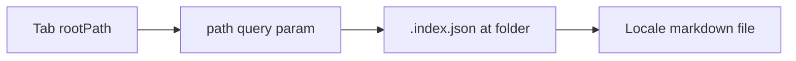

# ADR-124: Internal page folder `.index.json` contract

## Status

Accepted (2026-10-08). Mockup [`16-knowledge-folder-spike.html`](../admin-portal/ui-mockup/16-knowledge-folder-spike.html) confirmed. Implementation: [Web-portal-36](../product-backlog.md#pb-133), [feature-74](../sprint-backlog.md#sprint-9).

## Context

Instructions tabs already support `content` rows with per-locale `paths` ([ADR-071](./ADR-071-portal-content-paths.md)). [Web-portal-36](../product-backlog.md#pb-133) adds tab type **`internal_page_folder`**: a **`rootPath`** (for example `content/knowledge/`) and a browsable tree. Each folder may ship **`.index.json`** that lists subfolders and markdown articles and how each entry opens.

Pack spike: [`pack.framework.sdd.works/content/knowledge/.index.json`](../../pack.framework.sdd.works/content/knowledge/.index.json).

## Decision

### File placement

- One **`.index.json`** per folder inside **`rootPath`**, including the root.
- Paths in entries are **relative to the folder that contains that `.index.json`** (not relative to `rootPath`), so nested folders compose without repeating prefixes.

### Top-level shape

| Field | Required | Purpose |
| --- | --- | --- |
| `version` | yes | Schema version. Start at **1**. |
| `labels` | no | Optional listing title for this folder (locale map; `en` required when present). |
| `entries` | yes | Ordered list of folders and files shown in the tab body. |

### Entry: `kind: "folder"`

| Field | Required | Purpose |
| --- | --- | --- |
| `kind` | yes | `"folder"`. |
| `id` | yes | Stable slug for URL `path=` segments and tests. `[a-z0-9-]+`. |
| `labels` | yes | Row title per locale; **`en` required**. |
| `path` | yes | Subfolder name under the current directory (single segment or POSIX subpath without `..`). |

Opening a folder navigates to that subfolder’s `.index.json`. URL updates on `/` and `/instructions`: `?tab=<queryParam>&path=<posix-segments>` where segments are folder **`id`** values from root to the current folder (empty `path` = tab root listing). Use `/` between segments. Omit `doc`.

### Entry: `kind: "file"`

| Field | Required | Purpose |
| --- | --- | --- |
| `kind` | yes | `"file"`. |
| `id` | yes | Stable slug; need not match filename. |
| `labels` | yes | Row title per locale; **`en` required**. |
| `paths` | yes | Same shape as `content` tab **`paths`**: locale → markdown path **relative to the folder that contains this `.index.json`**. |
| `open` | yes | **`same_tab`** or **`new_tab`**. Required on every **`file`** entry. Defines navigation target; the portal uses different listing UI per value (below). |

**`kind: "folder"`** rows do not use **`open`**. A folder row always drills in on the **same tab** (subfolder listing).

### Query parameters (production)

| Param | When | Value |
| --- | --- | --- |
| `tab` | always | Tab row **`queryParam`** (for example `knowledge`). |
| `path` | folder listing or article | POSIX path of folder **`id`** segments under **`rootPath`**. Empty at tab root. |
| `doc` | article view only | **`file`** entry **`id`** in the folder named by **`path`**. Absent on folder listings. |

Example (same-tab article): `/?tab=knowledge&path=archived&doc=invoke-agent-trae`. Example (root list): `/?tab=knowledge`.

### `open` values and UI

Confirmed against mockup spike (2026-10-08). Production uses the same guide shell on `/` and `/instructions` (sticky hero, tab bar, selected Knowledge tab), not a stripped article-only page.

| | **`same_tab`** | **`new_tab`** |
| --- | --- | --- |
| Listing row | Underlined in-panel link. No external icon. | Same **`href`** as **`same_tab`** for that file plus `target="_blank"` and `rel="noopener noreferrer"`. Optional muted hint (i18n **`admin.guide.knowledge_new_tab_hint`**). Command-click or middle-click opens the same URL in a new tab. |
| After activate | List hides; article renders in the panel inside **`guide-md-body`** + **`guide-md-body--prose`**. **Back** (i18n **`admin.guide.knowledge_back`**) returns one level: from article to folder list, from subfolder list to parent list or tab root. No breadcrumb trail duplicating **Back**. | Current tab URL stays on the folder **`path=`** (no **`doc`**). New tab loads the full guide with **`doc`** set (hero, tabs, **Back**, article). |
| URL | Sets **`doc`** on the current guide URL. `history.pushState` / back and forward move between listing and article. | **`href`** includes **`tab`**, **`path`**, and **`doc`**. Listing row does not navigate the current tab when the primary click opens a new tab. |
| Headings | Tab root list: no extra panel title (tab label is enough). Subfolder list: one **`h2`** from that folder’s **`.index.json`** **`labels`**. | Same article chrome in the new tab. |
| Focus | Moves to **Back** or first heading in the article. | Focus stays on the listing; new tab is user-initiated. |

Implementation maps one **`open`** string to row component variant and click handler. Do not infer **`open`** from file type or path.

### Tab row (`content/.instructions-tabs.json`)

```json
{
  "type": "internal_page_folder",
  "id": "knowledge",
  "labels": { "en": "Knowledge", "zh-Hans": "知识", "zh-Hant": "知識" },
  "queryParam": "knowledge",
  "panelTestId": "panel-knowledge",
  "rootPath": "content/knowledge"
}
```

Validator rules (implementation):

- Reject `..`, absolute paths, and paths that escape **`rootPath`** after normalization.
- Only **`.md`** files referenced in `paths` values.
- Every **`file`** entry must resolve **`paths.en`**; other locales fall back to English ([Spec-seeds-16](../product-backlog.md#pb-110)).
- Reject duplicate **`id`** within one `.index.json`.

### Resolution (server)



1. Load `rootPath + path + "/.index.json"` (empty `path` → root index).
2. For a listing, return parsed index JSON (labels resolved for locale).
3. For an article (`same_tab`), read `paths[locale]` from the matching **`file`** entry (route keyed by folder `path=` + **`id`**). For **`new_tab`**, resolve the same markdown for the href of the new tab only; the listing API response still includes **`open`** so the client picks the row variant.

Bundled fallback and Git sync cache use the same resolver as other pack content ([ADR-071](./ADR-071-portal-content-paths.md)).

### Example (root index)

See pack file [`content/knowledge/.index.json`](../../pack.framework.sdd.works/content/knowledge/.index.json).

### Example (nested folder)

```json
{
  "version": 1,
  "labels": {
    "en": "Archived",
    "zh-Hans": "归档",
    "zh-Hant": "封存"
  },
  "entries": [
    {
      "kind": "file",
      "id": "invoke-agent-cursor",
      "labels": {
        "en": "Invoke agent in Cursor",
        "zh-Hans": "在 Cursor 中召唤智能体",
        "zh-Hant": "在 Cursor 中叫出智能體"
      },
      "paths": {
        "en": "invoke-agent-cursor.en.md",
        "zh-Hans": "invoke-agent-cursor.zh-Hans.md",
        "zh-Hant": "invoke-agent-cursor.zh-Hant.md"
      },
      "open": "new_tab"
    }
  ]
}
```

## Consequences

- Pack authors maintain folder UX in JSON plus markdown, without one tab row per article.
- Portal must validate indexes at sync or read time; bad indexes surface as tab-level errors, not silent empty lists.
- **`invoke-agents`** can move under **`knowledge/`** and drop the standalone `content` tab when the Knowledge folder tab ships.

## Alternatives considered

| Option | Why not |
| --- | --- |
| Auto-scan directory without `.index.json` | Order, labels, and `open` behavior are product choices; scanning hides i18n titles. |
| Single locale path per file (`path` string only) | Breaks parity with existing `content` tab `paths` and locale fallback. |
| `open: "modal"` | Out of scope for first release; adds focus trap and a11y work. |
