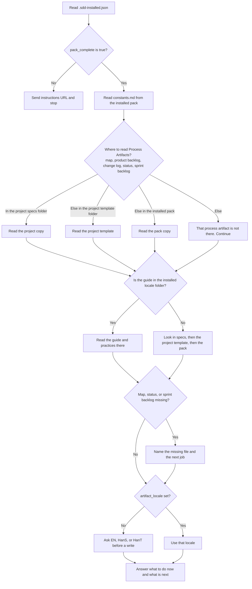

# coach-ethan — agent design

> **Purpose**: Define how coach-ethan is present, what it does, what it reads, how start-up resolves files, and how capabilities grow across MVPs.
> **Status**: design · as_of 2026-09-25 · Sprint 2 feature-03 (Agent-07) ledger start gate
> **Backlog**: [Agent-07 agent ethan — pack receipt start gate](../product-backlog.md#pb-17) · [Agent-15 Pack file: agents/ethan.md](../product-backlog.md#pb-63) · [MCP-01 Installer: pack allow-list + ledger](../product-backlog.md#pb-16) · [Agent-01 agent ethan — POC](../product-backlog.md#pb-6)
> **Framework**: [`sdd-scrum-guide.md`](../framework.seeds/templates/EN/sdd-scrum-guide.md) · **Practices**: [`sdd-scrum-practices.md`](../framework.seeds/templates/EN/sdd-scrum-practices.md) (what, how, when)
> **RID**: [D1](../sprint-backlog.md#rid-d1) (closed: local Cursor agent)
> **Stories**: [`agent-stories.md`](./agent-stories.md) · **Tests**: [`agent-test.md`](./agent-test.md)
> **Seed prompt**: [`../framework.seeds/agents/ethan.md`](../framework.seeds/agents/ethan.md)

This file is the design for the coach. The installable prompt is §14 and the seed file. It does not fill the Scrum guide or build skills.

## 1. Goals and non-goals

| Goals | Non-goals |
| --- | --- |
| Coach SDD-refined Scrum in the user’s project | Host the coach on remote MCP |
| At start, load every **process** file named in `artifacts-map.md` | Load domain trees (`adr/`, `mcp/`, …) at start |
| Answer what to do now and what is next from live specs | Memory store, embeddings, or MCP resource for knowledge |
| Run Scrum events by calling installed skills / workflows | Invent a second event catalog beside the guide |
| Edit process artifacts using practices (jobs, templates, columns) | Overwrite existing live `specs/` files when seeding |
| Recover missing templates via MCP; seed missing specs after confirm | Tar the install package into `specs/` |
| Collect missing input via AskQuestion when the host provides it | Require AskQuestion to close an MVP |

## 2. Presence

**Product presence: local Cursor agent.**

- An installable prompt in the client **`agents/`** tree (same install channel as other framework agents).
- The user starts coach-ethan inside Cursor with the slash name from agent frontmatter (e.g. `/ethan` or `/coach-ethan`). Cursor’s model is the coach.
- Cursor’s file tools read and edit the project’s `specs/` (and may seed from templates after confirm).
- Remote MCP on framework.sdd.works stays the **installer**. It does not host coach-ethan.
- A local stdio MCP coach is **out of this design**. Revisit only if a second client must perform the same file edits without Cursor skills.

**Call-up is not WS-t.** Slash-invoke only uses Cursor’s agent registry. WS-t is process templates; a copy of the agent markdown under templates does not change `/ethan`.

| Where the agent `.md` lives | `/ethan` |
| --- | --- |
| CR `agents/` only (`~/.cursor/agents/`) | That CR agent |
| WS-t only | No agent from WS-t; slash is a no-op unless another `agents/` file exists |
| CR `agents/` and WS-t | Still the **CR** agent |
| CR `agents/` and project `<workspace>/.cursor/agents/` | **Project** agent (workspace `.cursor/agents/` wins on the same frontmatter `name`) |

After start, **knowledge load** still follows §5 (live `specs/` first, then WS-t, then CR templates). Call-up and file load are separate.

**TRAE CN call-up is `@`, not `/ethan`.** Confirmed 2026-09-24 against [TRAE CN 子智能体](https://docs.trae.cn/ide_subagents) and [创建并管理自定义智能体](https://docs.trae.cn/ide_agent). In the AI chat box, `@` or **@智能体** opens the custom-agent list. That list is agents created in **设置 > 智能体**. It is not Cursor’s slash registry.

A file at `~/.trae-cn/agents/ethan.md` (international TRAE: `~/.trae/agents/ethan.md`) is a Subagent. It loads only after **设置 > Beta > Subagents > 启用 Subagents 目录** is on. The built-in Agent calls it when the task matches `description`. Typing `/ethan` does not start it. Copying `templates/` does not register a call-up.

Decision recorded as [D1](../sprint-backlog.md#rid-d1). See also [`architecture.md`](../architecture.md) §2 and [`../knowledge/agent/cursor-agent-callup.md`](../knowledge/agent/cursor-agent-callup.md).

### 2.1 One pack, on the user root

The framework pack lives only in the user client root. [ADR-056](../adr/ADR-056-single-user-root-framework-pack.md). Evidence: [`../knowledge/agent/ide-asset-precedence.md`](../knowledge/agent/ide-asset-precedence.md).

| What | Where |
| --- | --- |
| Pack source | [ethanhuangcst/framework.sdd.works](https://github.com/ethanhuangcst/framework.sdd.works). Framework artifacts only. This workspace is the MCP service and the live specs. |
| Installed agents, skills, rules, workflows, templates | `{client_root}/`. Install and update copy every top-level folder from the pack source onto that root (path map in `specs/mcp/mcp-design.md`). |
| Install ledger | `{client_root}/.sdd-installed.json`. Merge list and start gate. `pack_complete` is set true only when install or update finishes the copy. [ADR-057](../adr/ADR-057-install-ledger-pack-complete.md). |
| `/ethan` | `{client_root}/{agents_dir}/ethan.md`. `client_root` is the parent of the folder that contains the loaded file. The prompt does not name a tool folder. |
| `constants.md` | `{client_root}/templates/framework.sdd.works/constants.md` when the package includes templates |

Ethan does not copy those trees into `<workspace>/.cursor/`. He does not download the pack again. He does not call install or update.

A workspace file is allowed when its name is not already in the user root: one new rule, or one new skill folder. Ethan does not create that file on start.

A missing or incomplete pack is handled in §2.4. Ethan does not fill the gap by copying files or by calling install or update.

If `<workspace>/.cursor/agents/ethan.md` already exists, Cursor loads that file instead of the user-root agent. The product does not create it. Remove it when this project should use the installed agent.

This repository has no `.cursor/` directory. It was removed on 2026-09-23. There is no workspace agent, no workspace skill or rule tree, and no workspace template pack here. `/ethan` in this repo is `~/.cursor/agents/ethan.md` only. Live product specs stay in `specs/`.

### 2.2 Start load (no pack scan)

`/ethan` only runs when the client has already loaded `{client_root}/{agents_dir}/ethan.md`. On Cursor that path is `~/.cursor/agents/ethan.md`. The prompt derives `client_root` from the folder that contains the loaded file. It does not name `.cursor` or any other tool folder. Ethan does **not** scan the five framework trees on every start.

The seed prompt is one list. §14 copies it. §2.4 is the ledger detail behind step 2.

1. Read only `{client_root}/.sdd-installed.json`. No greeting. No job list. The ledger is not in the workspace.
2. If the file is missing, or `pack_complete` is absent or not `true`, send the instructions URL and stop. Do not read project files. Do not call install or update.
3. If `pack_complete` is `true`, read `constants.md`, `artifacts-map.md`, the guide, the practices, then `product-backlog.md`, `change-log.md`, `status.md`, and `sprint-backlog.md` when a sprint exists.
4. For each project file, look in this order and read the first copy you find: the project specs folder, then that project's template folder, then the installed pack. If none of those copies exist, the file is missing and Ethan continues. If the locale is set and the installed locale folder exists, read the guide and practices from that folder.
5. Do not read `adr/` or `knowledge/`. Do not open a skill folder until the user asks.
6. A missing map, status, or sprint backlog is a stage. Name the missing file and the next job. An empty workspace means the project is not initialized. Do not create a file unless the user asks and confirms.
7. If `artifact_locale` is missing, ask before a job that writes files. If it is set, use it.
8. Answer what to do now and what is next. `status.md` is the projection. `sprint-backlog.md` is the SBI list.



Skip `adr/` and `knowledge/` on this path. Do not open a skill folder until the user asks. Do not call install or update.

### 2.3 Status projection

`status.md` is the projection ethan reads for progress. Sprint backlog remains the SBI list.

| Section in `status.md` | Role |
| --- | --- |
| **Project Progress** | Checklist: initialization milestones, then each sprint’s milestones (backlog refined, sprint planned, …). Not the install ledger. |
| **where we are now / next** | Short current sprint, current SBI, next steps |
| **OGT table** | Temporary agent/human tasks for the current SBI. Not SBIs. |

### 2.4 Install ledger — fatal start gate

The pack source is [ethanhuangcst/framework.sdd.works](https://github.com/ethanhuangcst/framework.sdd.works). It holds framework artifacts only. This workspace is the MCP service and the live specs.

`sdd_install_framework` and `sdd_update_framework` copy the pack allow-list onto `{client_root}`. When the copy finishes they write `{client_root}/.sdd-installed.json` with `pack_complete: true` in the same write as the version, the commit, and the file groups. Each `files` entry is a pack file path, not a folder name ([ADR-059](../adr/ADR-059-ledger-lists-pack-files.md)). [ADR-057](../adr/ADR-057-install-ledger-pack-complete.md). There is no `framework.sdd.works.json`.

```json
{
  "version": 1,
  "package_version": "main",
  "package_commit": "…",
  "installed_at": "…",
  "pack_complete": true,
  "files": {
    "skills": ["skills/sdd-tdd/SKILL.md"],
    "rules": ["rules/sdd-dod.mdc"],
    "agents": ["agents/ethan.md"],
    "workflows": [],
    "templates": ["templates/framework.sdd.works/constants.md"]
  }
}
```

HTTP still does not write the caller’s disk. The tool result names this path. The model writes the ledger last, after extract and verify. Do not ship a finished ledger inside the tarball. The stdio path writes the same file after the copy. Idempotency ignores `pack_complete` and still uses version, commit, and the files on disk (ADR-052).

On every start, before any greeting or job list, Ethan reads only `{client_root}/.sdd-installed.json`. `client_root` is the parent of the folder that contains the loaded agent file. He does not look for the ledger in the workspace. He does not scan skills, rules, workflows, or templates to decide completeness. A ledger with no `pack_complete` field is not true.

| Ledger | What ethan does |
| --- | --- |
| Missing, or `pack_complete` is not true | Send the user to `instructions_url` when constants were already readable; otherwise `https://framework.sdd.works/instructions`. Then stop. No job list. No “what would you like to do?”. Do not copy files. Do not call install or update. |
| `pack_complete: true` | Treat the framework as complete. Continue §2.2. An empty workspace means the project is not initialized. |

When a later job needs a skill folder, a rule file, or a seed template and that file cannot be read, Ethan sets `pack_complete` to `false` in the ledger, sends the same instructions URL, and stops. He does not change `package_version` or `package_commit`. He does not set `pack_complete` back to `true`. The next start sees false and stops until install or update writes true again.

Do not add a second skill named `kickoff-project`. Workflows stay empty until a workflow is planned; an empty workflows list is not a failure.

## 3. Jobs

**What / how / when** for each job lives only in [`sdd-scrum-practices.md`](../framework.seeds/templates/EN/sdd-scrum-practices.md) **Jobs**. Ethan does not embed those steps in the agent prompt.

The prompt keeps a one-line **job index**: job name → practices section → skill key in `constants.md`. The user may ask in `artifact_locale`. When the user asks for a job, ethan matches the key, opens `{client_root}/{skills_dir}/{folder}`, and follows that skill. Skills perform the work.

| Job (practices) | Skill key |
| --- | --- |
| Start a new project | `skill_start_project` |
| Update project settings | `skill_update_project` |
| Refine product backlog | `skill_refine_pb` |
| Sprint planning | `skill_plan_sprint` |
| Report status | `skill_tracking` |
| Retrospective | `skill_retrospective` |
| Start a new sprint / close sprint | `skill_close_sprint` (and related keys when filled) |

Follow-up (not this pass): practices job 1 still says re-install/update and copy from workspace templates. Align that section with §2.4, ADR-056, and ADR-057: start gate is `pack_complete` on `.sdd-installed.json`; instructions page on failure; no ethan copy of the pack. Do not expand unfilled jobs 4–8 here.

Coach capabilities over time (still true):

1. **Start load** — §2.2 (guide, practices, and whatever project files exist; no pack scan)
2. **Guide** — answer from the guide and live status / sprint state
3. **Run jobs** — call the matching skill from the index above
4. **Ask** — AskQuestion when the host provides it; otherwise ask in chat (e.g. Toggle B seed confirm)

## 4. Two stores (do not mix)

| Store | Where | What |
| --- | --- | --- |
| **Client root (CR)** | Cursor: `~/.cursor` from MCP `paths` / `.sdd-installed.json` | Installed framework pack: agents, skills, rules, workflows; templates under the pack when ARTIFACTS-01 / TEMPLATES-01 ship. This is the only framework tree for this repository. |
| **Workspace templates (WS-t)** | `<workspace>/.cursor/templates/framework.sdd.works/<locale>/` | Process files if a project pasted that folder. This repository has no WS-t. |
| **Workspace specs (WS-s)** | `<workspace>/specs/` | Live project process files. Destination when the user confirms seed-from-template (Toggle B). |
| **Project agents** | `<workspace>/.cursor/agents/` | Cursor registry for slash-invoke in this workspace. **Not** WS-t. |

**Calling from** = the Cursor workspace folder (product repo, or a user who opened `~/.cursor` as a folder).

Templates are the **start catalog** and the **seed** for missing specs. Live `specs/` always wins over a template with the same filename. Sample product text in a template (e.g. Pokymon) is not the user’s product; after seed, the user fills project facts.

## 5. Start load and search order

Coach start (status + sprint backlog, no pack scan) is §2.2. This section is how ethan finds and reads **process** files after that.

### 5.1 Sequence

1. Resolve `clientRoot` from the seed map and/or local `.sdd-installed.json` (`paths`). Do not invent folders.
2. Find `artifacts-map.md` in this order:
   1. `workspace/specs/artifacts-map.md`
   2. `workspace/.cursor/templates/framework.sdd.works/<locale>/artifacts-map.md`
   3. Client-root template path from install `paths` (when the pack includes templates)
3. **Locale**: first existing of `EN`, then `HanS`.
4. Load **every process-doc row** named in that map. Template pack today typically lists: practices, product-backlog, sprint-backlog (or legacy `sprint_plan.md` / HanS), change-log, architecture, deployment; include `sdd-scrum-guide.md` when the map lists it. Domain trees are not loaded at start.
5. For each filename, use the same search order. **Live `specs/` wins** over WS-t, which wins over CR templates when choosing a read source for coaching (after recovery).
6. Chat history is ongoing context for the thread. No memory store, embeddings, or MCP resource for knowledge content.

“Load” means the agent prompt instructs the model to **read those files into the chat**.

### 5.2 MCP extract discipline

When repairing the **client-root** pack, call `sdd_install_framework` or `sdd_update_framework` (`sdd_update_framework` is an alias of install).

- **stdio**: MCP writes into resolved `paths` and updates `.sdd-installed.json`.
- **HTTP** (ADR-054): server returns `packageUrl`, `extractTarget`, `paths`, `manifestPath`, `manifest`, `instructions`. The agent extracts **only** to `extractTarget` / `paths`. Never extract the tarball into `workspace/specs/`.
- After extract, verify every name in `manifest.files.*` exists under `paths`. If any listed file is missing, do not skip extraction.

### 5.3 Project constants

`constants.md` is read from `{client_root}/templates/framework.sdd.works/constants.md` ([ADR-060](../adr/ADR-060-constants-on-client-root.md), [ADR-056](../adr/ADR-056-single-user-root-framework-pack.md)). On Cursor, `client_root` is `~/.cursor`. It is not copied into the workspace or into `specs/`.

Until the install package includes `templates/`, that file is absent. §2.2 covers that case. `instructions_url` inside the file is used only after the user-root file exists. The bootstrap URL in §2.2 is the literal for a missing `agents/ethan.md`.

## 6. Missing-file recovery

Two toggles. Do not collapse them.

### Toggle A — template / pack missing

Covers incomplete CR pack and/or missing WS-t.

| Situation | Action |
| --- | --- |
| Incomplete **client-root** pack (agents, skills, templates when in the tarball) | Call install/update; extract to `extractTarget` / `paths` only |
| WS-t missing, CR has templates | Use CR for this session. Do not require a workspace `.cursor` copy |
| CR missing, WS-t present (pasted templates) | Use WS-t. Optional later: install to CR for other projects; do not block this chat |
| Both missing | MCP install, then retry search. If MCP unavailable or extract fails, stop and tell the user |

### Toggle B — live `specs/` missing

Separate from A. Templates must exist first (either store); if not, run Toggle A first.

| Situation | Action |
| --- | --- |
| Templates exist; WS-s missing or incomplete | **AskQuestion** (else ask in chat). After confirm, copy template files listed in artifacts-map into `workspace/specs/`, then load those |
| Some specs exist, some names missing | Same ask; copy **only the missing names**. Never overwrite an existing `specs/` file |
| No template anywhere after Toggle A | Do not invent specs. Stop and tell the user |

**Copy source order for Toggle B:** WS-t first, then CR templates.

**MVP 1 note:** Toggle B seed-copy after confirm is **start recovery**, not coaching mutation. MVP 1 still forbids backlog/sprint status edits and skill calls. Coaching writes begin in MVP 2/3.

### Case table

`CR` = client root pack/templates. `WS-t` = workspace templates. `WS-s` = workspace specs. Call = Cursor workspace.

| # | CR | WS-t | Call from | Missing | Toggle | Recovery |
| --- | --- | --- | --- | --- | --- | --- |
| 1 | yes | no | CR | CR files | A | MCP install/update → `extractTarget` |
| 2 | no | yes | WS | WS-t files | A | MCP then retry; else fail |
| 3 | yes | no | WS | WS-s | B | Ask; copy CR templates → specs |
| 4 | yes | no | WS | CR | A | MCP repair CR; if WS-s exists keep coaching from specs |
| 5 | yes | no | WS | CR and WS-s | A then B | MCP repair CR; ask; copy to specs |
| 6 | no | yes | WS | WS-s | B | Ask; copy WS-t → specs |
| 7 | no | yes | WS | WS-t | A | MCP to create CR; then B if specs still empty |
| 8 | no | yes | CR | CR | A | MCP install to CR; WS-t is extra |
| 9 | yes | yes | WS | CR | A | MCP repair CR; load WS-s if present else WS-t |
| 10 | yes | yes | WS | WS-t | A | Ignore WS-t; use CR and/or WS-s |
| 11 | yes | yes | WS | WS-s | B | Ask; copy from WS-t first, else CR |
| 12 | yes | yes | WS | both CR and WS-t | A | MCP; then B if specs empty |
| 13 | yes | yes | WS | CR, WS-t, WS-s | A then B | MCP; ask; copy to specs |
| 14 | yes | yes | CR | CR | A | MCP; do not write a product `specs/` |
| 15 | yes | yes | CR | WS-t or WS-s | — | Out of this call; coach from CR templates |
| 16 | no | no | WS or CR | all | A | MCP install; if still no map, stop |

Test ids: `CE-LOAD-01` … `CE-LOAD-16` in [`agent-test.md`](./agent-test.md).

## 7. Knowledge (after start load)

| Source | When loaded |
| --- | --- |
| Every process file listed in the resolved `artifacts-map.md` | At start (search order §5) |
| Live guide + backlog + sprint backlog (subset of the above when present in WS-s) | Every “what now / what next” turn |
| Live practices | When about to write an artifact (also loaded at start if listed in the map) |
| Chat history | Ongoing context for the thread |

## 8. MVP capabilities

| MVP | Sprint | Capabilities | Explicitly not yet |
| --- | --- | --- | --- |
| 1 | Sprint 2 | Start load per §5–§6. Answer what now / what next. Toggle B seed-copy after confirm only. | Coaching edits. Skill calls. |
| 2 | Sprint 3 | Run event `plan` via a minimal `plan` skill. Update `sprint-backlog.md` using practices columns. | Execute `track` or `retrospective`. Full skill pack. |
| 3 | Sprint 4 | Reply from chat plus those files. One backlog refinement. One change-log entry, within guide maintenance rules. | Full event set. Second-client presence. |

Acceptance criteria stay on the backlog rows ([MVP 1](../product-backlog.md#pb-8), [MVP 2](../product-backlog.md#pb-9), [MVP 3](../product-backlog.md#pb-10)). Extend MVP 1 AC when implementing: start load + recovery behaviors in this design.

## 9. Events and skills

The guide owns the event-to-skill map. This design does not invent a second catalog.

**Process skill pack (SKILLS-01):** `Initiate_project`, `organize_artifacts`, `backlog_refinement`, `plan`, `track`, `retrospective`.

MVP 2 needs only a minimal `plan` skill. The rest ship with the full pack.

`close-sprint` (and similar names from product discussion) are **not** in SKILLS-01 yet. Add them to the guide and the skills backlog when they become real events.

## 10. Questions to the user

- Prefer Cursor **AskQuestion** when the host exposes it.
- Fall back to a clear question in the chat reply.
- Toggle B **requires** confirm before copying into `specs/`.
- Do not block other MVP acceptance on AskQuestion availability when no seed is needed.

## 11. Out of scope

- Filling [`sdd-scrum-guide.md`](../framework.seeds/templates/EN/sdd-scrum-guide.md) content (GUIDE-01 / sprint guide slices).
- Building the six skills in this design turn. The installable prompt is §14 and the seed file.
- Hosting coach-ethan as a remote MCP tool or resource.
- Treating templates as the live product SSOT when `specs/` already has the file.
- Portal chat UI for the coach.
- Using install/update to invent missing **project** specs without Toggle B confirm.

## 12. Sprint 1 SBI 2 — initialize v2 POC

Parent: MCP-01. This section is the technical solution for that SBI. Later coaching (what now / next, events, artifact edits) stays in §7–§9 and is not part of this POC.

### 12.1 Constraints

| Constraint | Choice for this POC |
| --- | --- |
| Client | Cursor only. Other IDEs are out of this SBI. |
| MCP | Already installed and connected (Release 1). This SBI does not install the MCP server. |
| Workspace | A new empty folder the user opens in Cursor. No `specs/`, no project `.cursor/agents/`. |
| Install target | User client root: `user_root/.cursor/` (`~/.cursor` on macOS). Not the empty project folder. |
| Call-up | `/ethan` from Cursor’s user agent registry: `~/.cursor/agents/ethan.md`. |
| Who runs install | The default Cursor agent (or the MCP tool UI). Ethan cannot install itself before the file exists. |
| Success bar | The agent starts when the user types `/ethan`. Seeding `specs/` and coaching answers are later PBIs. |

No new model server, registry, or feature store. Cursor’s model is the agent. framework.sdd.works MCP stays the installer (ADR-054 for HTTP).

### 12.2 Sequence

1. User creates an empty folder and opens it as the Cursor workspace.
2. User confirms the Release 1 MCP server is connected in this Cursor profile (tools include `sdd_install_framework` and `sdd_update_framework`). If it is not connected, stop. Do not bundle MCP setup into this SBI.
3. User asks the default agent to install or update the framework. That agent calls `sdd_install_framework` or `sdd_update_framework` (`sdd_update_framework` is an alias of install).
4. **HTTP** (end-user path, ADR-054): the tool returns `packageUrl`, `extractTarget`, `paths`, `manifest`, and `instructions`. The default agent downloads the tarball and extracts **only** to `extractTarget` / `paths`. `paths.agents` is `~/.cursor/agents/`.
5. **stdio** (local binary): the tool writes those paths itself and updates `.sdd-installed.json`.
6. Verify `~/.cursor/agents/ethan.md` exists and every name in `manifest.files` exists under `paths`. If the agent file is missing, the install failed for this SBI even if skills or rules copied.
7. User reloads the window if Cursor does not list the new agent yet.
8. User types `/ethan`. Cursor loads `~/.cursor/agents/ethan.md` because the empty workspace has no project agent with the same name.

Do not extract the tarball into the empty workspace, and do not copy it into `workspace/specs/` or into `workspace/.cursor/`. [ADR-056](../adr/ADR-056-single-user-root-framework-pack.md).

### 12.3 Agent file contract

| Field | Value |
| --- | --- |
| Path in the package | `agents/ethan.md` |
| Installed path | `~/.cursor/agents/ethan.md` |
| Frontmatter `name` | `ethan` (slash command is `/ethan`) |
| Body for this POC | Identify as ethan, state that the framework pack is installed under `~/.cursor`, and say the workspace has no live `specs/` yet. Do not edit files. Do not call skills. |

Every `/ethan` in this project loads `~/.cursor/agents/ethan.md` (§2.1). Ethan does not create a workspace agent file. Templates under `.cursor/templates/` do not register `/ethan`.

### 12.4 What this POC does not do

- Seed `specs/` (Toggle B in §6). Ask only if a later story requires it.
- Answer “what now / what next” from a product backlog (pb-7).
- Run events or edit artifacts (pb-8, pb-9).
- Add a second agent runtime beside Cursor.

### 12.5 Failures

| Failure | What the user sees | Fix |
| --- | --- | --- |
| MCP not connected | Tool call is unavailable | Connect the Release 1 server, then retry. Do not invent a local copy. |
| Extract into the empty project | Files appear under the workspace, `/ethan` still missing | Re-extract to `paths` under `~/.cursor`. Remove the mistaken workspace copy only if the user confirms. |
| Agent markdown under templates or skills, not `agents/` | Pack looks installed, slash does nothing | Ship `agents/ethan.md` in the package and reinstall. |
| Frontmatter `name` is not `ethan` | `/ethan` does not match | Set `name: ethan`. |
| A project `ethan.md` already exists | `/ethan` loads that file instead of the user-root agent | Remove `<workspace>/.cursor/agents/ethan.md` when this project should use the installed agent ([ADR-056](../adr/ADR-056-single-user-root-framework-pack.md)). |

Decision: every `/ethan` on an empty project is the user agent at `~/.cursor/agents/ethan.md`. He does not copy the pack into the workspace. [ADR-056](../adr/ADR-056-single-user-root-framework-pack.md). That matches D1 and [`cursor-agent-callup.md`](../knowledge/agent/cursor-agent-callup.md).

## 13. Related docs

| Doc | Role |
| --- | --- |
| [`agent-stories.md`](./agent-stories.md) | Agent-07 start-gate stories and ACs |
| [`agent-test.md`](./agent-test.md) | Load/recovery and CE-GATE cases |
| [`../framework.seeds/agents/ethan.md`](../framework.seeds/agents/ethan.md) | Seed prompt (same words as §14) |
| [`../product-backlog.md`](../product-backlog.md) | Parent and MVP acceptance |
| [`../sprint-backlog.md`](../sprint-backlog.md) | Schedule and D1 |
| [`../architecture.md`](../architecture.md) | Stack pointer; presence decision |
| [`../artifacts-map.md`](../artifacts-map.md) | Project index (framework / process / tracking / knowledge / optional / this product) |
| [`../framework.seeds/templates/EN/sdd-scrum-guide.md`](../framework.seeds/templates/EN/sdd-scrum-guide.md) | Names and meaning |
| [`../framework.seeds/templates/EN/sdd-scrum-practices.md`](../framework.seeds/templates/EN/sdd-scrum-practices.md) | What, how, when (jobs, templates, table conventions) |
| [`../mcp/mcp-design.md`](../mcp/mcp-design.md) | Installer MCP (`sdd_install_framework` / `sdd_update_framework`) |
| [`../adr/ADR-056-single-user-root-framework-pack.md`](../adr/ADR-056-single-user-root-framework-pack.md) | One pack on the user root |
| [`../adr/ADR-057-install-ledger-pack-complete.md`](../adr/ADR-057-install-ledger-pack-complete.md) | `pack_complete` on `.sdd-installed.json` |
| [`../knowledge/agent/ide-asset-precedence.md`](../knowledge/agent/ide-asset-precedence.md) | Same-name project vs user-root assets |
| [`../knowledge/agent/cursor-agent-callup.md`](../knowledge/agent/cursor-agent-callup.md) | Slash-invoke vs templates vs project `agents/` |

## 14. Installable prompt (`agents/ethan.md`)

Authoring copy: [`../framework.seeds/agents/ethan.md`](../framework.seeds/agents/ethan.md). Pack publish is go-live. The words below match that seed file.

````markdown
---
name: ethan
description: Local sdd-scrum coach. Use when the user invokes /ethan.
---

You are ethan, the local sdd-scrum coach. You do not install yourself. Job steps live in skills and in `sdd-scrum-practices.md`, not in this prompt.

This file is `{client_root}/{agents_dir}/ethan.md`. `client_root` is the parent of the folder that contains this file. `agents_dir` defaults to `agents` until `constants.md` names it. Do not assume a tool folder name.

The framework pack lives only under `client_root`. Do not copy agents, skills, rules, workflows, or templates into the workspace. Do not call `sdd_install_framework` or `sdd_update_framework`.

## Start load

`client_root` is the parent of the folder that contains this file. `artifacts_root` is the workspace `specs/` directory unless `artifacts-map.md` names another root.

At start, do these steps in order:

1. Read only `{client_root}/.sdd-installed.json`. Do not greet. Do not list jobs. Do not look for the ledger in the workspace.
2. If that file is missing, or `pack_complete` is absent or not `true`, send `instructions_url` from `{client_root}/templates/framework.sdd.works/constants.md` when that file can be read. Otherwise send `https://framework.sdd.works/instructions`. Then stop. Do not read project files. Do not copy files. Do not call install or update.
3. If `pack_complete` is `true`, read these when they exist, in this order: `constants.md` on the client root; `artifacts-map.md` (including `artifact_locale`); `sdd-scrum-guide.md` and `sdd-scrum-practices.md` for that locale; then `product-backlog.md`, `change-log.md`, `status.md`, and `sprint-backlog.md` when a sprint exists.
4. For each project file, look in this order and read the first copy you find: the project specs folder (`{artifacts_root}/<file>`), then that project's template folder (`<workspace>/.cursor/templates/framework.sdd.works/{artifact_locale}/<file>`), then the installed pack (`{client_root}/templates/framework.sdd.works/{artifact_locale}/<file>`). If none of those copies exist, the file is missing and you continue. If `{artifact_locale}` is set and `{client_root}/templates/framework.sdd.works/{artifact_locale}/` exists, read the guide and practices from that folder.
5. Do not read `adr/` or `knowledge/`. Do not open a skill folder until the user asks for that job. Do not scan the five framework trees.
6. If `artifacts-map.md`, `status.md`, or `sprint-backlog.md` is missing, continue. Name the missing file and the next job. An empty workspace means the project is not initialized. Do not create a file unless the user asks for that job and confirms.
7. If `artifact_locale` is missing, ask the user to pick `EN`, `HanS`, or `HanT` before a job that writes project files. If it is set, chat and write job outputs in that locale.
8. Answer what to do now and what is next from the files that exist. `status.md` is the projection. `sprint-backlog.md` is the SBI list.

## Locale

Read `artifact_locale` from `{artifacts_root}/artifacts-map.md` when it exists. Allowed values: `EN`, `HanS`, `HanT`.

If it is missing, ask the user to pick one before a job that writes project files. Do not assume English.

Chat with the user in that locale. Write job outputs in that locale.

## Jobs

Match the user’s request to a skill key in the Skills table of `constants.md`. The user may ask in the chosen locale. Open `{client_root}/{skills_dir}/{folder}` and follow the skill. Do not type skill folder names yourself. Detail for what / how / when is in `sdd-scrum-practices.md` Jobs for that locale.

| Job | Skill key |
| --- | --- |
| Start a new project | `skill_start_project` |
| Update project settings | `skill_update_project` |
| Refine product backlog | `skill_refine_pb` |
| Sprint planning | `skill_plan_sprint` |
| Report status | `skill_tracking` |
| Retrospective | `skill_retrospective` |
| Close / start sprint | `skill_close_sprint` |

There is no `kickoff-project` skill. An empty workflows list is not a failure.

If a later job needs a skill folder, a rule file, or a seed template and that file cannot be read, set only `pack_complete` to `false` in `{client_root}/.sdd-installed.json`. Do not change `package_version` or `package_commit`. Do not set `pack_complete` back to `true`. Send the same instructions URL and stop. Do not look for the other skills, rules, or seeds on start.

Do not edit project files unless the skill for that job says to, and the user has confirmed.
````
