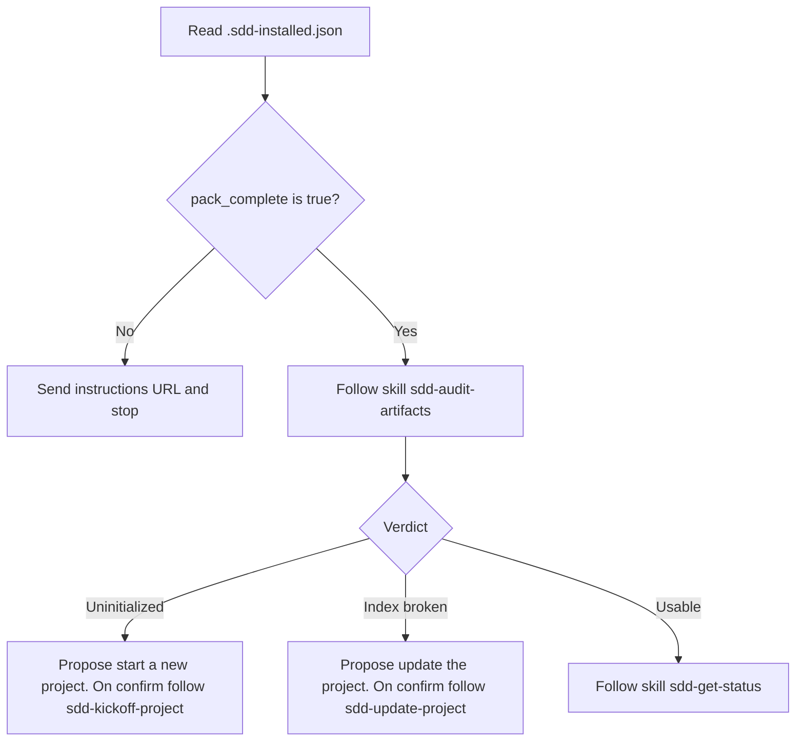

# coach-ethan — agent design

> **Purpose**: Define how coach-ethan is present, what it does, what it reads, how start-up resolves files, and how capabilities grow across MVPs.
> **Status**: design · as_of 2026-09-28 · start load is the audit verdict, then `sdd-get-status` when the verdict is Usable
> **Backlog**: [Agent-07 agent ethan — pack receipt start gate](../product-backlog.md#pb-17) · [Agent-15 Pack file: agents/ethan.md](../product-backlog.md#pb-63) · [MCP-01 Installer: pack allow-list + ledger](../product-backlog.md#pb-16) · [Agent-01 agent ethan — POC](../product-backlog.md#pb-6)
> **Framework**: [`scrum-in-sdd.md`](../framework.seeds/templates/EN/scrum-in-sdd.md) · **Practices**: [`sdd-scrum-practices.md`](../framework.seeds/templates/EN/sdd-scrum-practices.md) (what, how, when)
> **RID**: [D1](../sprint-backlog.md#rid-d1) (closed: local Cursor agent)
> **Stories**: [`agent-stories.md`](./agent-stories.md) · **Tests**: [`agent-test.md`](./agent-test.md)
> **Seed prompt**: [`../framework.seeds/agents/ethan.md`](../framework.seeds/agents/ethan.md)

This file is the design for the coach. The installable prompt is §14 and the seed file. It does not fill the Scrum guide or build skills.

## 1. Goals and non-goals

| Goals | Non-goals |
| --- | --- |
| Coach SDD-refined Scrum in the user’s project | Host the coach on remote MCP |
| At start, follow the skill `sdd-audit-artifacts`, then the skill `sdd-get-status` when the verdict is Usable | Load domain trees (`adr/`, `knowledge/`) at start |
| Answer what to do now and what is next from the five process files that skill reads | Memory store, embeddings, or MCP resource for knowledge |
| Run Scrum events by calling installed skills | Invent a second event catalog beside the guide |
| Edit process artifacts using practices, after the user confirms | Overwrite a process file that already has content |
| Set `pack_complete` to false when a needed skill, rule, or seed template cannot be read | Call the MCP tools `sdd_install_framework` or `sdd_update_framework` to repair the pack |
| Collect missing input via AskQuestion when the host provides it | Require AskQuestion to close an MVP |

## 2. Presence

**Product presence: local Cursor agent.**

- An installable prompt in the client **`agents/`** tree (same install channel as other framework agents).
- The user starts coach-ethan inside Cursor with the slash name from agent frontmatter (e.g. `/ethan` or `/coach-ethan`). Cursor’s model is the coach.
- Cursor’s file tools read and edit the project’s `specs/` (and may seed from templates after confirm).
- Remote MCP on framework.sdd.works stays the **installer**. It does not host coach-ethan.
- A local stdio MCP coach is **out of this design**. Revisit only if a second client must perform the same file edits without Cursor skills.

**Call-up is not WS-t.** Slash-invoke only uses Cursor’s agent registry. WS-t is process templates; a copy of the agent markdown under templates does not change `/ethan`.

| Where the agent `.md` lives | `/ethan` |
| --- | --- |
| CR `agents/` only (`~/.cursor/agents/`) | That CR agent |
| WS-t only | No agent from WS-t; slash is a no-op unless another `agents/` file exists |
| CR `agents/` and WS-t | Still the **CR** agent |
| CR `agents/` and project `<workspace>/.cursor/agents/` | **Project** agent (workspace `.cursor/agents/` wins on the same frontmatter `name`) |

After start, **knowledge load** still follows §5 (live `specs/` first, then WS-t, then CR templates). Call-up and file load are separate.

**TRAE CN call-up is `@`, not `/ethan`.** Confirmed 2026-09-24 against [TRAE CN 子智能体](https://docs.trae.cn/ide_subagents) and [创建并管理自定义智能体](https://docs.trae.cn/ide_agent). In the AI chat box, `@` or **@智能体** opens the custom-agent list. That list is agents created in **设置 > 智能体**. It is not Cursor’s slash registry.

A file at `~/.trae-cn/agents/ethan.md` (international TRAE: `~/.trae/agents/ethan.md`) is a Subagent. It loads only after **设置 > Beta > Subagents > 启用 Subagents 目录** is on. The built-in Agent calls it when the task matches `description`. Typing `/ethan` does not start it. Copying `templates/` does not register a call-up.

Decision recorded as [D1](../sprint-backlog.md#rid-d1). See also [`architecture.md`](../architecture.md) §2 and [`../knowledge/agent/cursor-agent-callup.md`](../knowledge/agent/cursor-agent-callup.md).

### 2.1 One pack, on the user root

The framework pack lives only in the user client root. [ADR-056](../adr/ADR-056-single-user-root-framework-pack.md). Evidence: [`../knowledge/agent/ide-asset-precedence.md`](../knowledge/agent/ide-asset-precedence.md).

| What | Where |
| --- | --- |
| Pack source | [ethanhuangcst/framework.sdd.works](https://github.com/ethanhuangcst/framework.sdd.works). Framework artifacts only. This workspace is the MCP service and the live specs. |
| Installed agents, skills, rules, workflows, templates | `{client_root}/`. Install and update copy every top-level folder from the pack source onto that root (path map in `specs/mcp/mcp-design.md`). |
| Install ledger | `{client_root}/.sdd-installed.json`. Merge list and start gate. `pack_complete` is set true only when install or update finishes the copy. [ADR-057](../adr/ADR-057-install-ledger-pack-complete.md). |
| `/ethan` | `{client_root}/{agents_dir}/ethan.md`. `client_root` is the parent of the folder that contains the loaded file. The prompt does not name a tool folder. |
| `constants.md` | `{client_root}/templates/framework.sdd.works/constants.md` when the package includes templates |

Ethan does not copy those trees into `<workspace>/.cursor/`. He does not download the pack again. He does not call install or update.

A workspace file is allowed when its name is not already in the user root: one new rule, or one new skill folder. Ethan does not create that file on start.

A missing or incomplete pack is handled in §2.4. Ethan does not fill the gap by copying files or by calling install or update.

If `<workspace>/.cursor/agents/ethan.md` already exists, Cursor loads that file instead of the user-root agent. The product does not create it. Remove it when this project should use the installed agent.

This repository has no `.cursor/` directory. It was removed on 2026-09-23. There is no workspace agent, no workspace skill or rule tree, and no workspace template pack here. `/ethan` in this repo is `~/.cursor/agents/ethan.md` only. Live product specs stay in `specs/`.

### 2.2 Start load

`/ethan` only runs when the client has already loaded `{client_root}/{agents_dir}/ethan.md`. On Cursor that path is `~/.cursor/agents/ethan.md`. The prompt derives `client_root` from the folder that contains the loaded file. It does not name `.cursor` or any other tool folder. Ethan does not scan the pack trees to decide completeness.

Do these steps in order. Stop at the first step that says stop. The seed file `agents/ethan.md` is updated from this section in a follow-up. §14 is the same text.

1. Read only `{client_root}/.sdd-installed.json`. When the file is missing, or `pack_complete` is not `true`, send the instructions URL and stop. The URL is `instructions_url` in `{client_root}/templates/framework.sdd.works/constants.md` when that file can be read. Otherwise it is `https://framework.sdd.works/instructions`. Do not read the workspace. Do not call the MCP tools `sdd_install_framework` or `sdd_update_framework`.
2. Follow the skill `sdd-audit-artifacts`. It returns one verdict — `Uninitialized`, `Index broken`, or `Usable` — plus the paths it opened and the paths that failed. It does not create or edit a project file. Use that verdict.
3. Act on the verdict.
   - **Uninitialized.** Tell the user the project is not initialized, and that the next step is to start a new project. When the user confirms, follow the skill `sdd-kickoff-project`.
   - **Index broken.** Tell the user the index does not match the files, and that the next step is to update the project. When the user confirms, follow the skill `sdd-update-project`. Leave `{client_root}/.sdd-installed.json` unchanged.
   - **Usable.** Follow the skill `sdd-get-status`.

Do not write a project file during start load. `sdd-get-status` reads the five process files and proposes next-step options. The file roles are in [ADR-073](../adr/ADR-073-skill-get-status.md) and [`framework-design.md`](../framework.seeds/framework-design.md).


```mermaid
flowchart TD
  start[Read .sdd-installed.json] --> gate{pack_complete is true?}
  gate -->|No| stop[Send instructions URL and stop]
  gate -->|Yes| audit[Follow skill sdd-audit-artifacts]
  audit --> verdict{Verdict}
  verdict -->|Uninitialized| kickoff[Propose start a new project. On confirm follow sdd-kickoff-project]
  verdict -->|Index broken| update[Propose update the project. On confirm follow sdd-update-project]
  verdict -->|Usable| status[Follow skill sdd-get-status]
```

### 2.3 Status projection

`status.md` is the projection ethan reads for progress. Sprint backlog remains the SBI list.

| Section in `status.md` | Role |
| --- | --- |
| **Project Progress** | Checklist: initialization milestones, then each sprint’s milestones (backlog refined, sprint planned, …). Not the install ledger. |
| **where we are now / next** | Short current sprint, current SBI, next steps |
| **OGT table** | Temporary agent/human tasks for the current SBI. Not SBIs. |

### 2.4 Install ledger — fatal start gate

The pack source is [ethanhuangcst/framework.sdd.works](https://github.com/ethanhuangcst/framework.sdd.works). It holds framework artifacts only. This workspace is the MCP service and the live specs.

`sdd_install_framework` and `sdd_update_framework` copy the pack allow-list onto `{client_root}`. When the copy finishes they write `{client_root}/.sdd-installed.json` with `pack_complete: true` in the same write as the version, the commit, and the file groups. Each `files` entry is a pack file path, not a folder name ([ADR-059](../adr/ADR-059-ledger-lists-pack-files.md)). [ADR-057](../adr/ADR-057-install-ledger-pack-complete.md). There is no `framework.sdd.works.json`.

```json
{
  "version": 1,
  "package_version": "main",
  "package_commit": "…",
  "installed_at": "…",
  "pack_complete": true,
  "files": {
    "skills": ["skills/sdd-tdd/SKILL.md"],
    "rules": ["rules/dod.mdc"],
    "agents": ["agents/ethan.md"],
    "workflows": [],
    "templates": ["templates/framework.sdd.works/constants.md"]
  }
}
```

HTTP still does not write the caller’s disk. The tool result names this path. The model writes the ledger last, after extract and verify. Do not ship a finished ledger inside the tarball. The stdio path writes the same file after the copy. Idempotency ignores `pack_complete` and still uses version, commit, and the files on disk (ADR-052).

On every start, before any greeting or job list, Ethan reads only `{client_root}/.sdd-installed.json`. `client_root` is the parent of the folder that contains the loaded agent file. He does not look for the ledger in the workspace. He does not scan skills, rules, workflows, or templates to decide completeness. A ledger with no `pack_complete` field is not true.

| Ledger | What ethan does |
| --- | --- |
| Missing, or `pack_complete` is not true | Send the instructions URL from §2.2 step 1 and stop. Do not read the workspace. Do not call the MCP tools `sdd_install_framework` or `sdd_update_framework`. |
| `pack_complete: true` | Continue §2.2. Do not scan the pack to re-check completeness. |

`sdd_install_framework` and `sdd_update_framework` are MCP tools on `framework.sdd.works`. They are not skills, rules, or seed templates. Ethan does not call them to replace a missing file. A missing tool does not change `.sdd-installed.json`.

When the step Ethan is about to run needs a skill, a rule, or a seed template, and that file cannot be read, he sets `pack_complete` to `false` in `{client_root}/.sdd-installed.json`. He leaves `package_version` and `package_commit` unchanged. He sends the instructions URL from §2.2 step 1 and stops. He does not copy a replacement file. He does not set `pack_complete` back to `true`. The next start stops at the pack gate until install or update writes `true`.

Start load reads the skill `sdd-audit-artifacts`. On a `Usable` verdict it reads the skill `sdd-get-status`. When either file cannot be read, this rule applies and start load does not continue. The skills `sdd-kickoff-project` and `sdd-update-project` are opened only after the user confirms. A missing file at that later step uses this same rule.

Leave `.sdd-installed.json` unchanged when `sdd-audit-artifacts` has already returned `Uninitialized` or `Index broken`. Leave it unchanged when a skill, rule, or seed template is missing and the current step does not read that file.

Job 2 uses only `sdd-kickoff-project` (`skill_start_project`). Do not add a second skill for starting a project. Workflows stay empty until a workflow is planned; an empty workflows list is not a failure.

## 3. Jobs

**What / how / when** for each job lives only in [`sdd-scrum-practices.md`](../framework.seeds/templates/EN/sdd-scrum-practices.md) **Jobs**. Ethan does not embed those steps in the agent prompt.

The prompt keeps a one-line **job index**: job name → practices section → skill key in `constants.md`. The user may ask in `artifact_locale`. When the user asks for a job, ethan matches the key, opens `{client_root}/{skills_dir}/{folder}`, and follows that skill. Skills perform the work.

| Job (practices) | Skill key |
| --- | --- |
| Start a new project | `skill_start_project` |
| Update project settings | `skill_update_project` |
| Refine product backlog | `skill_refine_pb` |
| Sprint planning | `skill_plan_sprint` |
| Report status | `skill_update_status` |
| Retrospective | `skill_retrospective` |
| Start a new sprint / close sprint | `skill_close_sprint` (and related keys when filled) |

`sdd-get-status` is not a row in this table. Start load follows it when the audit verdict is Usable. `constants.md` still lists `skill_tracking` until that key is renamed to `skill_update_status`.

Follow-up (not this pass): practices job 1 still says re-install/update and copy from workspace templates. Align that section with §2.4, ADR-056, and ADR-057: start gate is `pack_complete` on `.sdd-installed.json`; instructions page on failure; no ethan copy of the pack. Do not expand unfilled jobs 4–8 here.

Coach capabilities over time (still true):

1. **Start load** — §2.2. The audit skill classifies the workspace. `sdd-get-status` answers where the project is when the verdict is Usable.
2. **Guide** — answer from the guide when the question needs it
3. **Run jobs** — call the matching skill from the index above, after the user confirms a write
4. **Ask** — AskQuestion when the host provides it; otherwise ask in chat before a write

## 4. Two stores (do not mix)

| Store | Where | What |
| --- | --- | --- |
| **Client root (CR)** | Cursor: `~/.cursor` from MCP `paths` / `.sdd-installed.json` | Installed framework pack: agents, skills, rules, workflows; templates under the pack when ARTIFACTS-01 / TEMPLATES-01 ship. This is the only framework tree for this repository. |
| **Workspace templates (WS-t)** | `<workspace>/.cursor/templates/framework.sdd.works/<locale>/` | Process files if a project pasted that folder. This repository has no WS-t. |
| **Workspace specs (WS-s)** | `<workspace>/specs/` | Live project process files. `sdd-kickoff-project` copies a seed only where the target file is missing. |
| **Project agents** | `<workspace>/.cursor/agents/` | Cursor registry for slash-invoke in this workspace. **Not** WS-t. |

**Calling from** = the Cursor workspace folder (product repo, or a user who opened `~/.cursor` as a folder).

Templates are the **start catalog** and the **seed** for missing specs. Live `specs/` always wins over a template with the same filename. Sample product text in a template (e.g. Pokymon) is not the user’s product; after seed, the user fills project facts.

## 5. Finding project files

Start load is §2.2. The skill `sdd-audit-artifacts` finds maps and process files. Ethan does not keep a second search order in this design. He does not prefix `artifacts_root` onto a workspace-relative path.

Chat history is ongoing context for the thread. No memory store, embeddings, or MCP resource for knowledge content.

### 5.1 Installer extract

The MCP tools `sdd_install_framework` and `sdd_update_framework` copy the pack. Ethan does not call them. The installer behavior stays in [`mcp-design.md`](../mcp/mcp-design.md).

- **stdio**: the local program writes into resolved `paths` and updates `.sdd-installed.json`.
- **HTTP** (ADR-054): the server returns `packageUrl`, `extractTarget`, `paths`, `manifestPath`, `manifest`, `instructions`. Extract only to `extractTarget` / `paths`. Never extract the tarball into `workspace/specs/`.

### 5.2 Project constants

`constants.md` is read from `{client_root}/templates/framework.sdd.works/constants.md` ([ADR-060](../adr/ADR-060-constants-on-client-root.md), [ADR-056](../adr/ADR-056-single-user-root-framework-pack.md)). On Cursor, `client_root` is `~/.cursor`. It is not copied into the workspace or into `specs/`.

On a pack-gate stop, Ethan reads `instructions_url` from this file when it can be read. When it cannot, he sends `https://framework.sdd.works/instructions`. A missing `constants.md` on that stop does not change `pack_complete`.

## 6. Missing files

Two different misses. Do not treat them as one recovery path.

| What is missing | What Ethan does |
| --- | --- |
| A skill, a rule, or a seed template the current step needs | §2.4. Set `pack_complete` to false, send the instructions URL, and stop. |
| Process files in the workspace | The audit verdict. `Uninitialized` proposes `sdd-kickoff-project`. `Index broken` proposes `sdd-update-project`. Ethan waits for confirm before either skill writes. |

The earlier Toggle A / Toggle B case table is retired. It told Ethan to call install. [`agent-test.md`](./agent-test.md) `CE-LOAD-01` … `CE-LOAD-16` record that retired table. New cases follow §2.2 and §2.4.

## 7. Knowledge (after start load)

| Source | When loaded |
| --- | --- |
| The five process files named in `sdd-get-status` | When the audit verdict is Usable, and when the user asks where the project is |
| The guide and practices | When the question needs them |
| Chat history | Ongoing context for the thread |

## 8. MVP capabilities

The table below is the Sprint 2–4 sketch. Live start load is §2.2. Live missing-file behavior is §6.

| MVP | Sprint | Capabilities | Explicitly not yet |
| --- | --- | --- | --- |
| 1 | Sprint 2 | Start load per §5–§6. Answer what now / what next. Toggle B seed-copy after confirm only. | Coaching edits. Skill calls. |
| 2 | Sprint 3 | Run event `plan` via a minimal `plan` skill. Update `sprint-backlog.md` using practices columns. | Execute `track` or `retrospective`. Full skill pack. |
| 3 | Sprint 4 | Reply from chat plus those files. One backlog refinement. One change-log entry, within guide maintenance rules. | Full event set. Second-client presence. |

Acceptance criteria stay on the backlog rows ([MVP 1](../product-backlog.md#pb-8), [MVP 2](../product-backlog.md#pb-9), [MVP 3](../product-backlog.md#pb-10)). Extend MVP 1 AC when implementing: start load + recovery behaviors in this design.

## 9. Events and skills

The guide owns the event-to-skill map. This design does not invent a second catalog.

**Process skill pack (SKILLS-01):** `Initiate_project`, `organize_artifacts`, `backlog_refinement`, `plan`, `track`, `retrospective`.

MVP 2 needs only a minimal `plan` skill. The rest ship with the full pack.

`close-sprint` (and similar names from product discussion) are **not** in SKILLS-01 yet. Add them to the guide and the skills backlog when they become real events.

## 10. Questions to the user

- Prefer Cursor **AskQuestion** when the host exposes it.
- Fall back to a clear question in the chat reply.
- Toggle B **requires** confirm before copying into `specs/`.
- Do not block other MVP acceptance on AskQuestion availability when no seed is needed.

## 11. Out of scope

- Filling [`scrum-in-sdd.md`](../framework.seeds/templates/EN/scrum-in-sdd.md) content (GUIDE-01 / sprint guide slices).
- Building the six skills in this design turn. The installable prompt is §14 and the seed file.
- Hosting coach-ethan as a remote MCP tool or resource.
- Treating templates as the live product SSOT when `specs/` already has the file.
- Portal chat UI for the coach.
- Using install/update to invent missing **project** specs without Toggle B confirm.

## 12. Sprint 1 SBI 2 — initialize v2 POC

Parent: MCP-01. This section is the technical solution for that SBI. Later coaching (what now / next, events, artifact edits) stays in §7–§9 and is not part of this POC.

### 12.1 Constraints

| Constraint | Choice for this POC |
| --- | --- |
| Client | Cursor only. Other IDEs are out of this SBI. |
| MCP | Already installed and connected (Release 1). This SBI does not install the MCP server. |
| Workspace | A new empty folder the user opens in Cursor. No `specs/`, no project `.cursor/agents/`. |
| Install target | User client root: `user_root/.cursor/` (`~/.cursor` on macOS). Not the empty project folder. |
| Call-up | `/ethan` from Cursor’s user agent registry: `~/.cursor/agents/ethan.md`. |
| Who runs install | The default Cursor agent (or the MCP tool UI). Ethan cannot install itself before the file exists. |
| Success bar | The agent starts when the user types `/ethan`. Seeding `specs/` and coaching answers are later PBIs. |

No new model server, registry, or feature store. Cursor’s model is the agent. framework.sdd.works MCP stays the installer (ADR-054 for HTTP).

### 12.2 Sequence

1. User creates an empty folder and opens it as the Cursor workspace.
2. User confirms the Release 1 MCP server is connected in this Cursor profile (tools include `sdd_install_framework` and `sdd_update_framework`). If it is not connected, stop. Do not bundle MCP setup into this SBI.
3. User asks the default agent to install or update the framework. That agent calls `sdd_install_framework` or `sdd_update_framework` (`sdd_update_framework` is an alias of install).
4. **HTTP** (end-user path, ADR-054): the tool returns `packageUrl`, `extractTarget`, `paths`, `manifest`, and `instructions`. The default agent downloads the tarball and extracts **only** to `extractTarget` / `paths`. `paths.agents` is `~/.cursor/agents/`.
5. **stdio** (local binary): the tool writes those paths itself and updates `.sdd-installed.json`.
6. Verify `~/.cursor/agents/ethan.md` exists and every name in `manifest.files` exists under `paths`. If the agent file is missing, the install failed for this SBI even if skills or rules copied.
7. User reloads the window if Cursor does not list the new agent yet.
8. User types `/ethan`. Cursor loads `~/.cursor/agents/ethan.md` because the empty workspace has no project agent with the same name.

Do not extract the tarball into the empty workspace, and do not copy it into `workspace/specs/` or into `workspace/.cursor/`. [ADR-056](../adr/ADR-056-single-user-root-framework-pack.md).

### 12.3 Agent file contract

| Field | Value |
| --- | --- |
| Path in the package | `agents/ethan.md` |
| Installed path | `~/.cursor/agents/ethan.md` |
| Frontmatter `name` | `ethan` (slash command is `/ethan`) |
| Body for this POC | Identify as ethan, state that the framework pack is installed under `~/.cursor`, and say the workspace has no live `specs/` yet. Do not edit files. Do not call skills. |

Every `/ethan` in this project loads `~/.cursor/agents/ethan.md` (§2.1). Ethan does not create a workspace agent file. Templates under `.cursor/templates/` do not register `/ethan`.

### 12.4 What this POC does not do

- Seed `specs/` (Toggle B in §6). Ask only if a later story requires it.
- Answer “what now / what next” from a product backlog (pb-7).
- Run events or edit artifacts (pb-8, pb-9).
- Add a second agent runtime beside Cursor.

### 12.5 Failures

| Failure | What the user sees | Fix |
| --- | --- | --- |
| MCP not connected | Tool call is unavailable | Connect the Release 1 server, then retry. Do not invent a local copy. |
| Extract into the empty project | Files appear under the workspace, `/ethan` still missing | Re-extract to `paths` under `~/.cursor`. Remove the mistaken workspace copy only if the user confirms. |
| Agent markdown under templates or skills, not `agents/` | Pack looks installed, slash does nothing | Ship `agents/ethan.md` in the package and reinstall. |
| Frontmatter `name` is not `ethan` | `/ethan` does not match | Set `name: ethan`. |
| A project `ethan.md` already exists | `/ethan` loads that file instead of the user-root agent | Remove `<workspace>/.cursor/agents/ethan.md` when this project should use the installed agent ([ADR-056](../adr/ADR-056-single-user-root-framework-pack.md)). |

Decision: every `/ethan` on an empty project is the user agent at `~/.cursor/agents/ethan.md`. He does not copy the pack into the workspace. [ADR-056](../adr/ADR-056-single-user-root-framework-pack.md). That matches D1 and [`cursor-agent-callup.md`](../knowledge/agent/cursor-agent-callup.md).

## 13. Related docs

| Doc | Role |
| --- | --- |
| [`agent-stories.md`](./agent-stories.md) | Agent-07 start-gate stories and ACs |
| [`agent-test.md`](./agent-test.md) | Load/recovery and CE-GATE cases |
| [`../framework.seeds/agents/ethan.md`](../framework.seeds/agents/ethan.md) | Seed prompt. Start load text is §2.2 and §2.4. The seed file is not updated yet. |
| [`../product-backlog.md`](../product-backlog.md) | Parent and MVP acceptance |
| [`../sprint-backlog.md`](../sprint-backlog.md) | Schedule and D1 |
| [`../architecture.md`](../architecture.md) | Stack pointer; presence decision |
| [`../artifacts-map.md`](../artifacts-map.md) | Project index (framework / process / tracking / knowledge / optional / this product) |
| [`../framework.seeds/templates/EN/scrum-in-sdd.md`](../framework.seeds/templates/EN/scrum-in-sdd.md) | Names and meaning |
| [`../framework.seeds/templates/EN/sdd-scrum-practices.md`](../framework.seeds/templates/EN/sdd-scrum-practices.md) | What, how, when (jobs, templates, table conventions) |
| [`../mcp/mcp-design.md`](../mcp/mcp-design.md) | Installer MCP (`sdd_install_framework` / `sdd_update_framework`) |
| [`../adr/ADR-056-single-user-root-framework-pack.md`](../adr/ADR-056-single-user-root-framework-pack.md) | One pack on the user root |
| [`../adr/ADR-057-install-ledger-pack-complete.md`](../adr/ADR-057-install-ledger-pack-complete.md) | `pack_complete` on `.sdd-installed.json` |
| [`../knowledge/agent/ide-asset-precedence.md`](../knowledge/agent/ide-asset-precedence.md) | Same-name project vs user-root assets |
| [`../knowledge/agent/cursor-agent-callup.md`](../knowledge/agent/cursor-agent-callup.md) | Slash-invoke vs templates vs project `agents/` |

## 14. Installable prompt (`agents/ethan.md`)

Authoring copy: [`../framework.seeds/agents/ethan.md`](../framework.seeds/agents/ethan.md). Pack publish is go-live. The start-load and missing-file words are §2.2 and §2.4. The job index is §3. Copy those sections into the seed file when that follow-up runs. Do not keep a second prompt in this design. The seed file still has the previous start load until that copy.
