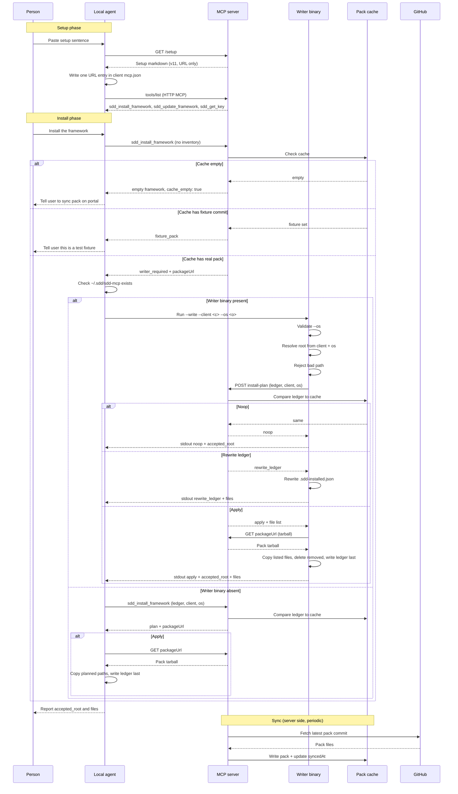
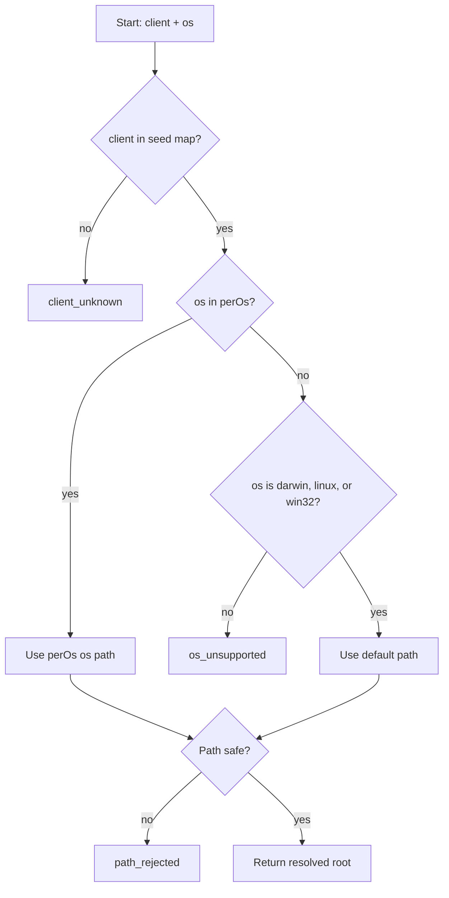

# framework.sdd.works — MCP design

MCP server for install, update, and get-key. Stories: [`mcp-stories.md`](./mcp-stories.md). Tests: [`mcp-tests.md`](./mcp-tests.md). Portal: [`app-design.md`](../admin-portal/app-design.md).

**Status:** the current contract is [ADR-130](../adr/ADR-130-simplified-installer-url-only-and-empty-cache.md), which supersedes the install steps in [ADR-129](../adr/ADR-129-url-mcp-server-plan-local-writer.md) decisions 3, 4, and 5. ADR-129 decisions 1 and 2 (URL entry and paste setup) stay. Related ADRs: [047](../adr/ADR-047-qwen-install-path-discovery.md), [051](../adr/ADR-051-zero-dep-stdio-binary.md), [053](../adr/ADR-053-server-side-sync-thin-stdio.md), [054](../adr/ADR-054-hybrid-http-ai-tarball.md), [055](../adr/ADR-055-layered-sync-freshness.md), [056](../adr/ADR-056-single-user-root-framework-pack.md), [057](../adr/ADR-057-install-ledger-pack-complete.md), [058](../adr/ADR-058-stdio-end-user-http-fallback.md), [059](../adr/ADR-059-ledger-lists-pack-files.md), [061](../adr/ADR-061-setup-prompt-public-path.md), [063](../adr/ADR-063-unregister-sdd-list-versions.md), [129](../adr/ADR-129-url-mcp-server-plan-local-writer.md), [130](../adr/ADR-130-simplified-installer-url-only-and-empty-cache.md).

## ADR-130 decisions

| # | Decision |
| --- | --- |
| 1 | `mcp.json` stays a URL only: `"url": "https://sdd.works/mcp"`. No `command`. |
| 2 | Setup prompt is URL only. Install instructions move to the `sdd_install_framework` tool result. The setup prompt has no install section. |
| 3 | Writer binary stays primary. No `--client-root` flag. The writer resolves the root from `--client` and `--os` alone. Unknown client returns `client_unknown`. No LLM at install time. |
| 4 | Writer stdout reports `accepted_root`, `commit`, `version`, and the written file list on `apply` and `rewrite_ledger`. On `noop`, it reports `accepted_root` only. |
| 5 | Cache age gate is dropped. Each successful sync updates `syncedAt` to now, even when the commit is unchanged. |
| 6 | Empty cache returns an empty framework: zero files, empty ledger, `pack_complete: true`, `cache_empty: true`. Not `sync_pending`. No git host. |
| 7 | `--os` is validated. Unknown `os` returns `os_unsupported`. Valid os with no per-os entry falls to `default`. |
| 8 | Unknown clients use the seed map. The writer does not call an LLM at install time. |
| 9 | Fix the hard-coded template path (MC-15). Pack references change from `{client_root}/templates/framework.sdd.works/...` to `{client_root}/templates/...`, matching `constants.json`. Pack repo structure stays. |
| 10 | Remove the local LLM discovery path. `src/core/path-resolve-llm.ts` is not called from the stdio program or the writer binary. A server-side LLM endpoint is deferred. |

## 1. Goals and non-goals

| Goals | Non-goals |
| --- | --- |
| End-user MCP is a URL | Portal chat LLM / image generation |
| Prompt-based setup: one paste; the agent writes the URL | Asking the person to edit `mcp.json` by hand |
| Local program writes the server plan. It is not the MCP process | Writing Server 2 disk as `~/.cursor` |
| When the program cannot run, the agent writes the same plan from the pack URL | Third-party skill marketplace |
| `listVersions` / `GET /api/sdd/versions` from operator sync cache | MCP transport session as business state |
| `sdd_get_key` from the admin key store (HTTP only) | Editing skills/rules inside an MCP session |
| Path allow-list; structured errors | Hard-coding a GitHub owner/repo for the pack |
| Seed map is the single path source for every transport | Trusting LLM paths without allow-list validation |

`serverInfo.name` = `framework.sdd.works` (literal). Tool names unprefixed. Descriptions SHOULD contain the literal `framework.sdd.works`.

## 1.1 Pack GitHub repository (admin Settings)

Two workspaces. Do not mix them.

| Workspace | Remote | What it is |
| --- | --- | --- |
| This workspace (`framework.sdd.works`) | [workspace.framework.sdd.works](https://github.com/ethanhuangcst/workspace.framework.sdd.works.git) | Build the product: framework pack authoring, MCP, and the web portal |
| Framework pack | [framework.sdd.works](https://github.com/ethanhuangcst/framework.sdd.works.git) | Published pack only |

This git working copy is the service repo. Sync and install never read this checkout's remote and never treat `specs/` or `src/` here as the pack tree. Pack files are copied into the pack repo by hand.

Pack source is the singleton **`Setting.githubUrl`** stored by the admin portal ([`app-design.md`](../admin-portal/app-design.md) Settings). Sync (`syncFrameworkRepo`), `GET /api/sdd/versions` / `listVersions()`, and `sdd_install_framework` / `sdd_update_framework` read that field at runtime. **Do not hard-code** an owner, repo, or clone URL in application code, path maps, or tool defaults.

Operators may change the URL in `/admin/settings`. The service validates `https://github.com/{owner}/{repo}` (optional `.git`) and persists the canonical form. An empty URL means no pack: sync and install fail with a structured error, not a baked-in fallback repo.

**Current operator value (example, changeable):** [https://github.com/ethanhuangcst/framework.sdd.works.git](https://github.com/ethanhuangcst/framework.sdd.works.git)

That URL is a **pack-only** tree. Observed top-level names on `main` (2026-09-24): `agents/`, `skill/`, `rules/`, `templates/`, plus non-pack files (`.gitignore`, workspace file). It is not the portal/`src` service repo. Feature-01 copies only the pack allow-list (with name mapping below), never every GitHub top-level file.

> Correction 2026-10-09: an earlier version of this section listed `templates/framework.sdd.works/` as a top-level name. That observation was wrong. The pack repo has `templates/` directly, and the pack `constants.json` defines `"templates_dir": "templates"`. The `framework.sdd.works/` level never existed in the pack repo (zero git commits touch that path). Skills, rules, and the agent that hard-coded `{client_root}/templates/framework.sdd.works/...` are the bug, tracked as MC-15. The fix changes those references to `{client_root}/templates/...`, matching `constants.json`. See [ADR-130](../adr/ADR-130-simplified-installer-url-only-and-empty-cache.md) decision 9.

## 2. The install flow

The flow has two phases: **setup** (register the MCP URL) and **install** (copy the pack). Setup and install are separate. Setup writes only the MCP URL entry. Install writes only framework artifacts (skills, rules, agents, workflows, templates).

### 2.1 Setup phase

The person pastes one sentence. The agent writes one URL entry. Setup stops there.

#### Setup steps

1. The person pastes in the agent: `Fetch and execute the setup instructions from https://sdd.works/setup`.
2. The agent fetches `GET /setup`. The server returns markdown from `public/agent-setup/prompt.md`. Setup version is `2026-10-09.v11`.
3. The setup markdown is URL only. It has no install section. It names no writer flags, no `--client-root`, no `accepted_root`, no git host.
4. The agent detects which IDE is running this session. It changes MCP configuration only for that agent. It does not read or write another IDE's `mcp.json` unless the user names that IDE (MC-10).
5. The agent writes one MCP entry named `framework.sdd.works`. The value is only `"url": "https://sdd.works/mcp"` (public) or `"url": "http://127.0.0.1:3041/mcp"` (local portal). A previous `command` or a previous host is replaced. The entry has no path and no `~` in the URL value.
6. The agent reloads MCP and checks `tools/list`. The names are `sdd_install_framework` and `sdd_update_framework`. HTTP also lists `sdd_get_key`. Setup stops here.

#### Client MCP file paths

| IDE | MCP file |
| --- | --- |
| Cursor | `~/.cursor/mcp.json` or `<workspace>/.cursor/mcp.json` |
| CodeBuddy (international), WorkBuddy | `~/.codebuddy/mcp.json` |
| CodeBuddy CN, WorkBuddy CN | `~/.codebuddy/mcp.json` |
| TRAE (international) | `~/.trae/mcp.json` |
| TRAE CN | `~/Library/Application Support/Trae CN/User/mcp.json` |

Project MCP is `.codebuddy/mcp.json` only when the user asked to configure the current workspace. TRAE (international) does not use the TRAE CN Application Support path. TRAE CN does not write `~/.trae-cn/mcp.json` or `~/.trae/mcp.json`.

#### Setup endpoints

| Endpoint | Serves |
| --- | --- |
| `GET /setup` | Markdown setup instructions (Next.js rewrite to `/api/agent-setup`) |
| `GET /agent-setup` | Redirect to `GET /setup` ([ADR-061](../adr/ADR-061-setup-prompt-public-path.md)) |
| Source file | `public/agent-setup/prompt.md` |

The instructions authorize only: add or replace one MCP entry named `framework.sdd.works` so it is only the URL; leave every other MCP entry unchanged; do not name a git host or a repository. They do not authorize installing the framework pack during setup.

Retired: Do not follow an older setup that tells the agent to download a program from a git host or to put a `command` in the MCP file. The current setup is the setup steps above. The MCP entry is a URL only. The download link is the pack on this server (MC-08).

### 2.2 Install phase

The person asks to install. The agent calls `sdd_install_framework`. The server returns a plan or `writer_required`. The writer binary, when it can run, copies the files. When it cannot run, the agent copies the same planned paths.

#### Install steps — primary path (writer binary can run)

1. The person asks the agent to install or update the framework.
2. The agent calls `sdd_install_framework` with no inventory over HTTP MCP.
3. The server checks the pack cache:
   - If the cache is empty, the server returns an empty framework: zero files, empty ledger, `pack_complete: true`, `cache_empty: true`. The agent writes nothing and tells the user to sync the pack on the admin portal. The flow stops (ADR-130 decision 6).
   - If the cached commit matches `sha-v*.*.*` or the fixture file set, the server returns `fixture_pack`. The agent writes nothing. The flow stops (MC-06).
   - If the cache is non-empty, the server returns `writer_required` with `packageUrl` on this server and instructions that name `--write`, `--client`, `--os`, and `SDD_SERVER_URL`. The instructions do not name `--client-root` or `accepted_root`. The result does not name a git host.
4. The agent checks whether the writer binary exists at `~/.sdd/sdd-mcp` (or `~/.sdd/sdd-mcp.exe` on Windows). If it does not exist, the agent falls through to the fallback path in §2.3.
5. The agent runs the writer binary: `SDD_SERVER_URL=https://sdd.works ~/.sdd/sdd-mcp --write --client <client> --os <os>`. The `--client` value is `cursor`, `claude`, `codex`, `copilot`, `codebuddy`, `trae`, or `trae-cn`. The `--os` value is `darwin`, `linux`, or `win32`. There is no `--client-root` flag.
6. The writer validates `--os`. An unknown `os` returns `os_unsupported` and the writer exits without copying files (ADR-130 decision 7).
7. The writer resolves the client root from `--client` and `--os` alone, using the path table in `packages/sdd-paths/paths.json`. An unknown client returns `client_unknown` and the writer exits. The writer does not call an LLM (ADR-130 decision 3).
8. The writer rejects a resolved path outside the home directory, a path that contains `..`, or `/etc`, `/usr`, `/bin`, `/sbin`. A rejected path returns `path_rejected` and the writer exits.
9. The writer reads `.sdd-installed.json` from the resolved client root. If the file does not exist, the writer treats it as a first install.
10. The writer posts to the server install-plan endpoint: the whole `.sdd-installed.json` (or absent), the client, the operating system, `force` when asked, and `missing`. The writer does not post file bodies. The writer does not post an accepted root. The server resolves the root from the client and the operating system (ADR-130 decision 3).
11. The server compares the ledger to the pack cache:
    - Same `package_version`, same `package_commit`, `pack_complete` present, and every listed file exists on disk: the server returns `noop`.
    - Same version and commit but `pack_complete` is missing: the server returns `rewrite_ledger`.
    - Otherwise: the server returns `apply` with the file list, the commit, and the version.
12. On `noop`, the writer exits without copying files. It prints `{"action":"noop","accepted_root":"<abs>"}` to stdout.
13. On `rewrite_ledger`, the writer rewrites `.sdd-installed.json` with `pack_complete: true` and the same file list. It prints `{"action":"rewrite_ledger","accepted_root":"<abs>","commit":"<sha>","version":"<v>","files":[...]}` to stdout.
14. On `apply`, the writer downloads the pack tarball from the server `packageUrl`, copies only the listed files into the resolved client root, deletes recorded files the new pack does not ship, and writes `.sdd-installed.json` last with `pack_complete: true`. It prints `{"action":"apply","accepted_root":"<abs>","commit":"<sha>","version":"<v>","files":[...]}` to stdout (ADR-130 decision 4).
15. The agent reads the writer stdout. It confirms the `accepted_root` matches the intended client root before it trusts the result. A wrong `--client` or `--os` is visible from the stdout (MC-13).
16. The tool result does not name a git host. The agent does not run `curl | tar` into the client root.

#### Install steps — fallback path (writer binary cannot run)

1. The agent sends the same inventory to `sdd_install_framework` over HTTP MCP: the ledger (or absent), the client, the operating system, `force` when asked, and `missing`.
2. The server resolves the root from the client and the operating system. It does not receive an accepted root from the caller (ADR-130 decision 3).
3. The server returns the plan (`noop`, `rewrite_ledger`, or `apply`), the instruction, and `packageUrl` on this server.
4. On `apply`, the agent downloads the pack tarball from `packageUrl`, copies only the planned paths into the resolved client root, and writes `.sdd-installed.json` last with `pack_complete: true`.
5. The agent does not extract the archive into the client root. The agent does not write `framework.sdd.works.json`.
6. HTTP `tools/list` keeps `sdd_get_key` (MC-07).

#### Install sequence



### 2.3 Cache freshness

The server syncs the pack from GitHub on a schedule. The cache is the source of truth for install and update. The cache is never stale by age (ADR-130 decision 5).

- The server fetches the latest commit on the configured branch on a schedule.
- The server writes the pack files to the cache and updates `syncedAt` on every sync, including when the commit is unchanged.
- There is no `CACHE_STALE_MINUTES` gate. There is no `cache_stale` failure code.
- `syncedAt` records the last sync time. It does not gate install or update.
- An empty cache returns an empty framework, not `sync_pending`. The agent writes nothing and tells the user to sync the pack on the admin portal (ADR-130 decision 6).
- The fixture commit set returns `fixture_pack`. The agent writes nothing (MC-06).

### 2.4 Lite HTTP installer

The lite HTTP installer is the fallback path in §2.2. It is not a separate program. When the writer binary cannot run, the agent copies the planned paths over HTTP MCP. The plan, the file list, and the ledger are the same as the writer path. The only difference is who copies the files.

## 3. Tools

The server exposes three tools. `sdd_install_framework` and `sdd_update_framework` are the same operation with different names. `sdd_get_key` is HTTP only.

### Failure codes

| Code | Meaning |
| --- | --- |
| `not_found` | The pack or version does not exist. |
| `unauthorized` | The caller is not authorized. |
| `path_rejected` | The resolved path is outside the home directory, contains `..`, or is a system path. |
| `already_up_to_date` | The ledger matches the cached pack. No file change. |
| `package_unavailable` | The pack tarball is not available on the server. |
| `client_config_unresolved` | The client root cannot be resolved from the client and the operating system. |
| `client_unknown` | The `--client` value is not in the path table. |
| `os_unsupported` | The `--os` value is not `darwin`, `linux`, or `win32`. |
| `sync_pending` | Retired. An empty cache returns an empty framework, not `sync_pending` (ADR-130 decision 6). |
| `version_not_found` | The named version does not exist in the cache. |
| `fixture_pack` | The cached commit matches the fixture set. The agent writes nothing (MC-06). |
| `cache_empty` | The cache is empty. The agent writes nothing and tells the user to sync the pack on the portal (ADR-130 decision 6). |
| `cache_stale` | Retired. There is no age gate (ADR-130 decision 5). |
| `llm_unavailable` | Retired. The server does not call an LLM at install time (ADR-130 decision 10). |

### Tool table

| Tool | Transport | Purpose |
| --- | --- | --- |
| `sdd_install_framework` | stdio + HTTP | Install or update the framework pack into the client root. |
| `sdd_update_framework` | stdio + HTTP | Same operation as `sdd_install_framework`. Different name for the update intent. |
| `sdd_get_key` | HTTP only | Return a short-lived portal key for the admin portal. |

`sdd_list_versions` is not registered (ADR-063). The server does not expose a version list tool.

### sdd_get_key

HTTP only. Returns a short-lived key the person pastes into the admin portal. The key is not a secret the agent stores. The agent shows the key to the person and stops.

### sdd_install_framework and sdd_update_framework

#### Input

| Field | Type | Required | Notes |
| --- | --- | --- | --- |
| `client` | string | yes | One of `cursor`, `claude`, `codex`, `copilot`, `codebuddy`, `trae`, `trae-cn`. |
| `os` | string | yes | One of `darwin`, `linux`, `win32`. |
| `force` | boolean | no | Rewrite the ledger even when the version matches. |
| `missing` | string[] | no | Files the ledger lists but the disk does not have. |
| `ledger` | object | no | The current `.sdd-installed.json` contents. |

The caller does not send an accepted root. The server resolves the root from `client` and `os` (ADR-130 decision 3).

#### Shared steps

1. The server validates `client` and `os`.
2. The server resolves the root from the path table.
3. The server rejects a bad path.
4. The server checks the cache:
   - Empty cache: return empty framework.
   - Fixture commit: return `fixture_pack`.
   - Otherwise: compare the ledger to the cache.
5. The server returns the plan: `noop`, `rewrite_ledger`, `apply`, or the empty framework.

#### Local program (writer binary)

When the writer binary can run, the server returns `writer_required` and the agent runs the binary. The binary does the plan. The binary prints `accepted_root`, `commit`, `version`, and `files` to stdout. See §2.2 install steps.

#### HTTP behavior

When the writer binary cannot run, the agent does the plan over HTTP MCP. The server returns the plan and `packageUrl`. The agent copies the planned paths and writes the ledger. See §2.2 fallback path.

## 4. Path resolution

The server resolves the client root from `client` and `os`. The path source is a seed map. The server does not call an LLM at install time (ADR-130 decision 10).

### 4.0 Path map architecture

The path map lives in `packages/sdd-paths/paths.json` in this repo. The server loads the seed map at startup. The map is a static table. The map is not a learned model.

The map has one entry per client. Each entry has:

- `name`: the canonical client name.
- `aliases`: other names the caller may use.
- `perOs`: a map of `os` to a root path template.
- `default`: a root path template used when `os` has no per-os entry.
- `config`: the MCP config file path for that client.

### 4.1 Seed path map data

The seed map covers the supported clients. The map is the only path source at install time. The server does not call an LLM to discover a path (ADR-130 decision 10).

| Client | `darwin` root | `linux` root | `win32` root | MCP config |
| --- | --- | --- | --- | --- |
| `cursor` | `~/.cursor` | `~/.cursor` | `%USERPROFILE%\.cursor` | `~/.cursor/mcp.json` |
| `claude` | `~/.claude` | `~/.claude` | `%USERPROFILE%\.claude` | `~/.claude/mcp.json` |
| `codex` | `~/.codex` | `~/.codex` | `%USERPROFILE%\.codex` | `~/.codex/mcp.json` |
| `copilot` | `~/.copilot` | `~/.copilot` | `%USERPROFILE%\.copilot` | `~/.copilot/mcp.json` |
| `codebuddy` | `~/.codebuddy` | `~/.codebuddy` | `%USERPROFILE%\.codebuddy` | `~/.codebuddy/mcp.json` |
| `trae` | `~/.trae` | `~/.trae` | `%USERPROFILE%\.trae` | `~/.trae/mcp.json` |
| `trae-cn` | `~/Library/Application Support/Trae CN/User` | `~/.trae-cn` | `%APPDATA%\Trae CN\User` | `~/Library/Application Support/Trae CN/User/mcp.json` |

A valid `os` with no per-os entry uses `default`. An unknown `os` returns `os_unsupported` (ADR-130 decision 7).

### 4.2 Qwen

Retired. The server does not call a Qwen LLM at install time. The local LLM discovery path is removed. A server-side LLM endpoint is deferred (ADR-130 decision 10).

### 4.4 Client path detection (MCPI-05)

The writer binary and the server resolve the client root the same way: from `client` and `os` against the seed map. There is no runtime probe. There is no LLM.

#### Detection flow



#### clientInfo.name mapping

The `--client` value maps to `clientInfo.name` in the seed map. Aliases are accepted:

| Caller value | Canonical name |
| --- | --- |
| `cursor` | `cursor` |
| `claude` | `claude` |
| `codex` | `codex` |
| `copilot` | `copilot` |
| `codebuddy`, `workbuddy` | `codebuddy` |
| `trae` | `trae` |
| `trae-cn`, `trae_cn`, `trae cn` | `trae-cn` |

#### Environment variables

The writer binary reads `SDD_SERVER_URL` from the environment. The server URL is not hard-coded in the binary. The setup markdown names `SDD_SERVER_URL=https://sdd.works` for public and `SDD_SERVER_URL=http://127.0.0.1:3041` for local.

| Variable | Purpose |
| --- | --- |
| `SDD_SERVER_URL` | The server base URL for the writer binary. |

#### Config file probe

The writer binary does not probe for a config file. The server resolves the config path from the seed map. The agent writes the MCP entry to the path the seed map names.

#### Module sketch

```
packages/sdd-paths/
  paths.json          # seed map
  index.ts            # resolve(client, os) -> { root, config }
  validate.ts         # reject bad paths
```

`resolve(client, os)` returns `{ root, config }` or throws `client_unknown` or `os_unsupported`. `validate(root)` rejects a path outside the home directory, a path with `..`, or a system path.

#### Compat aliases

Old client names are accepted as aliases. The canonical name is what the seed map stores. The alias table is in §4.4 clientInfo.name mapping.

#### Security

- The writer binary rejects a resolved path outside the home directory.
- The writer binary rejects a path that contains `..`.
- The writer binary rejects `/etc`, `/usr`, `/bin`, `/sbin`.
- The server does not receive an accepted root from the caller. The server resolves the root from `client` and `os` (ADR-130 decision 3).
- The writer binary does not call an LLM.
- The writer binary reads the server URL from `SDD_SERVER_URL`, not from a hard-coded value.

## 5. Pack allow-list and ledger

### Pack allow-list

The pack ships five top-level names. Source aliases are normalized on copy.

| Pack top-level | Source aliases | Purpose |
| --- | --- | --- |
| `agents` | `agent/`, `agents/` | Agent files. |
| `skills` | `skill/`, `skills/` | Skill files. |
| `rules` | `Rules/`, `rules/` | Rule files. |
| `workflows` | `workflows/` | Workflow files. |
| `templates` | `templates/` | Template files. |

The pack `constants.json` defines `"templates_dir": "templates"`. The pack repo has `templates/` directly. There is no `framework.sdd.works/` level in the pack repo (MC-15).

### Install ledger

The ledger is `{client_root}/.sdd-installed.json`. The writer binary writes it last. The ledger records what was installed.

```json
{
  "package_version": "sha-v1.2.0",
  "package_commit": "<sha>",
  "pack_complete": true,
  "syncedAt": "<iso>",
  "files": [
    { "path": "skills/sdd-build/SKILL.md", "sha": "<sha>", "size": 1234 },
    { "path": "rules/sdd-dod.mdc", "sha": "<sha>", "size": 5678 }
  ]
}
```

- `pack_complete: true` means the install finished all listed files.
- `files` is the file-level list. Each entry has `path`, `sha`, and `size`.
- `syncedAt` is the last sync time. It does not gate install or update.

### Write policy

- The writer binary copies only the listed files.
- The writer binary deletes recorded files the new pack does not ship.
- The writer binary writes `.sdd-installed.json` last.
- The agent does not extract the archive into the client root.
- The agent does not write `framework.sdd.works.json`.

## 6. Client-root scenarios

### Expected

The writer binary resolves the root from `client` and `os`. The server does not receive an accepted root from the caller (ADR-130 decision 3).

| Scenario | Result |
| --- | --- |
| First install, no ledger | The writer copies all listed files and writes the ledger. |
| Same version, same commit, `pack_complete: true`, all files exist | `noop`. No file change. |
| Same version, same commit, `pack_complete` missing | `rewrite_ledger`. The writer rewrites the ledger only. |
| New version | `apply`. The writer copies the new files, deletes removed files, and rewrites the ledger. |
| Empty cache | The server returns an empty framework. The agent writes nothing. |
| Fixture commit | The server returns `fixture_pack`. The agent writes nothing. |
| Unknown `--client` | `client_unknown`. The writer exits. |
| Unknown `--os` | `os_unsupported`. The writer exits. |
| Resolved path outside home | `path_rejected`. The writer exits. |
| Writer binary absent | The agent uses the fallback path in §2.2. |

## 7. Shared core

The server and the writer binary share the path resolution and the plan logic. The shared core is in `packages/sdd-paths` and `packages/sdd-install`.

- `packages/sdd-paths`: path resolution and validation.
- `packages/sdd-install`: plan logic (noop, rewrite_ledger, apply), file list diff, ledger read and write.

The writer binary imports the same modules. The server imports the same modules. The plan is the same on both paths.

## 8. i18n

The setup markdown is English. The framework pack ships English skills, rules, and agents. The admin portal supports the locales the portal spec names.

- The setup markdown has no hard-coded locale. The agent writes the MCP entry the same way for every locale.
- The writer binary output is JSON. The JSON keys are stable across locales.
- The framework pack files are English. A locale pack is a separate story.

## 9. Security

- The MCP entry is a URL only. No `command`, no `args`, no local path in the MCP file.
- The writer binary is downloaded from the server `packageUrl`, not from a git host.
- The writer binary validates `--os` and `--client`.
- The writer binary rejects a resolved path outside the home directory.
- The server does not receive an accepted root from the caller.
- The writer binary does not call an LLM.
- The writer binary reads the server URL from `SDD_SERVER_URL`.
- The ledger is written last. A failed install leaves the old ledger.
- The agent does not extract the archive into the client root.
- `sdd_get_key` returns a short-lived key. The key is not stored by the agent.
- Secrets stay out of tool results, ledger, and logs.

## 10. Tests

See [mcp-tests.md](./mcp-tests.md) for the test strategy. See [mcp-stories.md](./mcp-stories.md) for acceptance criteria. See [mcp-manual-test-results.md](./mcp-manual-test-results.md) for manual test records.

- Unit tests cover path resolution, plan logic, and ledger read and write.
- Integration tests cover the writer binary and the HTTP fallback.
- E2E tests cover the setup flow and the install flow in a real client.
- Manual tests cover the clients the automated suite does not reach.

## 11. Anti-patterns

- A setup markdown that tells the agent to download a program from a git host.
- A setup markdown that tells the agent to put a `command` in the MCP file.
- An MCP entry with a `command` or a local path.
- A writer binary that accepts an accepted root from the caller.
- A writer binary that calls an LLM at install time.
- A cache age gate that blocks a content-current pack.
- An empty cache that returns `sync_pending`.
- A ledger without `pack_complete`.
- A ledger without a file-level `files` list.
- An agent that extracts the archive into the client root.
- An agent that writes `framework.sdd.works.json`.
- A hard-coded `templates/framework.sdd.works/` path (MC-15).
