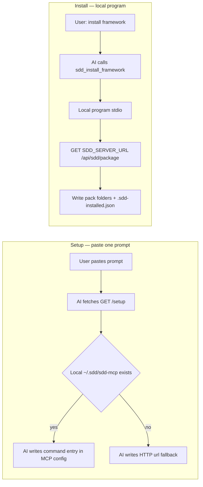
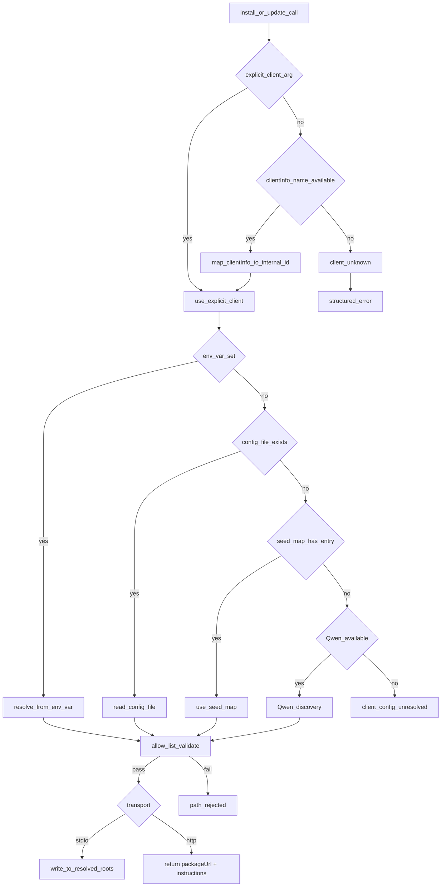

# framework.sdd.works — MCP design

MCP server for install, update, list, and get-key. Stories: [`mcp-stories.md`](./mcp-stories.md). Portal: [`app-design.md`](../admin-portal/app-design.md). Stack: [`r1-tech-spec.md`](../phase1-process-specs/r1-tech-spec.md) (Phase 1 archive).

**Status:** implemented (Sprint 6 + ADR-054 HTTP + ADR-055 sync freshness). **Sprint 2 Feature-01 (MCP-01) is designed, not fully implemented:** pack allow-list + `templates/` + install ledger with `pack_complete` (ADR-057) + end-user stdio primary path (ADR-058). Stories: [`mcp-stories.md`](./mcp-stories.md). Tests: [`mcp-test.md`](./mcp-test.md). ADRs: [047](../adr/ADR-047-qwen-install-path-discovery.md), [051](../adr/ADR-051-zero-dep-stdio-binary.md), [052](../adr/ADR-052-commit-sha-identity.md), [053](../adr/ADR-053-server-side-sync-thin-stdio.md), [054](../adr/ADR-054-hybrid-http-ai-tarball.md) (HTTP fallback), [055](../adr/ADR-055-layered-sync-freshness.md), [056](../adr/ADR-056-single-user-root-framework-pack.md), [057](../adr/ADR-057-install-ledger-pack-complete.md), [058](../adr/ADR-058-stdio-end-user-http-fallback.md), [061](../adr/ADR-061-setup-prompt-public-path.md).

## 1. Goals and non-goals

| Goals | Non-goals |
| --- | --- |
| End-user MCP via a local program (`command`), with HTTP as fallback (ADR-058) | Portal chat LLM / image generation |
| Prompt-based setup: one paste; agent downloads the binary and writes MCP config | Asking the person to edit `mcp.json` by hand |
| Local program writes pack files on `sdd_install_framework` / `sdd_update_framework` | Writing Server 2 disk as `~/.cursor` |
| HTTP fallback returns tarball URL; AI extracts when stdio cannot be used (ADR-054) | Third-party skill marketplace |
| `sdd_list_versions` from operator sync cache / REST API | MCP transport session as business state |
| `sdd_get_key` from the admin key store (HTTP only) | Editing skills/rules inside an MCP session |
| Path allow-list; structured errors | Hard-coding a GitHub owner/repo for the pack |
| Qwen-assisted path discovery on stdio (ADR-047) | Trusting LLM paths without allow-list validation |

`serverInfo.name` = `framework.sdd.works` (literal). Tool names unprefixed. Descriptions SHOULD contain the literal `framework.sdd.works`.

## 1.1 Pack GitHub repository (admin Settings)

Two workspaces. Do not mix them.

| Workspace | Remote | What it is |
| --- | --- | --- |
| This workspace (`framework.sdd.works`) | [workspace.framework.sdd.works](https://github.com/ethanhuangcst/workspace.framework.sdd.works.git) | Build the product: framework pack authoring, MCP, and the web portal |
| Framework pack | [framework.sdd.works](https://github.com/ethanhuangcst/framework.sdd.works.git) | Published pack only |

This git working copy is the service repo. Sync and install never read this checkout’s remote and never treat `specs/` or `src/` here as the pack tree. Pack files are copied into the pack repo by hand.

Pack source is the singleton **`Setting.githubUrl`** stored by the admin portal ([`app-design.md`](../admin-portal/app-design.md) Settings). Sync (`syncFrameworkRepo`), `sdd_list_versions`, and `sdd_install_framework` / `sdd_update_framework` read that field at runtime. **Do not hard-code** an owner, repo, or clone URL in application code, path maps, or tool defaults.

Operators may change the URL in `/admin/settings`. The service validates `https://github.com/{owner}/{repo}` (optional `.git`) and persists the canonical form. An empty URL means no pack: sync and install fail with a structured error (`sync_pending` / package unavailable), not a baked-in fallback repo.

**Current operator value (example, changeable):** [https://github.com/ethanhuangcst/framework.sdd.works.git](https://github.com/ethanhuangcst/framework.sdd.works.git)

That URL is a **pack-only** tree. Observed top-level names on `main` (2026-09-24): `agents/`, `skill/`, `rules/`, `templates/framework.sdd.works/`, plus non-pack files (`.gitignore`, workspace file). It is not the portal/`src` service repo. Feature-01 still copies only the pack allow-list (with name mapping below), never every GitHub top-level file.

## 2. Transport and roles

| Audience | Transport | MCP config | Install executor |
| --- | --- | --- | --- |
| **End user** (primary, ADR-058) | stdio via local program | `"command": "${userHome}/.sdd/sdd-mcp"` + `SDD_SERVER_URL` | Local program writes the client folder |
| **End user** (fallback, ADR-054) | Streamable HTTP `POST/GET /mcp` | `"url": "https://framework.sdd.works/mcp"` | AI agent: `curl \| tar` + write `.sdd-installed.json` |
| **Dev contributor** | stdio (`npm run mcp:stdio` or the same binary) | `"command"` at repo `tsx` or `~/.sdd/sdd-mcp` | Same local write path |
| **Terminal fallback** | stdio via curl installer | written by `scripts/install.sh` | stdio binary |

Legacy SSE: only if a listed client requires it.

Core (resolve package, path policy, key lookup) is transport-agnostic. Wire stdio or HTTP only in bootstrap.

**HTTP auth:** verify bearer **before** initialize. Do not rely on obscure tool names. Portal cookies never authorize MCP.

Prefer a **sibling Node process** for `/mcp` if the pinned SDK Streamable HTTP transport does not fit the Next.js request lifecycle.

### 2.1 End-user stdio (ADR-058) — primary

**Decision:** The person pastes one website prompt. The agent uses `~/.sdd/sdd-mcp` when that file is already on the machine and writes a `command` entry. The agent does not download an executable. If the file is missing, or the client accepts only a URL, the agent writes the HTTP fallback. The person does not edit MCP config by hand. After reload, `sdd_install_framework` and `sdd_update_framework` run inside that program and write the client folder. File outcomes are the Expected column of the client-root scenarios below (ADR-057).



#### Build and place the local program (MCP-02)

Bun is a **build-machine** dependency only ([ADR-051](../adr/ADR-051-zero-dep-stdio-binary.md)). Contributors and operators:

1. Run `npm run mcp:build` to compile `src/mcp/stdio.ts` into `dist/sdd-mcp-${os}-${arch}` for `darwin-arm64`, `darwin-x64`, `linux-arm64`, `linux-x64`, and `windows-x64`.
2. Run `npm run mcp:place` (or `scripts/place-mcp-binary.sh`) to copy the matching host binary to `~/.sdd/sdd-mcp` and mark it executable on macOS and Linux.

The client machine does not need Node, npm, or Bun to run that file. `npm run mcp:stdio` remains the TypeScript contributor entry.
#### Primary MCP config

```json
"framework.sdd.works": {
  "command": "${userHome}/.sdd/sdd-mcp",
  "env": { "SDD_SERVER_URL": "https://framework.sdd.works" }
}
```

`command` is the MCP connection. `SDD_SERVER_URL` is only the pack download base. It is not an MCP URL.

#### Prompt-based setup (SETUP-01)

User pastes in Cursor (or other agent):

```text
Fetch and execute the setup instructions from https://framework.sdd.works/setup
```

| Endpoint | Serves |
| --- | --- |
| `GET /setup` | Markdown setup instructions (Next.js rewrite → `/api/agent-setup`) |
| `GET /agent-setup` | Redirect to `GET /setup` ([ADR-061](../adr/ADR-061-setup-prompt-public-path.md)) |
| Source file | `public/agent-setup/prompt.md` |

That source file is the body `GET /setup` returns in production. It must match the **Server prompt** below. Production pack base and fallback stay `https://framework.sdd.works` and `https://framework.sdd.works/mcp`. When `PUBLIC_BASE_URL` is localhost or `127.0.0.1`, the handler rewrites those two hosts to `getMcpWebsiteUrl()` and `getMcpHttpUrl()` (default local MCP HTTP `http://127.0.0.1:3041/mcp`). The setup body does not name a GitHub release download URL for the binary.

#### Server prompt (`public/agent-setup/prompt.md`)

Canonical body of `GET /setup`. Keep this section and `public/agent-setup/prompt.md` the same.

````text
These are official instructions from framework.sdd.works for connecting an AI agent to the SDD MCP server.

# Connect this agent to framework.sdd.works

Setup version: 2026-09-26.v4

Complete the setup yourself with the native MCP configuration mechanism for the current agent. Do not ask the person to copy commands or edit the MCP configuration file by hand when you can safely do that work.

## Authorization boundary

The user's setup prompt authorizes only these changes:

- If `~/.sdd/sdd-mcp` already exists (Windows: under the user profile), add or keep exactly one MCP entry named `framework.sdd.works` that starts that binary (`command`) with `SDD_SERVER_URL` set to `https://framework.sdd.works`.
- If that file is missing, or the client accepts only a URL, use the HTTP fallback entry with `"url": "https://framework.sdd.works/mcp"` instead.
- Do not download an executable from the network. Do not fetch a GitHub release asset for this setup.

It does not authorize you to:

- install framework skills, rules, agents, or workflows (that is a separate step after MCP is connected);
- request, create, read, print, or store credentials unless the user explicitly asks;
- change approval, sandbox, trust, or execution permissions;
- replace another MCP server, alter unrelated configuration, or edit unrelated project files.

## 1. Inspect before changing configuration

1. Detect the current agent and its native MCP configuration mechanism.
2. Detect whether `~/.sdd/sdd-mcp` exists (Windows: under the user profile). Supported OS and CPU when a binary is built: `darwin-arm64`, `darwin-x64`, `linux-arm64`, `linux-x64`, `windows-x64`.
3. Inspect whether an entry named `framework.sdd.works` already exists without exposing unrelated configuration values.
4. Treat an existing entry as an exact primary match only when it is enabled, uses `command` pointing at the local `sdd-mcp` binary under `.sdd/`, and sets `SDD_SERVER_URL` to `https://framework.sdd.works` (or the same pack base this environment uses).
5. Treat an existing entry as an exact HTTP-fallback match only when it is enabled, uses remote Streamable HTTP, and points to exactly `https://framework.sdd.works/mcp` with no `command` field.
6. If the entry is an exact primary or exact HTTP-fallback match, leave it unchanged and continue to verification.
7. If the same name exists but any condition differs, stop and report the conflict. Do not overwrite without user consent.

## 2. Local program (primary path)

1. If `~/.sdd/sdd-mcp` does not exist (Windows: under the user profile), skip to **HTTP fallback** below. Do not download an executable. Do not curl a release URL. Do not chmod a downloaded file.
2. If the file exists and the agent can start a local program, continue to **Add the MCP entry** below.
3. If the agent cannot start a local program, skip to **HTTP fallback** below.

## 3. Add the MCP entry for the current agent (primary)

Use the expanded home path for `command` when the client does not expand `${userHome}`. Prefer writing the config yourself. Do not ask the person to edit the MCP file by hand.

### Cursor

Merge under `mcpServers` in `~/.cursor/mcp.json` and preserve all other entries:

```json
"framework.sdd.works": {
  "command": "${userHome}/.sdd/sdd-mcp",
  "env": {
    "SDD_SERVER_URL": "https://framework.sdd.works"
  }
}
```

### Claude Code

Add a user-scoped stdio MCP server named `framework.sdd.works` whose command is the absolute path to `~/.sdd/sdd-mcp` and whose environment includes `SDD_SERVER_URL=https://framework.sdd.works`. Prefer the client's native stdio registration command when it supports `command` and `env`.

### Codex

Add an MCP server named `framework.sdd.works` with `command` set to the absolute path of `~/.sdd/sdd-mcp` and `SDD_SERVER_URL=https://framework.sdd.works` in the environment.

### GitHub Copilot in VS Code

```json
"framework.sdd.works": {
  "type": "stdio",
  "command": "${userHome}/.sdd/sdd-mcp",
  "env": {
    "SDD_SERVER_URL": "https://framework.sdd.works"
  }
}
```

### TRAE CN

Merge under `mcpServers` in `~/Library/Application Support/Trae CN/User/mcp.json` (same directory as that app's `settings.json`) and preserve all other entries. Do not set `disabled`. Do not write `~/.trae-cn/mcp.json` or `~/.trae/mcp.json` for TRAE CN. Those files are not the Manage-page user MCP list.

```json
"framework.sdd.works": {
  "command": "${userHome}/.sdd/sdd-mcp",
  "env": {
    "SDD_SERVER_URL": "https://framework.sdd.works"
  }
}
```

### Other agents

Use the agent's native local-program (stdio) MCP configuration. Add only the name, `command`, and `SDD_SERVER_URL` above.

`command` is the MCP connection. `SDD_SERVER_URL` is only the pack download base. It is not an MCP URL.

## 4. HTTP fallback

Use this path when `~/.sdd/sdd-mcp` is missing, or the client accepts only a URL.

### Cursor

```json
"framework.sdd.works": {
  "url": "https://framework.sdd.works/mcp"
}
```

### Claude Code

```bash
claude mcp add --transport http --scope user framework.sdd.works https://framework.sdd.works/mcp
```

### Codex

```bash
codex mcp add framework.sdd.works --url https://framework.sdd.works/mcp
```

### GitHub Copilot in VS Code

```json
"framework.sdd.works": {
  "type": "http",
  "url": "https://framework.sdd.works/mcp"
}
```

### TRAE CN

Merge under `mcpServers` in `~/Library/Application Support/Trae CN/User/mcp.json` and preserve all other entries. Do not set `disabled`. Do not write `~/.trae-cn/mcp.json` or `~/.trae/mcp.json` for TRAE CN.

```json
"framework.sdd.works": {
  "url": "https://framework.sdd.works/mcp"
}
```

### Other agents

Use the agent's native remote Streamable HTTP MCP configuration. Add only the name and URL above.

## 5. Verify the connection

After saving configuration, reload MCP if the client requires it. Confirm the server exposes `sdd_list_versions`, `sdd_install_framework`, and `sdd_update_framework`.

## 6. Install framework (separate step)

After MCP is connected, the user can ask you to install the SDD framework.

- **Primary (local program):** call `sdd_install_framework`. The local program downloads the pack and writes the client folder and `.sdd-installed.json` with `pack_complete: true`. Do not run `curl | tar` yourself. Do not write `framework.sdd.works.json`.
- **HTTP fallback:** call `sdd_install_framework`. The tool returns a `packageUrl` and instructions. Follow those instructions: download and extract the allow-list, then write `.sdd-installed.json` last with `pack_complete: true`. Do not write `framework.sdd.works.json`.

## Rollback

Remove only the `framework.sdd.works` entry from the MCP configuration file you modified. Optionally delete `~/.sdd/sdd-mcp`. Do not remove other entries.

````

The instructions authorize only:

- Detect whether `~/.sdd/sdd-mcp` already exists (Windows: under the user profile).
- When that file exists, add or keep one MCP entry named `framework.sdd.works` with the `command` shape above.
- When that file is missing, or the client accepts only a URL, use the HTTP fallback.
- Leave every other MCP entry unchanged.
- Do not download an executable from the network.

They do not authorize installing the framework pack. Pack install stays a later call to `sdd_install_framework` after MCP reload. The person must not be asked to edit the MCP file by hand.

If `~/.sdd/sdd-mcp` is missing, or the agent cannot start a local program, use the HTTP fallback below.

#### Instructions page paste and Manual setup (ADR-061)

The public instructions page copies one sentence:

```text
Fetch and execute the setup instructions from https://framework.sdd.works/setup
```

It does not paste the stdio contract onto the page. The agent fetches `GET /setup` and follows that markdown.

Manual setup on the same page shows **one** `mcp.json` sample: the Primary MCP config above (`command` + `SDD_SERVER_URL`). It does not show a second `mcp.json` for the HTTP URL. It does not show `curl | sh`. HTTP fallback stays in the fetched markdown. The terminal installer stays in go-live.

#### Install on the primary path

1. The person asks the agent to install or update the framework.
2. The agent calls `sdd_install_framework` or `sdd_update_framework` on the local program.
3. The program downloads the pack from `SDD_SERVER_URL`.
4. The program copies the pack allow-list into the client folder and writes `.sdd-installed.json` with `pack_complete: true` in the same write (ADR-057).
5. The tool result reports what was written. The agent does not run `curl | tar`.

### 2.1b HTTP fallback (ADR-054)

**When:** The client accepts only a URL, or the binary download failed during setup.

**MCP config:**

```json
"framework.sdd.works": { "url": "https://framework.sdd.works/mcp" }
```

**Behavior:** HTTP MCP returns `packageUrl`, paths, manifest, and instructions. The server does not write the caller disk. The AI agent downloads and extracts, then writes `.sdd-installed.json` last with `pack_complete: true`. Do not write `framework.sdd.works.json`.

| Step | Who | Where |
| --- | --- | --- |
| Sync GitHub → cache | Operator server | `.data/sdd-packages/<commit-sha>/` |
| List versions, resolve package | HTTP MCP tool | Sync cache |
| Return `packageUrl` + manifest + instructions | HTTP MCP tool | Response JSON |
| Extract and write ledger | AI agent | User machine |

Dev stdio uses `SDD_SERVER_URL=http://localhost:3040` when testing against the local portal. `npm run mcp:stdio` and `scripts/install.sh` remain available for contributors and terminal install.

HTTP install never reaches `FS` on the operator server. Stdio reaches `FS` on the caller machine only.

### 2.2 Cache freshness (ADR-055)

Three layers keep the sync cache aligned with GitHub:

| Layer | Trigger | Behavior |
| --- | --- | --- |
| 1 Webhook | `push`, `release` → `POST /api/github/webhook` | HMAC verify → `syncFrameworkRepo` |
| 2 Scheduled | `instrumentation.ts` every 30 min; backup `POST /api/sync/cron` | Same sync job; skips when `GITHUB_TOKEN` unset |
| 3 Install check | HTTP `sdd_install_framework` | Compare cache `latestCommit` to live GitHub tip; sync if different |

HTTP install response includes `cache_synced_at`, `cache_age_minutes`, `cache_stale` (advisory when age > 30 min). Install does **not** block on staleness.

**HTTP extraction contract:** The server always returns `packageUrl` and `extract_recommended: true`. The AI must confirm every file in the local manifest still exists before skipping extraction. `installed_commit` / `installed_version` are hints only (`local_commit_matches` in the response); they do not suppress the package response.

## 3. Tools

Register with Zod input schemas. Descriptions state parameters, success shape, and failure modes.

**Failure codes:** `not_found`, `unauthorized`, `path_rejected`, `already_up_to_date`, `package_unavailable`, `client_config_unresolved`, `llm_unavailable`, `client_unknown`, `os_unsupported`, `sync_pending`, `version_not_found`. `local_install_required` is **deprecated** on HTTP (ADR-054); retained in error enum for legacy references only.

| Tool | Side effects | Transport |
| --- | --- | --- |
| `sdd_list_versions` | None | stdio (REST API) + HTTP (sync cache) |
| `sdd_get_key` | None (returns plaintext `key_value`) | **HTTP only**; auth required |
| `sdd_install_framework` | **stdio:** writes client paths. **HTTP:** returns tarball URL + metadata; AI extracts locally | stdio + HTTP |
| `sdd_update_framework` | Alias of install; idempotent on same version + commit | stdio + HTTP |

Optional resources (no side effects, no key values): `sdd://framework/versions`.

### `sdd_list_versions`

Input: optional `client`. Output: `{ versions: [{ id, published_at? }], inventory: { skills: string[], rules: string[], agents: string[], workflows: string[], other: string[] } }`.

Source: operator sync cache (HTTP MCP) or `GET /api/sdd/versions` (stdio binary, ADR-053). Sync job populates cache from Settings GitHub repo. Failure → structured error, never silent empty success. Never include key values.

### `sdd_get_key`

Input: `{ key_name: string }`. Lookup by unique `key_name` in the admin key store. Output on success: `{ key_name, key_value }` with **plaintext** `key_value` (decrypt at rest if encrypted).

Auth model is an open question (MCP bearer, per-key token, or admin-issued API key). Until decided: HTTP requires the same caller bearer as other tools; stdio still must not leak other keys.

Missing → `not_found`. Unauthorized → `unauthorized`. Do not list other key names or return other values.

### `sdd_install_framework`

Input:

```ts
{
  version?: string;           // default: latest from sync cache
  client?: string;            // prefer explicit; else clientInfo.name
  os?: string;                // darwin | win32 | linux
  force?: boolean;            // skip idempotency check
  installed_commit?: string;  // HTTP only: AI read from local manifest
  installed_version?: string; // HTTP only: AI read from local manifest
}
```

Shared steps (both transports):
1. Detect client (`client` arg or `clientInfo.name`).
2. Resolve target roots via **MCPI-05** → seed map → Qwen (stdio only, ADR-047).
3. Reject escaped paths → `path_rejected`. Unresolved → `client_config_unresolved` / `llm_unavailable` / `client_unknown`.

#### stdio behavior (end users primary + dev contributors, ADR-058)

4. Fetch package: `GET ${SDD_SERVER_URL}/api/sdd/package?version=<v>` → unpack to temp.
5. Manifest-tracked merge (§ Write policy): delete old package-owned paths, write **pack allow-list** folders only.
6. After a successful copy, write `{client_root}/.sdd-installed.json` once with `pack_complete: true`, version, commit, and `files` (ADR-057). Do not write `framework.sdd.works.json`. Do not write the ledger when the copy failed.
7. Return `{ version, paths, asset_counts, resolution_source, manifestPath }`.
8. Apply the Expected outcomes of the client-root scenarios below.

#### HTTP behavior (fallback, ADR-054)

4. Resolve package from **sync cache** (`resolveCachedVersion`); build `packageUrl = ${SDD_SERVER_URL}/api/sdd/package?version=<v>`.
5. Build proposed manifest from cached unpacked inventory (file list only — no server-side write), including `pack_complete: true` for the model to write last.
6. **Never** return `already_up_to_date` on HTTP — the server cannot verify the caller's disk. Always return `packageUrl` + `extract_recommended: true`. AI must verify local files before skipping `curl|tar`.
7. Return:

```json
{
  "packageUrl": "https://framework.sdd.works/api/sdd/package?version=latest",
  "version": "v1.0.0",
  "commitSha": "abc123…",
  "client": "cursor",
  "paths": { "skills": "…", "rules": "…", "agents": "…", "workflows": "…", "templates": "…" },
  "manifestPath": "~/.cursor/.sdd-installed.json",
  "manifest": {
    "version": 1,
    "package_version": "…",
    "package_commit": "…",
    "installed_at": "…",
    "pack_complete": true,
    "files": { "skills": ["…"], "rules": ["…"], "agents": ["…"], "workflows": ["…"], "templates": ["…"] }
  },
  "previousManifest": null,
  "extractTarget": "~/.cursor",
  "instructions": "…",
  "resolution_source": "seed"
}
```

The model writes `manifest` to `manifestPath` last. Do not return or write `framework.sdd.works.json`.
`previousManifest` is populated when the HTTP handler can read an existing manifest (e.g. tests with `installHome`; production relies on the AI reading `manifestPath` locally).

**AI executor steps** (from `instructions`):
1. Read `manifestPath`; if present, delete files listed in `previousManifest.files.*`.
2. `curl -fsSL "<packageUrl>" | tar xz -C "<extractTarget>" --strip-components 1`
3. Keep only pack allow-list folders under `extractTarget` if the tarball still contains extra top-level names (or extract into a temp dir and copy allow-list folders). Feature-01 implementation should prefer a tarball that already contains only pack folders.
4. Verify pack artifacts exist under `paths`.
5. Write `manifest` JSON to `manifestPath` **last**, with `pack_complete: true`. Do not write that flag if extract or verify failed. Do not write `framework.sdd.works.json`.

Do **not** commit a finished `.sdd-installed.json` with `pack_complete: true` inside the pack git tree. Generate it at install time. Baking it into the tarball before extract would mark an incomplete extract as complete.

HTTP never writes operator server disk as user config. The operator server does not verify the caller’s local filesystem after the tool returns.

#### Pack allow-list (MCP-01)

Copy **only** pack folders from the **Settings GitHub** package onto `{client_root}`. Source names on disk may differ from client-root names.

Canonical client-root names (path map): `agents`, `skills`, `rules`, `workflows`, `templates`.

**Pack-repo name mapping** (current Settings repo, 2026-09-24):

| GitHub top-level (pack repo) | Target |
| --- | --- |
| `agents/` | `{client_root}/agents/` (`paths.agents`) |
| `skill/` or `skills/` | `{client_root}/skills/` (`paths.skills`) |
| `Rules/` or `rules/` | `{client_root}/rules/` (`paths.rules`) |
| `workflows/` | `{client_root}/workflows/` |
| `templates/` | `{client_root}/templates/` (not `paths.other` / `sdd/`) |

Missing pack folders are skipped; they do not fail install. `ethan.md` and `constants.md` are later Sprint 2 features; Feature-01 copies them when present.

**Never copy** other GitHub top-level names (`.gitignore`, `*.code-workspace`, `src`, `prisma`, `package.json`, `specs`, `.github`, …). Sync **inventory** for install must use the same allow-list (including the aliases above); do not treat leftover tree nodes as install targets via `inventory.other`.

`paths.other` (`~/.cursor/sdd/`) stays a seed-map slot for non-pack extras. Feature-01 does not write the pack into `other`.

#### Install ledger (ADR-057)

One file at `{client_root}/.sdd-installed.json` is the merge ledger and Ethan’s start gate. Do not write `framework.sdd.works.json`.

Ledger shape:

```json
{
  "version": 1,
  "package_version": "main",
  "package_commit": "a1b2c3d4e5f6789...",
  "installed_at": "2026-09-24T00:00:00Z",
  "pack_complete": true,
    "files": {
    "skills": ["skills/tdd/SKILL.md", "skills/dod/SKILL.md"],
    "rules": ["rules/common-test-strategy.mdc", "rules/dod.mdc"],
    "agents": ["agents/ethan.md"],
    "workflows": [],
    "templates": ["templates/framework.sdd.works/constants.md"]
  }
}
```

`pack_complete` is true only after a successful copy (stdio) or after the AI has extracted and verified (HTTP fallback). Ethan may later set it false; install/update are the only writers of true.

#### Write policy — manifest-tracked merge (ADR-048, ADR-059)

**Decision:** manifest-tracked merge. `.sdd-installed.json` lists every **file** the package wrote, grouped under `files`. On install/update:

1. Read the old manifest (if it exists) → those paths are package-owned files.
2. Delete recorded files the new pack does not ship. Do not delete a parent directory. A directory name in an older ledger is not a delete of that directory.
3. Write the new package files (skills, rules, agents, workflows, and templates).
4. Update the manifest with the new file paths and `pack_complete: true`.
5. User-owned files (not in the manifest) are never touched.

Manifest shape (`~/.<client>/.sdd-installed.json`):

```json
{
  "version": 1,
  "package_version": "2.3.0",
  "package_commit": "a1b2c3d4e5f6789...",
  "installed_at": "2026-09-17T14:00:00Z",
  "pack_complete": true,
  "files": {
    "skills": ["skills/tdd/SKILL.md", "skills/dod/SKILL.md"],
    "rules": ["rules/common-test-strategy.mdc", "rules/dod.mdc"],
    "agents": ["agents/code-reviewer.md"],
    "workflows": ["workflows/new-feature.md"],
    "templates": ["templates/framework.sdd.works/constants.md"]
  }
}
```

- **Install (first time)**: no manifest → write all package files, create manifest with file paths.
- **Update (same ref label)**: `package_version` and **`package_commit`** both match the resolved package **and** every manifest-listed file still exists on disk → `already_up_to_date`, no writes. Same ref label with a **new commit SHA** → delete only recorded files the new pack drops, write the new files, keep unrecorded files. If any listed file is missing, proceed with reinstall (self-heal). `force: true` always reinstalls.
- **User customizations**: files not in the manifest are preserved across updates, including a note inside a pack skill folder.
- **Corrupted/missing manifest**: fall back to per-artifact merge (overwrite package files, preserve others) and log a warning. Do not delete user files if the manifest is missing.

#### Client-root scenarios (Sprint 2 feature-01)

Cursor’s folder is `~/.cursor`. **Expected** is the local-program writer (ADR-058) with the install ledger in [ADR-057](../adr/ADR-057-install-ledger-pack-complete.md). **Current** is production HTTP at `https://framework.sdd.works/mcp` until ADR-058 ships: that tool returns a download link, paths, a manifest, and instructions. It does not write the user’s disk. The agent in the IDE follows the instructions and writes the files.

Observed production instructions (25 Sep 2026): the server cannot write the disk; read `.sdd-installed.json` if it exists; remove paths listed under `files.*`; run `curl | tar` into the client folder; write the returned manifest to `.sdd-installed.json`. The returned manifest has version, commit, and folder names. It has no `pack_complete`. The response has no receipt. `extract_recommended` is true. The tool does not report already up to date.

**Scenario 1. User skills, rules, agents, workflows, and templates exist. The framework pack is not installed.**

Example:

- `~/.cursor/skills/samectx/SKILL.md` already exists, and the content is “my skill”. The pack does not have `samectx`.
- `~/.cursor/skills/tdd/SKILL.md` already exists, and the content is “my tdd notes”. The pack also has a file at this same path.
- `~/.cursor/.sdd-installed.json` does not exist yet. Install has not recorded anything on this computer.

Expected:

- Copy in only the pack folders: skills, rules, agents, workflows, and templates.
- Leave `samectx` as it is. The content stays “my skill”.
- Replace `skills/tdd/SKILL.md`. The content becomes the pack’s text, not “my tdd notes”.
- Write `.sdd-installed.json` once. It lists each pack file, such as `skills/tdd/SKILL.md`, not the folder name `tdd` and not `samectx`. `pack_complete` is true.
- Do not write `framework.sdd.works.json`.

Current:

- The tool returns a download link, `extractTarget` `~/.cursor`, and a new manifest with folder names and no `pack_complete`.
- There is no previous record, so the instructions do not ask the agent to delete anything first.
- The instructions tell the agent to unpack the archive into `~/.cursor`. That unpack can replace `skills/tdd/SKILL.md` and can also add files that are not part of the pack, such as `.gitignore` or `src`.
- The agent writes the returned manifest to `.sdd-installed.json` with no `pack_complete`. The server does not write a receipt.

**Scenario 2. An older framework is installed, and the user also has their own skill.**

Example:

- `~/.cursor/.sdd-installed.json` exists. It lists `skills: ["tdd"]` for the old pack. It does not list `samectx`.
- `~/.cursor/skills/tdd/SKILL.md` exists, and the content is the old pack text.
- `~/.cursor/skills/samectx/SKILL.md` exists, and the content is “my skill”.
- The new pack still has `tdd` and does not have `samectx`.

Expected:

- Do not delete the `skills/tdd/` folder. The new record lists each pack file, not the folder name `tdd` ([ADR-059](../adr/ADR-059-ledger-lists-pack-files.md)).
- Replace the pack’s `skills/tdd/SKILL.md`. The content becomes the new pack text.
- Leave `samectx` as it is. The content stays “my skill”.
- If the old record listed the folder name `tdd`, do not delete that directory. Leave files inside it that the new pack does not ship.
- Write `.sdd-installed.json` again. It lists `skills/tdd/SKILL.md`, and `pack_complete` is true.
- Do not write `framework.sdd.works.json`.

Current:

- The tool returns a download link, the previous record (listing `tdd`), and a new manifest with folder names and no `pack_complete`.
- The instructions tell the agent to remove paths listed under `files.*` (the folder `tdd`), then unpack the archive into `~/.cursor`, then write the returned manifest.
- If the agent follows that, `tdd` is replaced and `samectx` stays. The new `.sdd-installed.json` has no `pack_complete`.

**Scenario 3. The user edited a pack file. The pack version has not changed.**

Example:

- `~/.cursor/.sdd-installed.json` exists. Version is `main`, commit is `abc`, and it lists `skills: ["tdd"]`.
- `~/.cursor/skills/tdd/SKILL.md` still exists. The user changed the content from “pack tdd” to “my edited tdd”.
- The pack to install is still `main` at commit `abc`.

Expected:

- Stop and report already up to date when `pack_complete` is present (true or false).
- The content of `skills/tdd/SKILL.md` stays “my edited tdd”.
- Do not look at the value of `pack_complete` to make this decision.
- If the field is missing, that is scenario 6a: rewrite the ledger with `pack_complete` true and do not report already up to date.

Current:

- The tool still returns a download link. `extract_recommended` is true. It does not report already up to date.
- The instructions tell the agent to remove listed paths and unpack. If the agent does that, `skills/tdd/SKILL.md` becomes “pack tdd” again.
- If the agent reads the local record, sees the same version and commit, and skips the unpack, the edit can stay. The server does not make that decision.

**Scenario 4. The user has a notes folder that is not part of the pack.**

Example:

- `~/.cursor/notes/ideas.md` already exists, and the content is “my ideas”.
- `~/.cursor/.sdd-installed.json` does not list `notes`.

Expected:

- Leave `notes/ideas.md` as it is. The content stays “my ideas”.
- Copy only skills, rules, agents, workflows, and templates.

Current:

- The tool returns a download link and instructions to unpack the archive into `~/.cursor`.
- `notes` is not in the previous record, so the instructions do not ask the agent to delete it. The content of `ideas.md` can stay.
- The same unpack can also add files that are not part of the pack, such as `.gitignore` or `src`.

**Scenario 5. The user added a note inside a pack skill folder.**

Example:

- `~/.cursor/skills/tdd/SKILL.md` already exists, and the content is “old pack tdd”.
- `~/.cursor/skills/tdd/old-step.md` already exists, and the content is “old pack step”. The last pack shipped this file. The new pack does not.
- `~/.cursor/skills/tdd/my-notes.md` already exists, and the content is “my notes”. The pack never had this file.
- `~/.cursor/.sdd-installed.json` exists. It lists `skills/tdd/SKILL.md` and `skills/tdd/old-step.md`. It does not list `my-notes.md`.
- The new pack has `skills/tdd/SKILL.md` with the content “new pack tdd”. It does not have `old-step.md` or `my-notes.md`.

Expected:

- Replace `skills/tdd/SKILL.md`. The content becomes “new pack tdd”.
- Delete `skills/tdd/old-step.md`, because it is listed in `.sdd-installed.json` and the new pack does not have it.
- Leave `skills/tdd/my-notes.md` as it is. The content stays “my notes”.
- Leave the `skills/tdd/` directory in place.
- Write `.sdd-installed.json` again. It lists `skills/tdd/SKILL.md`. It does not list `old-step.md` or `my-notes.md`. `pack_complete` is true.

Current:

- The returned manifest lists the folder name `tdd`, not each file.
- The instructions tell the agent to remove paths listed under `files.*`. That is the folder `tdd`, so the whole folder is deleted, including `my-notes.md`.
- After unpack, `SKILL.md` becomes “new pack tdd”. `old-step.md` and `my-notes.md` are gone.
- The agent writes the returned manifest with no `pack_complete`.

**Scenario 6. The install record is the old shape. It has no `pack_complete` field.**

A missing `pack_complete` means this computer still has the old install record. It does not mean the install is already finished.

Example:

- `~/.cursor/.sdd-installed.json` exists. Version is `main`, commit is `abc`, and it lists `skills/tdd/SKILL.md`. There is no `pack_complete` field.
- `~/.cursor/skills/tdd/SKILL.md` still exists, and the content is “my edited tdd”.

**6a. The server pack is the same version and the same commit.**

The server pack is also `main` at commit `abc`.

Expected:

- Do not report already up to date.
- Do not replace `skills/tdd/SKILL.md`. The content stays “my edited tdd”.
- Rewrite `.sdd-installed.json` in the new shape. Version stays `main`, commit stays `abc`, the file list stays, and `pack_complete` is true.

Current:

- The tool still returns a download link. It does not report already up to date. The returned manifest has no `pack_complete`.
- The instructions tell the agent to remove listed paths and unpack. If the agent does that, “my edited tdd” is replaced.
- If the agent only writes the returned manifest and skips the unpack, the content can stay, but the new record still has no `pack_complete`.

**6b. The server pack is a different version or a different commit.**

The server pack is `main` at commit `def`. The file on the server for `skills/tdd/SKILL.md` has the content “new pack tdd”.

Expected:

- Do not report already up to date.
- Replace the recorded pack file. The content of `skills/tdd/SKILL.md` becomes “new pack tdd”.
- Leave files that are not in the old record, such as `skills/tdd/my-notes.md`, in place.
- Write `.sdd-installed.json` for commit `def`, listing each pack file, with `pack_complete` true.

Current:

- The tool returns a download link and a new manifest for commit `def` with folder names and no `pack_complete`.
- The instructions tell the agent to remove listed paths (the whole skill folder when the record uses folder names) and unpack.
- After that, `skills/tdd/SKILL.md` becomes “new pack tdd”. A note inside that folder is deleted with the folder.
- The agent writes the returned manifest with no `pack_complete`.

**Scenario 7. `.sdd-installed.json` has `pack_complete` set to false.**

The field is present. It is false. This is not the old record shape in Scenario 6.

Example:

- `~/.cursor/.sdd-installed.json` exists. Version is `main`, commit is `abc`, it lists `skills/tdd/SKILL.md`, and `pack_complete` is false.
- `~/.cursor/skills/tdd/SKILL.md` still exists, and the content is “my edited tdd”.

**7a. The server pack is the same version and the same commit.**

The server pack is also `main` at commit `abc`.

Expected:

- Report already up to date.
- Do not replace `skills/tdd/SKILL.md`. The content stays “my edited tdd”.
- Do not change `pack_complete`. It stays false.

Current:

- The tool still returns a download link. It does not read `pack_complete` and does not report already up to date.
- The instructions tell the agent to remove listed paths and unpack. If the agent does that, the content becomes the pack text again and the new record has no `pack_complete`.
- If the agent skips the unpack because version and commit match, the content and `pack_complete: false` can stay. The server does not make that decision.

**7b. The server pack is a different version or a different commit.**

The server pack is `main` at commit `def`. The file on the server for `skills/tdd/SKILL.md` has the content “new pack tdd”.

Expected:

- Do not report already up to date.
- Replace the recorded pack file. The content of `skills/tdd/SKILL.md` becomes “new pack tdd”.
- Leave a user file that was never recorded, such as `skills/tdd/my-notes.md`.
- Write `.sdd-installed.json` for commit `def`, with `pack_complete` true.

Current:

- The tool returns a download link and a new manifest for commit `def` with folder names and no `pack_complete`.
- The instructions tell the agent to remove listed paths and unpack. A note inside a deleted skill folder is lost.
- The agent writes the returned manifest with no `pack_complete`.

**Scenario 8. The download fails before any file is copied.**

The server pack may be the same commit or a newer one. The installer never receives the files, so both cases do the same thing. It does not change `.sdd-installed.json`, and it does not set `pack_complete` to false.

Example:

- `~/.cursor/.sdd-installed.json` exists. Version is `main`, commit is `abc`, it lists `skills/tdd/SKILL.md`, and `pack_complete` is true.
- `~/.cursor/skills/tdd/SKILL.md` already exists, and the content is “pack tdd”.
- `~/.cursor/skills/samectx/SKILL.md` already exists, and the content is “my skill”.
- The tool cannot download the pack. The server pack may still be `main` at `abc`, or it may be `main` at `def`.

Expected:

- Leave `skills/tdd/SKILL.md` as it is. The content stays “pack tdd”.
- Leave `samectx` as it is. The content stays “my skill”.
- Do not rewrite `.sdd-installed.json`. Version stays `main`, commit stays `abc`, and `pack_complete` stays true.
- Do not write `framework.sdd.works.json`.
- Report that the download failed.

Current:

- The tool may still return a download link. The failure happens when the agent runs `curl` (or when the package endpoint errors before a usable link).
- If the agent stops after that failure and does not unpack or rewrite the record, the files and `.sdd-installed.json` stay as they were: `main` at `abc` with `pack_complete` true.
- The server never wrote those files, so a failed agent download does not change them either.

### `sdd_update_framework`

Alias of `sdd_install_framework` (same channel-specific behavior). **stdio:** idempotent when manifest + on-disk integrity match. **HTTP:** idempotent when AI passes matching `installed_commit` + `installed_version`, or when AI reads local manifest and skips. Supports `force?: boolean` on both channels.

## 4. Path resolution (PATH-01 seed map + Qwen)

**Decision:** versioned data file is the architecture foundation (PATH-01, Sprint 1); Qwen discovery (MCPI-04, Sprint 6) layers on top as refinement/fallback; cross-client expansion (MCPI-02, Sprint 7) grows the same file. Do not grow a static encyclopedia of every vendor layout as the only strategy.

### 4.0 Path map (PATH-01) — architecture foundation

One versioned data file, loaded at server bootstrap, never hot-reloaded in v1:

```text
packages/sdd-paths/
  paths.json          # versioned data (client × OS → roots)
  paths.schema.json   # JSON Schema for CI validation
  paths.test.ts       # table-validation unit test (no logic tests)
  resolver.ts         # resolve(client, os, overrides?) → ResolvedPaths | PathError
```

Shape:

```json
{
  "version": 1,
  "updated_at": "2026-09-17",
  "clients": {
    "cursor": {
      "default": { "skills": "~/.cursor/skills/", "rules": "~/.cursor/rules/", "agents": "~/.cursor/agents/", "workflows": "~/.cursor/workflows/" },
      "darwin":  { "skills": "~/.cursor/skills/", "rules": "~/.cursor/rules/", "agents": "~/.cursor/agents/", "workflows": "~/.cursor/workflows/" },
      "win32":   { "skills": "%USERPROFILE%\\.cursor\\skills\\", "rules": "%USERPROFILE%\\.cursor\\rules\\", "agents": "%USERPROFILE%\\.cursor\\agents\\", "workflows": "%USERPROFILE%\\.cursor\\workflows\\" },
      "compat":  [{ "skills": "~/.claude/skills/", "rules": "~/.claude/rules/", "agents": "~/.claude/agents/", "workflows": "~/.claude/workflows/" }]
    },
    "codebuddy": {
      "darwin":  { "skills": "~/.codebuddy/skills/", "rules": "~/.codebuddy/Rules/", "agents": "~/.codebuddy/agents/", "workflows": "~/.codebuddy/workflows/" },
      "win32":   { "skills": "%USERPROFILE%\\.codebuddy\\skills\\", "rules": "%USERPROFILE%\\.codebuddy\\Rules\\", "agents": "%USERPROFILE%\\.codebuddy\\agents\\", "workflows": "%USERPROFILE%\\.codebuddy\\workflows\\" },
      "compat":  [{ "skills": "~/.claude/skills/", "rules": "~/.claude/rules/", "agents": "~/.claude/agents/", "workflows": "~/.claude/workflows/" }]
    },
    "trae": {
      "darwin":  { "skills": "~/.trae/skills/", "rules": "~/.trae/rules/", "agents": "~/.trae/agents/", "workflows": "~/.trae/workflows/" },
      "win32":   { "skills": "%USERPROFILE%\\.trae\\skills\\", "rules": "%USERPROFILE%\\.trae\\rules\\", "agents": "%USERPROFILE%\\.trae\\agents\\", "workflows": "%USERPROFILE%\\.trae\\workflows\\" }
    },
    "trae-cn": {
      "darwin":  { "skills": "~/.trae-cn/skills/", "rules": "~/.trae-cn/rules/", "agents": "~/.trae-cn/agents/", "workflows": "~/.trae-cn/workflows/" },
      "win32":   { "skills": "%USERPROFILE%\\.trae-cn\\skills\\", "rules": "%USERPROFILE%\\.trae-cn\\rules\\", "agents": "%USERPROFILE%\\.trae-cn\\agents\\", "workflows": "%USERPROFILE%\\.trae-cn\\workflows\\" },
      "compat":  [{ "skills": "~/.trae/skills/", "rules": "~/.trae/rules/", "agents": "~/.trae/agents/", "workflows": "~/.trae/workflows/" }]
    },
    "claude": {
      "default": { "skills": "~/.claude/skills/", "rules": "~/.claude/rules/", "agents": "~/.claude/agents/", "workflows": "~/.claude/workflows/" },
      "win32":   { "skills": "%USERPROFILE%\\.claude\\skills\\", "rules": "%USERPROFILE%\\.claude\\rules\\", "agents": "%USERPROFILE%\\.claude\\agents\\", "workflows": "%USERPROFILE%\\.claude\\workflows\\" }
    }
  }
}
```

Notes:
- `compat` entries are additional roots the client also reads (confirmed by empirical spike). `sdd_install_framework` may write to a compat root to cover multiple clients in one write — but never to both `primary` and `compat` for the same client.
- CodeBuddy rules dir is `Rules/` (capital R) on this machine — case-insensitive matching.
- `mcp.json` is NOT in the seed map — it's out of scope for `sdd_install_framework` (MCP server is already registered).

Resolver contract:

```ts
type ResolvedPaths = { skills: string; rules: string; agents: string; workflows: string; other: string };
type PathError =
  | { code: "client_unknown"; client: string }
  | { code: "os_unsupported"; client: string; os: string }
  | { code: "path_rejected"; reason: string; raw: string };

resolve(client, os, overrides?): ResolvedPaths | PathError;
```

Resolution order: explicit caller overrides → `clients[client][os]` → `clients[client].default` → `client_unknown`. `~` / `%USERPROFILE%` expanded server-side; raw caller strings never reach `fs`.

Maintenance:
- **Reactive, not scheduled.** No daily job, no auto-discovery in v1. Update on vendor changelog, new first-class client (Sprint 7), or user report of a wrong path. Bump `version` on every change.
- **Validate the table, not the logic.** CI runs `paths.test.ts` on every PR: every entry resolves under HOME/USERPROFILE, no `..`, every client has a `default`, trailing slashes consistent. Logic tests use a fixture map.
- **Release-time smoke** on macOS / Windows / Linux for the top 2–3 clients is the drift gate.
- **Staleness:** `sdd_list_versions` (Sprint 5) exposes `paths_version` so a stale local install can warn.
- **Security:** expand `~` / `%USERPROFILE%` server-side only; reject absolute paths escaping the user home after expansion; never log raw caller overrides at info level.
- **Scope guard:** the map is mechanism (where to write files), not product knowledge. Do not grow it into a per-client POI encyclopedia (`no-city-encyclopedia`).

### 4.1 Seed path map (data)


First-class clients (v1) keep documented **seed** defaults:

| Client | Notes |
| --- | --- |
| Cursor | `~/.cursor/skills`, `~/.cursor/rules`, `~/.cursor/agents`, `~/.cursor/workflows` (Windows: `%USERPROFILE%\.cursor\…`) |
| Cursor Agents | Same Cursor roots — agents at `~/.cursor/agents/` (confirmed by spike) |
| CodeBuddy CN | `~/.codebuddy/skills`, `~/.codebuddy/Rules` (capital R), `~/.codebuddy/agents`, `~/.codebuddy/workflows` (confirmed by spike) |
| TRAE | `~/.trae/skills`, `~/.trae/rules`, `~/.trae/agents`, `~/.trae/workflows` (confirmed by spike) |
| TRAE CN | `~/.trae-cn/skills`, `~/.trae-cn/rules`, `~/.trae-cn/agents`, `~/.trae-cn/workflows` (confirmed by spike; also reads `~/.trae/`) |
| Claude Code | `~/.claude/skills`, `~/.claude/rules`, `~/.claude/agents`, `~/.claude/workflows` (confirmed by spike) |
| Cline | VS Code extension global/storage paths as documented |
| Codex / Copilot | Document after verifying |

OS: macOS, Windows, Linux. Expand `~` / `%USERPROFILE%` on the **caller** machine (stdio).

TRAE Agents: **confirmed** (empirical spike 2026-09-17) — TRAE and TRAE CN both read `~/.trae/agents/` and `~/.trae-cn/agents/` respectively. TRAE CN also reads `~/.trae/` (cross-TRAE shared root). Unknown client after seed + LLM → structured error, no writes.

Allow-list: only mapped config roots (and LLM-proposed roots that pass the same policy). No writes to `/`, `/etc`, or repo `.git`.

### 4.2 Qwen config search (stdio)

Layers on top of PATH-01 (§4.0). Before writing skills/rules for a target client:

```text
client arg or detect
  → seed roots + candidate config files under allow-listed homes
  → redact snippets (paths / skill-rule keys only)
  → Qwen Chat Completions → JSON { skillsRoot, rulesRoot, otherRoots, confidence, rationale }
  → path-policy validate
  → write OR fallback seed OR client_config_unresolved / llm_unavailable
```

- Prefer explicit `client` when provided.
- Cache resolution by `(client, os, config fingerprint)` with short TTL.
- Never send key-store values or env secrets to Qwen.
- HTTP MCP: do not run Qwen against operator server disk. HTTP install returns paths from seed map + args; the AI executes locally (§2.1).
- Fallback target is the PATH-01 seed map (§4.0), not a separate static table.

### 4.3 Module sketch

Path resolution modules live in shared core (see §6).

### 4.4 Client path detection (MCPI-05)

Deterministic path resolution layer that runs **before** Qwen (§4.2). **stdio:** reads caller env/config. **HTTP:** returns **unexpanded** seed-map templates (`~/.cursor/skills/`, etc.) via `resolveTemplates` + `client`/`os` — no env/config/LLM on server; `previousManifest` is null (AI reads local manifest). Knowledge: [`client.paths.md`](./client.paths.md).

#### Detection flow



#### clientInfo.name mapping

Case-insensitive mapping with aliases. Static table in `src/core/path-detect.ts`:

| clientInfo.name (lowercase) | internal id | aliases |
| --- | --- | --- |
| cursor | cursor | |
| claude-code, claude code | claude | |
| cline | cline | |
| codex | codex | |
| github-copilot, copilot | copilot | |
| kiro | kiro | |
| continue | continue | |
| windsurf | windsurf | |
| gemini-cli, gemini | gemini | |
| opencode | opencode | |
| codebuddy, workbuddy | codebuddy | workbuddy-cn, workbuddy cn |
| trae | trae | trae-intl, trae international |
| trae-cn, traecode cn, trae cn | trae-cn | traecode-cn |

Unrecognized name + no explicit arg → `client_unknown` (fail closed).

SDK access: `McpServer.server.getClientVersion()` returns `{ name, version }` from the initialize handshake.

**TRAE CN vs TRAE distinction:** `trae-cn` reads BOTH `~/.trae-cn/` (CN-native) AND `~/.trae/` (international, shared). `trae` reads only `~/.trae/`. See compat aliases table below.

#### Env var resolution table

Per-client resolver reads `process.env` (stdio inherits the client's env):

| Client | Env var | Resolves | Skills subpath |
| --- | --- | --- | --- |
| claude | `CLAUDE_CONFIG_DIR` | `$CLAUDE_CONFIG_DIR/` | `skills/` |
| codex | `CODEX_HOME` | `$CODEX_HOME/` | via `.agents/skills` |
| cline | `CLINE_DIR` | `$CLINE_DIR/` | `skills/` |
| cline | `CLINE_DATA_DIR` | `$CLINE_DATA_DIR/` | (data dir, not skills) |
| kiro | `KIRO_HOME` | `$KIRO_HOME/` | `skills/` |
| copilot | `COPILOT_CUSTOM_INSTRUCTIONS_DIRS` | comma-sep extra dirs | (instructions, not skills) |
| opencode | `XDG_DATA_HOME` | `$XDG_DATA_HOME/opencode/` | `skills/` |
| gemini | `GEMINI_CLI_HOME` | (verify) | `skills/` |

Clients without env vars (Cursor, WorkBuddy, TRAE, Windsurf) skip this step and fall through to config probe → seed → Qwen.

#### Config file probe

Per-client config file paths to probe (read-only, parse only path-relevant fields):

| Client | Config file | Format | Path field |
| --- | --- | --- | --- |
| claude | `~/.claude.json` | JSON | mcpServers (presence / MCP config) |
| codex | `~/.codex/config.toml` | TOML | (no skills path in config) |
| cline | `~/.cline/data/settings/cline_mcp_settings.json` | JSON | mcpServers |
| continue | `~/.continue/config.yaml` | YAML | rules (`file://` entries) |
| kiro | `~/.kiro/settings/mcp.json` | JSON | mcpServers |

Most client config files store MCP server config, not skills paths. Config file probe is primarily useful for detecting whether a client is installed and for reading custom instruction dirs (Copilot). For skills/rules roots, env vars and seed map are the primary signals.

#### Module sketch

```text
src/core/
  path-detect.ts          # detectClient(clientInfo) + resolveClientPaths(client, os, env)
  path-resolve-llm.ts     # Qwen (unchanged, last resort)
  path-policy.ts          # allow-list (unchanged)
```

`resolveClientPaths` returns:

```text
ResolvedClientPaths {
  primary: {
    skills:   string,   // ~/.<client>/skills/
    rules:    string,   // ~/.<client>/rules/ (case-insensitive: CodeBuddy uses Rules/)
    agents:   string,   // ~/.<client>/agents/
    workflows: string,  // ~/.<client>/workflows/
  }
  compat: CompatRoot[]  // additional roots this client also reads (see table below)
  source: "env" | "config" | "seed" | "llm"
}
```

or `PathError`.

**Compat aliases** — additional roots a client reads beyond its primary (confirmed by empirical spike, 2026-09-17):

| Client | Compat root | Also read by | Write implication |
| --- | --- | --- | --- |
| cursor | `~/.claude/skills/` | Claude Code, CodeBuddy CN (with ClaudeCode plugin) | Writing to `~/.claude/skills/` covers 3 clients in one write |
| codebuddy | `~/.claude/skills/` | Cursor, Claude Code | (same shared root, via ClaudeCode plugin) |
| trae-cn | `~/.trae/skills/` | TRAE (international) | Writing to `~/.trae/skills/` covers both TRAE + TRAE CN in one write |

`sdd_install_framework` uses compat aliases to let the user choose:
- **Single-client install** → write to `primary` only.
- **Shared-root install** → write to a `compat` root (covers multiple clients in one write).
- **Never write to both `primary` and `compat` for the same client** — the client reads both, so it would see duplicate skills.

**`mcp.json` setup is out of scope for install/update tools.** Initial MCP registration uses prompt-based setup (`GET /setup`, SETUP-01, [ADR-061](../adr/ADR-061-setup-prompt-public-path.md)). `sdd_install_framework` / `sdd_update_framework` write **framework artifacts** (skills/rules/agents/workflows) only — never MCP server config.

Cache resolved paths per stdio session (the server process lives for the duration of the client session). Cache key: `(client, os, configFingerprint)`.

#### Security

- Env vars are read from `process.env` only on **stdio** (inherits IDE env). HTTP uses seed map + explicit `client`/`os` unless test harness sets `installHome`.
- Config file reads are limited to path-relevant fields; never parse credentials or key values.
- All resolved paths pass `path-policy` (allow-list) before any write.
- `clientInfo.name` is logged at debug level only; never log env var values.

## 5. Package resolve (server sync + client fetch, ADR-053 + ADR-054)

**Operator server (sync job):**

```text
Setting.githubUrl (admin portal; never hard-coded)
  → list tags / resolve latest ref
  → materializePackage (GITHUB_TOKEN server-side)
  → store unpacked + tarball in .data/sdd-packages/<commit-sha>/
  → write manifest.json (versions, inventory, latestCommit)
```

**stdio client (end users primary + dev contributors — direct write, ADR-058):**

```text
GET ${SDD_SERVER_URL}/api/sdd/package?version=<v>
  → download tarball (X-SDD-Commit, X-SDD-Version headers)
  → unpack to temp dir
  → copy pack allow-list folders into client roots (manifest-tracked merge)
  → write .sdd-installed.json once with pack_complete true (ADR-057)
```

**HTTP MCP + AI agent (fallback, ADR-054):**

```text
sdd_install_framework (HTTP)
  → resolveCachedVersion from sync cache
  → return packageUrl pointing at GET /api/sdd/package?version=<v>
  → AI agent: curl | tar xz -C extractTarget --strip-components 1
  → AI agent: write .sdd-installed.json to manifestPath last with pack_complete true
```

`GITHUB_TOKEN` stays on the operator server only. End users never call GitHub directly.

## 6. Shared core

```text
src/core/
  sync/{sync-job,manifest,cache,paths}.ts   # server-side sync + cache (ADR-053)
  tools/{list-versions,get-key,install,update,package-fetch}.ts
  path-policy.ts           # allow-list
  path-detect.ts           # MCPI-05: detectClient + resolveClientPaths (env/config)
  path-resolve-llm.ts      # Qwen client + schema + redact (layers on packages/sdd-paths)
  package-resolve.ts       # server-side only (sync job); stdio uses package-fetch.ts
src/app/api/sdd/{versions,package}/route.ts  # public package REST API
src/app/api/agent-setup/route.ts             # prompt-based MCP setup (SETUP-01); public path GET /setup
src/app/api/install/route.ts                 # curl installer fallback
public/agent-setup/prompt.md                 # setup instructions source
src/app/api/admin/sync/route.ts              # manual sync trigger
packages/sdd-paths/
  paths.json               # PATH-01 versioned seed data
  paths.schema.json        # JSON Schema (CI validation)
  paths.test.ts            # table-validation unit test
  resolver.ts              # resolve(client, os, overrides?) → ResolvedPaths | PathError
src/mcp/
  create-server.ts    # register tools
  stdio.ts
  http.ts             # Streamable HTTP
```

`core` must not import Next, MCP SDK transports, or Prisma directly if that would pull Next into stdio. Use a small `src/db` or ports interface for keys/settings. Qwen HTTP client may live in `path-resolve-llm.ts` behind an injectable port for fixture tests. `packages/sdd-paths` is imported by both `core` and the portal BFF (Instructions page, Settings preview) — one source of truth.

## 7. i18n

Tool **descriptions** shown in clients: English source + overlay for `zh-Hans` / `zh-Hant` (I18N-02). Operator logs may stay English. Protocol ids stay English.

## 8. Security

- Env secrets only. Never return env, stacks, or internal paths that are not needed for the user action.
- Validate all tool args before filesystem or DB.
- Rate-limit expensive list/install on HTTP; document Qwen cost/latency in install/update descriptions.
- Key values only from `sdd_get_key` after auth.
- Redact config snippets before Qwen; never send `key_value` or `QWEN_API_KEY` in prompts.
- LLM-proposed paths MUST pass `path-policy` before write.

## 9. Tests

Test plan: [`mcp-test.md`](./mcp-test.md). Follow **common-test-strategy** + [`r1-tech-spec.md`](../phase1-process-specs/r1-tech-spec.md) quality bar. Unit: **PATH-01 table validation + resolver + path-policy + path-detect** (100% of those paths), idempotent update, key lookup, **LLM JSON schema + allow-list rejection of escaped paths**. Integration: tool contracts on stdio fixture + HTTP. Default CI: fixture GitHub payloads and **fixture Qwen responses** (live Qwen opt-in). E2E path-detection scenarios on a real Mac: see [`mcp-test.md`](./mcp-test.md) § Client path determination E2E.

## 10. Anti-patterns

- HTTP MCP writing Server 2 `~/.cursor` (use Hybrid: return URL, AI extracts locally)
- Requiring end users to configure a stdio `command` path when HTTP URL suffices (ADR-054)
- Using AI Write tool to recreate skill trees instead of `tar` extraction
- Expecting HTTP install to verify local filesystem state without AI passing `installed_commit` / `installed_version`
- Security through tool-name obscurity
- Returning key values from `sdd_list_versions` or resources
- Silent empty success when GitHub is down
- Auto-detect client incorrectly and writing the wrong product's config dir
- Writing paths from Qwen without allow-list validation
- Growing a static per-client encyclopedia instead of seed + LLM discovery (ADR-047)
- Portal chat LLM for operators in v1
- Writing to `mcp.json` from `sdd_install_framework` / `sdd_update_framework` (out of scope — MCP server is already registered)
- Writing to both `primary` and `compat` for the same client (causes duplicate skills)
