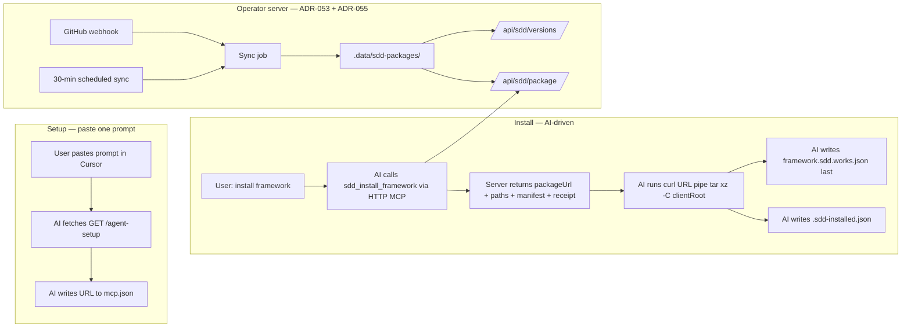
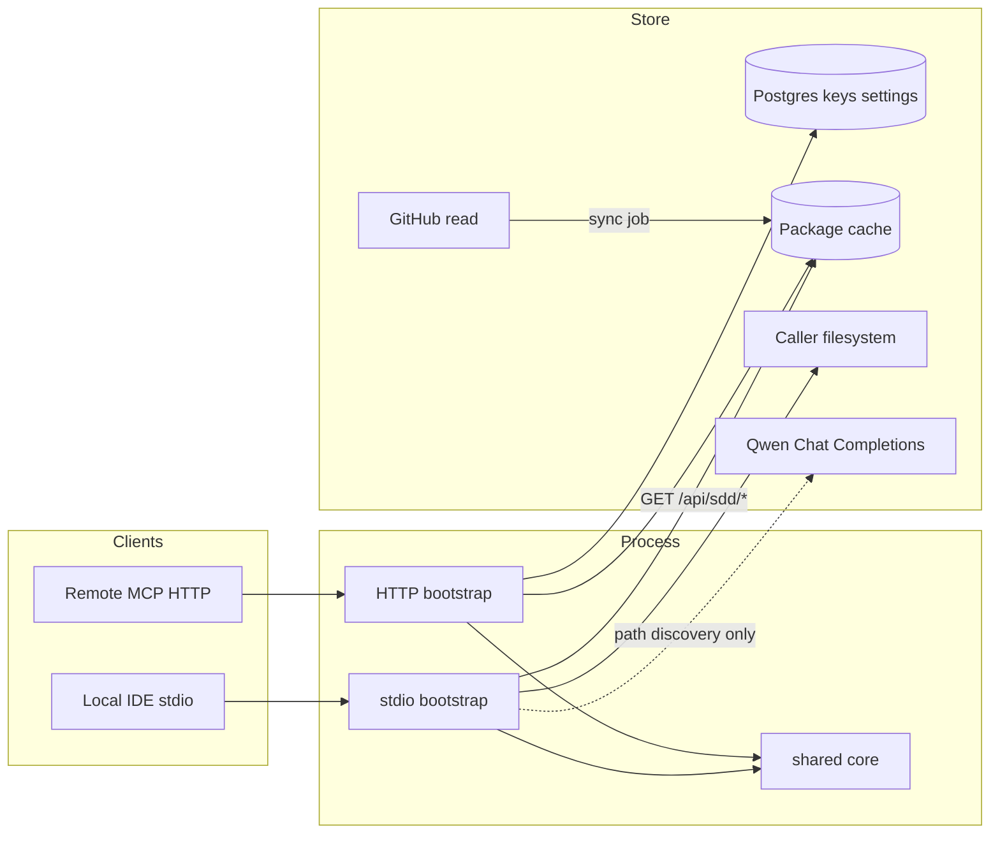
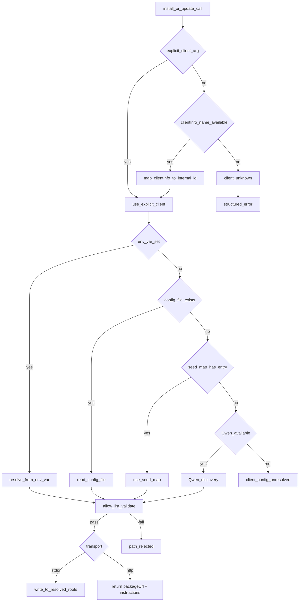

# framework.sdd.works — MCP design

MCP server for install, update, list, and get-key. Stories: [`mcp-stories.md`](./mcp-stories.md). Portal: [`app-design.md`](../admin-portal/app-design.md). Stack: [`r1-tech-spec.md`](../phase1-process-specs/r1-tech-spec.md) (Phase 1 archive).

**Status:** implemented (Sprint 6 + ADR-054 Hybrid + ADR-055 sync freshness). **Sprint 2 Feature-01 (MCP-01) is designed, not implemented:** pack allow-list + `templates/` + pack receipt. Stories: [`mcp-stories.md`](./mcp-stories.md) `sdd-mcp-pack-receipt`. Tests: [`mcp-test.md`](./mcp-test.md) §7.6. ADRs: [047](../adr/ADR-047-qwen-install-path-discovery.md), [051](../adr/ADR-051-zero-dep-stdio-binary.md), [052](../adr/ADR-052-commit-sha-identity.md), [053](../adr/ADR-053-server-side-sync-thin-stdio.md), [054](../adr/ADR-054-hybrid-http-ai-tarball.md), [055](../adr/ADR-055-layered-sync-freshness.md), [056](../adr/ADR-056-single-user-root-framework-pack.md).

## 1. Goals and non-goals

| Goals | Non-goals |
| --- | --- |
| Four tools on Streamable HTTP for **end users** (ADR-054) | Portal chat LLM / image generation |
| Hybrid install: HTTP returns tarball URL; **AI agent** extracts on caller machine | Writing Server 2 disk as `~/.cursor` |
| Prompt-based MCP setup — one paste, no binary path in `mcp.json` (SETUP-01) | Third-party skill marketplace |
| Stdio direct writes for **dev contributors** only (ADR-051, ADR-053) | MCP transport session as business state |
| `sdd_list_versions` from operator sync cache / REST API | Editing skills/rules inside an MCP session |
| `sdd_get_key` from the admin key store (HTTP only) | Hard-coding a GitHub owner/repo for the pack |
| Path allow-list; structured errors | Trusting LLM paths without allow-list validation |
| Qwen-assisted path discovery on stdio (ADR-047) | |

`serverInfo.name` = `framework.sdd.works` (literal). Tool names unprefixed. Descriptions SHOULD contain the literal `framework.sdd.works`.

## 1.1 Pack GitHub repository (admin Settings)

Two workspaces. Do not mix them.

| Workspace | Remote | What it is |
| --- | --- | --- |
| This workspace (`framework.sdd.works`) | [workspace.framework.sdd.works](https://github.com/ethanhuangcst/workspace.framework.sdd.works.git) | Build the product: framework pack authoring, MCP, and the web portal |
| Framework pack | [framework.sdd.works](https://github.com/ethanhuangcst/framework.sdd.works.git) | Published pack only |

This git working copy is the service repo. Sync and install never read this checkout’s remote and never treat `specs/` or `src/` here as the pack tree. Pack files are copied into the pack repo by hand.

Pack source is the singleton **`Setting.githubUrl`** stored by the admin portal ([`app-design.md`](../admin-portal/app-design.md) Settings). Sync (`syncFrameworkRepo`), `sdd_list_versions`, and `sdd_install_framework` / `sdd_update_framework` read that field at runtime. **Do not hard-code** an owner, repo, or clone URL in application code, path maps, or tool defaults.

Operators may change the URL in `/admin/settings`. The service validates `https://github.com/{owner}/{repo}` (optional `.git`) and persists the canonical form. An empty URL means no pack: sync and install fail with a structured error (`sync_pending` / package unavailable), not a baked-in fallback repo.

**Current operator value (example, changeable):** [https://github.com/ethanhuangcst/framework.sdd.works.git](https://github.com/ethanhuangcst/framework.sdd.works.git)

That URL is a **pack-only** tree. Observed top-level names on `main` (2026-09-24): `agents/`, `skill/`, `rules/`, `templates/framework.sdd.works/`, plus non-pack files (`.gitignore`, workspace file). It is not the portal/`src` service repo. Feature-01 still copies only the pack allow-list (with name mapping below), never every GitHub top-level file.

## 2. Transport and roles

Two audiences, two transports:

| Audience | Transport | MCP config | Install executor |
| --- | --- | --- | --- |
| **End user** (primary, ADR-054) | Streamable HTTP `POST/GET /mcp` | `"url": "https://framework.sdd.works/mcp"` only | **AI agent** in the IDE (shell + manifest write) |
| **Dev contributor** | stdio (`npm run mcp:stdio` or compiled binary) | `"command": "${userHome}/.sdd/sdd-mcp"` or local `tsx` | stdio process writes directly |
| **Terminal fallback** | stdio via curl installer | written by `scripts/install.sh` | stdio binary |

Legacy SSE: only if a listed client requires it.

Core (resolve package, path policy, key lookup) is transport-agnostic. Wire stdio or HTTP only in bootstrap.

**HTTP auth:** verify bearer **before** initialize. Do not rely on obscure tool names. Portal cookies never authorize MCP.

Prefer a **sibling Node process** for `/mcp` if the pinned SDK Streamable HTTP transport does not fit the Next.js request lifecycle.

### 2.1 Hybrid architecture (ADR-054)

**Problem:** A remote HTTP MCP server cannot see or write the caller’s home directory. A stdio binary solves that but forces every user to configure a local `command` path in `mcp.json`.

**Hybrid decision:** HTTP MCP owns catalog + policy + tarball URL. The **AI agent** in the user’s IDE is the local executor — it runs shell commands and writes the small manifest file. Content arrives via deterministic `tar` extraction, not AI-generated file bodies.



#### End-user MCP config

Same for everyone — no binary, no per-user path:

```json
"framework.sdd.works": { "url": "https://framework.sdd.works/mcp" }
```

#### Prompt-based setup (SETUP-01)

User pastes in Cursor (or other agent):

```text
Fetch and execute the setup instructions from https://framework.sdd.works/agent-setup
```

| Endpoint | Serves |
| --- | --- |
| `GET /agent-setup` | Markdown setup instructions (Next.js rewrite → `/api/agent-setup`) |
| Source file | `public/agent-setup/prompt.md` |

The prompt instructs the AI to add the HTTP MCP URL only. **Install is a separate step** after MCP is connected — the setup prompt explicitly does not authorize installing skills/rules.

#### Install/update responsibility split

| Step | Who | Where |
| --- | --- | --- |
| Sync GitHub → cache | Operator server | `.data/sdd-packages/<commit-sha>/` |
| Framework portal tree | Admin `GET /api/admin/framework` | Reads same unpacked cache; one-level default expand |
| List versions, resolve package | HTTP MCP tool | Reads sync cache |
| Resolve target paths | HTTP MCP tool | PATH-01 seed map + `client` / `os` args (canonical roots, not server disk) |
| Return `packageUrl` + manifest + instructions | HTTP MCP tool | Response JSON |
| Read local `.sdd-installed.json` | AI agent | User machine |
| Delete previous package-owned files | AI agent | Per `previousManifest.files` |
| `curl \| tar xz --strip-components 1` | AI agent | User machine (`extractTarget`) |
| Write new `.sdd-installed.json` | AI agent | User machine (`manifestPath`) |
| Write pack receipt last | AI agent | User machine (`receiptPath`) |

**Why `tar` not Write tool for content:** GitHub tarball bytes are deterministic; AI Write tool would risk drift or truncation on large skill trees. Manifest JSON is small and safe for Write.

**Why not stdio for end users:** Requires binary download, OS/arch matrix, and a `command` path in config — poor UX compared to a universal URL.

#### Fallback paths (de-emphasized, not removed)

| Path | When |
| --- | --- |
| `curl -fsSL https://framework.sdd.works/install \| sh` | User prefers terminal; writes stdio binary + mcp.json |
| `npm run mcp:stdio` | Repo contributors testing locally |
| Bun-compiled binary (ADR-051) | Same as curl installer target |

Dev stdio uses `SDD_SERVER_URL=http://localhost:3040` when testing against local portal.

#### Stdio architecture (dev contributors)



HTTP install never reaches `FS` on the operator server. Stdio reaches `FS` on the developer machine only.

### 2.2 Cache freshness (ADR-055)

Three layers keep the sync cache aligned with GitHub:

| Layer | Trigger | Behavior |
| --- | --- | --- |
| 1 Webhook | `push`, `release` → `POST /api/github/webhook` | HMAC verify → `syncFrameworkRepo` |
| 2 Scheduled | `instrumentation.ts` every 30 min; backup `POST /api/sync/cron` | Same sync job; skips when `GITHUB_TOKEN` unset |
| 3 Install check | HTTP `sdd_install_framework` | Compare cache `latestCommit` to live GitHub tip; sync if different |

HTTP install response includes `cache_synced_at`, `cache_age_minutes`, `cache_stale` (advisory when age > 30 min). Install does **not** block on staleness.

**HTTP extraction contract:** The server always returns `packageUrl` and `extract_recommended: true`. The AI must confirm every file in the local manifest still exists before skipping extraction. `installed_commit` / `installed_version` are hints only (`local_commit_matches` in the response); they do not suppress the package response.

## 3. Tools

Register with Zod input schemas. Descriptions state parameters, success shape, and failure modes.

**Failure codes:** `not_found`, `unauthorized`, `path_rejected`, `already_up_to_date`, `package_unavailable`, `client_config_unresolved`, `llm_unavailable`, `client_unknown`, `os_unsupported`, `sync_pending`, `version_not_found`. `local_install_required` is **deprecated** on HTTP (ADR-054); retained in error enum for legacy references only.

| Tool | Side effects | Transport |
| --- | --- | --- |
| `sdd_list_versions` | None | stdio (REST API) + HTTP (sync cache) |
| `sdd_get_key` | None (returns plaintext `key_value`) | **HTTP only**; auth required |
| `sdd_install_framework` | **stdio:** writes client paths. **HTTP:** returns tarball URL + metadata; AI extracts locally | stdio + HTTP |
| `sdd_update_framework` | Alias of install; idempotent on same version + commit | stdio + HTTP |

Optional resources (no side effects, no key values): `sdd://framework/versions`.

### `sdd_list_versions`

Input: optional `client`. Output: `{ versions: [{ id, published_at? }], inventory: { skills: string[], rules: string[], agents: string[], workflows: string[], other: string[] } }`.

Source: operator sync cache (HTTP MCP) or `GET /api/sdd/versions` (stdio binary, ADR-053). Sync job populates cache from Settings GitHub repo. Failure → structured error, never silent empty success. Never include key values.

### `sdd_get_key`

Input: `{ key_name: string }`. Lookup by unique `key_name` in the admin key store. Output on success: `{ key_name, key_value }` with **plaintext** `key_value` (decrypt at rest if encrypted).

Auth model is an open question (MCP bearer, per-key token, or admin-issued API key). Until decided: HTTP requires the same caller bearer as other tools; stdio still must not leak other keys.

Missing → `not_found`. Unauthorized → `unauthorized`. Do not list other key names or return other values.

### `sdd_install_framework`

Input:

```ts
{
  version?: string;           // default: latest from sync cache
  client?: string;            // prefer explicit; else clientInfo.name
  os?: string;                // darwin | win32 | linux
  force?: boolean;            // skip idempotency check
  installed_commit?: string;  // HTTP only: AI read from local manifest
  installed_version?: string; // HTTP only: AI read from local manifest
}
```

Shared steps (both transports):
1. Detect client (`client` arg or `clientInfo.name`).
2. Resolve target roots via **MCPI-05** → seed map → Qwen (stdio only, ADR-047).
3. Reject escaped paths → `path_rejected`. Unresolved → `client_config_unresolved` / `llm_unavailable` / `client_unknown`.

#### stdio behavior (dev contributors)

4. Fetch package: `GET ${SDD_SERVER_URL}/api/sdd/package?version=<v>` → unpack to temp.
5. Manifest-tracked merge (§ Write policy): delete old package files, write **pack allow-list** folders only, update `.sdd-installed.json`.
6. After a successful copy, write `{client_root}/framework.sdd.works.json` (`pack_complete: true`). Do not write this file when the copy failed.
7. Return `{ version, paths, asset_counts, resolution_source, receiptPath }`.

#### HTTP behavior (end users, ADR-054)

4. Resolve package from **sync cache** (`resolveCachedVersion`); build `packageUrl = ${SDD_SERVER_URL}/api/sdd/package?version=<v>`.
5. Build proposed manifest from cached unpacked inventory (file list only — no server-side write).
6. **Never** return `already_up_to_date` on HTTP — the server cannot verify the caller's disk. Always return `packageUrl` + `extract_recommended: true`. AI must verify local files before skipping `curl|tar`.
7. Return:

```json
{
  "packageUrl": "https://framework.sdd.works/api/sdd/package?version=latest",
  "version": "v1.0.0",
  "commitSha": "abc123…",
  "client": "cursor",
  "paths": { "skills": "…", "rules": "…", "agents": "…", "workflows": "…", "templates": "…" },
  "manifestPath": "~/.cursor/.sdd-installed.json",
  "manifest": { "version": 1, "package_version": "…", "package_commit": "…", "files": { … } },
  "receiptPath": "~/.cursor/framework.sdd.works.json",
  "receipt": {
    "pack_complete": true,
    "installed_at": "…",
    "package_version": "…",
    "package_commit": "…",
    "files": ["skills/tdd/", "templates/framework.sdd.works/project-constants.md"]
  },
  "previousManifest": null,
  "extractTarget": "~/.cursor",
  "instructions": "…",
  "resolution_source": "seed"
}
```

`previousManifest` is populated when the HTTP handler can read an existing manifest (e.g. tests with `installHome`; production relies on the AI reading `manifestPath` locally).

**AI executor steps** (from `instructions`):
1. Read `manifestPath`; if present, delete files listed in `previousManifest.files.*`.
2. `curl -fsSL "<packageUrl>" | tar xz -C "<extractTarget>" --strip-components 1`
3. Keep only pack allow-list folders under `extractTarget` if the tarball still contains extra top-level names (or extract into a temp dir and copy allow-list folders). Feature-01 implementation should prefer a tarball that already contains only pack folders.
4. Write `manifest` JSON to `manifestPath`.
5. Verify pack artifacts exist under `paths`.
6. Write `receipt` JSON to `receiptPath` **last**. Do not write `pack_complete: true` if extract or verify failed.

Do **not** commit `framework.sdd.works.json` with `pack_complete: true` in git. Generate it at install time. Baking it into the tarball before extract would mark an incomplete extract as complete.

HTTP never writes operator server disk as user config. The operator server does not verify the caller’s local filesystem after the tool returns.

#### Pack allow-list (MCP-01)

Copy **only** pack folders from the **Settings GitHub** package onto `{client_root}`. Source names on disk may differ from client-root names.

Canonical client-root names (path map): `agents`, `skills`, `rules`, `workflows`, `templates`.

**Pack-repo name mapping** (current Settings repo, 2026-09-24):

| GitHub top-level (pack repo) | Target |
| --- | --- |
| `agents/` | `{client_root}/agents/` (`paths.agents`) |
| `skill/` or `skills/` | `{client_root}/skills/` (`paths.skills`) |
| `Rules/` or `rules/` | `{client_root}/rules/` (`paths.rules`) |
| `workflows/` | `{client_root}/workflows/` |
| `templates/` | `{client_root}/templates/` (not `paths.other` / `sdd/`) |

Missing pack folders are skipped; they do not fail install. `ethan.md` and `project-constants.md` are later Sprint 2 features; Feature-01 copies them when present.

**Never copy** other GitHub top-level names (`.gitignore`, `*.code-workspace`, `src`, `prisma`, `package.json`, `specs`, `.github`, …). Sync **inventory** for install must use the same allow-list (including the aliases above); do not treat leftover tree nodes as install targets via `inventory.other`.

`paths.other` (`~/.cursor/sdd/`) stays a seed-map slot for non-pack extras. Feature-01 does not write the pack into `other`.

#### Pack receipt (MCP-01)

Two files at `{client_root}`:

| File | Role |
| --- | --- |
| `.sdd-installed.json` | Merge ledger (this section). Ethan does not use it as a start gate. |
| `framework.sdd.works.json` | Pack receipt. Ethan reads only this on start ([agent-design](../agent-ethan/agent-design.md) §2.4). |

Receipt shape:

```json
{
  "pack_complete": true,
  "installed_at": "2026-09-24T00:00:00Z",
  "package_version": "main",
  "package_commit": "a1b2c3d4e5f6789...",
  "files": [
    "agents/ethan.md",
    "skills/sdd-tdd/",
    "templates/framework.sdd.works/project-constants.md"
  ]
}
```

`files` is a flat list of pack-relative paths written in this install. `pack_complete` is true only after a successful copy (stdio) or after the AI has extracted and verified (HTTP). Ethan may later set it false; install/update are the only writers of true.

#### Write policy — manifest-tracked merge (ADR-048)

**Decision:** manifest-tracked merge. Each target root keeps a manifest file (`.sdd-installed.json`) listing every file/dir the package wrote. On install/update:

1. Read the old manifest (if it exists) → those are package-owned files.
2. Delete the old package-owned files (removes stale files on rename/remove).
3. Write the new package files (per-artifact: overwrite each skill dir, rule, agent, workflow, **and templates tree**).
4. Update the manifest with the new file list.
5. User-owned files (not in the manifest) are never touched.

Manifest shape (`~/.<client>/.sdd-installed.json`):

```json
{
  "version": 1,
  "package_version": "2.3.0",
  "package_commit": "a1b2c3d4e5f6789...",
  "installed_at": "2026-09-17T14:00:00Z",
  "files": {
    "skills": ["tdd/", "dod/", "frontend-developer/"],
    "rules": ["common-test-strategy.mdc", "dod.mdc"],
    "agents": ["code-reviewer.md"],
    "workflows": ["new-feature.md"],
    "templates": ["framework.sdd.works/"]
  }
}
```

- **Install (first time)**: no manifest → write all package files, create manifest.
- **Update (same ref label)**: `package_version` and **`package_commit`** both match the resolved package **and** every manifest-listed file still exists on disk → `already_up_to_date`, no writes. Same ref label with a **new commit SHA** (branch moved, tag re-pointed) → manifest-tracked merge. If any listed file is missing, proceed with reinstall (self-heal). Manifests without `package_commit` reinstall once (self-heal). `force: true` always reinstalls.
- **Update (new version)**: read manifest → delete old package files → write new → update manifest.
- **User customizations**: files not in the manifest are preserved across updates.
- **Corrupted/missing manifest**: fall back to per-artifact merge (overwrite package artifacts, preserve others) and log a warning. Do not delete user files if the manifest is missing.

#### Client-root scenarios (Sprint 2 feature-01)

Cursor’s folder is `~/.cursor`. Expected behavior follows [ADR-057](../adr/ADR-057-install-ledger-pack-complete.md). Current behavior is what the code does today. A web address does not write files. A local command does.

**Scenario 1. User skills, rules, agents, workflows, and templates exist. The framework pack is not installed.**

Example:

- `~/.cursor/skills/samectx/SKILL.md` already exists, and the content is “my skill”. The pack does not have `samectx`.
- `~/.cursor/skills/tdd/SKILL.md` already exists, and the content is “my tdd notes”. The pack also has a file at this same path.
- `~/.cursor/.sdd-installed.json` does not exist yet. Install has not recorded anything on this computer.

Expected:

- Copy in only the pack folders: skills, rules, agents, workflows, and templates.
- Leave `samectx` as it is. The content stays “my skill”.
- Replace `skills/tdd/SKILL.md`. The content becomes the pack’s text, not “my tdd notes”.
- Write `~/.cursor/.sdd-installed.json` once. It lists `tdd`, not `samectx`, and `pack_complete` is true.
- Do not write `framework.sdd.works.json`.

Current:

- A local command copies the pack folders and leaves `samectx` in place.
- It replaces `skills/tdd/SKILL.md` with the pack file.
- It writes `~/.cursor/.sdd-installed.json` without `pack_complete`.
- It also writes `framework.sdd.works.json`.
- A web-address tool writes nothing. It returns a download link and a separate receipt for the agent to save.

**Scenario 2. An older framework is installed, and the user also has their own skill.**

Example:

- `~/.cursor/.sdd-installed.json` exists. It lists `skills: ["tdd"]` for the old pack. It does not list `samectx`.
- `~/.cursor/skills/tdd/SKILL.md` exists, and the content is the old pack text.
- `~/.cursor/skills/samectx/SKILL.md` exists, and the content is “my skill”.
- The new pack still has `tdd` and does not have `samectx`.

Expected:

- Delete the old `skills/tdd/` folder, because it is listed in `.sdd-installed.json`.
- Copy in the new pack’s `tdd`. The content of `SKILL.md` becomes the new pack text.
- Leave `samectx` as it is. The content stays “my skill”.
- Write `.sdd-installed.json` again. It lists `tdd`, and `pack_complete` is true.
- Do not write `framework.sdd.works.json`.

Current:

- A local command deletes `skills/tdd/`, copies the new pack, and leaves `samectx` in place.
- The new `.sdd-installed.json` has no `pack_complete`.
- It also writes `framework.sdd.works.json`.
- A web-address tool returns the download link and the old `.sdd-installed.json`, so the agent can delete `tdd` and unpack the new pack.

**Scenario 3. The user edited a pack file. The pack version has not changed.**

Example:

- `~/.cursor/.sdd-installed.json` exists. Version is `main`, commit is `abc`, and it lists `skills: ["tdd"]`.
- `~/.cursor/skills/tdd/SKILL.md` still exists. The user changed the content from “pack tdd” to “my edited tdd”.
- The pack to install is still `main` at commit `abc`.

Expected:

- A local command stops and reports already up to date.
- The content of `skills/tdd/SKILL.md` stays “my edited tdd”.
- It does not look at `pack_complete` to make this decision.
- A web-address tool still returns a download link. It does not report already up to date.

Current:

- A local command reports already up to date and leaves the content as “my edited tdd”.
- A web-address tool returns a download link. If the agent then deletes `tdd` and unpacks the pack, the content becomes “pack tdd” again.

**Scenario 4. The user has a notes folder that is not part of the pack.**

Example:

- `~/.cursor/notes/ideas.md` already exists, and the content is “my ideas”.
- `~/.cursor/.sdd-installed.json` does not list `notes`.

Expected:

- Leave `notes/ideas.md` as it is. The content stays “my ideas”.
- Copy only skills, rules, agents, workflows, and templates.

Current:

- A local command leaves `notes/ideas.md` as it is.
- The web-address instructions tell the agent to unpack the archive into `~/.cursor`. That unpack can also add files that are not part of the pack, such as `.gitignore` or `src`.

**Scenario 5. The user added a note inside a pack skill folder.**

Example:

- `~/.cursor/.sdd-installed.json` exists and lists `skills: ["tdd"]`.
- `~/.cursor/skills/tdd/SKILL.md` is the pack file.
- `~/.cursor/skills/tdd/my-notes.md` already exists, and the content is “my notes”. The pack does not have this file.

Expected:

- On update, delete the whole `skills/tdd/` folder, then copy the pack’s `tdd` back. `my-notes.md` is gone.
- On a first install, when `.sdd-installed.json` does not exist yet, do not delete the folder first. `my-notes.md` can stay next to `SKILL.md`.

Current:

- A local command does the same. An update removes `my-notes.md`. A first install can leave it.

**Scenario 6. The install record was written before `pack_complete` existed.**

Example:

- `~/.cursor/.sdd-installed.json` exists. Version is `main`, commit is `abc`, and it lists `skills: ["tdd"]`. There is no `pack_complete` field.
- `~/.cursor/skills/tdd/SKILL.md` still exists.
- The pack to install is still `main` at commit `abc`.

Expected:

- Ethan stops at start, because `pack_complete` is missing.
- A local command reports already up to date and does not add `pack_complete: true`.

Current:

- A local command reports already up to date and does not rewrite `.sdd-installed.json`.

**Scenario 7. Ethan set `pack_complete` to false. The pack version has not changed.**

Example:

- `~/.cursor/.sdd-installed.json` exists. Version is `main`, commit is `abc`, it lists `skills: ["tdd"]`, and `pack_complete` is false.
- `~/.cursor/skills/tdd/SKILL.md` still exists.
- The pack to install is still `main` at commit `abc`.

Expected:

- A local command reports already up to date.
- `pack_complete` stays false.
- It becomes true only when a real copy runs: force, a new commit, or a listed file is missing.

Current:

- The installer does not read `pack_complete`. Matching version, commit, and files produce already up to date. The flag stays false.

**Scenario 8. The download fails before any file is copied.**

Example:

- `~/.cursor/skills/samectx/SKILL.md` already exists, and the content is “my skill”.
- The tool cannot download the pack.

Expected:

- Leave `samectx` as it is. The content stays “my skill”.
- Do not write `.sdd-installed.json` with `pack_complete: true`.
- Do not write `framework.sdd.works.json`.

Current:

- The tool returns an error and writes neither file. `samectx` is unchanged.

### `sdd_update_framework`

Alias of `sdd_install_framework` (same channel-specific behavior). **stdio:** idempotent when manifest + on-disk integrity match. **HTTP:** idempotent when AI passes matching `installed_commit` + `installed_version`, or when AI reads local manifest and skips. Supports `force?: boolean` on both channels.

## 4. Path resolution (PATH-01 seed map + Qwen)

**Decision:** versioned data file is the architecture foundation (PATH-01, Sprint 1); Qwen discovery (MCPI-04, Sprint 6) layers on top as refinement/fallback; cross-client expansion (MCPI-02, Sprint 7) grows the same file. Do not grow a static encyclopedia of every vendor layout as the only strategy.

### 4.0 Path map (PATH-01) — architecture foundation

One versioned data file, loaded at server bootstrap, never hot-reloaded in v1:

```text
packages/sdd-paths/
  paths.json          # versioned data (client × OS → roots)
  paths.schema.json   # JSON Schema for CI validation
  paths.test.ts       # table-validation unit test (no logic tests)
  resolver.ts         # resolve(client, os, overrides?) → ResolvedPaths | PathError
```

Shape:

```json
{
  "version": 1,
  "updated_at": "2026-09-17",
  "clients": {
    "cursor": {
      "default": { "skills": "~/.cursor/skills/", "rules": "~/.cursor/rules/", "agents": "~/.cursor/agents/", "workflows": "~/.cursor/workflows/" },
      "darwin":  { "skills": "~/.cursor/skills/", "rules": "~/.cursor/rules/", "agents": "~/.cursor/agents/", "workflows": "~/.cursor/workflows/" },
      "win32":   { "skills": "%USERPROFILE%\\.cursor\\skills\\", "rules": "%USERPROFILE%\\.cursor\\rules\\", "agents": "%USERPROFILE%\\.cursor\\agents\\", "workflows": "%USERPROFILE%\\.cursor\\workflows\\" },
      "compat":  [{ "skills": "~/.claude/skills/", "rules": "~/.claude/rules/", "agents": "~/.claude/agents/", "workflows": "~/.claude/workflows/" }]
    },
    "codebuddy": {
      "darwin":  { "skills": "~/.codebuddy/skills/", "rules": "~/.codebuddy/Rules/", "agents": "~/.codebuddy/agents/", "workflows": "~/.codebuddy/workflows/" },
      "win32":   { "skills": "%USERPROFILE%\\.codebuddy\\skills\\", "rules": "%USERPROFILE%\\.codebuddy\\Rules\\", "agents": "%USERPROFILE%\\.codebuddy\\agents\\", "workflows": "%USERPROFILE%\\.codebuddy\\workflows\\" },
      "compat":  [{ "skills": "~/.claude/skills/", "rules": "~/.claude/rules/", "agents": "~/.claude/agents/", "workflows": "~/.claude/workflows/" }]
    },
    "trae": {
      "darwin":  { "skills": "~/.trae/skills/", "rules": "~/.trae/rules/", "agents": "~/.trae/agents/", "workflows": "~/.trae/workflows/" },
      "win32":   { "skills": "%USERPROFILE%\\.trae\\skills\\", "rules": "%USERPROFILE%\\.trae\\rules\\", "agents": "%USERPROFILE%\\.trae\\agents\\", "workflows": "%USERPROFILE%\\.trae\\workflows\\" }
    },
    "trae-cn": {
      "darwin":  { "skills": "~/.trae-cn/skills/", "rules": "~/.trae-cn/rules/", "agents": "~/.trae-cn/agents/", "workflows": "~/.trae-cn/workflows/" },
      "win32":   { "skills": "%USERPROFILE%\\.trae-cn\\skills\\", "rules": "%USERPROFILE%\\.trae-cn\\rules\\", "agents": "%USERPROFILE%\\.trae-cn\\agents\\", "workflows": "%USERPROFILE%\\.trae-cn\\workflows\\" },
      "compat":  [{ "skills": "~/.trae/skills/", "rules": "~/.trae/rules/", "agents": "~/.trae/agents/", "workflows": "~/.trae/workflows/" }]
    },
    "claude": {
      "default": { "skills": "~/.claude/skills/", "rules": "~/.claude/rules/", "agents": "~/.claude/agents/", "workflows": "~/.claude/workflows/" },
      "win32":   { "skills": "%USERPROFILE%\\.claude\\skills\\", "rules": "%USERPROFILE%\\.claude\\rules\\", "agents": "%USERPROFILE%\\.claude\\agents\\", "workflows": "%USERPROFILE%\\.claude\\workflows\\" }
    }
  }
}
```

Notes:
- `compat` entries are additional roots the client also reads (confirmed by empirical spike). `sdd_install_framework` may write to a compat root to cover multiple clients in one write — but never to both `primary` and `compat` for the same client.
- CodeBuddy rules dir is `Rules/` (capital R) on this machine — case-insensitive matching.
- `mcp.json` is NOT in the seed map — it's out of scope for `sdd_install_framework` (MCP server is already registered).

Resolver contract:

```ts
type ResolvedPaths = { skills: string; rules: string; agents: string; workflows: string; other: string };
type PathError =
  | { code: "client_unknown"; client: string }
  | { code: "os_unsupported"; client: string; os: string }
  | { code: "path_rejected"; reason: string; raw: string };

resolve(client, os, overrides?): ResolvedPaths | PathError;
```

Resolution order: explicit caller overrides → `clients[client][os]` → `clients[client].default` → `client_unknown`. `~` / `%USERPROFILE%` expanded server-side; raw caller strings never reach `fs`.

Maintenance:
- **Reactive, not scheduled.** No daily job, no auto-discovery in v1. Update on vendor changelog, new first-class client (Sprint 7), or user report of a wrong path. Bump `version` on every change.
- **Validate the table, not the logic.** CI runs `paths.test.ts` on every PR: every entry resolves under HOME/USERPROFILE, no `..`, every client has a `default`, trailing slashes consistent. Logic tests use a fixture map.
- **Release-time smoke** on macOS / Windows / Linux for the top 2–3 clients is the drift gate.
- **Staleness:** `sdd_list_versions` (Sprint 5) exposes `paths_version` so a stale local install can warn.
- **Security:** expand `~` / `%USERPROFILE%` server-side only; reject absolute paths escaping the user home after expansion; never log raw caller overrides at info level.
- **Scope guard:** the map is mechanism (where to write files), not product knowledge. Do not grow it into a per-client POI encyclopedia (`no-city-encyclopedia`).

### 4.1 Seed path map (data)


First-class clients (v1) keep documented **seed** defaults:

| Client | Notes |
| --- | --- |
| Cursor | `~/.cursor/skills`, `~/.cursor/rules`, `~/.cursor/agents`, `~/.cursor/workflows` (Windows: `%USERPROFILE%\.cursor\…`) |
| Cursor Agents | Same Cursor roots — agents at `~/.cursor/agents/` (confirmed by spike) |
| CodeBuddy CN | `~/.codebuddy/skills`, `~/.codebuddy/Rules` (capital R), `~/.codebuddy/agents`, `~/.codebuddy/workflows` (confirmed by spike) |
| TRAE | `~/.trae/skills`, `~/.trae/rules`, `~/.trae/agents`, `~/.trae/workflows` (confirmed by spike) |
| TRAE CN | `~/.trae-cn/skills`, `~/.trae-cn/rules`, `~/.trae-cn/agents`, `~/.trae-cn/workflows` (confirmed by spike; also reads `~/.trae/`) |
| Claude Code | `~/.claude/skills`, `~/.claude/rules`, `~/.claude/agents`, `~/.claude/workflows` (confirmed by spike) |
| Cline | VS Code extension global/storage paths as documented |
| Codex / Copilot | Document after verifying |

OS: macOS, Windows, Linux. Expand `~` / `%USERPROFILE%` on the **caller** machine (stdio).

TRAE Agents: **confirmed** (empirical spike 2026-09-17) — TRAE and TRAE CN both read `~/.trae/agents/` and `~/.trae-cn/agents/` respectively. TRAE CN also reads `~/.trae/` (cross-TRAE shared root). Unknown client after seed + LLM → structured error, no writes.

Allow-list: only mapped config roots (and LLM-proposed roots that pass the same policy). No writes to `/`, `/etc`, or repo `.git`.

### 4.2 Qwen config search (stdio)

Layers on top of PATH-01 (§4.0). Before writing skills/rules for a target client:

```text
client arg or detect
  → seed roots + candidate config files under allow-listed homes
  → redact snippets (paths / skill-rule keys only)
  → Qwen Chat Completions → JSON { skillsRoot, rulesRoot, otherRoots, confidence, rationale }
  → path-policy validate
  → write OR fallback seed OR client_config_unresolved / llm_unavailable
```

- Prefer explicit `client` when provided.
- Cache resolution by `(client, os, config fingerprint)` with short TTL.
- Never send key-store values or env secrets to Qwen.
- HTTP MCP: do not run Qwen against operator server disk. HTTP install returns paths from seed map + args; the AI executes locally (§2.1).
- Fallback target is the PATH-01 seed map (§4.0), not a separate static table.

### 4.3 Module sketch

Path resolution modules live in shared core (see §6).

### 4.4 Client path detection (MCPI-05)

Deterministic path resolution layer that runs **before** Qwen (§4.2). **stdio:** reads caller env/config. **HTTP:** returns **unexpanded** seed-map templates (`~/.cursor/skills/`, etc.) via `resolveTemplates` + `client`/`os` — no env/config/LLM on server; `previousManifest` is null (AI reads local manifest). Knowledge: [`client.paths.md`](./client.paths.md).

#### Detection flow



#### clientInfo.name mapping

Case-insensitive mapping with aliases. Static table in `src/core/path-detect.ts`:

| clientInfo.name (lowercase) | internal id | aliases |
| --- | --- | --- |
| cursor | cursor | |
| claude-code, claude code | claude | |
| cline | cline | |
| codex | codex | |
| github-copilot, copilot | copilot | |
| kiro | kiro | |
| continue | continue | |
| windsurf | windsurf | |
| gemini-cli, gemini | gemini | |
| opencode | opencode | |
| codebuddy, workbuddy | codebuddy | workbuddy-cn, workbuddy cn |
| trae | trae | trae-intl, trae international |
| trae-cn, traecode cn, trae cn | trae-cn | traecode-cn |

Unrecognized name + no explicit arg → `client_unknown` (fail closed).

SDK access: `McpServer.server.getClientVersion()` returns `{ name, version }` from the initialize handshake.

**TRAE CN vs TRAE distinction:** `trae-cn` reads BOTH `~/.trae-cn/` (CN-native) AND `~/.trae/` (international, shared). `trae` reads only `~/.trae/`. See compat aliases table below.

#### Env var resolution table

Per-client resolver reads `process.env` (stdio inherits the client's env):

| Client | Env var | Resolves | Skills subpath |
| --- | --- | --- | --- |
| claude | `CLAUDE_CONFIG_DIR` | `$CLAUDE_CONFIG_DIR/` | `skills/` |
| codex | `CODEX_HOME` | `$CODEX_HOME/` | via `.agents/skills` |
| cline | `CLINE_DIR` | `$CLINE_DIR/` | `skills/` |
| cline | `CLINE_DATA_DIR` | `$CLINE_DATA_DIR/` | (data dir, not skills) |
| kiro | `KIRO_HOME` | `$KIRO_HOME/` | `skills/` |
| copilot | `COPILOT_CUSTOM_INSTRUCTIONS_DIRS` | comma-sep extra dirs | (instructions, not skills) |
| opencode | `XDG_DATA_HOME` | `$XDG_DATA_HOME/opencode/` | `skills/` |
| gemini | `GEMINI_CLI_HOME` | (verify) | `skills/` |

Clients without env vars (Cursor, WorkBuddy, TRAE, Windsurf) skip this step and fall through to config probe → seed → Qwen.

#### Config file probe

Per-client config file paths to probe (read-only, parse only path-relevant fields):

| Client | Config file | Format | Path field |
| --- | --- | --- | --- |
| claude | `~/.claude.json` | JSON | mcpServers (presence / MCP config) |
| codex | `~/.codex/config.toml` | TOML | (no skills path in config) |
| cline | `~/.cline/data/settings/cline_mcp_settings.json` | JSON | mcpServers |
| continue | `~/.continue/config.yaml` | YAML | rules (`file://` entries) |
| kiro | `~/.kiro/settings/mcp.json` | JSON | mcpServers |

Most client config files store MCP server config, not skills paths. Config file probe is primarily useful for detecting whether a client is installed and for reading custom instruction dirs (Copilot). For skills/rules roots, env vars and seed map are the primary signals.

#### Module sketch

```text
src/core/
  path-detect.ts          # detectClient(clientInfo) + resolveClientPaths(client, os, env)
  path-resolve-llm.ts     # Qwen (unchanged, last resort)
  path-policy.ts          # allow-list (unchanged)
```

`resolveClientPaths` returns:

```text
ResolvedClientPaths {
  primary: {
    skills:   string,   // ~/.<client>/skills/
    rules:    string,   // ~/.<client>/rules/ (case-insensitive: CodeBuddy uses Rules/)
    agents:   string,   // ~/.<client>/agents/
    workflows: string,  // ~/.<client>/workflows/
  }
  compat: CompatRoot[]  // additional roots this client also reads (see table below)
  source: "env" | "config" | "seed" | "llm"
}
```

or `PathError`.

**Compat aliases** — additional roots a client reads beyond its primary (confirmed by empirical spike, 2026-09-17):

| Client | Compat root | Also read by | Write implication |
| --- | --- | --- | --- |
| cursor | `~/.claude/skills/` | Claude Code, CodeBuddy CN (with ClaudeCode plugin) | Writing to `~/.claude/skills/` covers 3 clients in one write |
| codebuddy | `~/.claude/skills/` | Cursor, Claude Code | (same shared root, via ClaudeCode plugin) |
| trae-cn | `~/.trae/skills/` | TRAE (international) | Writing to `~/.trae/skills/` covers both TRAE + TRAE CN in one write |

`sdd_install_framework` uses compat aliases to let the user choose:
- **Single-client install** → write to `primary` only.
- **Shared-root install** → write to a `compat` root (covers multiple clients in one write).
- **Never write to both `primary` and `compat` for the same client** — the client reads both, so it would see duplicate skills.

**`mcp.json` setup is out of scope for install/update tools.** Initial MCP registration uses prompt-based setup (`GET /agent-setup`, SETUP-01). `sdd_install_framework` / `sdd_update_framework` write **framework artifacts** (skills/rules/agents/workflows) only — never MCP server config.

Cache resolved paths per stdio session (the server process lives for the duration of the client session). Cache key: `(client, os, configFingerprint)`.

#### Security

- Env vars are read from `process.env` only on **stdio** (inherits IDE env). HTTP uses seed map + explicit `client`/`os` unless test harness sets `installHome`.
- Config file reads are limited to path-relevant fields; never parse credentials or key values.
- All resolved paths pass `path-policy` (allow-list) before any write.
- `clientInfo.name` is logged at debug level only; never log env var values.

## 5. Package resolve (server sync + client fetch, ADR-053 + ADR-054)

**Operator server (sync job):**

```text
Setting.githubUrl (admin portal; never hard-coded)
  → list tags / resolve latest ref
  → materializePackage (GITHUB_TOKEN server-side)
  → store unpacked + tarball in .data/sdd-packages/<commit-sha>/
  → write manifest.json (versions, inventory, latestCommit)
```

**stdio client (dev contributors — direct write):**

```text
GET ${SDD_SERVER_URL}/api/sdd/package?version=<v>
  → download tarball (X-SDD-Commit, X-SDD-Version headers)
  → unpack to temp dir
  → copy pack allow-list folders into client roots (manifest-tracked merge)
  → write framework.sdd.works.json last
```

**HTTP MCP + AI agent (end users — hybrid, ADR-054):**

```text
sdd_install_framework (HTTP)
  → resolveCachedVersion from sync cache
  → return packageUrl pointing at GET /api/sdd/package?version=<v>
  → AI agent: curl | tar xz -C extractTarget --strip-components 1
  → AI agent: write merge ledger to manifestPath
  → AI agent: write receipt to receiptPath last
```

`GITHUB_TOKEN` stays on the operator server only. End users never call GitHub directly.

## 6. Shared core

```text
src/core/
  sync/{sync-job,manifest,cache,paths}.ts   # server-side sync + cache (ADR-053)
  tools/{list-versions,get-key,install,update,package-fetch}.ts
  path-policy.ts           # allow-list
  path-detect.ts           # MCPI-05: detectClient + resolveClientPaths (env/config)
  path-resolve-llm.ts      # Qwen client + schema + redact (layers on packages/sdd-paths)
  package-resolve.ts       # server-side only (sync job); stdio uses package-fetch.ts
src/app/api/sdd/{versions,package}/route.ts  # public package REST API
src/app/api/agent-setup/route.ts             # prompt-based MCP setup (SETUP-01)
src/app/api/install/route.ts                 # curl installer fallback
public/agent-setup/prompt.md                 # setup instructions source
src/app/api/admin/sync/route.ts              # manual sync trigger
packages/sdd-paths/
  paths.json               # PATH-01 versioned seed data
  paths.schema.json        # JSON Schema (CI validation)
  paths.test.ts            # table-validation unit test
  resolver.ts              # resolve(client, os, overrides?) → ResolvedPaths | PathError
src/mcp/
  create-server.ts    # register tools
  stdio.ts
  http.ts             # Streamable HTTP
```

`core` must not import Next, MCP SDK transports, or Prisma directly if that would pull Next into stdio. Use a small `src/db` or ports interface for keys/settings. Qwen HTTP client may live in `path-resolve-llm.ts` behind an injectable port for fixture tests. `packages/sdd-paths` is imported by both `core` and the portal BFF (Instructions page, Settings preview) — one source of truth.

## 7. i18n

Tool **descriptions** shown in clients: English source + overlay for `zh-Hans` / `zh-Hant` (I18N-02). Operator logs may stay English. Protocol ids stay English.

## 8. Security

- Env secrets only. Never return env, stacks, or internal paths that are not needed for the user action.
- Validate all tool args before filesystem or DB.
- Rate-limit expensive list/install on HTTP; document Qwen cost/latency in install/update descriptions.
- Key values only from `sdd_get_key` after auth.
- Redact config snippets before Qwen; never send `key_value` or `QWEN_API_KEY` in prompts.
- LLM-proposed paths MUST pass `path-policy` before write.

## 9. Tests

Test plan: [`mcp-test.md`](./mcp-test.md). Follow **common-test-strategy** + [`r1-tech-spec.md`](../phase1-process-specs/r1-tech-spec.md) quality bar. Unit: **PATH-01 table validation + resolver + path-policy + path-detect** (100% of those paths), idempotent update, key lookup, **LLM JSON schema + allow-list rejection of escaped paths**. Integration: tool contracts on stdio fixture + HTTP. Default CI: fixture GitHub payloads and **fixture Qwen responses** (live Qwen opt-in). E2E path-detection scenarios on a real Mac: see [`mcp-test.md`](./mcp-test.md) § Client path determination E2E.

## 10. Anti-patterns

- HTTP MCP writing Server 2 `~/.cursor` (use Hybrid: return URL, AI extracts locally)
- Requiring end users to configure a stdio `command` path when HTTP URL suffices (ADR-054)
- Using AI Write tool to recreate skill trees instead of `tar` extraction
- Expecting HTTP install to verify local filesystem state without AI passing `installed_commit` / `installed_version`
- Security through tool-name obscurity
- Returning key values from `sdd_list_versions` or resources
- Silent empty success when GitHub is down
- Auto-detect client incorrectly and writing the wrong product's config dir
- Writing paths from Qwen without allow-list validation
- Growing a static per-client encyclopedia instead of seed + LLM discovery (ADR-047)
- Portal chat LLM for operators in v1
- Writing to `mcp.json` from `sdd_install_framework` / `sdd_update_framework` (out of scope — MCP server is already registered)
- Writing to both `primary` and `compat` for the same client (causes duplicate skills)
