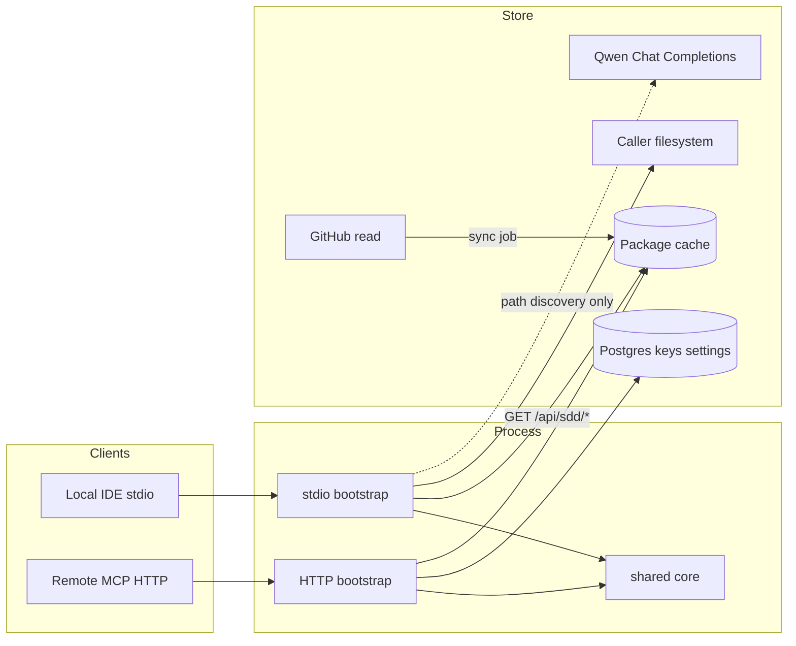
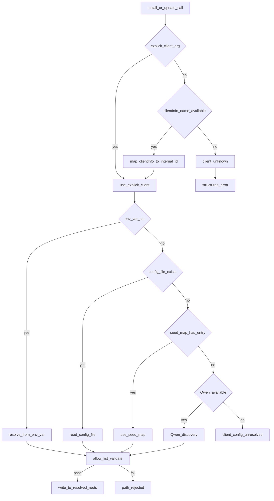

# framework.sdd.works — MCP design

MCP server for install, update, list, and get-key. Stories: [`mcp-stories.md`](./mcp-stories.md). Portal: [`app-design.md`](../admin-portal/app-design.md). Stack: [`tech-spec.md`](../tech-spec.md).

**Status:** draft. Pin `@modelcontextprotocol/sdk` and verify `tool` / `registerTool` against that release before coding.

## 1. Goals and non-goals

| Goals | Non-goals |
| --- | --- |
| Four tools, same core on stdio and Streamable HTTP | Portal chat LLM / image generation |
| Install/update skills, rules, other folders on the **caller** machine | Writing Server 2 disk as `~/.cursor` |
| `sdd_list_versions` from Settings-linked GitHub / releases | Third-party skill marketplace |
| `sdd_get_key` from the admin key store | MCP transport session as business state |
| Path allow-list; structured errors | Editing skills/rules inside an MCP session |
| Qwen-assisted client-config path discovery (stdio, ADR-047) | Trusting LLM paths without allow-list validation |

`serverInfo.name` = `framework.sdd.works` (literal). Tool names unprefixed. Descriptions SHOULD contain the literal `framework.sdd.works`.

## 2. Transport

```text
Local desktop?  → stdio entry (developer machine)
Remote client?  → Streamable HTTP POST/GET /mcp
Legacy SSE?     → only if a listed client requires it
```

Core (resolve package, path policy, key lookup) is transport-agnostic. Wire stdio or HTTP only in bootstrap.



**HTTP auth:** verify bearer **before** initialize. Do not rely on obscure tool names. Portal cookies never authorize MCP.

**HTTP install (ADR-054):** the hosted process cannot write the caller’s home directory. `sdd_install_framework` / `sdd_update_framework` return `{ packageUrl, paths, manifest, instructions }` for AI shell extraction (`curl | tar`). They must not write server disk as user config roots. Stdio (dev contributors) still writes locally.

Prefer a **sibling Node process** for `/mcp` if the pinned SDK Streamable HTTP transport does not fit the Next.js request lifecycle.

**Distribution (ADR-054, primary):** end users paste one setup prompt; the AI fetches `GET /agent-setup` (rewrites to `/api/agent-setup`) and adds `"url": "https://framework.sdd.works/mcp"` to MCP config — no binary, no path. Install/update: AI calls HTTP MCP tools, downloads tarball from `/api/sdd/package`, extracts locally, writes `.sdd-installed.json`.

**Distribution (stdio, dev contributors, ADR-051 + ADR-053):** stdio entry packaged via `bun build --compile` for contributors. Fallback **curl installer** (`curl -fsSL https://framework.sdd.works/install | sh`) remains for terminal users. Dev: `npm run mcp:stdio` with `SDD_SERVER_URL=http://localhost:3040`.

## 3. Tools

Register with Zod input schemas. Descriptions state parameters, success shape, and failure modes (`not_found`, `unauthorized`, `path_rejected`, `already_up_to_date`, `local_install_required`, `package_unavailable`, `client_config_unresolved`, `llm_unavailable`).

| Tool | Side effects | Transport |
| --- | --- | --- |
| `sdd_list_versions` | None | stdio (REST API) + HTTP (sync cache) |
| `sdd_get_key` | None (returns plaintext `key_value`) | **HTTP only**; auth required |
| `sdd_install_framework` | Writes client skill/rule paths (stdio) or returns tarball URL + instructions (HTTP, ADR-054) | stdio + HTTP |
| `sdd_update_framework` | Same as install; idempotent on same version | same as install |

Optional resources (no side effects, no key values): `sdd://framework/versions`.

### `sdd_list_versions`

Input: optional `client`. Output: `{ versions: [{ id, published_at? }], inventory: { skills: string[], rules: string[], agents: string[], workflows: string[], other: string[] } }`.

Source: operator sync cache (HTTP MCP) or `GET /api/sdd/versions` (stdio binary, ADR-053). Sync job populates cache from Settings GitHub repo. Failure → structured error, never silent empty success. Never include key values.

### `sdd_get_key`

Input: `{ key_name: string }`. Lookup by unique `key_name` in the admin key store. Output on success: `{ key_name, key_value }` with **plaintext** `key_value` (decrypt at rest if encrypted).

Auth model is an open question (MCP bearer, per-key token, or admin-issued API key). Until decided: HTTP requires the same caller bearer as other tools; stdio still must not leak other keys.

Missing → `not_found`. Unauthorized → `unauthorized`. Do not list other key names or return other values.

### `sdd_install_framework`

Input: `{ version?: string, client?: string, os?: string, force?: boolean }`. Missing version → latest from list. Client: explicit argument in v1 if auto-detect is unresolved. `force: true` skips the version match check and always reinstalls.

Behavior:
1. Resolve package artifact for version.
2. Resolve target roots: **MCPI-05** deterministic detection (env vars + config files) → seed path map + Qwen search of redacted local client config (stdio only; ADR-047 / MCPI-04). Prefer explicit `client`; else `clientInfo.name`.
3. Reject if any target is outside allow-list or contains `..` → `path_rejected`. Unresolved → `client_config_unresolved` / `llm_unavailable` / `client_unknown`.
4. Write skills (each with `SKILL.md`), rules, agents, workflows.
5. Return `{ version, paths, asset_counts, resolution_source: "env" | "config" | "seed" | "llm" }`.

#### Write policy — manifest-tracked merge (ADR-048)

**Decision:** manifest-tracked merge. Each target root keeps a manifest file (`.sdd-installed.json`) listing every file/dir the package wrote. On install/update:

1. Read the old manifest (if it exists) → those are package-owned files.
2. Delete the old package-owned files (removes stale files on rename/remove).
3. Write the new package files (per-artifact: overwrite each skill dir, rule, agent, workflow).
4. Update the manifest with the new file list.
5. User-owned files (not in the manifest) are never touched.

Manifest shape (`~/.<client>/.sdd-installed.json`):

```json
{
  "version": 1,
  "package_version": "2.3.0",
  "package_commit": "a1b2c3d4e5f6789...",
  "installed_at": "2026-09-17T14:00:00Z",
  "files": {
    "skills": ["tdd/", "dod/", "frontend-developer/"],
    "rules": ["common-test-strategy.mdc", "dod.mdc"],
    "agents": ["code-reviewer.md"],
    "workflows": ["new-feature.md"]
  }
}
```

- **Install (first time)**: no manifest → write all package files, create manifest.
- **Update (same ref label)**: `package_version` and **`package_commit`** both match the resolved package **and** every manifest-listed file still exists on disk → `already_up_to_date`, no writes. Same ref label with a **new commit SHA** (branch moved, tag re-pointed) → manifest-tracked merge. If any listed file is missing, proceed with reinstall (self-heal). Manifests without `package_commit` reinstall once (self-heal). `force: true` always reinstalls.
- **Update (new version)**: read manifest → delete old package files → write new → update manifest.
- **User customizations**: files not in the manifest are preserved across updates.
- **Corrupted/missing manifest**: fall back to per-artifact merge (overwrite package artifacts, preserve others) and log a warning. Do not delete user files if the manifest is missing.

### `sdd_update_framework`

Same path policy as install. If `package_version`, `package_commit`, and on-disk integrity all match → `already_up_to_date` without needless rewrite. Supports `force?: boolean` like install.

## 4. Path resolution (PATH-01 seed map + Qwen)

**Decision:** versioned data file is the architecture foundation (PATH-01, Sprint 1); Qwen discovery (MCPI-04, Sprint 6) layers on top as refinement/fallback; cross-client expansion (MCPI-02, Sprint 7) grows the same file. Do not grow a static encyclopedia of every vendor layout as the only strategy.

### 4.0 Path map (PATH-01) — architecture foundation

One versioned data file, loaded at server bootstrap, never hot-reloaded in v1:

```text
packages/sdd-paths/
  paths.json          # versioned data (client × OS → roots)
  paths.schema.json   # JSON Schema for CI validation
  paths.test.ts       # table-validation unit test (no logic tests)
  resolver.ts         # resolve(client, os, overrides?) → ResolvedPaths | PathError
```

Shape:

```json
{
  "version": 1,
  "updated_at": "2026-09-17",
  "clients": {
    "cursor": {
      "default": { "skills": "~/.cursor/skills/", "rules": "~/.cursor/rules/", "agents": "~/.cursor/agents/", "workflows": "~/.cursor/workflows/" },
      "darwin":  { "skills": "~/.cursor/skills/", "rules": "~/.cursor/rules/", "agents": "~/.cursor/agents/", "workflows": "~/.cursor/workflows/" },
      "win32":   { "skills": "%USERPROFILE%\\.cursor\\skills\\", "rules": "%USERPROFILE%\\.cursor\\rules\\", "agents": "%USERPROFILE%\\.cursor\\agents\\", "workflows": "%USERPROFILE%\\.cursor\\workflows\\" },
      "compat":  [{ "skills": "~/.claude/skills/", "rules": "~/.claude/rules/", "agents": "~/.claude/agents/", "workflows": "~/.claude/workflows/" }]
    },
    "codebuddy": {
      "darwin":  { "skills": "~/.codebuddy/skills/", "rules": "~/.codebuddy/Rules/", "agents": "~/.codebuddy/agents/", "workflows": "~/.codebuddy/workflows/" },
      "win32":   { "skills": "%USERPROFILE%\\.codebuddy\\skills\\", "rules": "%USERPROFILE%\\.codebuddy\\Rules\\", "agents": "%USERPROFILE%\\.codebuddy\\agents\\", "workflows": "%USERPROFILE%\\.codebuddy\\workflows\\" },
      "compat":  [{ "skills": "~/.claude/skills/", "rules": "~/.claude/rules/", "agents": "~/.claude/agents/", "workflows": "~/.claude/workflows/" }]
    },
    "trae": {
      "darwin":  { "skills": "~/.trae/skills/", "rules": "~/.trae/rules/", "agents": "~/.trae/agents/", "workflows": "~/.trae/workflows/" },
      "win32":   { "skills": "%USERPROFILE%\\.trae\\skills\\", "rules": "%USERPROFILE%\\.trae\\rules\\", "agents": "%USERPROFILE%\\.trae\\agents\\", "workflows": "%USERPROFILE%\\.trae\\workflows\\" }
    },
    "trae-cn": {
      "darwin":  { "skills": "~/.trae-cn/skills/", "rules": "~/.trae-cn/rules/", "agents": "~/.trae-cn/agents/", "workflows": "~/.trae-cn/workflows/" },
      "win32":   { "skills": "%USERPROFILE%\\.trae-cn\\skills\\", "rules": "%USERPROFILE%\\.trae-cn\\rules\\", "agents": "%USERPROFILE%\\.trae-cn\\agents\\", "workflows": "%USERPROFILE%\\.trae-cn\\workflows\\" },
      "compat":  [{ "skills": "~/.trae/skills/", "rules": "~/.trae/rules/", "agents": "~/.trae/agents/", "workflows": "~/.trae/workflows/" }]
    },
    "claude": {
      "default": { "skills": "~/.claude/skills/", "rules": "~/.claude/rules/", "agents": "~/.claude/agents/", "workflows": "~/.claude/workflows/" },
      "win32":   { "skills": "%USERPROFILE%\\.claude\\skills\\", "rules": "%USERPROFILE%\\.claude\\rules\\", "agents": "%USERPROFILE%\\.claude\\agents\\", "workflows": "%USERPROFILE%\\.claude\\workflows\\" }
    }
  }
}
```

Notes:
- `compat` entries are additional roots the client also reads (confirmed by empirical spike). `sdd_install_framework` may write to a compat root to cover multiple clients in one write — but never to both `primary` and `compat` for the same client.
- CodeBuddy rules dir is `Rules/` (capital R) on this machine — case-insensitive matching.
- `mcp.json` is NOT in the seed map — it's out of scope for `sdd_install_framework` (MCP server is already registered).

Resolver contract:

```ts
type ResolvedPaths = { skills: string; rules: string; agents: string; workflows: string; other: string };
type PathError =
  | { code: "client_unknown"; client: string }
  | { code: "os_unsupported"; client: string; os: string }
  | { code: "path_rejected"; reason: string; raw: string };

resolve(client, os, overrides?): ResolvedPaths | PathError;
```

Resolution order: explicit caller overrides → `clients[client][os]` → `clients[client].default` → `client_unknown`. `~` / `%USERPROFILE%` expanded server-side; raw caller strings never reach `fs`.

Maintenance:
- **Reactive, not scheduled.** No daily job, no auto-discovery in v1. Update on vendor changelog, new first-class client (Sprint 7), or user report of a wrong path. Bump `version` on every change.
- **Validate the table, not the logic.** CI runs `paths.test.ts` on every PR: every entry resolves under HOME/USERPROFILE, no `..`, every client has a `default`, trailing slashes consistent. Logic tests use a fixture map.
- **Release-time smoke** on macOS / Windows / Linux for the top 2–3 clients is the drift gate.
- **Staleness:** `sdd_list_versions` (Sprint 5) exposes `paths_version` so a stale local install can warn.
- **Security:** expand `~` / `%USERPROFILE%` server-side only; reject absolute paths escaping the user home after expansion; never log raw caller overrides at info level.
- **Scope guard:** the map is mechanism (where to write files), not product knowledge. Do not grow it into a per-client POI encyclopedia (`no-city-encyclopedia`).

### 4.1 Seed path map (data)


First-class clients (v1) keep documented **seed** defaults:

| Client | Notes |
| --- | --- |
| Cursor | `~/.cursor/skills`, `~/.cursor/rules`, `~/.cursor/agents`, `~/.cursor/workflows` (Windows: `%USERPROFILE%\.cursor\…`) |
| Cursor Agents | Same Cursor roots — agents at `~/.cursor/agents/` (confirmed by spike) |
| CodeBuddy CN | `~/.codebuddy/skills`, `~/.codebuddy/Rules` (capital R), `~/.codebuddy/agents`, `~/.codebuddy/workflows` (confirmed by spike) |
| TRAE | `~/.trae/skills`, `~/.trae/rules`, `~/.trae/agents`, `~/.trae/workflows` (confirmed by spike) |
| TRAE CN | `~/.trae-cn/skills`, `~/.trae-cn/rules`, `~/.trae-cn/agents`, `~/.trae-cn/workflows` (confirmed by spike; also reads `~/.trae/`) |
| Claude Code | `~/.claude/skills`, `~/.claude/rules`, `~/.claude/agents`, `~/.claude/workflows` (confirmed by spike) |
| Cline | VS Code extension global/storage paths as documented |
| Codex / Copilot | Document after verifying |

OS: macOS, Windows, Linux. Expand `~` / `%USERPROFILE%` on the **caller** machine (stdio).

TRAE Agents: **confirmed** (empirical spike 2026-09-17) — TRAE and TRAE CN both read `~/.trae/agents/` and `~/.trae-cn/agents/` respectively. TRAE CN also reads `~/.trae/` (cross-TRAE shared root). Unknown client after seed + LLM → structured error, no writes.

Allow-list: only mapped config roots (and LLM-proposed roots that pass the same policy). No writes to `/`, `/etc`, or repo `.git`.

### 4.2 Qwen config search (stdio)

Layers on top of PATH-01 (§4.0). Before writing skills/rules for a target client:

```text
client arg or detect
  → seed roots + candidate config files under allow-listed homes
  → redact snippets (paths / skill-rule keys only)
  → Qwen Chat Completions → JSON { skillsRoot, rulesRoot, otherRoots, confidence, rationale }
  → path-policy validate
  → write OR fallback seed OR client_config_unresolved / llm_unavailable
```

- Prefer explicit `client` when provided.
- Cache resolution by `(client, os, config fingerprint)` with short TTL.
- Never send key-store values or env secrets to Qwen.
- HTTP MCP: do not run this against Server 2 disk (see §3 / MCPI-03).
- Fallback target is the PATH-01 seed map (§4.0), not a separate static table.

### 4.3 Module sketch

Path resolution modules live in shared core (see §6).

### 4.4 Client path detection (MCPI-05)

Deterministic path resolution layer that runs **before** Qwen (§4.2). stdio only. Knowledge: [`client.paths.md`](./client.paths.md).

#### Detection flow



#### clientInfo.name mapping

Case-insensitive mapping with aliases. Static table in `src/core/path-detect.ts`:

| clientInfo.name (lowercase) | internal id | aliases |
| --- | --- | --- |
| cursor | cursor | |
| claude-code, claude code | claude | |
| cline | cline | |
| codex | codex | |
| github-copilot, copilot | copilot | |
| kiro | kiro | |
| continue | continue | |
| windsurf | windsurf | |
| gemini-cli, gemini | gemini | |
| opencode | opencode | |
| codebuddy, workbuddy | codebuddy | workbuddy-cn, workbuddy cn |
| trae | trae | trae-intl, trae international |
| trae-cn, traecode cn, trae cn | trae-cn | traecode-cn |

Unrecognized name + no explicit arg → `client_unknown` (fail closed).

SDK access: `McpServer.server.getClientVersion()` returns `{ name, version }` from the initialize handshake.

**TRAE CN vs TRAE distinction:** `trae-cn` reads BOTH `~/.trae-cn/` (CN-native) AND `~/.trae/` (international, shared). `trae` reads only `~/.trae/`. See compat aliases table below.

#### Env var resolution table

Per-client resolver reads `process.env` (stdio inherits the client's env):

| Client | Env var | Resolves | Skills subpath |
| --- | --- | --- | --- |
| claude | `CLAUDE_CONFIG_DIR` | `$CLAUDE_CONFIG_DIR/` | `skills/` |
| codex | `CODEX_HOME` | `$CODEX_HOME/` | via `.agents/skills` |
| cline | `CLINE_DIR` | `$CLINE_DIR/` | `skills/` |
| cline | `CLINE_DATA_DIR` | `$CLINE_DATA_DIR/` | (data dir, not skills) |
| kiro | `KIRO_HOME` | `$KIRO_HOME/` | `skills/` |
| copilot | `COPILOT_CUSTOM_INSTRUCTIONS_DIRS` | comma-sep extra dirs | (instructions, not skills) |
| opencode | `XDG_DATA_HOME` | `$XDG_DATA_HOME/opencode/` | `skills/` |
| gemini | `GEMINI_CLI_HOME` | (verify) | `skills/` |

Clients without env vars (Cursor, WorkBuddy, TRAE, Windsurf) skip this step and fall through to config probe → seed → Qwen.

#### Config file probe

Per-client config file paths to probe (read-only, parse only path-relevant fields):

| Client | Config file | Format | Path field |
| --- | --- | --- | --- |
| claude | `~/.claude.json` | JSON | mcpServers (presence / MCP config) |
| codex | `~/.codex/config.toml` | TOML | (no skills path in config) |
| cline | `~/.cline/data/settings/cline_mcp_settings.json` | JSON | mcpServers |
| continue | `~/.continue/config.yaml` | YAML | rules (`file://` entries) |
| kiro | `~/.kiro/settings/mcp.json` | JSON | mcpServers |

Most client config files store MCP server config, not skills paths. Config file probe is primarily useful for detecting whether a client is installed and for reading custom instruction dirs (Copilot). For skills/rules roots, env vars and seed map are the primary signals.

#### Module sketch

```text
src/core/
  path-detect.ts          # detectClient(clientInfo) + resolveClientPaths(client, os, env)
  path-resolve-llm.ts     # Qwen (unchanged, last resort)
  path-policy.ts          # allow-list (unchanged)
```

`resolveClientPaths` returns:

```text
ResolvedClientPaths {
  primary: {
    skills:   string,   // ~/.<client>/skills/
    rules:    string,   // ~/.<client>/rules/ (case-insensitive: CodeBuddy uses Rules/)
    agents:   string,   // ~/.<client>/agents/
    workflows: string,  // ~/.<client>/workflows/
  }
  compat: CompatRoot[]  // additional roots this client also reads (see table below)
  source: "env" | "config" | "seed" | "llm"
}
```

or `PathError`.

**Compat aliases** — additional roots a client reads beyond its primary (confirmed by empirical spike, 2026-09-17):

| Client | Compat root | Also read by | Write implication |
| --- | --- | --- | --- |
| cursor | `~/.claude/skills/` | Claude Code, CodeBuddy CN (with ClaudeCode plugin) | Writing to `~/.claude/skills/` covers 3 clients in one write |
| codebuddy | `~/.claude/skills/` | Cursor, Claude Code | (same shared root, via ClaudeCode plugin) |
| trae-cn | `~/.trae/skills/` | TRAE (international) | Writing to `~/.trae/skills/` covers both TRAE + TRAE CN in one write |

`sdd_install_framework` uses compat aliases to let the user choose:
- **Single-client install** → write to `primary` only.
- **Shared-root install** → write to a `compat` root (covers multiple clients in one write).
- **Never write to both `primary` and `compat` for the same client** — the client reads both, so it would see duplicate skills.

**`mcp.json` is out of scope** for `sdd_install_framework` / `sdd_update_framework`. The MCP server is already registered in the client's `mcp.json` (that's how the tool is called). These tools write **framework artifacts** (skills/rules/agents/workflows) only — never MCP server config.

Cache resolved paths per stdio session (the server process lives for the duration of the client session). Cache key: `(client, os, configFingerprint)`.

#### Security

- Env vars are read from `process.env` only (stdio). HTTP server never runs this.
- Config file reads are limited to path-relevant fields; never parse credentials or key values.
- All resolved paths pass `path-policy` (allow-list) before any write.
- `clientInfo.name` is logged at debug level only; never log env var values.

## 5. Package resolve (server sync + client fetch, ADR-053)

**Operator server (sync job):**

```text
Settings GitHub URL
  → list tags / resolve latest ref
  → materializePackage (GITHUB_TOKEN server-side)
  → store unpacked + tarball in .data/sdd-packages/<commit-sha>/
  → write manifest.json (versions, inventory, latestCommit)
```

**stdio client (install/update):**

```text
GET ${SDD_SERVER_URL}/api/sdd/package?version=<v>
  → download tarball (X-SDD-Commit, X-SDD-Version headers)
  → unpack to temp dir
  → copy into allowed client roots (manifest-tracked merge)
```

HTTP MCP without a local bridge stops before unpack-to-home. `GITHUB_TOKEN` stays on the operator server only.

## 6. Shared core

```text
src/core/
  sync/{sync-job,manifest,cache,paths}.ts   # server-side sync + cache (ADR-053)
  tools/{list-versions,get-key,install,update,package-fetch}.ts
  path-policy.ts           # allow-list
  path-detect.ts           # MCPI-05: detectClient + resolveClientPaths (env/config)
  path-resolve-llm.ts      # Qwen client + schema + redact (layers on packages/sdd-paths)
  package-resolve.ts       # server-side only (sync job); stdio uses package-fetch.ts
src/app/api/sdd/{versions,package}/route.ts  # public package REST API
src/app/api/admin/sync/route.ts              # manual sync trigger
packages/sdd-paths/
  paths.json               # PATH-01 versioned seed data
  paths.schema.json        # JSON Schema (CI validation)
  paths.test.ts            # table-validation unit test
  resolver.ts              # resolve(client, os, overrides?) → ResolvedPaths | PathError
src/mcp/
  create-server.ts    # register tools
  stdio.ts
  http.ts             # Streamable HTTP
```

`core` must not import Next, MCP SDK transports, or Prisma directly if that would pull Next into stdio. Use a small `src/db` or ports interface for keys/settings. Qwen HTTP client may live in `path-resolve-llm.ts` behind an injectable port for fixture tests. `packages/sdd-paths` is imported by both `core` and the portal BFF (Instructions page, Settings preview) — one source of truth.

## 7. i18n

Tool **descriptions** shown in clients: English source + overlay for `zh-Hans` / `zh-Hant` (I18N-02). Operator logs may stay English. Protocol ids stay English.

## 8. Security

- Env secrets only. Never return env, stacks, or internal paths that are not needed for the user action.
- Validate all tool args before filesystem or DB.
- Rate-limit expensive list/install on HTTP; document Qwen cost/latency in install/update descriptions.
- Key values only from `sdd_get_key` after auth.
- Redact config snippets before Qwen; never send `key_value` or `QWEN_API_KEY` in prompts.
- LLM-proposed paths MUST pass `path-policy` before write.

## 9. Tests

Test plan: [`mcp-test.md`](./mcp-test.md). Follow **common-test-strategy** + `tech-spec.md` quality bar. Unit: **PATH-01 table validation + resolver + path-policy + path-detect** (100% of those paths), idempotent update, key lookup, **LLM JSON schema + allow-list rejection of escaped paths**. Integration: tool contracts on stdio fixture + HTTP. Default CI: fixture GitHub payloads and **fixture Qwen responses** (live Qwen opt-in). E2E path-detection scenarios on a real Mac: see [`mcp-test.md`](./mcp-test.md) § Client path determination E2E.

## 10. Anti-patterns

- HTTP MCP writing Server 2 `~/.cursor`
- Security through tool-name obscurity
- Returning key values from `sdd_list_versions` or resources
- Silent empty success when GitHub is down
- Auto-detect client incorrectly and writing the wrong product's config dir
- Writing paths from Qwen without allow-list validation
- Growing a static per-client encyclopedia instead of seed + LLM discovery (ADR-047)
- Portal chat LLM for operators in v1
- Writing to `mcp.json` from `sdd_install_framework` / `sdd_update_framework` (out of scope — MCP server is already registered)
- Writing to both `primary` and `compat` for the same client (causes duplicate skills)
