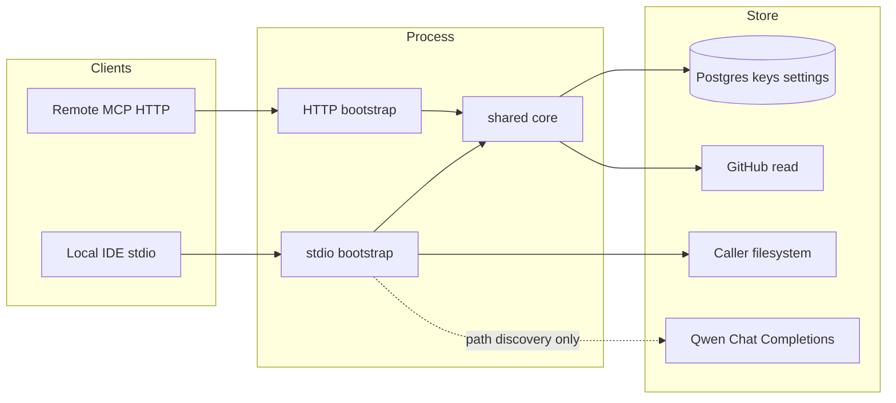

# framework.sdd.works — MCP design

MCP server for install, update, list, and get-key. Stories: [`mcp-stories.md`](./mcp-stories.md). Portal: [`app-design.md`](../admin-portal/app-design.md). Stack: [`tech-spec.md`](../tech-spec.md).

**Status:** draft. Pin `@modelcontextprotocol/sdk` and verify `tool` / `registerTool` against that release before coding.

## 1. Goals and non-goals

| Goals | Non-goals |
| --- | --- |
| Four tools, same core on stdio and Streamable HTTP | Portal chat LLM / image generation |
| Install/update skills, rules, other folders on the **caller** machine | Writing Server 2 disk as `~/.cursor` |
| `sdd_list_versions` from Settings-linked GitHub / releases | Third-party skill marketplace |
| `sdd_get_key` from the admin key store | MCP transport session as business state |
| Path allow-list; structured errors | Editing skills/rules inside an MCP session |
| Qwen-assisted client-config path discovery (stdio, ADR-047) | Trusting LLM paths without allow-list validation |

`serverInfo.name` = `framework.sdd.works` (literal). Tool names unprefixed. Descriptions SHOULD contain the literal `framework.sdd.works`.

## 2. Transport

```text
Local desktop?  → stdio entry (developer machine)
Remote client?  → Streamable HTTP POST/GET /mcp
Legacy SSE?     → only if a listed client requires it
```

Core (resolve package, path policy, key lookup) is transport-agnostic. Wire stdio or HTTP only in bootstrap.



**HTTP auth:** verify bearer **before** initialize. Do not rely on obscure tool names. Portal cookies never authorize MCP.

**HTTP install:** the hosted process cannot see the caller’s home directory. Without a documented local bridge, `sdd_install_framework` / `sdd_update_framework` return `local_install_required` or signed local-install instructions. They must not write server disk as user config roots.

Prefer a **sibling Node process** for `/mcp` if the pinned SDK Streamable HTTP transport does not fit the Next.js request lifecycle.

## 3. Tools

Register with Zod input schemas. Descriptions state parameters, success shape, and failure modes (`not_found`, `unauthorized`, `path_rejected`, `already_up_to_date`, `local_install_required`, `package_unavailable`, `client_config_unresolved`, `llm_unavailable`).

| Tool | Side effects | Transport |
| --- | --- | --- |
| `sdd_list_versions` | None | stdio + HTTP |
| `sdd_get_key` | None (returns plaintext `key_value`) | stdio + HTTP; **auth required** |
| `sdd_install_framework` | Writes client skill/rule paths | stdio; HTTP only with local bridge |
| `sdd_update_framework` | Same as install; idempotent on same version | same as install |

Optional resources (no side effects, no key values): `sdd://framework/versions`.

### `sdd_list_versions`

Input: optional `client`. Output: `{ versions: [{ id, published_at? }], inventory: { skills: string[], rules: string[], other: string[] } }`.

Source: Settings GitHub repo tags/releases and/or a version manifest in the repo (open question: GitHub sync vs release artifact vs both). Cache the list. Failure → structured error, never silent empty success. Never include key values.

### `sdd_get_key`

Input: `{ key_name: string }`. Lookup by unique `key_name` in the admin key store. Output on success: `{ key_name, key_value }` with **plaintext** `key_value` (decrypt at rest if encrypted).

Auth model is an open question (MCP bearer, per-key token, or admin-issued API key). Until decided: HTTP requires the same caller bearer as other tools; stdio still must not leak other keys.

Missing → `not_found`. Unauthorized → `unauthorized`. Do not list other key names or return other values.

### `sdd_install_framework`

Input: `{ version?: string, client?: string, os?: string }`. Missing version → latest from list. Client: explicit argument in v1 if auto-detect is unresolved.

Behavior:
1. Resolve package artifact for version.
2. Resolve target roots: seed path map + Qwen search of redacted local client config (stdio only; ADR-047 / MCPI-04). Prefer explicit `client`.
3. Reject if any target is outside allow-list or contains `..` → `path_rejected`. Unresolved → `client_config_unresolved` / `llm_unavailable`.
4. Write skills (each with `SKILL.md`), rules, other folders.
5. Return `{ version, paths, asset_counts, resolution_source: "llm" | "seed" }`.

Merge vs overwrite of existing user files is an open question. Until decided: do not delete files outside the package inventory; colliding names follow a single documented policy (prefer merge for extra user files; overwrite package-owned files). Record the choice in an ADR when implemented.

### `sdd_update_framework`

Same path policy as install. If the installed version equals the requested version → `already_up_to_date` without needless rewrite.

## 4. Path resolution (PATH-01 seed map + Qwen)

**Decision:** versioned data file is the architecture foundation (PATH-01, Sprint 1); Qwen discovery (MCPI-04, Sprint 6) layers on top as refinement/fallback; cross-client expansion (MCPI-02, Sprint 7) grows the same file. Do not grow a static encyclopedia of every vendor layout as the only strategy.

### 4.0 Path map (PATH-01) — architecture foundation

One versioned data file, loaded at server bootstrap, never hot-reloaded in v1:

```text
packages/sdd-paths/
  paths.json          # versioned data (client × OS → roots)
  paths.schema.json   # JSON Schema for CI validation
  paths.test.ts       # table-validation unit test (no logic tests)
  resolver.ts         # resolve(client, os, overrides?) → ResolvedPaths | PathError
```

Shape:

```json
{
  "version": 1,
  "updated_at": "2026-09-14",
  "clients": {
    "cursor": {
      "default": { "skills": "~/.cursor/skills/", "rules": "~/.cursor/rules/", "other": "~/.cursor/sdd/" },
      "darwin":  { "skills": "~/.cursor/skills/", "rules": "~/.cursor/rules/", "other": "~/.cursor/sdd/" },
      "win32":   { "skills": "%USERPROFILE%\\.cursor\\skills\\", "rules": "%USERPROFILE%\\.cursor\\rules\\", "other": "%USERPROFILE%\\.cursor\\sdd\\" }
    }
  }
}
```

Resolver contract:

```ts
type ResolvedPaths = { skills: string; rules: string; other: string };
type PathError =
  | { code: "client_unknown"; client: string }
  | { code: "os_unsupported"; client: string; os: string }
  | { code: "path_rejected"; reason: string; raw: string };

resolve(client, os, overrides?): ResolvedPaths | PathError;
```

Resolution order: explicit caller overrides → `clients[client][os]` → `clients[client].default` → `client_unknown`. `~` / `%USERPROFILE%` expanded server-side; raw caller strings never reach `fs`.

Maintenance:
- **Reactive, not scheduled.** No daily job, no auto-discovery in v1. Update on vendor changelog, new first-class client (Sprint 7), or user report of a wrong path. Bump `version` on every change.
- **Validate the table, not the logic.** CI runs `paths.test.ts` on every PR: every entry resolves under HOME/USERPROFILE, no `..`, every client has a `default`, trailing slashes consistent. Logic tests use a fixture map.
- **Release-time smoke** on macOS / Windows / Linux for the top 2–3 clients is the drift gate.
- **Staleness:** `sdd_list_versions` (Sprint 5) exposes `paths_version` so a stale local install can warn.
- **Security:** expand `~` / `%USERPROFILE%` server-side only; reject absolute paths escaping the user home after expansion; never log raw caller overrides at info level.
- **Scope guard:** the map is mechanism (where to write files), not product knowledge. Do not grow it into a per-client POI encyclopedia (`no-city-encyclopedia`).

### 4.1 Seed path map (data)


First-class clients (v1) keep documented **seed** defaults:

| Client | Notes |
| --- | --- |
| Cursor | `~/.cursor/skills`, `~/.cursor/rules` (Windows: `%USERPROFILE%\.cursor\…`) |
| Cursor Agents | Same Cursor roots unless the product documents a distinct agent dir |
| WorkBuddy / WorkBuddy CN | Document after verifying vendor paths |
| Claude Code | `~/.claude/skills` or current documented skills root |
| Cline | VS Code extension global/storage paths as documented |
| VS Code | User profile skills/rules if the product uses them; else project `.vscode` only if documented |
| Codex / Copilot | Document after verifying |

OS: macOS, Windows, Linux. Expand `~` / `%USERPROFILE%` on the **caller** machine (stdio).

TRAE Agents: candidate until MCP and install paths are verified. Unknown client after seed + LLM → structured error, no writes.

Allow-list: only mapped config roots (and LLM-proposed roots that pass the same policy). No writes to `/`, `/etc`, or repo `.git`.

### 4.2 Qwen config search (stdio)

Layers on top of PATH-01 (§4.0). Before writing skills/rules for a target client:

```text
client arg or detect
  → seed roots + candidate config files under allow-listed homes
  → redact snippets (paths / skill-rule keys only)
  → Qwen Chat Completions → JSON { skillsRoot, rulesRoot, otherRoots, confidence, rationale }
  → path-policy validate
  → write OR fallback seed OR client_config_unresolved / llm_unavailable
```

- Prefer explicit `client` when provided.
- Cache resolution by `(client, os, config fingerprint)` with short TTL.
- Never send key-store values or env secrets to Qwen.
- HTTP MCP: do not run this against Server 2 disk (see §3 / MCPI-03).
- Fallback target is the PATH-01 seed map (§4.0), not a separate static table.

### 4.3 Module sketch

Path resolution modules live in shared core (see §6).

## 5. Package resolve

```text
Settings GitHub URL(s)
  → list tags/releases or manifest
  → fetch tree or release tarball (read-only token server-side)
  → unpack to a temp dir (stdio process)
  → copy into allowed client roots
```

HTTP without a bridge stops before unpack-to-home. `GITHUB_TOKEN` stays in env.

## 6. Shared core

```text
src/core/
  tools/{list-versions,get-key,install,update}.ts
  path-policy.ts           # allow-list
  path-resolve-llm.ts      # Qwen client + schema + redact (layers on packages/sdd-paths)
  package-resolve.ts
packages/sdd-paths/
  paths.json               # PATH-01 versioned seed data
  paths.schema.json        # JSON Schema (CI validation)
  paths.test.ts            # table-validation unit test
  resolver.ts              # resolve(client, os, overrides?) → ResolvedPaths | PathError
src/mcp/
  create-server.ts    # register tools
  stdio.ts
  http.ts             # Streamable HTTP
```

`core` must not import Next, MCP SDK transports, or Prisma directly if that would pull Next into stdio. Use a small `src/db` or ports interface for keys/settings. Qwen HTTP client may live in `path-resolve-llm.ts` behind an injectable port for fixture tests. `packages/sdd-paths` is imported by both `core` and the portal BFF (Instructions page, Settings preview) — one source of truth.

## 7. i18n

Tool **descriptions** shown in clients: English source + overlay for `zh-Hans` / `zh-Hant` (I18N-02). Operator logs may stay English. Protocol ids stay English.

## 8. Security

- Env secrets only. Never return env, stacks, or internal paths that are not needed for the user action.
- Validate all tool args before filesystem or DB.
- Rate-limit expensive list/install on HTTP; document Qwen cost/latency in install/update descriptions.
- Key values only from `sdd_get_key` after auth.
- Redact config snippets before Qwen; never send `key_value` or `QWEN_API_KEY` in prompts.
- LLM-proposed paths MUST pass `path-policy` before write.

## 9. Tests

Test plan: write `mcp-test.md` when automation lands. Until then follow **common-test-strategy** + `tech-spec.md` quality bar. Unit: **PATH-01 table validation + resolver + path-policy** (100% of those paths), idempotent update, key lookup, **LLM JSON schema + allow-list rejection of escaped paths**. Integration: tool contracts on stdio fixture + HTTP. Default CI: fixture GitHub payloads and **fixture Qwen responses** (live Qwen opt-in).

## 10. Anti-patterns

- HTTP MCP writing Server 2 `~/.cursor`
- Security through tool-name obscurity
- Returning key values from `sdd_list_versions` or resources
- Silent empty success when GitHub is down
- Auto-detect client incorrectly and writing the wrong product’s config dir
- Writing paths from Qwen without allow-list validation
- Growing a static per-client encyclopedia instead of seed + LLM discovery (ADR-047)
- Portal chat LLM for operators in v1
