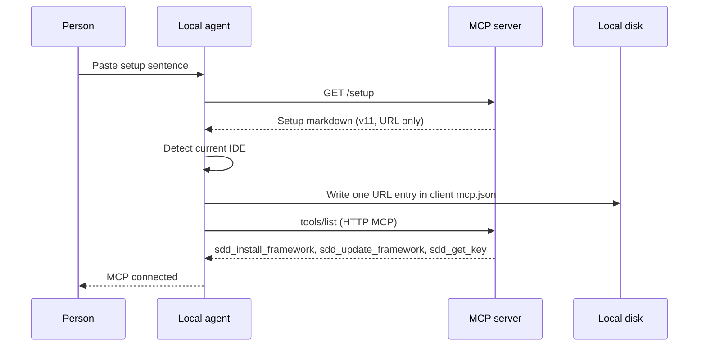
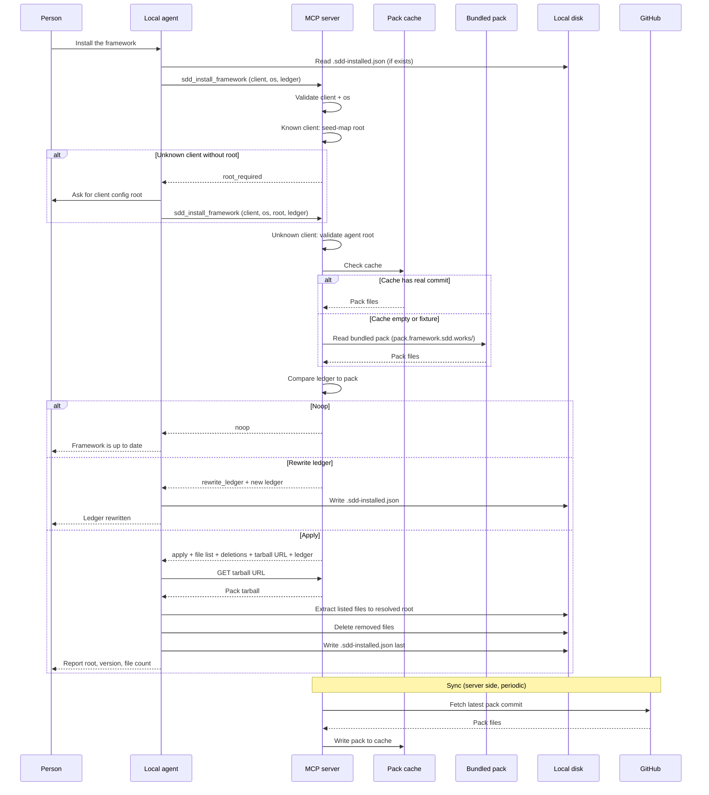

# MCP design

MCP server for install, update, and get-key. Stories: [`mcp-stories.md`](./mcp-stories.md). Tests: [`mcp-tests.md`](./mcp-tests.md). Previous design: [`mcp-design-complex.md`](./mcp-design-complex.md).

**Status:** simplified design, confirmed 2026-10-10 ([ADR-132](../adr/ADR-132-simplified-install-root-and-templates.md)). Builds on [ADR-131](../adr/ADR-131-http-only-install-bundled-fallback.md): no writer binary, HTTP-only install, bundled pack as cache fallback, tarball URL for file delivery, no LLM at install time. Root: agent sends `client` and `os` only for known clients; server uses the seed map; unknown clients get `root_required` until the person supplies `root`.

## 1. Goals

- Install and update the SDD framework pack into a client root with one MCP tool call.
- Push as much work to the server as possible. The server resolves the root for known clients, plans the install, and serves the tarball. The agent downloads the tarball and writes the ledger.
- Keep the design simple and neat: one install path, five failure codes, no writer binary, no local program, no LLM, no agent-side root detection chain.

### Non-goals

- No writer binary. No `~/.sdd/` directory. No `SDD_SERVER_URL` env var for the agent.
- No LLM at install time. The seed map resolves paths.
- No independent pack versioning. The pack and server deploy together when the cache is the source. The bundled fallback ships with the server.

## 1.1 Pack source

Two workspaces. Do not mix them.

| Workspace | Remote | What it is |
| --- | --- | --- |
| This workspace | `workspace.framework.sdd.works` | Build the product: MCP server, web portal, bundled pack. |
| Framework pack | `framework.sdd.works` | Published pack only. Synced to cache. |

Pack source for sync is the singleton `Setting.githubUrl` stored by the admin portal. The server reads that field at runtime. Do not hard-code an owner, repo, or clone URL in application code or tool defaults. An empty URL means no pack: sync and install fail with a structured error.

The pack repo top-level names on `main`: `agents/`, `skills/`, `rules/`, `workflows/`, `templates/`. The `templates/` folder holds a `framework.sdd.works/` subfolder (MC-18). Source aliases are normalized on copy (see §6).

## 2. Two server jobs

The server has two jobs. Job 1 gets the agent connected. Job 2 gets the framework files onto disk. The two jobs are separate. Job 1 ends when `tools/list` returns the tool names. Job 2 ends when the ledger is written.

### 2.0 Code module boundary

The two jobs run in two separate code modules. The boundary keeps setup serving out of the pack install path, and keeps pack install logic out of setup serving.

| Module | Owns | Files |
| --- | --- | --- |
| Setup backend | `GET /setup`, `GET /setup/install`, `GET /setup/node`, `GET /install`, setup markdown rewrite, paste sentences, client MCP file paths, node setup catalog | `src/app/api/agent-setup/route.ts`, `src/app/api/agent-setup/install/route.ts`, `src/app/api/agent-setup/node/route.ts`, `src/app/api/agent-setup/install-full/route.ts`, `src/mcp/setup-markdown.ts`, `src/mcp/setup-paths.ts`, `src/mcp/paste-sentences.ts`, `src/mcp/node-setup-catalog.ts`, `src/mcp/brand.ts`, `src/mcp/public-origin.ts`, `public/agent-setup/prompt.md`, `public/agent-setup/install.md`, `public/agent-setup/node.md`, `public/agent-setup/install-full.md` |
| Pack install backend | `sdd_install_framework`, `sdd_update_framework`, `sdd_get_key`, install plan, tarball URL, ledger, cache and bundled pack read | `src/core/tools/install.ts`, `src/core/tools/install-http.ts`, `src/core/tools/install-plan.ts`, `src/core/tools/apply-plan.ts`, `src/core/tools/get-key.ts`, `src/core/tools/list-versions.ts`, `src/core/tools/package-fetch.ts`, `src/core/tools/errors.ts`, `src/core/sync/*` |

Boundary rules:

- The setup backend does not import from `src/core/tools/` or `src/core/sync/`.
- The pack install backend does not import from `src/mcp/setup-*`, `src/mcp/paste-sentences.ts`, `src/mcp/node-setup-catalog.ts`, or `src/mcp/brand.ts`.
- Shared types live in `src/core/tools/errors.ts` or a types module the two modules agree on. The setup backend does not import install-only types.
- Client detection (`src/core/path-detect.ts`) is install-only. The setup backend uses `src/mcp/setup-paths.ts` for the client MCP file path table. The pack install backend uses the seed map in `packages/sdd-paths/paths.json`, not the setup path table.
- The MCP server entry (`src/mcp/create-server.ts`, `src/mcp/http-server.ts`) wires both modules. It is the only place that imports from both.
- `GET /setup`, `GET /setup/install`, `GET /setup/node`, and `GET /install` are documentation pages served by the setup backend (`public/agent-setup/prompt.md`, `install.md`, `node.md`, `install-full.md`). The pack install backend is `sdd_install_framework` tool logic and does not serve markdown pages. Setup routes do not share a handler with MCP tool handlers. `GET /install` names the pack install sequence but does not call install functions; it serves static markdown only.

### 2.1 Job 1: Install MCP

This job gets the agent connected to the server. The person pastes one sentence. The agent writes one URL entry. The server serves the setup markdown and speaks the MCP protocol. This job ends when `tools/list` returns the three tool names.

#### Job 1 steps

1. The person pastes in the agent: `Fetch and execute the setup instructions from https://sdd.works/setup`.
2. The agent fetches `GET /setup`. The server returns markdown. Setup version is `2026-10-09.v11`.
3. The setup markdown is URL only. It has no install section.
4. The agent detects which IDE is running this session. It writes MCP config only for that client. The agent uses only the section in the setup markdown that names the IDE running this session. It does not read or write another IDE's `mcp.json` unless the person names that IDE in this chat.
5. The agent writes one MCP entry named `framework.sdd.works`. The value is only `"url": "https://sdd.works/mcp"`. A previous `command` is replaced.
6. The agent reloads MCP and checks `tools/list`. The names are `sdd_install_framework`, `sdd_update_framework`, and `sdd_get_key`. Job 1 ends.

#### Client MCP file paths

| Client | MCP file | Do not use |
| --- | --- | --- |
| Cursor | `~/.cursor/mcp.json` | |
| Claude Code | `~/.claude/mcp.json` (or `claude mcp add`) | |
| Codex | `~/.codex/mcp.json` (or `codex mcp add`) | |
| Copilot | VS Code settings | |
| CodeBuddy or WorkBuddy | `~/.codebuddy/mcp.json` | Cursor, TRAE, or TRAE CN MCP files. Project file `.codebuddy/mcp.json` only when the person asked to configure this workspace. |
| CodeBuddy CN or WorkBuddy CN | `~/.codebuddy/mcp.json` | Same as CodeBuddy. |
| TRAE (international) | `~/.trae/mcp.json` | `~/Library/Application Support/Trae CN/User/mcp.json` and `~/.trae-cn/mcp.json` |
| TRAE CN | `~/Library/Application Support/Trae CN/User/mcp.json` | `~/.trae-cn/mcp.json` and `~/.trae/mcp.json` |

#### Job 1 sequence


```mermaid
sequenceDiagram
    participant P as Person
    participant A as Local agent
    participant S as MCP server
    participant D as Local disk

    P->>A: Paste setup sentence
    A->>S: GET /setup
    S-->>A: Setup markdown (v11, URL only)
    A->>A: Detect current IDE
    A->>D: Write one URL entry in client mcp.json
    A->>S: tools/list (HTTP MCP)
    S-->>A: sdd_install_framework, sdd_update_framework, sdd_get_key
    A-->>P: MCP connected
```

### 2.2 Job 2: Install or update pack

This job gets the framework files onto disk. The agent calls `sdd_install_framework`. The server resolves the root, checks the cache or bundled pack, builds the plan, and returns a tarball URL. The agent downloads the tarball, extracts the listed paths, and writes the ledger last. This job ends when the ledger is written.

#### Job 2 steps

1. The person asks the agent to install or update the framework.
2. The agent identifies `client` from the user or the MCP handshake and reads `.sdd-installed.json` from the resolved client root when it already exists.
3. The agent calls `sdd_install_framework` with `client`, `os`, and `ledger` (or absent). For a client in the seed map, the agent omits `root`.
4. The server validates `client` and `os`:
   - Missing or unmapped `client`: return `client_unknown`.
   - Known `client` with an unknown `os`: return `os_unsupported`.
5. The server resolves the root:
   - For a known client, the server uses the seed-map root (`packages/sdd-paths/paths.json`) by `client` and `os`. The server ignores any `root` the agent sends.
   - For a client that is not in the seed map, when `root` is absent return `root_required` so the agent can ask the person. When `root` is present, validate it against the path policy and use it. Return `path_rejected` when the path is outside the home, contains `..`, or is a system path.
6. The server checks the pack source:
   - If the cache has a real commit (synced from GitHub), use the cache.
   - If the cache is empty or has a fixture commit, fall back to the bundled pack under `pack.framework.sdd.works/` in the server repo.
   - The agent never sees a cache problem. The server always returns a plan.
7. The server compares the sent ledger to the pack:
   - Same version, same commit, `pack_complete: true`, all files exist: return `noop`.
   - Same version and commit but `pack_complete` missing: return `rewrite_ledger`.
   - Otherwise: return `apply` with the file list, deletions, the new ledger, and a tarball URL.
8. On `noop`: the agent tells the user the framework is up to date. Stop.
9. On `rewrite_ledger`: the agent writes `.sdd-installed.json` with the new ledger at the resolved root. Stop.
10. On `apply`:
    1. The agent downloads the tarball from the tarball URL.
    2. The agent extracts only the listed file paths into the resolved root.
    3. The agent deletes the files in the deletions list from the resolved root.
    4. The agent writes `.sdd-installed.json` last with the new ledger.
11. The agent reports the result to the user: the resolved root, the version, and the file count. Job 2 ends.

#### Install page (MC-17)

The install sequence lives at `GET /install` (`public/agent-setup/install-full.md`). An agent asked to install the framework, with MCP connected, fetches this page before calling `sdd_install_framework`. The page names the sequence: read the ledger, call `sdd_install_framework` with `client` and `os` (omit `root` for known clients), download the tarball, extract listed paths, write the ledger last. The setup page (`GET /setup`) links to this page from an "After setup" note. The setup boundary stays: `GET /setup` is MCP connection only and has no install section.

#### Job 2 sequence


```mermaid
sequenceDiagram
    participant P as Person
    participant A as Local agent
    participant S as MCP server
    participant C as Pack cache
    participant B as Bundled pack
    participant D as Local disk
    participant G as GitHub

    P->>A: Install the framework
    A->>D: Read .sdd-installed.json (if exists)
    A->>S: sdd_install_framework (client, os, ledger)
    S->>S: Validate client + os
    S->>S: Known client: seed-map root
    alt Unknown client without root
        S-->>A: root_required
        A->>P: Ask for client config root
        A->>S: sdd_install_framework (client, os, root, ledger)
    end
    S->>S: Unknown client: validate agent root
    S->>C: Check cache
    alt Cache has real commit
        C-->>S: Pack files
    else Cache empty or fixture
        S->>B: Read bundled pack (pack.framework.sdd.works/)
        B-->>S: Pack files
    end
    S->>S: Compare ledger to pack
    alt Noop
        S-->>A: noop
        A-->>P: Framework is up to date
    else Rewrite ledger
        S-->>A: rewrite_ledger + new ledger
        A->>D: Write .sdd-installed.json
        A-->>P: Ledger rewritten
    else Apply
        S-->>A: apply + file list + deletions + tarball URL + ledger
        A->>S: GET tarball URL
        S-->>A: Pack tarball
        A->>D: Extract listed files to resolved root
        A->>D: Delete removed files
        A->>D: Write .sdd-installed.json last
        A-->>P: Report root, version, file count
    end

    Note over S,G: Sync (server side, periodic)
    S->>G: Fetch latest pack commit
    G-->>S: Pack files
    S->>C: Write pack to cache
```

### 2.3 Cache and fallback

The cache is the primary source. The bundled pack is the fallback.

- The server syncs the pack from GitHub to the cache on a schedule.
- The cache holds the latest synced commit.
- When the cache has a real commit, the server reads from the cache.
- When the cache is empty or has a fixture commit, the server reads from the bundled pack under `pack.framework.sdd.works/` in the server repo.
- The agent never sees `cache_empty`, `fixture_pack`, or `sync_pending`. The server always returns a plan.

### 2.4 File delivery

The server returns a tarball URL, not inline file contents. This keeps the tool result small.

- The tool result carries the plan, the file paths (no content), the deletions, the new ledger, and one tarball URL.
- The agent downloads one tarball, extracts the listed paths, and writes the ledger.
- The file contents never pass through the agent's context window.
- For updates, the server returns only the changed file paths and a diff tarball URL.

<a id="25-production-pack-sync-feature-82--mcp-07"></a>

### 2.5 Production pack sync (feature-82 / MCP-07)

Operators sync the framework pack GitHub repo into the portal cache. End-user install and lite APIs read that cache on the live site.

| Fact | Detail |
| --- | --- |
| Trigger | Signed-in admin → **Framework** → **Sync with git repository** (`syncFrameworkRepo` in `src/core/sync/sync-job.ts`). Same job as webhook and scheduled sync |
| Repo URL | `Setting.githubUrl` from Admin Settings. No hard-coded owner or repo |
| Cache dir | `SDD_PACKAGE_CACHE_DIR`, default `.data/sdd-packages` locally; production volume `framework_sdd_packages` → `/data/sdd-packages` on web and MCP containers ([`release.md`](../release.md) §2) |
| Manifest | `manifest.json` at cache root: `latestCommit`, `latestVersion`, `versions[]`, `inventory`, `syncedAt` |
| Unpack layout | Per commit: unpacked tree is the pack repo root (`agents/`, `skills/`, `rules/`, `workflows/`, `templates/`, `content/`, plus root files such as `lite-pack.allowlist.json`) |
| Cache-only REST | `GET /api/sdd/versions`, `GET /api/sdd/package`, `GET /api/sdd/lite/files`, and `GET /api/sdd/lite/file` read the cache only. Empty manifest → 409 `sync_pending`. Missing allow-list file → 404 `lite_manifest_missing` |
| MCP install source | `install-http.ts` uses cache when present and not a fixture commit; otherwise bundled pack under `pack.framework.sdd.works/` (ADR-131). Production goal: after sync, MCP install uses **cache** (`packSource: "cache"`) |
| Fixture guard | Commits matching `sha-v*.*.*` or the six-file GitHub fixture stub are refused for install and fall back to bundled. Do not treat production `latestCommit` as fixture after a real sync |
| Verification | [MCP-07](../product-backlog.md#pb-105), [feature-82](../sprint-backlog.md#sprint-9), [`mcp-tests.md`](./mcp-tests.md#15-feature-82-production-pack-sync) §15, [`release.md`](../release.md) §7.3. Closes [Spec-seeds-15](../product-backlog.md#pb-97) when `lite-pack.allowlist.json` is present in production unpack |

## 3. Tools

### Failure codes

| Code | Meaning |
| --- | --- |
| `client_unknown` | `client` is missing or cannot be mapped to a canonical client id. |
| `root_required` | `client` is not in the seed map and `root` was not sent. |
| `os_unsupported` | The `os` value is not `darwin`, `linux`, or `win32`. |
| `path_rejected` | The resolved path is outside home, contains `..`, or is a system path. |
| `unauthorized` | The caller is not authorized. Portal key only. |

`noop` is a result, not an error. It means the installed pack matches the cached pack. No operation needed.

### Tool table

| Tool | Transport | Purpose |
| --- | --- | --- |
| `sdd_install_framework` | HTTP | Install or update the framework pack. |
| `sdd_update_framework` | HTTP | Same operation as `sdd_install_framework`. Different name for update intent. |
| `sdd_get_key` | HTTP only | Return a short-lived portal key for the admin portal. |

`sdd_list_versions` is not registered (ADR-063). The server does not expose a version list tool.

### sdd_get_key

HTTP only. Returns a short-lived key the person pastes into the admin portal. The key is not a secret the agent stores. The agent shows the key to the person and stops.

### sdd_install_framework input

| Field | Type | Required | Notes |
| --- | --- | --- | --- |
| `client` | string | yes | `cursor`, `claude`, `codex`, `copilot`, `codebuddy`, `trae`, `trae-cn`. |
| `os` | string | yes | `darwin`, `linux`, `win32`. |
| `root` | string | no | Send only for a client not in the seed map, after `root_required`. The server validates it. Known clients omit `root`; the server uses the seed-map root. |
| `ledger` | object | no | The current `.sdd-installed.json` contents. Absent on first install. |
| `force` | boolean | no | Rewrite the ledger even when the version matches. |
| `missing` | string[] | no | Files the ledger lists but the disk does not have. |

The agent sends `client` and `os`. It does not detect or send `root` for known clients. For an unknown client, the agent retries with `root` after the person answers `root_required`.

### sdd_install_framework result

```json
{
  "action": "apply",
  "root": "~/.cursor",
  "version": "sha-v1.2.0",
  "files": ["skills/sdd-build/SKILL.md", "rules/sdd-dod.mdc"],
  "deletions": ["skills/old-skill/SKILL.md"],
  "tarballUrl": "https://sdd.works/pack/sha-v1.2.0/diff.tar.gz",
  "ledger": {
    "package_version": "sha-v1.2.0",
    "pack_complete": true,
    "files": [
      { "path": "skills/sdd-build/SKILL.md", "sha": "..." }
    ]
  }
}
```

On `noop`: `{ "action": "noop", "root": "~/.cursor", "version": "sha-v1.2.0" }`.

On `rewrite_ledger`: `{ "action": "rewrite_ledger", "root": "~/.cursor", "ledger": {...} }`.

On `root_required`: `{ "error": { "code": "root_required", "message": "Send root for this client after asking the person where the IDE stores skills and rules." } }`.

## 4. Path resolution

The server resolves the install root. The agent sends `client` and `os`. For a known client, the server reads the seed map. For an unknown client, the agent sends `root` after `root_required`. No LLM. No agent-side root detection chain.

### Client identification

The agent maps the running session to a `client` value using the user, the MCP handshake `clientInfo.name`, or aliases in the seed map. That step does not choose an install root.

### Server-side resolution

- Known client: resolve from the seed map using `client` and `os`. Ignore any `root` the agent sends.
- Unknown client: when `root` is absent, return `root_required`. When `root` is present, validate it. Reject a path outside the home directory, a path with `..`, or `/etc`, `/usr`, `/bin`, `/sbin`. Return `path_rejected`.

### Relocation limitation

Users who relocate a first-class client with env vars such as `CLAUDE_CONFIG_DIR`, `CODEX_HOME`, `CLINE_DIR`, or `KIRO_HOME` still install to the seed-map default in this release. [`client.paths.md`](./client.paths.md) documents those env vars for operators. The install tool does not read them.

### Seed map

| Client | `darwin` root | `linux` root | `win32` root |
| --- | --- | --- | --- |
| `cursor` | `~/.cursor` | `~/.cursor` | `%USERPROFILE%\.cursor` |
| `claude` | `~/.claude` | `~/.claude` | `%USERPROFILE%\.claude` |
| `codex` | `~/.codex` | `~/.codex` | `%USERPROFILE%\.codex` |
| `copilot` | `~/.copilot` | `~/.copilot` | `%USERPROFILE%\.copilot` |
| `codebuddy` | `~/.codebuddy` | `~/.codebuddy` | `%USERPROFILE%\.codebuddy` |
| `trae` | `~/.trae` | `~/.trae` | `%USERPROFILE%\.trae` |
| `trae-cn` | `~/Library/Application Support/Trae CN/User` | `~/.trae-cn` | `%APPDATA%\Trae CN\User` |

A valid `os` with no per-os entry uses `default`. An unknown `os` returns `os_unsupported`.

### Client aliases

The `client` value maps to the canonical name in the seed map. Aliases are accepted:

| Caller value | Canonical name |
| --- | --- |
| `cursor` | `cursor` |
| `claude` | `claude` |
| `codex` | `codex` |
| `copilot` | `copilot` |
| `codebuddy`, `workbuddy` | `codebuddy` |
| `trae` | `trae` |
| `trae-cn`, `trae_cn`, `trae cn` | `trae-cn` |

### Path validation

The server rejects:
- A path outside the home directory.
- A path containing `..`.
- System paths: `/etc`, `/usr`, `/bin`, `/sbin`.

## 5. Ledger

The ledger is `{client_root}/.sdd-installed.json`. The agent writes it last.

```json
{
  "package_version": "sha-v1.2.0",
  "pack_complete": true,
  "files": [
    { "path": "skills/sdd-build/SKILL.md", "sha": "..." }
  ]
}
```

- `pack_complete: true` means the install finished all listed files.
- `files` is the file-level list. Each entry has `path` and `sha`.

## 6. Pack structure

The pack ships five top-level names. Source aliases are normalized on copy.

| Directory | Source aliases | Purpose |
| --- | --- | --- |
| `agents` | `agent/`, `agents/` | Agent files. |
| `skills` | `skill/`, `skills/` | Skill files. |
| `rules` | `Rules/`, `rules/` | Rule files. |
| `workflows` | `workflows/` | Workflow files. |
| `templates` | `templates/` | Template files. |

The pack `constants.json` defines `"templates_dir": "templates"`. The pack `templates/` folder holds a `framework.sdd.works/` subfolder. Locale seeds live under `templates/framework.sdd.works/{locale}/...`. Shared files (`constants.json`, `pack-scrum-in-sdd.md`, `sdd-scrum-practices.md`, `coach-knowledge.md`) live under `templates/framework.sdd.works/`. After install, `{client_root}/templates/framework.sdd.works/{locale}/...` resolves the paths skills, rules, and agents reference (MC-18).

### Write policy

- The agent copies only the listed files.
- The agent deletes recorded files the new pack does not ship.
- The agent writes `.sdd-installed.json` last.
- The agent does not extract the archive into the client root.
- The agent does not write `framework.sdd.works.json`.

## 7. Security

- The MCP entry is a URL only. No `command`, no `args`, no local path in the MCP file.
- The server validates `client` and `os`.
- For a known client, the server uses the seed-map root. For an unknown client, the server returns `root_required` until the agent sends a validated `root`.
- The server rejects a resolved path outside the home directory, with `..`, or a system path.
- The server does not call an LLM at install time.
- The ledger is written last. A failed install leaves the old ledger.
- The agent does not extract the archive into the client root.
- `sdd_get_key` returns a short-lived key. The key is not stored by the agent.
- Secrets stay out of tool results, ledger, and logs.

## 8. Anti-patterns

- A writer binary or any local program the agent must install.
- An LLM call at install time.
- Inline file contents in the tool result (too many tokens).
- A `cache_empty` or `fixture_pack` error the agent must handle.
- A `command` field in the MCP entry.
- An install sequence that lives only inside the tool result, with no fetchable page for an agent that has MCP connected but has not called the tool yet (MC-17).
- A flat `templates/{locale}/` install path that does not match the `templates/framework.sdd.works/{locale}/` paths skills and rules reference (MC-18).
- An agent-side root detection chain (env vars, config probe) or a `root_warning` field in the tool result (ADR-132).
- Sending a workspace folder as `root` for a known client instead of omitting `root` and letting the server use the seed map (MC-16).
