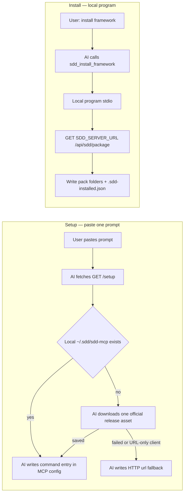
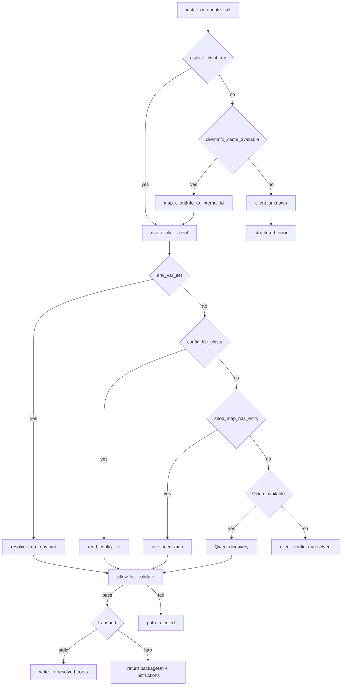

# framework.sdd.works — MCP design

MCP server for install, update, list, and get-key. Stories: [`mcp-stories.md`](./mcp-stories.md). Portal: [`app-design.md`](../admin-portal/app-design.md). Stack: [`r1-tech-spec.md`](../phase1-process-specs/r1-tech-spec.md) (Phase 1 archive).

**Status:** the current steps are [ADR-129](../adr/ADR-129-url-mcp-server-plan-local-writer.md), in the next section. Sections from §2 downward still describe ADR-058. Stories: [`mcp-stories.md`](./mcp-stories.md). Tests: [`mcp-tests.md`](./mcp-tests.md). ADRs: [047](../adr/ADR-047-qwen-install-path-discovery.md), [051](../adr/ADR-051-zero-dep-stdio-binary.md), [052](../adr/ADR-052-commit-sha-identity.md), [053](../adr/ADR-053-server-side-sync-thin-stdio.md), [054](../adr/ADR-054-hybrid-http-ai-tarball.md), [055](../adr/ADR-055-layered-sync-freshness.md), [056](../adr/ADR-056-single-user-root-framework-pack.md), [057](../adr/ADR-057-install-ledger-pack-complete.md), [058](../adr/ADR-058-stdio-end-user-http-fallback.md), [061](../adr/ADR-061-setup-prompt-public-path.md), [128](../adr/ADR-128-install-root-and-writer.md), [129](../adr/ADR-129-url-mcp-server-plan-local-writer.md).

## Decisions (TBD1–TBD5)

These five decisions are the install contract. Sections from §2 downward still describe the older ADR-058 path. The code does not meet every decision yet.

- **TBD1.** The program file is the home directory plus `.sdd/sdd-mcp`. On Windows the file name is `sdd-mcp.exe`. Home comes from the operating system (`$HOME` or `USERPROFILE`). A literal `~` is not written into `mcp.json`. The agent expands home before it saves or starts the file. The download link in the tool result is the pack on this server. The server syncs that pack from git. A git host or a repository name is not in the tool result.
- **TBD2.** The agent may name a candidate client root. The program accepts or rejects that path. For a known client, the program's path wins. The program rejects a path outside home, a path that contains `..`, and `/etc`, `/usr`, `/bin`, or `/sbin`.
- **TBD3.** The program sends the whole `.sdd-installed.json`, the accepted root, the client, the operating system, `force` when asked, and `missing`. It does not send file bodies. The server composes `noop`, `rewrite_ledger`, or `apply`. The program writes that plan.
- **TBD4.** The local program is the only writer on the primary path. It checks the plan, copies the listed files, and writes `.sdd-installed.json` last. That program is not the MCP process.
- **TBD5.** When the program cannot be downloaded or cannot run, the agent writes. The server returns the same plan, the instruction, and the pack URL on this server. The agent copies only the planned paths and does not extract the archive into the client root.

## Current steps

1. The person pastes one sentence. The agent fetches `GET /setup`.
2. The agent detects the agent that is running this session. It changes MCP configuration only for that agent. It does not read or write another IDE's `mcp.json` unless the user names that IDE in the chat (MC-10). It writes one MCP entry named `framework.sdd.works`. The value is only a URL. On the public host that URL is `https://sdd.works/mcp`. On a local portal the setup page rewrites it to `http://127.0.0.1:3041/mcp`. A previous `command` or a previous host is replaced. The entry has no path and no `~` in the URL value (TBD1). Setup version is `2026-10-09.v10`. **CodeBuddy (international)** is CodeBuddy or WorkBuddy. **CodeBuddy CN** is CodeBuddy CN or WorkBuddy CN. Both use `~/.codebuddy/mcp.json` under `mcpServers`. Project MCP is `.codebuddy/mcp.json` only when the user asked to configure the current workspace. **TRAE (international)** uses `~/.trae/mcp.json` and does not use the TRAE CN Application Support path or `~/.trae-cn/mcp.json` for that user list. **TRAE CN** uses `~/Library/Application Support/Trae CN/User/mcp.json` and does not write `~/.trae-cn/mcp.json` or `~/.trae/mcp.json` for that user list.
3. The agent reloads MCP and checks `tools/list`. The names are `sdd_install_framework` and `sdd_update_framework`. HTTP also lists `sdd_get_key`. Setup stops here.
4. The person asks to install. The agent calls `sdd_install_framework` with no inventory.
5. The server returns `writer_required` when the caller sends no inventory. The download link is the pack on this server. A cache older than 30 minutes returns `cache_stale` and no write plan. The result does not name a git host or a repository (MC-02).
6. When the local program is already on the machine, the agent runs it with `--write`, `--client`, `--os`, and `--client-root` when it has a candidate folder. It sets `SDD_SERVER_URL` to the portal (`https://sdd.works` on the public host). `GET /setup` section 4 names those flags. `--client` is `cursor`, `claude`, `codex`, or `copilot` for those agents. `--client` is `codebuddy` for CodeBuddy (international), WorkBuddy, CodeBuddy CN, and WorkBuddy CN. `--client` is `trae` for TRAE (international) and `trae-cn` for TRAE CN. `--os` is `darwin`, `linux`, or `win32`. The install tool result names the same flags and does not send the agent to git for that program (TBD1, TBD4, MC-11).
7. The program accepts or rejects the candidate root. For a known client, the program's path wins. A path outside home, a path with `..`, or `/etc`, `/usr`, `/bin`, or `/sbin` is rejected (TBD2).
8. The program reads `.sdd-installed.json` and posts that whole file, the accepted root, the client, the operating system, `force` when asked, and `missing`. It does not post file bodies (TBD3, MC-05).
9. The server returns `noop`, `rewrite_ledger`, or `apply`. A stale cache returns `cache_stale`. The program then exits and does not copy files (TBD3).
10. On `apply`, the program checks the plan, copies only the listed files, and writes `.sdd-installed.json` last (TBD4).
11. When the program cannot run, the agent sends the same inventory, and sets `accepted_root` to the candidate folder when it has one. `GET /setup` section 4 says that. The server returns the plan, the instruction, and the pack URL on this server. The agent copies only the planned paths and does not extract the archive into the client root (TBD5). HTTP `tools/list` keeps `sdd_get_key` (MC-07).

## 1. Goals and non-goals

| Goals | Non-goals |
| --- | --- |
| End-user MCP is a URL. The current steps are ADR-129 | Portal chat LLM / image generation |
| Prompt-based setup: one paste; the agent writes the URL, or replaces an existing entry with that URL | Asking the person to edit `mcp.json` by hand |
| Local program writes the server plan. It is not the MCP process (ADR-129) | Writing Server 2 disk as `~/.cursor` |
| When the program cannot run, the agent writes the same plan from the pack URL (ADR-129) | Third-party skill marketplace |
| `listVersions` / `GET /api/sdd/versions` from operator sync cache | MCP transport session as business state |
| `sdd_get_key` from the admin key store (HTTP only) | Editing skills/rules inside an MCP session |
| Path allow-list; structured errors | Hard-coding a GitHub owner/repo for the pack |
| Qwen-assisted path discovery on stdio (ADR-047) | Trusting LLM paths without allow-list validation |

`serverInfo.name` = `framework.sdd.works` (literal). Tool names unprefixed. Descriptions SHOULD contain the literal `framework.sdd.works`.

## 1.1 Pack GitHub repository (admin Settings)

Two workspaces. Do not mix them.

| Workspace | Remote | What it is |
| --- | --- | --- |
| This workspace (`framework.sdd.works`) | [workspace.framework.sdd.works](https://github.com/ethanhuangcst/workspace.framework.sdd.works.git) | Build the product: framework pack authoring, MCP, and the web portal |
| Framework pack | [framework.sdd.works](https://github.com/ethanhuangcst/framework.sdd.works.git) | Published pack only |

This git working copy is the service repo. Sync and install never read this checkout’s remote and never treat `specs/` or `src/` here as the pack tree. Pack files are copied into the pack repo by hand.

Pack source is the singleton **`Setting.githubUrl`** stored by the admin portal ([`app-design.md`](../admin-portal/app-design.md) Settings). Sync (`syncFrameworkRepo`), `GET /api/sdd/versions` / `listVersions()`, and `sdd_install_framework` / `sdd_update_framework` read that field at runtime. **Do not hard-code** an owner, repo, or clone URL in application code, path maps, or tool defaults.

Operators may change the URL in `/admin/settings`. The service validates `https://github.com/{owner}/{repo}` (optional `.git`) and persists the canonical form. An empty URL means no pack: sync and install fail with a structured error (`sync_pending` / package unavailable), not a baked-in fallback repo.

**Current operator value (example, changeable):** [https://github.com/ethanhuangcst/framework.sdd.works.git](https://github.com/ethanhuangcst/framework.sdd.works.git)

That URL is a **pack-only** tree. Observed top-level names on `main` (2026-09-24): `agents/`, `skill/`, `rules/`, `templates/framework.sdd.works/`, plus non-pack files (`.gitignore`, workspace file). It is not the portal/`src` service repo. Feature-01 still copies only the pack allow-list (with name mapping below), never every GitHub top-level file.

## 2. Transport and roles

| Audience | Transport | MCP config | Install executor |
| --- | --- | --- | --- |
| **End user** | Streamable HTTP `POST/GET /mcp` | `"url": "https://sdd.works/mcp"` only | Local program writes the server plan. It is not the MCP process. The tool download link is the pack on this server. |
| **Dev contributor** | stdio (`npm run mcp:stdio` or the same binary) | `"command"` at repo `tsx` or `~/.sdd/sdd-mcp` | Same local write path |
| **Terminal fallback** | stdio via curl installer | written by `scripts/install.sh` | stdio binary |

Legacy SSE: only if a listed client requires it.

Core (resolve package, path policy, key lookup) is transport-agnostic. Wire stdio or HTTP only in bootstrap.

**HTTP auth:** verify bearer **before** initialize. Do not rely on obscure tool names. Portal cookies never authorize MCP.

Prefer a **sibling Node process** for `/mcp` if the pinned SDK Streamable HTTP transport does not fit the Next.js request lifecycle.

### 2.1 End-user stdio (ADR-058) — primary

**Decision:** The person pastes one website prompt. The agent writes one URL entry named `framework.sdd.works`. Install calls that URL. The local program, when it is already on the machine, writes the pack. The tool result's download link is the pack on this server. The result does not name a git host. Sections below that still show a `command` entry or a git release URL are the older ADR-058 path. They are not the current setup.


```mermaid
flowchart LR
  subgraph setup [Setup — paste one prompt]
    User[User pastes prompt] --> AI1[AI fetches GET /setup]
    AI1 --> AI2{Local ~/.sdd/sdd-mcp exists}
    AI2 -->|yes| AI3[AI writes command entry in MCP config]
    AI2 -->|no| AI5[AI downloads one official release asset]
    AI5 -->|saved| AI3
    AI5 -->|failed or URL-only client| AI4[AI writes HTTP url fallback]
  end

  subgraph install [Install — local program]
    UserChat[User: install framework] --> AICall[AI calls sdd_install_framework]
    AICall --> Stdio[Local program stdio]
    Stdio --> Fetch[GET SDD_SERVER_URL /api/sdd/package]
    Fetch --> Write[Write pack folders + .sdd-installed.json]
  end
```

#### Build and place the local program (MCP-02)

Bun is a **build-machine** dependency only ([ADR-051](../adr/ADR-051-zero-dep-stdio-binary.md)). Contributors and operators:

1. Run `npm run mcp:build` to compile `src/mcp/stdio.ts` into `dist/sdd-mcp-${os}-${arch}` for `darwin-arm64`, `darwin-x64`, `linux-arm64`, `linux-x64`, and `windows-x64`.
2. Run `npm run mcp:place` (or `scripts/place-mcp-binary.sh`) to copy the matching host binary to `~/.sdd/sdd-mcp` and mark it executable on macOS and Linux.

The client machine does not need Node, npm, or Bun to run that file. `npm run mcp:stdio` remains the TypeScript contributor entry.

#### Publish the local program (feature-80 / MCP-06)

The visitor download is a GitHub Release on the repo that contains [`.github/workflows/release.yml`](../../.github/workflows/release.yml): `ethanhuangcst/workspace.framework.sdd.works`. It is not the portal container image and not the pack repo `ethanhuangcst/framework.sdd.works`.

1. An operator pushes a git tag that matches `v*` on the default branch history.
2. The workflow runs `npm run mcp:build` and attaches these assets:

| OS and CPU | Release asset | Saved local path |
| --- | --- | --- |
| macOS Apple silicon | `sdd-mcp-darwin-arm64` | `~/.sdd/sdd-mcp` |
| macOS Intel | `sdd-mcp-darwin-x64` | `~/.sdd/sdd-mcp` |
| Linux arm64 | `sdd-mcp-linux-arm64` | `~/.sdd/sdd-mcp` |
| Linux x64 | `sdd-mcp-linux-x64` | `~/.sdd/sdd-mcp` |
| Windows x64 | `sdd-mcp-windows-x64.exe` | `~/.sdd/sdd-mcp` under the user profile |

3. Those release URLs are not an agent download. `GET /setup` and `sdd_install_framework` do not name a git host (MC-02).
4. `scripts/install.sh` is outside this setup contract.

#### Primary MCP config

```json
"framework.sdd.works": {
  "url": "https://sdd.works/mcp"
}
```

The entry has no `command`. The pack download base is the server that serves `/api/sdd/package`. It is not a git URL.

#### Prompt-based setup (SETUP-01)

User pastes in Cursor (or other agent):

```text
Fetch and execute the setup instructions from https://sdd.works/setup
```

| Endpoint | Serves |
| --- | --- |
| `GET /setup` | Markdown setup instructions (Next.js rewrite → `/api/agent-setup`) |
| `GET /agent-setup` | Redirect to `GET /setup` ([ADR-061](../adr/ADR-061-setup-prompt-public-path.md)) |
| Source file | `public/agent-setup/prompt.md` |

That source file is the body `GET /setup` returns in production. It must match `public/agent-setup/prompt.md`. Setup version **2026-10-09.v10** (MC-02, MC-04, MC-06, MC-10, MC-11) adds **Current client only**, `cache_stale` and `fixture_pack` stop rules, candidate-folder rejection, and names `--write`, `--client`, `--os`, `--client-root`, `SDD_SERVER_URL`, and `accepted_root` in section 4. Headings: **CodeBuddy (international)** (CodeBuddy or WorkBuddy) and **CodeBuddy CN** (CodeBuddy CN or WorkBuddy CN), both `~/.codebuddy/mcp.json`, with `.codebuddy/mcp.json` only when the user asked to configure this project; **TRAE (international)** (`~/.trae/mcp.json`, not the TRAE CN user path); **TRAE CN** (`~/Library/Application Support/Trae CN/User/mcp.json`, not `~/.trae-cn/mcp.json` or `~/.trae/mcp.json` for that user list). The body is a URL entry. It does not name a git host. The pasted prompt that used to follow this paragraph is retired (MC-08).

#### Server prompt (`public/agent-setup/prompt.md`)

The body of `GET /setup` is `public/agent-setup/prompt.md` only. This design file does not copy that body. Setup version is `2026-10-09.v10`.

Retired. Do not follow an older setup that tells the agent to download a program from a git host or to put a `command` in the MCP file. The current setup is the Current steps section. The MCP entry is a URL only. The download link is the pack on this server (MC-08).

The instructions authorize only:

- Add or replace one MCP entry named `framework.sdd.works` so it is only `"url": "https://sdd.works/mcp"`.
- Leave every other MCP entry unchanged.
- Do not name a git host or a repository.

They do not authorize installing the framework pack during setup. Pack install is a later call to `sdd_install_framework`. The download link in that result is the pack on this server.

#### Instructions page paste and Manual setup (ADR-061)

The public instructions page copies one sentence:

```text
Fetch and execute the setup instructions from https://sdd.works/setup
```

It does not paste the stdio contract onto the page. The agent fetches `GET /setup` and follows that markdown.

Manual setup on the same page shows **one** `mcp.json` sample: the URL entry above. It does not show a `command` entry.

#### Install on the primary path

1. The person asks the agent to install or update the framework.
2. The agent calls `sdd_install_framework` or `sdd_update_framework` on the URL entry.
3. The program posts the ledger and the accepted root. The server returns the plan. The pack bytes come from this server.
4. The program copies the planned files and writes `.sdd-installed.json` last (MC-05).
5. The tool result does not name a git host. The agent does not run `curl | tar` into the client root.

### 2.1b HTTP fallback (ADR-054)

**When:** The MCP entry is the URL. The local program is not the MCP process. When that program cannot run, the agent writes the same plan.

**MCP config:**

```json
"framework.sdd.works": { "url": "https://sdd.works/mcp" }
```

**Behavior:** HTTP MCP returns `writer_required` when the caller sends no inventory, or a plan when the caller sends inventory. The pack URL is on this server. The server does not write the caller disk. The local program, or the agent when that program cannot run, copies only the planned paths. Do not extract an archive into the client root. Do not write `framework.sdd.works.json`.

| Step | Who | Where |
| --- | --- | --- |
| Sync GitHub → cache | Operator server | `.data/sdd-packages/<commit-sha>/` |
| List versions, resolve package | HTTP MCP tool | Sync cache |
| Return `writer_required` or a plan, plus the pack URL on this server | HTTP MCP tool | Response JSON |
| Copy planned paths and write the ledger last | Local program, or the agent when that program cannot run | User machine |

Dev stdio uses `SDD_SERVER_URL=http://localhost:3040` when testing against the local portal. `npm run mcp:stdio` and `scripts/install.sh` remain available for contributors and terminal install.

HTTP install never reaches `FS` on the operator server. Stdio reaches `FS` on the caller machine only.

### 2.1c Lite HTTP installer (not MCP)

**When:** A partner site or the public guide offers a one-line **lite** prompt (for example 2study.ai). The person wants only the skills and rules listed in the pack manifest, not the full allow-list copy through MCP.

**Not in scope for MCP tools:** Lite copy does not call `sdd_install_framework` or `sdd_update_framework`. It does not merge into `.sdd-installed.json` and does not set `pack_complete`. [MCP-05](../product-backlog.md#L344) partial-ledger merge is **Retired**; full install ledger stays on [MCP-01](../product-backlog.md#L318).

| Step | Who | Where |
| --- | --- | --- |
| Pack ships `lite-pack.allowlist.json` | Pack repo | Repo root ([ADR-107](../adr/ADR-107-lite-pack-allowlist-filename.md), [Spec-seeds-15](../product-backlog.md#L474)) |
| Operator sync | Admin server | Same cache as full install ([MCP-07](../product-backlog.md#L335) **feature-82**: production serves the synced pack) |
| Return same-origin file links | `GET /api/sdd/lite/files` and `GET /api/sdd/lite/file` ([Web-portal-17](../product-backlog.md#L446), [`app-design.md`](../admin-portal/app-design.md) Lite install file links) | Sync cache only; no live GitHub at request time |
| Public install markdown | `GET /setup/install` ([Web-portal-18](../product-backlog.md#L488) Part 1, [ADR-061](../adr/ADR-061-setup-prompt-public-path.md)) | Tells the agent to fetch links, resolve `{client_root}`, copy listed paths |
| Copy listed skills and rules | Local agent | Client folder; **no** `.sdd-installed.json` write |

Full framework install remains: paste `GET /setup`, register the URL entry, then MCP install or update.

### 2.2 Cache freshness (ADR-055)

Three layers keep the sync cache aligned with GitHub:

| Layer | Trigger | Behavior |
| --- | --- | --- |
| 1 Webhook | `push`, `release` → `POST /api/github/webhook` | HMAC verify → `syncFrameworkRepo` |
| 2 Scheduled | `instrumentation.ts` every 30 min; backup `POST /api/sync/cron` | Same sync job; skips when `GITHUB_TOKEN` unset |
| 3 Install check | HTTP `sdd_install_framework` | Compare cache `latestCommit` to the live git tip; sync when they differ. A cache older than 30 minutes returns `cache_stale` and no write plan. A cached commit matching `sha-v*.*.*`, or the fixture file set, returns `fixture_pack` and writes no client file |

A cache older than 30 minutes is not an advisory flag. The result code is `cache_stale`. The result has no write plan and no `packageUrl`.

The pack the server serves is the copy synced from the git repository in Settings. `latestCommit` is a git commit from that repository. It is not a fixture commit. The portal process ignores `GITHUB_FIXTURE`. A practice GitHub port is selected only when a test calls `setGitHubPortForTests`. That call does not run in the portal process (MC-03).

## 3. Tools

Register with Zod input schemas. Descriptions state parameters, success shape, and failure modes.

**Failure codes:** `cache_stale`, `not_found`, `unauthorized`, `path_rejected`, `already_up_to_date`, `package_unavailable`, `client_config_unresolved`, `llm_unavailable`, `client_unknown`, `os_unsupported`, `sync_pending`, `version_not_found`. `local_install_required` is **deprecated** on HTTP (ADR-054); retained in error enum for legacy references only.

| Tool | Side effects | Transport |
| --- | --- | --- |
| `sdd_get_key` | None. Success text is the plaintext secret only. A missing name returns the text `not_found` and is not a tool error | **HTTP only**; auth required |
| `sdd_install_framework` | **Local program:** copies the planned files. **HTTP:** returns `writer_required` or a plan. The server does not write the caller disk | stdio + HTTP |
| `sdd_update_framework` | Alias of install; idempotent on the same version and commit | stdio + HTTP |

`sdd_list_versions` is **not** registered on either transport ([ADR-063](../adr/ADR-063-unregister-sdd-list-versions.md), [MCP-03](../product-backlog.md#L339)). Version listing is server-only: `listVersions()` in `src/core/tools/list-versions.ts` and `GET /api/sdd/versions`. Do not expose the same payload as an MCP resource.

Setup confirm sentence: the agent confirms `sdd_install_framework` and `sdd_update_framework` (HTTP also has `sdd_get_key`). It does not name `sdd_list_versions`. The setup body is `public/agent-setup/prompt.md`. This design file does not copy it.

### Server-only version listing

`listVersions()` / `GET /api/sdd/versions` return `{ versions: [{ id, published_at? }], inventory: { skills, rules, agents, workflows, other }, paths_version }`. Source: operator sync cache. Failure → structured error, never silent empty success. Never include key values. Used by tests, operators, and install resolution of latest — not by the model via MCP tools.

### `sdd_get_key`

Input: `{ key_name: string }`. Lookup by unique `key_name` in the admin key store. HTTP only. Stdio does not register this tool.

[MC-09](../issues-log.md) replaces the old success body `{ key_name, key_value }` and the old `not_found` error.

| Result | `isError` | Text |
| --- | --- | --- |
| Name exists and the value decrypts | absent | The plaintext secret only. No JSON. No `key_name`, `key_description`, or `created_at`. |
| Name is missing, or the stored value does not decrypt | absent | `not_found` |
| Caller is not authorized | true | `{"error":{"code":"unauthorized"}}` |
| `key_name` is empty | true | `{"error":{"code":"invalid_input"}}` |

A missing name is an expected lookup result. It is not a tool error. The text has no `error` object and no other key names or values.

`unauthorized` and `invalid_input` stay errors. Their text has a code and no message.

The tool description tells the caller to stop. It does not name the store, other keys, or a next action.

Auth: HTTP uses the same caller bearer as the other HTTP tools.

### `sdd_install_framework`

Input:

```ts
{
  version?: string;           // default: latest from sync cache
  client?: string;            // prefer explicit; else clientInfo.name
  os?: string;                // darwin | win32 | linux
  force?: boolean;            // skip idempotency check
  installed_commit?: string;  // HTTP only: AI read from local manifest
  installed_version?: string; // HTTP only: AI read from local manifest
}
```

Shared steps (both transports):
1. Detect client (`client` arg or `clientInfo.name`).
2. Resolve target roots via **MCPI-05** → seed map → Qwen (stdio only, ADR-047).
3. Reject escaped paths → `path_rejected`. Unresolved → `client_config_unresolved` / `llm_unavailable` / `client_unknown`.

#### Local program

4. Read `.sdd-installed.json`. Post the accepted root, the client, the operating system, `force` when asked, `missing`, and the ledger. Do not post file bodies.
5. On `cache_stale`, or when the cached commit is `sha-v1.0.0` or the tarball is the fixture file set, exit and copy nothing.
6. On `noop`, exit without copying files.
7. On `apply` or `rewrite_ledger`, copy only the listed files from the pack on this server, then write `.sdd-installed.json` last.
8. A known client uses the path-table root. Reject a path outside home, a path that contains `..`, and `/etc`, `/usr`, `/bin`, or `/sbin`.

The program file the agent runs is built from this source. Each `dist/sdd-mcp-*` file and `~/.sdd/sdd-mcp` include the `cache_stale` refusal.

#### HTTP behavior

4. When the caller sends no inventory and the cache is younger than 30 minutes, return `writer_required` and `packageUrl` on this server. The instructions name `--write`, `--client`, `--os`, `--client-root`, and `SDD_SERVER_URL`. They tell the agent to set `accepted_root` when the program cannot run. The result does not name a git host. A cached commit matching `sha-v*.*.*`, or the fixture file set, returns `fixture_pack` and writes no client file (MC-06, MC-11).
5. When the caller sends inventory, return `noop`, `rewrite_ledger`, or `apply`. Include the pack URL on this server with `apply`.
6. Do not return `already_up_to_date` when a recorded path is missing. Do not tell the caller to extract an archive into the client root.
7. The server records the accepted root. It does not use that field to choose a different folder. The program still rejects a path outside the client root before it writes.

The old response that told the agent to run `curl | tar` into the client root is retired. The agent copies only the planned paths. The ledger is written last and is not baked into the pack archive.

HTTP never writes operator server disk as user config.

#### Pack allow-list (MCP-01)

Copy **only** pack folders from the **Settings GitHub** package onto `{client_root}`. Source names on disk may differ from client-root names.

Canonical client-root names (path map): `agents`, `skills`, `rules`, `workflows`, `templates`.

**Pack-repo name mapping** (current Settings repo, 2026-09-24):

| GitHub top-level (pack repo) | Target |
| --- | --- |
| `agents/` | `{client_root}/agents/` (`paths.agents`) |
| `skill/` or `skills/` | `{client_root}/skills/` (`paths.skills`) |
| `Rules/` or `rules/` | `{client_root}/rules/` (`paths.rules`) |
| `workflows/` | `{client_root}/workflows/` |
| `templates/` | `{client_root}/templates/` (not `paths.other` / `sdd/`) |

Missing pack folders are skipped; they do not fail install. `ethan.md` and `constants.json` are later Sprint 2 features; Feature-01 copies them when present.

**Never copy** other GitHub top-level names (`.gitignore`, `*.code-workspace`, `src`, `prisma`, `package.json`, `specs`, `.github`, …). Sync **inventory** for install must use the same allow-list (including the aliases above); do not treat leftover tree nodes as install targets via `inventory.other`.

`paths.other` (`~/.cursor/sdd/`) stays a seed-map slot for non-pack extras. Feature-01 does not write the pack into `other`.

#### Install ledger (ADR-057)

One file at `{client_root}/.sdd-installed.json` is the merge ledger and Ethan’s start gate. Do not write `framework.sdd.works.json`.

Ledger shape:

```json
{
  "version": 1,
  "package_version": "main",
  "package_commit": "a1b2c3d4e5f6789...",
  "installed_at": "2026-09-24T00:00:00Z",
  "pack_complete": true,
    "files": {
    "skills": ["skills/tdd/SKILL.md", "skills/dod/SKILL.md"],
    "rules": ["rules/common-test-strategy.mdc", "rules/sdd-dod.mdc"],
    "agents": ["agents/ethan.md"],
    "workflows": [],
    "templates": ["templates/framework.sdd.works/constants.json"]
  }
}
```

`pack_complete` is true only after a successful copy (stdio) or after the AI has extracted and verified (HTTP fallback). Ethan may later set it false; install/update are the only writers of true.

#### Write policy — manifest-tracked merge (ADR-048, ADR-059)

**Decision:** manifest-tracked merge. `.sdd-installed.json` lists every **file** the package wrote, grouped under `files`. On install/update:

1. Read the old manifest (if it exists) → those paths are package-owned files.
2. Delete recorded files the new pack does not ship. Do not delete a parent directory. A directory name in an older ledger is not a delete of that directory.
3. Write the new package files (skills, rules, agents, workflows, and templates).
4. Update the manifest with the new file paths and `pack_complete: true`.
5. User-owned files (not in the manifest) are never touched.

Manifest shape (`~/.<client>/.sdd-installed.json`):

```json
{
  "version": 1,
  "package_version": "2.3.0",
  "package_commit": "a1b2c3d4e5f6789...",
  "installed_at": "2026-09-17T14:00:00Z",
  "pack_complete": true,
  "files": {
    "skills": ["skills/tdd/SKILL.md", "skills/dod/SKILL.md"],
    "rules": ["rules/common-test-strategy.mdc", "rules/sdd-dod.mdc"],
    "agents": ["agents/code-reviewer.md"],
    "workflows": ["workflows/new-feature.md"],
    "templates": ["templates/framework.sdd.works/constants.json"]
  }
}
```

- **Install (first time)**: no manifest → write all package files, create manifest with file paths.
- **Update (same ref label)**: `package_version` and **`package_commit`** both match the resolved package **and** every manifest-listed file still exists on disk → `already_up_to_date`, no writes. Same ref label with a **new commit SHA** → delete only recorded files the new pack drops, write the new files, keep unrecorded files. If any listed file is missing, proceed with reinstall (self-heal). `force: true` always reinstalls.
- **User customizations**: files not in the manifest are preserved across updates, including a note inside a pack skill folder.
- **Corrupted/missing manifest**: fall back to per-artifact merge (overwrite package files, preserve others) and log a warning. Do not delete user files if the manifest is missing.

#### Client-root scenarios (Sprint 2 feature-01)

Cursor’s folder is `~/.cursor`. **Expected** is the local program writing the server plan. The ledger rules are in [ADR-057](../adr/ADR-057-install-ledger-pack-complete.md). The current contract is the Current steps section. The server does not write the user’s disk.

The 25 Sep 2026 production instructions told the agent to run `curl | tar` into the client folder. That observation is not the current contract.

**Scenario 1. User skills, rules, agents, workflows, and templates exist. The framework pack is not installed.**

Example:

- `~/.cursor/skills/samectx/SKILL.md` already exists, and the content is “my skill”. The pack does not have `samectx`.
- `~/.cursor/skills/tdd/SKILL.md` already exists, and the content is “my tdd notes”. The pack also has a file at this same path.
- `~/.cursor/.sdd-installed.json` does not exist yet. Install has not recorded anything on this computer.

Expected:

- Copy in only the pack folders: skills, rules, agents, workflows, and templates.
- Leave `samectx` as it is. The content stays “my skill”.
- Replace `skills/tdd/SKILL.md`. The content becomes the pack’s text, not “my tdd notes”.
- Write `.sdd-installed.json` once. It lists each pack file, such as `skills/tdd/SKILL.md`, not the folder name `tdd` and not `samectx`. `pack_complete` is true.
- Do not write `framework.sdd.works.json`.

Current:

- The tool returns a download link, `extractTarget` `~/.cursor`, and a new manifest with folder names and no `pack_complete`.
- There is no previous record, so the instructions do not ask the agent to delete anything first.
- The instructions tell the agent to unpack the archive into `~/.cursor`. That unpack can replace `skills/tdd/SKILL.md` and can also add files that are not part of the pack, such as `.gitignore` or `src`.
- The agent writes the returned manifest to `.sdd-installed.json` with no `pack_complete`. The server does not write a receipt.

**Scenario 2. An older framework is installed, and the user also has their own skill.**

Example:

- `~/.cursor/.sdd-installed.json` exists. It lists `skills: ["tdd"]` for the old pack. It does not list `samectx`.
- `~/.cursor/skills/tdd/SKILL.md` exists, and the content is the old pack text.
- `~/.cursor/skills/samectx/SKILL.md` exists, and the content is “my skill”.
- The new pack still has `tdd` and does not have `samectx`.

Expected:

- Do not delete the `skills/tdd/` folder. The new record lists each pack file, not the folder name `tdd` ([ADR-059](../adr/ADR-059-ledger-lists-pack-files.md)).
- Replace the pack’s `skills/tdd/SKILL.md`. The content becomes the new pack text.
- Leave `samectx` as it is. The content stays “my skill”.
- If the old record listed the folder name `tdd`, do not delete that directory. Leave files inside it that the new pack does not ship.
- Write `.sdd-installed.json` again. It lists `skills/tdd/SKILL.md`, and `pack_complete` is true.
- Do not write `framework.sdd.works.json`.

Current:

- The tool returns a download link, the previous record (listing `tdd`), and a new manifest with folder names and no `pack_complete`.
- The instructions tell the agent to remove paths listed under `files.*` (the folder `tdd`), then unpack the archive into `~/.cursor`, then write the returned manifest.
- If the agent follows that, `tdd` is replaced and `samectx` stays. The new `.sdd-installed.json` has no `pack_complete`.

**Scenario 3. The user edited a pack file. The pack version has not changed.**

Example:

- `~/.cursor/.sdd-installed.json` exists. Version is `main`, commit is `abc`, and it lists `skills: ["tdd"]`.
- `~/.cursor/skills/tdd/SKILL.md` still exists. The user changed the content from “pack tdd” to “my edited tdd”.
- The pack to install is still `main` at commit `abc`.

Expected:

- Stop and report already up to date when `pack_complete` is present (true or false).
- The content of `skills/tdd/SKILL.md` stays “my edited tdd”.
- Do not look at the value of `pack_complete` to make this decision.
- If the field is missing, that is scenario 6a: rewrite the ledger with `pack_complete` true and do not report already up to date.

Current:

- The server returns a plan. It does not tell the agent to unpack the archive into the client folder.
- The local program copies only the planned paths. A user edit in a file the plan does not list stays.

**Scenario 4. The user has a notes folder that is not part of the pack.**

Example:

- `~/.cursor/notes/ideas.md` already exists, and the content is “my ideas”.
- `~/.cursor/.sdd-installed.json` does not list `notes`.

Expected:

- Leave `notes/ideas.md` as it is. The content stays “my ideas”.
- Copy only skills, rules, agents, workflows, and templates.

Current:

- The tool returns a download link and instructions to unpack the archive into `~/.cursor`.
- `notes` is not in the previous record, so the instructions do not ask the agent to delete it. The content of `ideas.md` can stay.
- The same unpack can also add files that are not part of the pack, such as `.gitignore` or `src`.

**Scenario 5. The user added a note inside a pack skill folder.**

Example:

- `~/.cursor/skills/tdd/SKILL.md` already exists, and the content is “old pack tdd”.
- `~/.cursor/skills/tdd/old-step.md` already exists, and the content is “old pack step”. The last pack shipped this file. The new pack does not.
- `~/.cursor/skills/tdd/my-notes.md` already exists, and the content is “my notes”. The pack never had this file.
- `~/.cursor/.sdd-installed.json` exists. It lists `skills/tdd/SKILL.md` and `skills/tdd/old-step.md`. It does not list `my-notes.md`.
- The new pack has `skills/tdd/SKILL.md` with the content “new pack tdd”. It does not have `old-step.md` or `my-notes.md`.

Expected:

- Replace `skills/tdd/SKILL.md`. The content becomes “new pack tdd”.
- Delete `skills/tdd/old-step.md`, because it is listed in `.sdd-installed.json` and the new pack does not have it.
- Leave `skills/tdd/my-notes.md` as it is. The content stays “my notes”.
- Leave the `skills/tdd/` directory in place.
- Write `.sdd-installed.json` again. It lists `skills/tdd/SKILL.md`. It does not list `old-step.md` or `my-notes.md`. `pack_complete` is true.

Current:

- The returned manifest lists the folder name `tdd`, not each file.
- The instructions tell the agent to remove paths listed under `files.*`. That is the folder `tdd`, so the whole folder is deleted, including `my-notes.md`.
- After unpack, `SKILL.md` becomes “new pack tdd”. `old-step.md` and `my-notes.md` are gone.
- The agent writes the returned manifest with no `pack_complete`.

**Scenario 6. The install record is the old shape. It has no `pack_complete` field.**

A missing `pack_complete` means this computer still has the old install record. It does not mean the install is already finished.

Example:

- `~/.cursor/.sdd-installed.json` exists. Version is `main`, commit is `abc`, and it lists `skills/tdd/SKILL.md`. There is no `pack_complete` field.
- `~/.cursor/skills/tdd/SKILL.md` still exists, and the content is “my edited tdd”.

**6a. The server pack is the same version and the same commit.**

The server pack is also `main` at commit `abc`.

Expected:

- Do not report already up to date.
- Do not replace `skills/tdd/SKILL.md`. The content stays “my edited tdd”.
- Rewrite `.sdd-installed.json` in the new shape. Version stays `main`, commit stays `abc`, the file list stays, and `pack_complete` is true.

Current:

- The tool still returns a download link. It does not report already up to date. The returned manifest has no `pack_complete`.
- The instructions tell the agent to remove listed paths and unpack. If the agent does that, “my edited tdd” is replaced.
- If the agent only writes the returned manifest and skips the unpack, the content can stay, but the new record still has no `pack_complete`.

**6b. The server pack is a different version or a different commit.**

The server pack is `main` at commit `def`. The file on the server for `skills/tdd/SKILL.md` has the content “new pack tdd”.

Expected:

- Do not report already up to date.
- Replace the recorded pack file. The content of `skills/tdd/SKILL.md` becomes “new pack tdd”.
- Leave files that are not in the old record, such as `skills/tdd/my-notes.md`, in place.
- Write `.sdd-installed.json` for commit `def`, listing each pack file, with `pack_complete` true.

Current:

- The tool returns a download link and a new manifest for commit `def` with folder names and no `pack_complete`.
- The instructions tell the agent to remove listed paths (the whole skill folder when the record uses folder names) and unpack.
- After that, `skills/tdd/SKILL.md` becomes “new pack tdd”. A note inside that folder is deleted with the folder.
- The agent writes the returned manifest with no `pack_complete`.

**Scenario 7. `.sdd-installed.json` has `pack_complete` set to false.**

The field is present. It is false. This is not the old record shape in Scenario 6.

Example:

- `~/.cursor/.sdd-installed.json` exists. Version is `main`, commit is `abc`, it lists `skills/tdd/SKILL.md`, and `pack_complete` is false.
- `~/.cursor/skills/tdd/SKILL.md` still exists, and the content is “my edited tdd”.

**7a. The server pack is the same version and the same commit.**

The server pack is also `main` at commit `abc`.

Expected:

- Report already up to date.
- Do not replace `skills/tdd/SKILL.md`. The content stays “my edited tdd”.
- Do not change `pack_complete`. It stays false.

Current:

- The tool still returns a download link. It does not read `pack_complete` and does not report already up to date.
- The instructions tell the agent to remove listed paths and unpack. If the agent does that, the content becomes the pack text again and the new record has no `pack_complete`.
- If the agent skips the unpack because version and commit match, the content and `pack_complete: false` can stay. The server does not make that decision.

**7b. The server pack is a different version or a different commit.**

The server pack is `main` at commit `def`. The file on the server for `skills/tdd/SKILL.md` has the content “new pack tdd”.

Expected:

- Do not report already up to date.
- Replace the recorded pack file. The content of `skills/tdd/SKILL.md` becomes “new pack tdd”.
- Leave a user file that was never recorded, such as `skills/tdd/my-notes.md`.
- Write `.sdd-installed.json` for commit `def`, with `pack_complete` true.

Current:

- The tool returns a download link and a new manifest for commit `def` with folder names and no `pack_complete`.
- The instructions tell the agent to remove listed paths and unpack. A note inside a deleted skill folder is lost.
- The agent writes the returned manifest with no `pack_complete`.

**Scenario 8. The download fails before any file is copied.**

The server pack may be the same commit or a newer one. The installer never receives the files, so both cases do the same thing. It does not change `.sdd-installed.json`, and it does not set `pack_complete` to false.

Example:

- `~/.cursor/.sdd-installed.json` exists. Version is `main`, commit is `abc`, it lists `skills/tdd/SKILL.md`, and `pack_complete` is true.
- `~/.cursor/skills/tdd/SKILL.md` already exists, and the content is “pack tdd”.
- `~/.cursor/skills/samectx/SKILL.md` already exists, and the content is “my skill”.
- The tool cannot download the pack. The server pack may still be `main` at `abc`, or it may be `main` at `def`.

Expected:

- Leave `skills/tdd/SKILL.md` as it is. The content stays “pack tdd”.
- Leave `samectx` as it is. The content stays “my skill”.
- Do not rewrite `.sdd-installed.json`. Version stays `main`, commit stays `abc`, and `pack_complete` stays true.
- Do not write `framework.sdd.works.json`.
- Report that the download failed.

Current:

- The tool may still return a download link. The failure happens when the agent runs `curl` (or when the package endpoint errors before a usable link).
- If the agent stops after that failure and does not unpack or rewrite the record, the files and `.sdd-installed.json` stay as they were: `main` at `abc` with `pack_complete` true.
- The server never wrote those files, so a failed agent download does not change them either.

### `sdd_update_framework`

Alias of `sdd_install_framework` (same channel-specific behavior). **stdio:** idempotent when manifest + on-disk integrity match. **HTTP:** idempotent when AI passes matching `installed_commit` + `installed_version`, or when AI reads local manifest and skips. Supports `force?: boolean` on both channels.

## 4. Path resolution (PATH-01 seed map + Qwen)

**Decision:** versioned data file is the architecture foundation (PATH-01, Sprint 1); Qwen discovery (MCPI-04, Sprint 6) layers on top as refinement/fallback; cross-client expansion (MCPI-02, Sprint 7) grows the same file. Do not grow a static encyclopedia of every vendor layout as the only strategy.

### 4.0 Path map (PATH-01) — architecture foundation

One versioned data file, loaded at server bootstrap, never hot-reloaded in v1:

```text
packages/sdd-paths/
  paths.json          # versioned data (client × OS → roots)
  paths.schema.json   # JSON Schema for CI validation
  paths.test.ts       # table-validation unit test (no logic tests)
  resolver.ts         # resolve(client, os, overrides?) → ResolvedPaths | PathError
```

Shape:

```json
{
  "version": 1,
  "updated_at": "2026-09-17",
  "clients": {
    "cursor": {
      "default": { "skills": "~/.cursor/skills/", "rules": "~/.cursor/rules/", "agents": "~/.cursor/agents/", "workflows": "~/.cursor/workflows/" },
      "darwin":  { "skills": "~/.cursor/skills/", "rules": "~/.cursor/rules/", "agents": "~/.cursor/agents/", "workflows": "~/.cursor/workflows/" },
      "win32":   { "skills": "%USERPROFILE%\\.cursor\\skills\\", "rules": "%USERPROFILE%\\.cursor\\rules\\", "agents": "%USERPROFILE%\\.cursor\\agents\\", "workflows": "%USERPROFILE%\\.cursor\\workflows\\" },
      "compat":  [{ "skills": "~/.claude/skills/", "rules": "~/.claude/rules/", "agents": "~/.claude/agents/", "workflows": "~/.claude/workflows/" }]
    },
    "codebuddy": {
      "darwin":  { "skills": "~/.codebuddy/skills/", "rules": "~/.codebuddy/Rules/", "agents": "~/.codebuddy/agents/", "workflows": "~/.codebuddy/workflows/" },
      "win32":   { "skills": "%USERPROFILE%\\.codebuddy\\skills\\", "rules": "%USERPROFILE%\\.codebuddy\\Rules\\", "agents": "%USERPROFILE%\\.codebuddy\\agents\\", "workflows": "%USERPROFILE%\\.codebuddy\\workflows\\" },
      "compat":  [{ "skills": "~/.claude/skills/", "rules": "~/.claude/rules/", "agents": "~/.claude/agents/", "workflows": "~/.claude/workflows/" }]
    },
    "trae": {
      "darwin":  { "skills": "~/.trae/skills/", "rules": "~/.trae/rules/", "agents": "~/.trae/agents/", "workflows": "~/.trae/workflows/" },
      "win32":   { "skills": "%USERPROFILE%\\.trae\\skills\\", "rules": "%USERPROFILE%\\.trae\\rules\\", "agents": "%USERPROFILE%\\.trae\\agents\\", "workflows": "%USERPROFILE%\\.trae\\workflows\\" }
    },
    "trae-cn": {
      "darwin":  { "skills": "~/.trae-cn/skills/", "rules": "~/.trae-cn/rules/", "agents": "~/.trae-cn/agents/", "workflows": "~/.trae-cn/workflows/" },
      "win32":   { "skills": "%USERPROFILE%\\.trae-cn\\skills\\", "rules": "%USERPROFILE%\\.trae-cn\\rules\\", "agents": "%USERPROFILE%\\.trae-cn\\agents\\", "workflows": "%USERPROFILE%\\.trae-cn\\workflows\\" },
      "compat":  [{ "skills": "~/.trae/skills/", "rules": "~/.trae/rules/", "agents": "~/.trae/agents/", "workflows": "~/.trae/workflows/" }]
    },
    "claude": {
      "default": { "skills": "~/.claude/skills/", "rules": "~/.claude/rules/", "agents": "~/.claude/agents/", "workflows": "~/.claude/workflows/" },
      "win32":   { "skills": "%USERPROFILE%\\.claude\\skills\\", "rules": "%USERPROFILE%\\.claude\\rules\\", "agents": "%USERPROFILE%\\.claude\\agents\\", "workflows": "%USERPROFILE%\\.claude\\workflows\\" }
    }
  }
}
```

Notes:
- `compat` entries are additional roots the client also reads (confirmed by empirical spike). `sdd_install_framework` may write to a compat root to cover multiple clients in one write — but never to both `primary` and `compat` for the same client.
- CodeBuddy rules dir is `Rules/` (capital R) on this machine — case-insensitive matching.
- `mcp.json` is NOT in the seed map — it's out of scope for `sdd_install_framework` (MCP server is already registered).

Resolver contract:

```ts
type ResolvedPaths = { skills: string; rules: string; agents: string; workflows: string; other: string };
type PathError =
  | { code: "client_unknown"; client: string }
  | { code: "os_unsupported"; client: string; os: string }
  | { code: "path_rejected"; reason: string; raw: string };

resolve(client, os, overrides?): ResolvedPaths | PathError;
```

Resolution order: explicit caller overrides → `clients[client][os]` → `clients[client].default` → `client_unknown`. `~` / `%USERPROFILE%` expanded server-side; raw caller strings never reach `fs`.

Maintenance:
- **Reactive, not scheduled.** No daily job, no auto-discovery in v1. Update on vendor changelog, new first-class client (Sprint 7), or user report of a wrong path. Bump `version` on every change.
- **Validate the table, not the logic.** CI runs `paths.test.ts` on every PR: every entry resolves under HOME/USERPROFILE, no `..`, every client has a `default`, trailing slashes consistent. Logic tests use a fixture map.
- **Release-time smoke** on macOS / Windows / Linux for the top 2–3 clients is the drift gate.
- **Staleness:** `GET /api/sdd/versions` / `listVersions()` expose `paths_version` so a stale local install can warn. That field is not delivered through an MCP tool ([ADR-063](../adr/ADR-063-unregister-sdd-list-versions.md)).
- **Security:** expand `~` / `%USERPROFILE%` server-side only; reject absolute paths escaping the user home after expansion; never log raw caller overrides at info level.
- **Scope guard:** the map is mechanism (where to write files), not product knowledge. Do not grow it into a per-client POI encyclopedia (`no-city-encyclopedia`).

### 4.1 Seed path map (data)


First-class clients (v1) keep documented **seed** defaults:

| Client | Notes |
| --- | --- |
| Cursor | `~/.cursor/skills`, `~/.cursor/rules`, `~/.cursor/agents`, `~/.cursor/workflows` (Windows: `%USERPROFILE%\.cursor\…`) |
| Cursor Agents | Same Cursor roots — agents at `~/.cursor/agents/` (confirmed by spike) |
| CodeBuddy CN | `~/.codebuddy/skills`, `~/.codebuddy/Rules` (capital R), `~/.codebuddy/agents`, `~/.codebuddy/workflows` (confirmed by spike) |
| TRAE | `~/.trae/skills`, `~/.trae/rules`, `~/.trae/agents`, `~/.trae/workflows` (confirmed by spike) |
| TRAE CN | `~/.trae-cn/skills`, `~/.trae-cn/rules`, `~/.trae-cn/agents`, `~/.trae-cn/workflows` (confirmed by spike; also reads `~/.trae/`) |
| Claude Code | `~/.claude/skills`, `~/.claude/rules`, `~/.claude/agents`, `~/.claude/workflows` (confirmed by spike) |
| Cline | VS Code extension global/storage paths as documented |
| Codex / Copilot | Document after verifying |

OS: macOS, Windows, Linux. Expand `~` / `%USERPROFILE%` on the **caller** machine (stdio).

TRAE Agents: **confirmed** (empirical spike 2026-09-17) — TRAE and TRAE CN both read `~/.trae/agents/` and `~/.trae-cn/agents/` respectively. TRAE CN also reads `~/.trae/` (cross-TRAE shared root). Unknown client after seed + LLM → structured error, no writes.

Allow-list: only mapped config roots (and LLM-proposed roots that pass the same policy). No writes to `/`, `/etc`, or repo `.git`.

### 4.2 Qwen config search (stdio)

Layers on top of PATH-01 (§4.0). Before writing skills/rules for a target client:

```text
client arg or detect
  → seed roots + candidate config files under allow-listed homes
  → redact snippets (paths / skill-rule keys only)
  → Qwen Chat Completions → JSON { skillsRoot, rulesRoot, otherRoots, confidence, rationale }
  → path-policy validate
  → write OR fallback seed OR client_config_unresolved / llm_unavailable
```

- Prefer explicit `client` when provided.
- Cache resolution by `(client, os, config fingerprint)` with short TTL.
- Never send key-store values or env secrets to Qwen.
- HTTP MCP: do not run Qwen against operator server disk. HTTP install returns paths from seed map + args; the AI executes locally (§2.1).
- Fallback target is the PATH-01 seed map (§4.0), not a separate static table.

### 4.3 Module sketch

Path resolution modules live in shared core (see §6).

### 4.4 Client path detection (MCPI-05)

Deterministic path resolution layer that runs **before** Qwen (§4.2). **stdio:** reads caller env/config. **HTTP:** returns **unexpanded** seed-map templates (`~/.cursor/skills/`, etc.) via `resolveTemplates` + `client`/`os` — no env/config/LLM on server; `previousManifest` is null (AI reads local manifest). Knowledge: [`client.paths.md`](./client.paths.md).

#### Detection flow


```mermaid
flowchart TD
  Start[install_or_update_call] --> CheckExplicit{explicit_client_arg}
  CheckExplicit -->|yes| ResolveClient[use_explicit_client]
  CheckExplicit -->|no| CheckClientInfo{clientInfo_name_available}
  CheckClientInfo -->|yes| MapClient[map_clientInfo_to_internal_id]
  CheckClientInfo -->|no| ErrorClient[client_unknown]
  MapClient --> ResolveClient
  ErrorClient --> EndError[structured_error]
  ResolveClient --> CheckEnv{env_var_set}
  CheckEnv -->|yes| ResolveEnv[resolve_from_env_var]
  CheckEnv -->|no| CheckConfig{config_file_exists}
  CheckConfig -->|yes| ResolveConfig[read_config_file]
  CheckConfig -->|no| CheckSeed{seed_map_has_entry}
  CheckSeed -->|yes| ResolveSeed[use_seed_map]
  CheckSeed -->|no| CheckQwen{Qwen_available}
  CheckQwen -->|yes| ResolveQwen[Qwen_discovery]
  CheckQwen -->|no| EndUnresolved[client_config_unresolved]
  ResolveEnv --> Validate[allow_list_validate]
  ResolveConfig --> Validate
  ResolveSeed --> Validate
  ResolveQwen --> Validate
  Validate -->|pass| Channel{transport}
  Channel -->|stdio| Write[write_to_resolved_roots]
  Channel -->|http| ReturnUrl[return packageUrl + instructions]
  Validate -->|fail| EndRejected[path_rejected]
```

#### clientInfo.name mapping

Case-insensitive mapping with aliases. Static table in `src/core/path-detect.ts`:

| clientInfo.name (lowercase) | internal id | aliases |
| --- | --- | --- |
| cursor | cursor | |
| claude-code, claude code | claude | |
| cline | cline | |
| codex | codex | |
| github-copilot, copilot | copilot | |
| kiro | kiro | |
| continue | continue | |
| windsurf | windsurf | |
| gemini-cli, gemini | gemini | |
| opencode | opencode | |
| codebuddy, workbuddy | codebuddy | workbuddy-cn, workbuddy cn |
| trae | trae | trae-intl, trae international |
| trae-cn, traecode cn, trae cn | trae-cn | traecode-cn |

Unrecognized name + no explicit arg → `client_unknown` (fail closed).

SDK access: `McpServer.server.getClientVersion()` returns `{ name, version }` from the initialize handshake.

**TRAE CN vs TRAE distinction:** `trae-cn` reads BOTH `~/.trae-cn/` (CN-native) AND `~/.trae/` (international, shared). `trae` reads only `~/.trae/`. See compat aliases table below.

#### Env var resolution table

Per-client resolver reads `process.env` (stdio inherits the client's env):

| Client | Env var | Resolves | Skills subpath |
| --- | --- | --- | --- |
| claude | `CLAUDE_CONFIG_DIR` | `$CLAUDE_CONFIG_DIR/` | `skills/` |
| codex | `CODEX_HOME` | `$CODEX_HOME/` | via `.agents/skills` |
| cline | `CLINE_DIR` | `$CLINE_DIR/` | `skills/` |
| cline | `CLINE_DATA_DIR` | `$CLINE_DATA_DIR/` | (data dir, not skills) |
| kiro | `KIRO_HOME` | `$KIRO_HOME/` | `skills/` |
| copilot | `COPILOT_CUSTOM_INSTRUCTIONS_DIRS` | comma-sep extra dirs | (instructions, not skills) |
| opencode | `XDG_DATA_HOME` | `$XDG_DATA_HOME/opencode/` | `skills/` |
| gemini | `GEMINI_CLI_HOME` | (verify) | `skills/` |

Clients without env vars (Cursor, WorkBuddy, TRAE, Windsurf) skip this step and fall through to config probe → seed → Qwen.

#### Config file probe

Per-client config file paths to probe (read-only, parse only path-relevant fields):

| Client | Config file | Format | Path field |
| --- | --- | --- | --- |
| claude | `~/.claude.json` | JSON | mcpServers (presence / MCP config) |
| codex | `~/.codex/config.toml` | TOML | (no skills path in config) |
| cline | `~/.cline/data/settings/cline_mcp_settings.json` | JSON | mcpServers |
| continue | `~/.continue/config.yaml` | YAML | rules (`file://` entries) |
| kiro | `~/.kiro/settings/mcp.json` | JSON | mcpServers |

Most client config files store MCP server config, not skills paths. Config file probe is primarily useful for detecting whether a client is installed and for reading custom instruction dirs (Copilot). For skills/rules roots, env vars and seed map are the primary signals.

#### Module sketch

```text
src/core/
  path-detect.ts          # detectClient(clientInfo) + resolveClientPaths(client, os, env)
  path-resolve-llm.ts     # Qwen (unchanged, last resort)
  path-policy.ts          # allow-list (unchanged)
```

`resolveClientPaths` returns:

```text
ResolvedClientPaths {
  primary: {
    skills:   string,   // ~/.<client>/skills/
    rules:    string,   // ~/.<client>/rules/ (case-insensitive: CodeBuddy uses Rules/)
    agents:   string,   // ~/.<client>/agents/
    workflows: string,  // ~/.<client>/workflows/
  }
  compat: CompatRoot[]  // additional roots this client also reads (see table below)
  source: "env" | "config" | "seed" | "llm"
}
```

or `PathError`.

**Compat aliases** — additional roots a client reads beyond its primary (confirmed by empirical spike, 2026-09-17):

| Client | Compat root | Also read by | Write implication |
| --- | --- | --- | --- |
| cursor | `~/.claude/skills/` | Claude Code, CodeBuddy CN (with ClaudeCode plugin) | Writing to `~/.claude/skills/` covers 3 clients in one write |
| codebuddy | `~/.claude/skills/` | Cursor, Claude Code | (same shared root, via ClaudeCode plugin) |
| trae-cn | `~/.trae/skills/` | TRAE (international) | Writing to `~/.trae/skills/` covers both TRAE + TRAE CN in one write |

`sdd_install_framework` uses compat aliases to let the user choose:
- **Single-client install** → write to `primary` only.
- **Shared-root install** → write to a `compat` root (covers multiple clients in one write).
- **Never write to both `primary` and `compat` for the same client** — the client reads both, so it would see duplicate skills.

**`mcp.json` setup is out of scope for install/update tools.** Initial MCP registration uses prompt-based setup (`GET /setup`, SETUP-01, [ADR-061](../adr/ADR-061-setup-prompt-public-path.md)). `sdd_install_framework` / `sdd_update_framework` write **framework artifacts** (skills/rules/agents/workflows) only — never MCP server config.

Cache resolved paths per stdio session (the server process lives for the duration of the client session). Cache key: `(client, os, configFingerprint)`.

#### Security

- Env vars are read from `process.env` only on **stdio** (inherits IDE env). HTTP uses seed map + explicit `client`/`os` unless test harness sets `installHome`.
- Config file reads are limited to path-relevant fields; never parse credentials or key values.
- All resolved paths pass `path-policy` (allow-list) before any write.
- `clientInfo.name` is logged at debug level only; never log env var values.

## 5. Package resolve (server sync + client fetch, ADR-053 + ADR-054)

**Operator server (sync job):**

```text
Setting.githubUrl (admin portal; never hard-coded)
  → list tags / resolve latest ref
  → materializePackage (GITHUB_TOKEN server-side)
  → store unpacked + tarball in .data/sdd-packages/<commit-sha>/
  → write manifest.json (versions, inventory, latestCommit)
```

**stdio client (end users primary + dev contributors — direct write, ADR-058):**

```text
GET ${SDD_SERVER_URL}/api/sdd/package?version=<v>
  → download tarball (X-SDD-Commit, X-SDD-Version headers)
  → unpack to temp dir
  → copy pack allow-list folders into client roots (manifest-tracked merge)
  → write .sdd-installed.json once with pack_complete true (ADR-057)
```

**HTTP MCP + AI agent (fallback, ADR-054):**

```text
sdd_install_framework (HTTP)
  → resolveCachedVersion from sync cache
  → return packageUrl pointing at GET /api/sdd/package?version=<v>
  → AI agent: curl | tar xz -C extractTarget --strip-components 1
  → AI agent: write .sdd-installed.json to manifestPath last with pack_complete true
```

`GITHUB_TOKEN` stays on the operator server only. End users never call GitHub directly.

## 6. Shared core

```text
src/core/
  sync/{sync-job,manifest,cache,paths}.ts   # server-side sync + cache (ADR-053)
  tools/{list-versions,get-key,install,update,package-fetch}.ts
  path-policy.ts           # allow-list
  path-detect.ts           # MCPI-05: detectClient + resolveClientPaths (env/config)
  path-resolve-llm.ts      # Qwen client + schema + redact (layers on packages/sdd-paths)
  package-resolve.ts       # server-side only (sync job); stdio uses package-fetch.ts
src/app/api/sdd/{versions,package}/route.ts  # public package REST API
src/app/api/agent-setup/route.ts             # prompt-based MCP setup (SETUP-01); public path GET /setup
src/app/api/install/route.ts                 # curl installer fallback
public/agent-setup/prompt.md                 # setup instructions source
src/app/api/admin/sync/route.ts              # manual sync trigger
packages/sdd-paths/
  paths.json               # PATH-01 versioned seed data
  paths.schema.json        # JSON Schema (CI validation)
  paths.test.ts            # table-validation unit test
  resolver.ts              # resolve(client, os, overrides?) → ResolvedPaths | PathError
src/mcp/
  create-server.ts    # register tools
  stdio.ts
  http.ts             # Streamable HTTP
```

`core` must not import Next, MCP SDK transports, or Prisma directly if that would pull Next into stdio. Use a small `src/db` or ports interface for keys/settings. Qwen HTTP client may live in `path-resolve-llm.ts` behind an injectable port for fixture tests. `packages/sdd-paths` is imported by both `core` and the portal BFF (Instructions page, Settings preview) — one source of truth.

## 7. i18n

Tool **descriptions** shown in clients: English source + overlay for `zh-Hans` / `zh-Hant` (I18N-02). Operator logs may stay English. Protocol ids stay English.

## 8. Security

- Env secrets only. Never return env, stacks, or internal paths that are not needed for the user action.
- Validate all tool args before filesystem or DB.
- Rate-limit expensive list/install on HTTP; document Qwen cost/latency in install/update descriptions.
- Key values only from `sdd_get_key` after auth.
- Redact config snippets before Qwen; never send `key_value` or `QWEN_API_KEY` in prompts.
- LLM-proposed paths MUST pass `path-policy` before write.

## 9. Tests

Test plan: [`mcp-tests.md`](./mcp-tests.md). Follow **common-test-strategy** + [`r1-tech-spec.md`](../phase1-process-specs/r1-tech-spec.md) quality bar. Unit: **PATH-01 table validation + resolver + path-policy + path-detect** (100% of those paths), idempotent update, key lookup, **LLM JSON schema + allow-list rejection of escaped paths**. Integration: tool contracts on stdio fixture + HTTP. Default CI: fixture GitHub payloads and **fixture Qwen responses** (live Qwen opt-in). E2E path-detection scenarios on a real Mac: see [`mcp-tests.md`](./mcp-tests.md) § Client path determination E2E.

## 10. Anti-patterns

- HTTP MCP writing the caller disk (return a plan; the local program or the agent copies planned paths)
- Requiring end users to configure a stdio `command` path when HTTP URL suffices (ADR-054)
- Using AI Write tool to recreate skill trees instead of `tar` extraction
- Expecting HTTP install to verify local filesystem state without AI passing `installed_commit` / `installed_version`
- Security through tool-name obscurity
- Returning key values from `GET /api/sdd/versions`, `listVersions()`, or resources
- Silent empty success when GitHub is down
- Auto-detect client incorrectly and writing the wrong product's config dir
- Writing paths from Qwen without allow-list validation
- Growing a static per-client encyclopedia instead of seed + LLM discovery (ADR-047)
- Portal chat LLM for operators in v1
- Writing to `mcp.json` from `sdd_install_framework` / `sdd_update_framework` (out of scope — MCP server is already registered)
- Writing to both `primary` and `compat` for the same client (causes duplicate skills)
