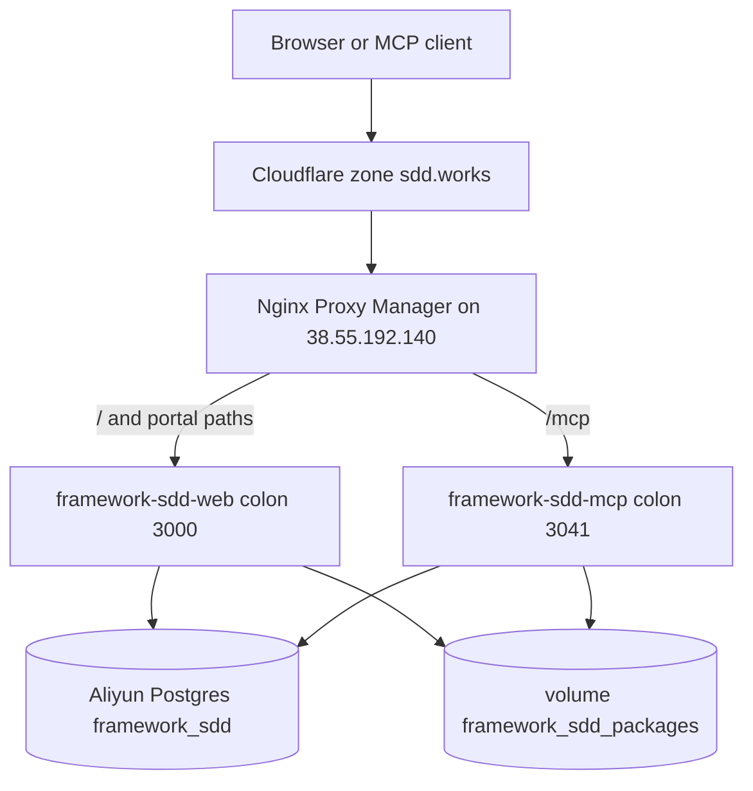

# Release — framework.sdd.works (go-live handbook)

> **Purpose**: Operator handbook to deploy and smoke the **portal**, **MCP HTTP**, **lite installer**, and **Node installer** on **`sdd.works`**. Values for secrets stay in Portainer and local [`specs/.secrets`](./.secrets) (gitignored). Do not paste secret values into chat or into this file.
> **Not in this release:** ship or install the framework **pack** (`sdd_install_framework` end-user pack write, pack GitHub release of skills/rules tree). Pack content sync into the **SYNK cache** is in scope because setup and lite/node APIs need a package cache.
> **Long form:** [`go-live/framework-sdd-works-deployment-instruction.md`](./go-live/framework-sdd-works-deployment-instruction.md). **Compose env reference:** [`go-live/20261008/portainer.md`](./go-live/20261008/portainer.md). **DNS cutover state:** [`go-live/20261008/hostname-cutover-inventory.md`](./go-live/20261008/hostname-cutover-inventory.md). **Node inventory:** [`go-live/hk_vps_3_setting.md`](./go-live/hk_vps_3_setting.md).

## 1. Scope

| In scope | Out of scope |
| --- | --- |
| Next.js portal at **`https://sdd.works`** | WordPress course content authoring on **`learn.sdd.works`** (except iframe `frame-ancestors`) |
| Streamable HTTP MCP at **`https://sdd.works/mcp`** | Publishing a new **stdio binary** GitHub Release (separate when binary changes) |
| Full setup markdown **`GET /setup`** | Client-side pack install into `~/.cursor` |
| Lite installer **`GET /setup/install`** + **`/api/sdd/lite/*`** | Renaming MCP entry id **`framework.sdd.works`** |
| Node installer **`GET /setup/node`** + **`/api/setup/node/catalog`** | Reverting apex DNS to WordPress |
| Package read APIs **`/api/sdd/versions`**, **`/api/sdd/package`** | Editing email DNS (`send`, `_dmarc`, DKIM) |
| Admin portal (Keys, Settings, Framework sync, Accounts) | Closing backlog rows / marking feature Done |
| Operator guide to public URLs ([feature-84](./sprint-backlog.md#sprint-9) / [Web-portal-20](./product-backlog.md#pb-106)) | Pushing the [feature-80](./sprint-backlog.md#sprint-9) `v*` tag (this handbook only names that step) |

**This cutover image (decided for go-live):** GHCR tag **`5e047ef418d3e7c25c040c13bf1efd854319f81d`** (full git sha). Short ref **`5e047ef`**. `origin/main` at 2026-10-08. GitHub Actions workflow **GHCR** succeeded (2026-10-08T11:41:42Z). Image:

`ghcr.io/ethanhuangcst/workspace.framework.sdd.works/web:5e047ef418d3e7c25c040c13bf1efd854319f81d`

**`IMAGE_TAG` tracing rule:** In Portainer, set **`IMAGE_TAG`** to the **full** commit sha GHCR pushed (`format=long` in [`.github/workflows/ghcr.yml`](../.github/workflows/ghcr.yml)). Do not use branch name **`main`**, **`latest`**, or short sha in production unless you also record the full sha in your run notes. Short sha is fine in chat when it maps to one row in the deploy table below.

**Not in `5e047ef`:** local uncommitted work (for example feature-80 setup **2026-10-08.v6**). Ship that in a later **`IMAGE_TAG`** after merge, push, and a green GHCR run.

## 2. Production runtime



| Host | Role |
| --- | --- |
| **`sdd.works`** | Canonical portal + `/setup*` + `/mcp` + package APIs (Cloudflare **Proxied** → NPM → containers) |
| **`www.sdd.works`** | Cloudflare Single Redirect **301** → **`https://sdd.works`** + same path and query |
| **`framework.sdd.works`** | Keep NPM host. After this image: pages **301** → **`sdd.works`**. **`/api/*` is not redirected** (GitHub webhook, package GETs) |
| **`learn.sdd.works`** | WordPress only (`38.55.199.241`). Learn tab iframe. Not this Portainer stack |

| Fact | Value |
| --- | --- |
| Node | 野草云3 · **`38.55.192.140`** |
| Stack | **`framework-sdd-works`** |
| Containers | **`framework-sdd-web`**, **`framework-sdd-mcp`** |
| Image | `ghcr.io/ethanhuangcst/workspace.framework.sdd.works/web:<IMAGE_TAG>` |
| Debug host ports | **`3008→3000`** (web), **`3204→3041`** (mcp). NPM uses **container** ports |
| Shared volume | **`framework_sdd_packages`** → `/data/sdd-packages` on both services |
| Docker network | **`portainer_network`** (external; never delete) |

## 3. Consoles

| Console | URL |
| --- | --- |
| GitHub Actions | https://github.com/ethanhuangcst/workspace.framework.sdd.works/actions |
| GHCR package | https://github.com/ethanhuangcst/workspace.framework.sdd.works/pkgs/container/workspace.framework.sdd.works%2Fweb |
| Portainer | https://portainer.agent-mate.ai/ → endpoint **野草云3** |
| NPM | https://nginx.agent-mate.ai/ |
| Cloudflare | zone **`sdd.works`** |
| Public app | https://sdd.works |

## 4. Secrets checklist (`specs/.secrets` + Portainer)

Fill **values** only on your machine in [`specs/.secrets`](./.secrets) and in the Portainer stack env. This file lists **names**. Do not commit values.

### 4.0 Portainer paste file (gitignored)

| Item | Value |
| --- | --- |
| File | [`go-live/.portainer.env`](./go-live/.portainer.env) (gitignored) |
| Use | Copy all `KEY=value` lines into Portainer stack **`framework-sdd-works`** env before Recreate |
| **`IMAGE_TAG`** | **`5e047ef418d3e7c25c040c13bf1efd854319f81d`** (full sha; matches §1) |
| Regenerate | When secrets rotate, update [`.secrets`](./.secrets) then refresh `.portainer.env` |

Do not commit `.portainer.env`. Compose shape stays in [`go-live/20261008/portainer.md`](./go-live/20261008/portainer.md).

### 4.1 Required before Recreate (P0)

| Name | Where | Purpose |
| --- | --- | --- |
| `DATABASE_URL` | Portainer (both) + `.secrets` | Aliyun DSN for database **`framework_sdd`** |
| `SESSION_SECRET` | Portainer (web) + `.secrets` | Admin sessions |
| `KEYS_ENCRYPTION_KEY` | Portainer (both) + `.secrets` | 64-char hex for key store |
| `ADMIN_SEED_PASSWORD` | Portainer (web) + `.secrets` | First admin; seed **fails** if blank |
| `ADMIN_SEED_EMAIL` | Portainer (web) + `.secrets` | Default `me@ethanhuang.com` if omitted |
| `ADMIN_SEED_USERNAME` | Portainer (web) | Usually `admin` |
| `GITHUB_TOKEN` | Portainer (both) + `.secrets` | PAT: package sync / Framework tree (`contents:read`). Portainer **Registries** needs a token with **`read:packages`** for GHCR pull (may be the same PAT) |
| `MCP_AUTH_TOKEN` | Portainer (mcp) + `.secrets` | Bearer for **`/mcp`** |
| `PUBLIC_BASE_URL` | Portainer (both) | **`https://sdd.works`** (already set) |
| `SDD_SERVER_URL` | Portainer (mcp) | **`https://sdd.works`** (already set) |
| `IMAGE_TAG` | Portainer stack env | **Full git sha** for this go-live (see §1; not `main` / `latest`) |

Also set on mcp (non-secret defaults): `MCP_HTTP_HOST=0.0.0.0`, `MCP_HTTP_PORT=3041`, `MCP_HTTP_PATH=/mcp`, `SDD_PACKAGE_CACHE_DIR=/data/sdd-packages`. On web: `PORT=3000`, `HOSTNAME=0.0.0.0`, `NODE_ENV=production`.

### 4.2 Recommended (P1 / P2)

| Name | Where | Purpose |
| --- | --- | --- |
| `RESEND_API_KEY` | Portainer (web) + `.secrets` | Password reset / invite mail |
| `MAIL_FROM` | Portainer (web) + `.secrets` | From address Resend accepts |
| `GITHUB_WEBHOOK_SECRET` | Portainer (web) + `.secrets` | GitHub → `POST /api/github/webhook` |
| `CRON_SECRET` | Portainer (web) + `.secrets` | Bearer for `POST /api/sync/cron` |

### 4.3 Already used for cutover ops (not Portainer portal stack)

| Name in `.secrets` | Purpose |
| --- | --- |
| Cloudflare `API_KEY` | DNS / Single Redirect API (cutover already applied) |
| WordPress `USER` / `password` (SSH) | `learn.sdd.works` host ops |
| WordPress admin `PASSWORD` | WP admin |

Do **not** put Portainer or NPM login passwords in git. Leave `OPENAI_API_KEY` empty for this prod path (HTTP MCP does not call Qwen).

### 4.4 Post-deploy (portal UI, not env)

| Item | Where | Decided value |
| --- | --- | --- |
| GitHub framework repo URL | Admin → Settings → Save | **`https://github.com/ethanhuangcst/framework.sdd.works.git`** (pack repo; not the workspace app repo) |
| Force sync | Admin → Framework → Sync with git repository | Run once after Settings save |
| GitHub webhook (pack updates) | GitHub repo → Webhooks | **`https://framework.sdd.works/api/github/webhook`** (legacy host; **`/api/*` must not 301**). Secret = `GITHUB_WEBHOOK_SECRET` in §4.0 |
| API keys for `sdd_get_key` | Admin → Keys | Create in UI after login |
| Rotate seed admin password | After first login | Required if seed password was shared |

Without Settings URL + sync, `GET /api/sdd/versions` returns **`409 sync_pending`**.

### 4.5 Operator decisions (fixed for this release)

| Topic | Decision |
| --- | --- |
| Deploy **`IMAGE_TAG`** | **`5e047ef418d3e7c25c040c13bf1efd854319f81d`** |
| GHCR also tags | **`5e047ef`** (short), **`latest`** (default branch; do not use for Recreate) |
| Public URLs in stack env | **`https://sdd.works`** for `PUBLIC_BASE_URL` and `SDD_SERVER_URL` |
| Postgres database | **`framework_sdd`** on **`101.132.156.250:5432`** (DSN in `.portainer.env`) |
| Previous Portainer paste | **`fc1c76c`** was stale; do not redeploy that tag for cutover |
| Learn iframe blocker | WordPress **`frame-ancestors https://sdd.works`** on **`learn.sdd.works`** (operator on WP host; not Portainer) |
| Stdio binary release | Out of scope; feature-80 **`v*` tag** is separate from this portal Recreate |
| Portainer GHCR pull | Registry login needs PAT with **`read:packages`**. The stack `GITHUB_TOKEN` is for GitHub **contents** sync; add **`read:packages`** on the same PAT or a second token in Portainer **Registries** |

## 5. Pre-flight

1. **`origin/main`** is at **`5e047ef`** (`git rev-parse --short origin/main`).
2. GHCR workflow **GHCR** succeeded for **`5e047ef418d3e7c25c040c13bf1efd854319f81d`** (2026-10-08). Pull by **full** tag, not `latest`.
3. Confirm Portainer can pull that tag (`read:packages` on registry login).
4. Confirm DNS (already live; do not flip apex back to WordPress):

```bash
curl -sS -H 'accept: application/dns-json' 'https://cloudflare-dns.com/dns-query?name=sdd.works&type=A'
# Expect Cloudflare anycast addresses (proxied), not 38.55.199.241
```

5. Confirm NPM hosts exist: **`sdd.works`** and **`framework.sdd.works`**, scheme **`http`**, forward **`framework-sdd-web:3000`**, custom location **`/mcp`** → **`framework-sdd-mcp:3041`**.
6. Isolation (update path): only Recreate **`framework-sdd-works`**. Do not edit other stacks. Do not `docker network rm portainer_network`.

**DNS and NPM for this cutover are already done.** This release is **image + smoke**. Skip greenfield Steps F/G in the long deploy doc unless a host is missing.

## 6. Deploy (update existing stack)

1. Portainer → 野草云3 → Stacks → **`framework-sdd-works`**.
2. Confirm compose matches [`go-live/20261008/portainer.md`](./go-live/20261008/portainer.md) (env names and `PUBLIC_BASE_URL` / `SDD_SERVER_URL` = `https://sdd.works`).
3. Set stack env from [`go-live/.portainer.env`](./go-live/.portainer.env) ( **`IMAGE_TAG`** = full sha from §1 ).
4. Confirm P0 names from §4.1 match the paste file (values stay gitignored).
5. **Update the stack** with **Pull** + **Recreate** (both web and mcp share the image).
6. Wait until **`framework-sdd-web`** and **`framework-sdd-mcp`** are **running**.
7. NPM → open Proxy Host **`sdd.works`** → **Save** (even if unchanged). Repeat for **`framework.sdd.works`**. Do **not** delete the framework host.
8. On the node (optional debug):

```bash
curl -sS -o /dev/null -w '%{http_code}\n' http://127.0.0.1:3008/
curl -sS -o /dev/null -w '%{http_code}\n' -X POST http://127.0.0.1:3204/mcp \
  -H 'Content-Type: application/json' \
  -H 'Authorization: Bearer <MCP_AUTH_TOKEN>' \
  -d '{"jsonrpc":"2.0","method":"initialize","params":{"protocolVersion":"2024-11-05","capabilities":{},"clientInfo":{"name":"smoke","version":"1.0"}},"id":1}'
```

Expect web `200` or `307`. MCP `200` with JSON-RPC (or `401` without Bearer). Public **`502` on `/mcp`** means NPM→mcp upstream is down; fix the mcp container, not DNS.

## 7. Smoke (this release)

Run in order. Mark each box when it passes.

### 7.1 Portal and hostname

```bash
curl -sI https://sdd.works/ | head -20
# Expect: 200, X-Powered-By: Next.js (or equivalent Next headers)

curl -sI https://sdd.works/instructions | head -15
# Expect: 200

curl -sI https://www.sdd.works/ | head -15
# Expect: 301 Location: https://sdd.works/

curl -sI https://sdd.works/en/home-en | head -15
# Expect: 301 Location: https://sdd.works/instructions

curl -sI https://framework.sdd.works/instructions | head -15
# Expect AFTER this image: 301 Location: https://sdd.works/instructions
# Expect BEFORE this image: 200 on framework host (old image)

curl -sI -X POST https://framework.sdd.works/api/github/webhook | head -15
# Expect: NOT 301 (401/400/200 depending on signature). Redirect would break GitHub.
```

Browser: open **`https://sdd.works/`** (private window if the old WordPress path was cached). Guide loads. Locale switch works.

### 7.2 Full setup, lite installer, Node installer

```bash
curl -sS https://sdd.works/setup | head -40
# Expect: markdown; SDD_SERVER_URL / mcp URLs use https://sdd.works
# Expect: MCP entry name still framework.sdd.works
# Expect: no https://framework.sdd.works as pack/MCP origin

curl -sS -o /dev/null -w '%{http_code}\n' https://sdd.works/agent-setup
# Expect: 3xx to /setup

curl -sS https://sdd.works/setup/install | head -40
# Expect: Lite install version; GET https://sdd.works/api/sdd/lite/files
# Expect: partner sentence uses https://sdd.works/setup/install

curl -sS https://sdd.works/setup/node | head -40
# Expect: Node setup version; GET https://sdd.works/api/setup/node/catalog

curl -sS https://sdd.works/api/setup/node/catalog | head -c 400; echo
# Expect: 200 JSON with node_lts and downloads
```

Browser Setup tab:

- Copy full setup sentence → `Fetch and execute the setup instructions from https://sdd.works/setup`
- If Node copy control is shipped: copies `… from https://sdd.works/setup/node`

### 7.3 Package API and admin sync

```bash
curl -sS https://sdd.works/api/sdd/versions
# 409 sync_pending until Settings URL + sync; then 200 with latestCommit
```

1. Sign in at **`https://sdd.works/login`** with seed admin.
2. Settings → save framework GitHub repo URL.
3. Framework → **Sync with git repository**.
4. Re-check `GET /api/sdd/versions` → **200**.
5. `GET https://sdd.works/api/sdd/package?version=latest` → **200** gzip; headers `X-SDD-Commit`, `X-SDD-Version`.
6. Lite (after sync + allowlist in cache):

```bash
curl -sS https://sdd.works/api/sdd/lite/files | head -c 500; echo
```

### 7.4 MCP

```bash
export MCP_TOKEN='…'   # from Portainer; do not commit
curl -sS -X POST https://sdd.works/mcp \
  -H "Authorization: Bearer $MCP_TOKEN" \
  -H "Content-Type: application/json" \
  -d '{"jsonrpc":"2.0","method":"initialize","params":{"protocolVersion":"2024-11-05","capabilities":{},"clientInfo":{"name":"smoke","version":"1.0"}},"id":1}'
```

- [ ] **initialize** succeeds (not **502**)
- [ ] Wrong/missing Bearer → **401**
- [ ] Cursor (optional): `url` `https://sdd.works/mcp` + Bearer → tools include `sdd_get_key`, `sdd_install_framework`, `sdd_update_framework`

### 7.5 Learn tab (portal code + WordPress)

1. Open **`https://sdd.works/?tab=learn-scrum-in-sdd`** (or Instructions → Learn).
2. Iframe `src` is **`https://learn.sdd.works/en/learn-embedded/`**.
3. Fallback link opens **`https://learn.sdd.works`**.
4. Blank iframe with a working fallback = WordPress missing **`frame-ancestors https://sdd.works`**. Fix on the WordPress host; do not roll back portal DNS.

### 7.6 Coexistence

Spot-check one other app on the node (for example places or kb health). Confirm other stacks did not mass-restart.

## 8. Rollback

1. Portainer → set **`IMAGE_TAG`** to the previous known-good **sha** → Recreate + Pull.
2. Re-run §7.1–§7.4 smokes on that tag.
3. **Do not** point apex **`@`** at **`38.55.199.241`** (WordPress).
4. **Do not** remove Cloudflare **`www`** / **`/en/home-en`** redirects unless you intentionally undo cutover.
5. Postgres **`framework_sdd`** is not reverted by image rollback. Restore a DB backup only if a bad migration shipped.
6. Volume **`framework_sdd_packages`** may stay. Never `docker network rm portainer_network`.

## 9. Subsequent releases

1. Merge to `main` → wait for green GHCR.
2. Portainer **`IMAGE_TAG`** = new sha → Recreate + Pull.
3. NPM **Save** on **`sdd.works`** (and **`framework.sdd.works`** if still used).
4. Re-run §7.1, §7.2, §7.3, §7.4.
5. If Prisma schema changed: backup **`framework_sdd`** first.
6. Stdio binaries: [feature-80](./sprint-backlog.md#sprint-9) pushes a `v*` tag on `workspace.framework.sdd.works`. GitHub Actions attaches `sdd-mcp-darwin-arm64`, `sdd-mcp-darwin-x64`, `sdd-mcp-linux-arm64`, `sdd-mcp-linux-x64`, and `sdd-mcp-windows-x64.exe`. This handbook does not push that tag.

## 10. Operator sources (detail)

| Doc | Use when |
| --- | --- |
| [`go-live/framework-sdd-works-deployment-instruction.md`](./go-live/framework-sdd-works-deployment-instruction.md) | First-time stack create, full env index, abort matrix |
| [`go-live/20261008/portainer.md`](./go-live/20261008/portainer.md) | Exact compose env for this cutover |
| [`go-live/20261008/hostname-cutover-inventory.md`](./go-live/20261008/hostname-cutover-inventory.md) | Live DNS, redirects, WordPress notes |
| [`go-live/hk_vps_3_setting.md`](./go-live/hk_vps_3_setting.md) | Port and stack isolation on 野草云3 |
| [`adr/ADR-127-public-hostnames-sdd-and-learn.md`](./adr/ADR-127-public-hostnames-sdd-and-learn.md) | Hostname product rules |
| [`test-report.md`](./test-report.md) | Last automated hostname Vitest report |

## 11. Done when

- [ ] Image **`5e047ef418d3e7c25c040c13bf1efd854319f81d`** (or newer full sha) is running on web and mcp
- [ ] §7.1–§7.4 pass
- [ ] §7.5 confirmed or WordPress `frame-ancestors` ticket opened
- [ ] Seed admin password rotated if the seed value was shared
- [ ] Pack install for end users is **not** required for this handbook
